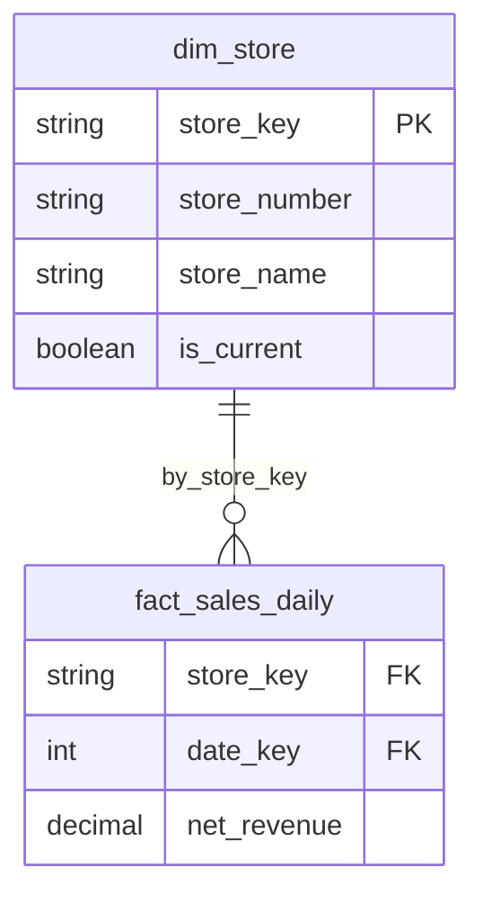

# Gold Layer Rules for Claude Code

This file combines all Gold layer cursor rules for use by Claude Code.

---

## Table of Contents
1. [MERGE Patterns](#merge-patterns)
2. [Deduplication Patterns](#deduplication-patterns)
3. [Documentation Standards](#documentation-standards)
4. [Mermaid ERD Diagrams](#mermaid-erd-diagrams)
5. [Schema Validation](#schema-validation)
6. [Fact Table Grain Validation](#fact-table-grain-validation)
7. [YAML-Driven Table Setup](#yaml-driven-table-setup)

---

## MERGE Patterns

### Column Name Mapping

**Map columns explicitly when Silver and Gold names differ:**

```python
# ✅ CORRECT
updates_df = (
    silver_df
    .withColumn("company_retail_control_number", col("company_rcn"))
    .select("store_number", "company_retail_control_number", ...)
)

# ❌ WRONG - Column doesn't exist in Silver!
updates_df = silver_df.select("company_retail_control_number")
```

### Variable Naming

**NEVER shadow PySpark functions:**

```python
# ❌ WRONG
from pyspark.sql.functions import count
count = updates_df.count()  # Shadows function!
df.agg(count("*"))  # Error: 'int' object is not callable

# ✅ CORRECT
record_count = updates_df.count()
df.agg(count("*"))  # Works!
```

**Avoid these variable names:** `count`, `sum`, `min`, `max`, `round`, `filter`

### SCD Type 1 (Overwrite)

```python
delta_gold.alias("target").merge(
    updates_df.alias("source"),
    "target.product_key = source.product_key"
).whenMatchedUpdateAll(
).whenNotMatchedInsertAll(
).execute()
```

### SCD Type 2 (Historical)

```python
updates_df = (
    silver_df
    .withColumn("store_key", md5(concat_ws("||", col("store_id"), col("processed_timestamp"))))
    .withColumn("effective_from", col("processed_timestamp"))
    .withColumn("effective_to", lit(None).cast("timestamp"))
    .withColumn("is_current", lit(True))
    ...
)

delta_gold.alias("target").merge(
    updates_df.alias("source"),
    "target.store_number = source.store_number AND target.is_current = true"
).whenMatchedUpdate(set={
    "record_updated_timestamp": "source.record_updated_timestamp"
}).whenNotMatchedInsertAll(
).execute()
```

### Fact Table Aggregation

```python
daily_sales = (
    transactions
    .groupBy("store_number", "upc_code", "transaction_date")
    .agg(
        spark_sum(when(col("quantity") > 0, col("price")).otherwise(0)).alias("gross_revenue"),
        count("*").alias("transaction_count"),
    )
)
```

---

## Deduplication Patterns

### Core Pattern

**MERGE requires unique source keys. Silver often has duplicates.**

```python
# ✅ CORRECT: Order by timestamp DESC, then dropDuplicates
silver_df = (
    silver_raw
    .orderBy(col("processed_timestamp").desc())
    .dropDuplicates(["store_number"])  # Keep latest
)

# ❌ WRONG: dropDuplicates without ordering (random selection)
silver_df = silver_raw.dropDuplicates(["store_number"])
```

### Generic Reusable Function

```python
def merge_dimension_with_deduplication(
    spark: SparkSession,
    catalog: str,
    silver_schema: str,
    gold_schema: str,
    silver_table_name: str,
    gold_table_name: str,
    business_key: str,
    transformation_func: callable
):
    """Generic pattern for merging with deduplication."""
    
    silver_raw = spark.table(f"{catalog}.{silver_schema}.{silver_table_name}")
    
    # Debug: Check for duplicates
    total_count = silver_raw.count()
    unique_count = silver_raw.select(business_key).distinct().count()
    print(f"Total: {total_count}, Unique: {unique_count}, Duplicates: {total_count - unique_count}")
    
    # Deduplicate (keep latest)
    silver_deduped = (
        silver_raw
        .orderBy(col("processed_timestamp").desc())
        .dropDuplicates([business_key])
    )
    
    # Apply transformations
    updates_df = transformation_func(silver_deduped)
    
    # Merge
    delta_gold = DeltaTable.forName(spark, f"{catalog}.{gold_schema}.{gold_table_name}")
    delta_gold.alias("target").merge(
        updates_df.alias("source"),
        f"target.{business_key} = source.{business_key}"
    ).whenMatchedUpdateAll().whenNotMatchedInsertAll().execute()
```

### Validation

- [ ] Deduplication key matches MERGE condition key
- [ ] orderBy before dropDuplicates
- [ ] Debug logging for deduplication metrics

---

## Documentation Standards

### YAML Schema as Source of Truth

YAML files in `gold_layer_design/yaml/` define the DDL. Always validate against them.

### Naming Conventions

| Type | Pattern | Example |
|------|---------|---------|
| Surrogate Key | `{entity}_key` | `store_key` |
| Business Key | Natural identifier | `store_number` |
| Foreign Key | `{referenced_entity}_key` | `store_key` |
| Measure | Descriptive name | `net_revenue`, `units_sold` |
| Boolean | `is_` or `has_` prefix | `is_current`, `has_discount` |
| Timestamp | `_timestamp` suffix | `record_created_timestamp` |

### Column Description Format

```
[Definition]. Business: [context]. Technical: [details].
```

**Example:**
```sql
net_revenue DECIMAL(18,2) COMMENT 'Net revenue after returns. Business: Primary KPI for financial reporting. Technical: gross_revenue - return_amount.'
```

### Silver Table Naming

**DLT does NOT use `_dim` or `_fact` suffixes:**

```python
# ✅ CORRECT - Actual DLT table names
silver_table = f"{catalog}.{silver_schema}.silver_users"
silver_table = f"{catalog}.{silver_schema}.silver_properties"

# ❌ WRONG - These don't exist!
silver_table = f"{catalog}.{silver_schema}.silver_user_dim"
```

### Pre-Implementation Validation

Before coding any merge script:

1. **Verify Silver table names** - Run `SHOW TABLES IN {silver_schema}`
2. **Create column mapping** - Document Silver → Gold column names
3. **Validate schema variables** - Ensure YAML matches actual schema

---

## Mermaid ERD Diagrams

### ERD Organization

- **Master ERD**: All domains (≤30 tables)
- **Domain ERDs**: Single domain with cross-references

### Syntax Rules



### Key Rules

- No inline comments within entity blocks
- 2-space indentation
- Short relationship labels: `by_{column_name}`
- Use `PK` and `FK` markers
- Cardinality: `||--o{` (one-to-many)

### Cross-Domain References

```mermaid
dim_external["dim_date (Time Domain)"] {
  int date_key PK
}

fact_domain ||--o{ dim_external : by_date_key
```

---

## Schema Validation

### DDL is Runtime Truth

The DDL defines the actual schema. Merge scripts must match it.

### Schema Validation Helper

```python
def validate_merge_schema(
    spark: SparkSession,
    updates_df: DataFrame,
    catalog: str,
    schema: str,
    table_name: str,
    raise_on_mismatch: bool = True
) -> dict:
    """Validate merge DataFrame matches target table schema."""
    
    target_df = spark.table(f"{catalog}.{schema}.{table_name}")
    
    source_cols = set(updates_df.columns)
    target_cols = set(target_df.columns)
    
    missing = target_cols - source_cols
    extra = source_cols - target_cols
    
    result = {
        "valid": len(missing) == 0 and len(extra) == 0,
        "missing_columns": list(missing),
        "extra_columns": list(extra),
        "type_mismatches": []
    }
    
    # Check types for common columns
    target_schema = {f.name: f.dataType for f in target_df.schema.fields}
    source_schema = {f.name: f.dataType for f in updates_df.schema.fields}
    
    for col_name in source_cols & target_cols:
        if str(source_schema[col_name]) != str(target_schema[col_name]):
            result["type_mismatches"].append({
                "column": col_name,
                "source": str(source_schema[col_name]),
                "target": str(target_schema[col_name])
            })
    
    if not result["valid"] and raise_on_mismatch:
        raise ValueError(f"Schema mismatch: {result}")
    
    return result
```

### Explicit Column Mapping

```python
updates_df = (
    silver_df
    .withColumn("store_id", col("store_number"))  # Rename
    .withColumn("product_id", col("upc_code"))    # Rename
    .select(
        "store_id",      # Gold name
        "product_id",    # Gold name
        ...
    )
)
```

---

## Fact Table Grain Validation

### Grain Types

| Grain Type | PRIMARY KEY | Aggregation |
|------------|-------------|-------------|
| Transaction | `transaction_id` | None |
| Aggregated | `store_id, product_id, date` | `.groupBy().agg()` |
| Snapshot | `entity_id, snapshot_date` | None |

### Infer Grain from DDL

```python
def infer_grain_from_ddl(spark, catalog, schema, table_name):
    """Infer fact table grain from PRIMARY KEY."""
    
    constraints = spark.sql(f"""
        SELECT constraint_name, column_list
        FROM system.information_schema.table_constraints
        WHERE table_catalog = '{catalog}'
          AND table_schema = '{schema}'
          AND table_name = '{table_name}'
          AND constraint_type = 'PRIMARY KEY'
    """).collect()
    
    if not constraints:
        return {"grain_type": "unknown", "pk_columns": []}
    
    pk_columns = constraints[0]["column_list"].split(",")
    pk_columns = [c.strip() for c in pk_columns]
    
    # Infer grain type
    if len(pk_columns) == 1 and pk_columns[0].endswith("_id"):
        grain_type = "transaction"
    elif "date" in " ".join(pk_columns).lower():
        grain_type = "aggregated" if len(pk_columns) > 2 else "snapshot"
    else:
        grain_type = "aggregated"
    
    return {"grain_type": grain_type, "pk_columns": pk_columns}
```

### Pattern: Aggregated Fact

```python
# Grain: store_number + upc_code + transaction_date
daily_sales = (
    transactions
    .groupBy("store_number", "upc_code", "transaction_date")
    .agg(
        spark_sum("revenue").alias("net_revenue"),
        count("*").alias("transaction_count")
    )
)
```

### Pattern: Transaction Fact

```python
# Grain: transaction_id (no aggregation)
fact_df = (
    silver_df
    .withColumn("transaction_key", col("transaction_id"))
    .select(...)  # Direct pass-through
)
```

---

## YAML-Driven Table Setup

### Core Principle

YAML files are the single source of truth for Gold table definitions.

### YAML Schema Structure

```yaml
# gold_layer_design/yaml/{domain}/{table_name}.yaml

table_name: dim_cluster
domain: compute
bronze_source: compute.clusters

description: >
  Gold layer compute cluster dimension.
  Business: Used for cluster analysis and cost attribution.

primary_key:
  columns: ['workspace_id', 'cluster_id']
  composite: true

columns:
  - name: workspace_id
    type: STRING
    nullable: false
    description: "Workspace identifier. Business: Links to dim_workspace."
  
  - name: cluster_id
    type: STRING
    nullable: false
    description: "Cluster identifier. Business: Unique cluster ID."
  
  - name: cluster_name
    type: STRING
    nullable: true
    description: "Cluster display name. Business: Human-readable name."
```

### DDL Builder Function

```python
STANDARD_PROPERTIES = {
    'delta.enableChangeDataFeed': 'true',
    'delta.enableRowTracking': 'true',
    'delta.enableDeletionVectors': 'true',
    'delta.autoOptimize.autoCompact': 'true',
    'delta.autoOptimize.optimizeWrite': 'true',
    'layer': 'gold',
    'source_layer': 'silver'
}

def build_create_table_ddl(catalog: str, schema: str, config: dict) -> str:
    """Build CREATE TABLE DDL from YAML config."""
    table_name = config['table_name']
    columns = config.get('columns', [])
    description = config.get('description', '')
    domain = config.get('domain', 'unknown')
    
    # Build column DDL
    col_ddls = []
    for col in columns:
        null_str = "" if col.get('nullable', True) else " NOT NULL"
        desc = escape_sql_string(col.get('description', ''))
        comment = f"\n    COMMENT '{desc}'" if desc else ""
        col_ddls.append(f"  {col['name']} {col['type']}{null_str}{comment}")
    
    columns_str = ",\n".join(col_ddls)
    
    # Build properties
    props = STANDARD_PROPERTIES.copy()
    props['domain'] = domain
    props['entity_type'] = "dimension" if table_name.startswith("dim_") else "fact"
    props_str = ",\n    ".join([f"'{k}' = '{v}'" for k, v in props.items()])
    
    return f"""CREATE OR REPLACE TABLE {catalog}.{schema}.{table_name} (
{columns_str}
)
USING DELTA
CLUSTER BY AUTO
TBLPROPERTIES (
    {props_str}
)
COMMENT '{escape_sql_string(description)}'"""
```

### Benefits

- **94% code reduction** (5000 → 300 lines)
- Schema changes are reviewable YAML diffs
- Consistent table properties guaranteed
- No SQL escaping issues

### Asset Bundle Configuration

```yaml
sync:
  include:
    - "gold_layer_design/**/*.yaml"

resources:
  jobs:
    gold_setup_job:
      tasks:
        - task_key: setup_all_tables
          notebook_task:
            notebook_path: ../src/gold/setup_tables.py
            base_parameters:
              catalog: ${var.catalog}
              gold_schema: ${var.gold_schema}
```


