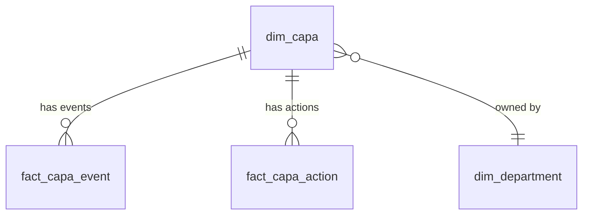

# Gold Layer Dimensional Model Design Prompt

Use this prompt when you need to design a production-ready Gold layer dimensional model for a new data source or domain.

## Context

This prompt template guides the creation of a comprehensive dimensional model following Databricks best practices, Unity Catalog governance, and industry-specific regulatory requirements. Based on the Alaska Airlines ETQ project (393 Bronze tables → 37 Gold tables with 100% accountability).

---

## Prompt Template

```markdown
# Gold Layer Dimensional Model Design Request

## Project Context
- **Project Name:** Databricks Health Monitor Using System Tables
- **Business Domain:** [e.g., Cost & Capacity, Reliability & Performance, Governance & Security, Data Quality & Optimization, Usage & Productivity]
- **Source System:** [e.g., Databricks System Tables]
- **Source Databricks Catalog:** [system]
- **Target Schema:** [Gold schema name, e.g., `<catalog>.db_health_monitor`]

## Input Materials
I have the following source system metadata:
- [ ] Bronze table inventory (table names, row counts, descriptions) 
- [ ] Bronze schema metadata (columns, data types, keys, nullability) - @systemtablesschema - Sheet1.csv
- [ ] Business process documentation (workflows, use cases) - @mapping.md
- [ ] Data dictionary or field definitions @systemtablesschema - Sheet1.csv
- [ ] Sample queries or existing reports (optional) - @/blogposts and @/dashboards

## Requirements

### 1. Comprehensive Domain Analysis
Create a detailed domain analysis document that:
- **Identifies 4-6 core business domains** from the Bronze tables
  - Group related tables by business process (e.g., Cost & Capacity, Reliability & Performance, Governance & Security, Data Quality & Optimization, Usage & Productivity)
  - Justify domain boundaries with business context
- **Consolidates Bronze tables** into logical entity groups
  - Show consolidation strategies: semantic hierarchies, denormalization, reference merging
  - Document consolidation ratios (e.g., 215 lookups → 21 dimensions)
- **Provides 100% accountability** - every Bronze table mapped, consolidated, or excluded with rationale
  - Create consolidation summary table by source database
  - Explain all exclusions (system metadata, deprecated fields)
- **Documents business processes** and how data flows through them
  - Key performance indicators (KPIs) and analytics use cases

**Key Question to Answer:** "What happened to every Bronze table?" with proof.

**Deliverable:** `docs/01_domain_analysis.md`

### 2. Complete Gold Layer Schema Design
Design a **star schema dimensional model** with:

#### Dimensions (15-25 tables)
- **Reference dimensions** (always included):
  - `dim_date` - Calendar/fiscal date dimension (Type 0, generated)
  - `dim_department` - Organizational structure (SCD Type 2)
  - `dim_employee` - Employee master (SCD Type 2)
  - `dim_location` - Physical locations (SCD Type 2)
- **Domain-specific dimensions** (with SCD Type 2 where appropriate):
  - Master entity dimensions (e.g., `dim_capa`, `dim_incident`, `dim_audit`)
  - Category/type dimensions (hierarchical lookups consolidated)
- **Naming convention:** `dim_<entity>` (lower_snake_case)

#### Facts (8-15 tables)
- **Transaction facts** (event-level grain):
  - One row per business event (e.g., `fact_capa_event`, `fact_incident_event`)
  - Preserve all event details for detailed analysis
- **Aggregate facts** (daily/monthly summaries):
  - Pre-aggregated for performance (e.g., `fact_sales_daily_summary`)
  - Reduce query complexity for dashboards
- **Periodic snapshot facts** (point-in-time states):
  - Snapshot of dimensions at specific intervals (e.g., `fact_risk_daily_snapshot`)
- **Naming convention:** `fact_<process>_<grain>` (lower_snake_case)

#### Bridge Tables (2-5 tables)
- Many-to-many relationship resolvers
- **Naming convention:** `bridge_<entity1>_<entity2>` (lower_snake_case)
- **Examples:** `bridge_incident_action`, `bridge_risk_owner`, `bridge_capa_department`

### 3. Databricks Best Practices Compliance
Every table must include:

#### Unity Catalog Governance
```sql
TBLPROPERTIES (
  'delta.enableChangeDataFeed' = 'true',
  'delta.autoOptimize.optimizeWrite' = 'true',
  'delta.autoOptimize.autoCompact' = 'true',
  'layer' = 'gold',
  'source_layer' = 'silver',
  'domain' = '<domain_name>',
  'entity_type' = '<dimension|fact|bridge>',
  'contains_pii' = '<true|false>',
  'data_classification' = '<confidential|internal|public>',
  'business_owner' = '<Team Name>',
  'technical_owner' = 'Data Engineering'
)
CLUSTER BY AUTO
COMMENT '<Comprehensive dual-purpose description>';
```

#### Primary/Foreign Key Constraints
- **All dimensions:** `PRIMARY KEY (<table>_key) NOT ENFORCED`
- **All facts:** `FOREIGN KEY (<dim>_key) REFERENCES dim_<table>(<table>_key) NOT ENFORCED`
- **Composite PKs for facts:** `PRIMARY KEY (dim1_key, dim2_key, date_key) NOT ENFORCED`

#### SCD Type 2 Tracking (9+ dimensions)
```sql
-- Surrogate key (PRIMARY KEY)
<entity>_key STRING NOT NULL,

-- Business key
<entity>_id STRING NOT NULL,

-- SCD Type 2 columns
effective_from TIMESTAMP NOT NULL,
effective_to TIMESTAMP,
is_current BOOLEAN NOT NULL,

-- Audit columns
record_created_timestamp TIMESTAMP NOT NULL,
record_updated_timestamp TIMESTAMP NOT NULL
```

### 4. Comprehensive Documentation Deliverables

Create a complete `gold_layer_design/` folder with:

#### A. Main README.md
**Required sections:**
1. **Executive Summary**
   - Data accountability certification (all Bronze tables accounted for)
   - Bronze→Gold consolidation summary table with ratios
2. **Repository Structure** - File organization guide
3. **Data Model Overview**
   - Business domains (6)
   - Entity counts (dimensions/facts/bridges)
   - Key relationships
4. **Design Principles**
   - Unity Catalog governance
   - SCD Type 2 patterns
   - Constraint-based optimization
   - Performance optimization
   - Naming conventions
5. **Deployment Guide** - Step-by-step deployment instructions
6. **Sample Analytics Queries** - 5+ real-world query examples
7. **Validation Checklist** - Pre-deployment validation steps
8. **FAQ Section** - Address common questions:
   - "Why only 37 Gold tables when there are 393 Bronze tables?"
   - "How do I know no data was lost?"
   - "Can I query without 100+ lookup tables?"
   - "What if I need to add more Bronze tables later?"

#### B. Domain Analysis (docs/01_domain_analysis.md)
**Required sections:**
1. **Executive Summary** - Data accountability statement
2. **Business Domains** (6 domains)
   - Purpose and scope
   - Bronze tables in this domain
   - Key entities
   - Gold layer design
3. **Gold Layer Entity Summary**
   - Dimension table catalog (with SCD type)
   - Fact table catalog (with grain definition)
   - Bridge table catalog
4. **Semantic Consistency Guidelines**
   - Naming conventions (all patterns documented)
   - Standard column patterns (PKs, FKs, SCD, metadata)
   - Data type harmonization (Bronze → Gold mappings)
   - Unity Catalog metadata tags (table + column level)
5. **Key Relationships** - Domain-specific relationship diagrams
6. **Analytics Use Cases** - 5+ example queries per domain
7. **Airline/Industry-Specific Context** (where applicable)
   - Regulatory compliance requirements
   - Safety Management System (SMS) integration
   - ETQ/system-specific modules
   - Operational context
   - Data quality standards

#### C. Mermaid ERD (docs/02_mermaid_erd.md)
**Requirements:**
- Complete entity-relationship diagram in Mermaid syntax
- All tables (dimensions, facts, bridges)
- All primary key / foreign key relationships
- Cardinality notations (1:N, M:N)
- Domain color-coding for visual grouping
- Relationship labels for clarity
- **Must be render-able** in Mermaid Live Editor or GitHub

**Pattern:**


#### D. Bronze-to-Gold Mapping Analysis (docs/03_bronze_to_gold_mapping_analysis.md)
**Purpose:** Prove that all Bronze tables are accounted for

**Required sections:**
1. **Executive Summary** - "0 tables lost" certification
2. **Consolidation Summary Table**
   - By source database (e.g., LOOKUPS, INCIDENTS, CORRACT)
   - Bronze table count → Gold table count
   - Consolidation strategy and ratio
3. **Detailed Mapping by Domain**
   - List every Bronze table name
   - Show Gold table mapping or exclusion reason
   - Justify all consolidations
4. **Consolidation Strategies Explained**
   - Semantic hierarchies (127 lookups → 1 dimension)
   - Denormalization (80 subforms → 1 wide fact)
   - Reference consolidation (3 sources → 1 master)
   - Column flattening (boolean tables → columns)
   - System exclusion (platform metadata removed)
5. **Validation Queries**
   - Prove 0 Bronze tables unaccounted for
   - Show consolidation metrics

#### E. Complete Column Lineage
**Files:**
- `COMPLETE_BRONZE_COLUMN_LINEAGE.csv` - All Bronze columns tracked
- `COMPLETE_BRONZE_COLUMN_LINEAGE_README.md` - Documentation

**CSV Columns:**
```csv
Bronze_Table,Bronze_Column,Bronze_Data_Type,Bronze_Nullable,Bronze_Key_Type,
Lineage_Type,Silver_Table,Silver_Column,Gold_Table,Gold_Column,Explanation
```

**Lineage Types:**
1. `direct_mapping` - Clean 1:1 pass-through (0.4%)
2. `consolidated_hierarchy` - Lookup tables merged into semantic dimensions (21%)
3. `denormalized` - Subforms flattened into wide tables (45%)
4. `consolidated_reference` - Reference data unified (3%)
5. `excluded` - System metadata removed (15%)
6. `unmapped` - Needs investigation (15%)

**Statistics Required:**
- Total Bronze columns (e.g., 4,065)
- Distribution by lineage type
- Top Silver target tables by column count
- Top Gold target tables by column count

#### F. YAML Specifications (yaml/*.yaml)
**One YAML file per table** (35+ files)

**Template:**
```yaml
table_name: dim_<entity>
description: |
  [Business purpose]. Business: [use cases and context]. Technical: [implementation details].
domain: <domain_name>
layer: gold
scd_type: 2  # or 1, or null for facts
primary_key: <entity>_key
business_key: <entity>_id

columns:
  - name: <entity>_key
    data_type: STRING
    nullable: false
    description: |
      Surrogate key uniquely identifying each version of this record. 
      Business: Used for joining to fact tables, ensures stable references across versions. 
      Technical: MD5 hash of business key + effective_from timestamp.
    primary_key: true

  - name: <entity>_id
    data_type: STRING
    nullable: false
    description: |
      Business key identifying the entity across all versions. 
      Business: The natural identifier used by business users and source systems. 
      Technical: Preserved from source system, same value across all SCD Type 2 versions.
    business_key: true

  - name: <attribute_name>
    data_type: <TYPE>
    nullable: false
    description: |
      [Definition]. Business: [purpose, business rules, use cases]. 
      Technical: [source column, calculation logic, data type, constraints].
    tags:
      pii: email  # if applicable
      data_quality_critical: true
      regulatory: "FAA Part 121"

  # SCD Type 2 columns (if applicable)
  - name: effective_from
    data_type: TIMESTAMP
    nullable: false
    description: |
      Start timestamp for this version of the record. 
      Business: Indicates when this version became active. 
      Technical: Populated from source system processed_timestamp or current_timestamp on insert.

  - name: effective_to
    data_type: TIMESTAMP
    nullable: true
    description: |
      End timestamp for this version (NULL for current version). 
      Business: Indicates when this version was superseded by a new version. 
      Technical: NULL for current version (is_current=true), populated on version expiration.

  - name: is_current
    data_type: BOOLEAN
    nullable: false
    description: |
      Flag indicating if this is the current active version (only one TRUE per business key). 
      Business: Use to filter for latest version of each entity. 
      Technical: Enforced through MERGE logic to ensure exactly one current version.

table_properties:
  contains_pii: "false"
  data_classification: "confidential"
  business_owner: "<Team Name>"
  technical_owner: "Data Engineering"

constraints:
  - type: primary_key
    columns: [<entity>_key]
    enforced: false

  - type: foreign_key
    columns: [department_key]
    references:
      table: dim_department
      columns: [department_key]
    enforced: false

relationships:
  - target_table: fact_<process>_event
    relationship_type: one_to_many
    description: "Each <entity> can have multiple events"
```

**Requirements:**
- **Comprehensive dual-purpose descriptions** (Business + Technical) for ALL columns
- **Industry/regulatory context** in descriptions where applicable
- **Primary/foreign key definitions** with NOT ENFORCED
- **SCD Type 2 metadata** for applicable dimensions
- **Unity Catalog properties** (PII, classification, ownership)
- **Sample use cases** in description field

#### G. Schema Reference CSV ([Project]_Gold_Schema.csv)
**Machine-readable data dictionary:**
```csv
Table_Name,Column_Name,Data_Type,Nullable,Description,Primary_Key,Foreign_Key,PII_Tag,Domain
dim_capa,capa_key,STRING,NO,"Surrogate key...",YES,,NO,safety_compliance
dim_capa,capa_id,STRING,NO,"Business key...",NO,,NO,safety_compliance
...
```

**Purpose:** 
- Machine-readable for tooling/automation
- Enhanced descriptions (business + technical)
- Regulatory context included
- PII and domain tagging

### 5. Consolidation Strategy Documentation

Explain the **10:1 consolidation ratio** (400 Bronze → 35 Gold):

| Strategy | Description | Example | Bronze Count | Gold Count | Ratio |
|----------|-------------|---------|--------------|------------|-------|
| **Semantic Hierarchies** | 100+ lookup tables → 1 hierarchical dimension | 127 incident type lookups → `dim_incident_type` (category/type/subtype columns) | 127 | 1 | 127:1 |
| **Denormalization** | 80+ subforms → 1 wide fact table | Incident subforms → `fact_incident_event` (100+ columns) | 80 | 1 | 80:1 |
| **Reference Consolidation** | Multiple reference tables → 1 master dimension | 3 location sources → `dim_location` | 3 | 1 | 3:1 |
| **Column Flattening** | Boolean/status tables → columns in facts | 48 simple lookups → columns in fact tables | 48 | 0 | N/A |
| **System Exclusion** | Platform metadata removed | 14 ENGINE tables excluded from Gold layer | 14 | 0 | N/A |

**Benefits of Consolidation:**
- ✅ Faster queries (fewer joins)
- ✅ Easier to understand (semantic groupings)
- ✅ Better for BI tools (fewer tables to navigate)
- ✅ Genie-friendly (LLM can understand hierarchies)
- ✅ Maintains 100% data completeness

### 6. Validation & Quality Checks

Provide validation queries to prove:

#### A. Table Accountability
```sql
-- Verify all Bronze tables are accounted for
SELECT 
  COUNT(DISTINCT Bronze_Table) as Total_Bronze_Tables,
  COUNT(DISTINCT CASE WHEN Gold_Table != '(Excluded)' THEN Bronze_Table END) as Mapped_Tables,
  COUNT(DISTINCT CASE WHEN Gold_Table = '(Excluded)' THEN Bronze_Table END) as Excluded_Tables
FROM bronze_to_gold_mapping;

-- Expected: Total = Mapped + Excluded, 0 unaccounted
```

#### B. Primary Key Uniqueness
```sql
-- Verify PKs are unique in each dimension
SELECT '<table_name>' as table_name, COUNT(*) as total_rows, COUNT(DISTINCT <pk_column>) as unique_pks
FROM ${catalog}.gold.<table_name>;

-- Expected: total_rows = unique_pks
```

#### C. Foreign Key Referential Integrity
```sql
-- Verify FKs have valid references
SELECT COUNT(*) as orphaned_records
FROM ${catalog}.gold.fact_<table> f
LEFT JOIN ${catalog}.gold.dim_<table> d ON f.<fk> = d.<pk>
WHERE d.<pk> IS NULL;

-- Expected: 0 orphaned records
```

#### D. SCD Type 2 Integrity
```sql
-- Verify only one current version per business key
SELECT <business_key>, COUNT(*) as current_count
FROM ${catalog}.gold.dim_<table>
WHERE is_current = TRUE
GROUP BY <business_key>
HAVING COUNT(*) > 1;

-- Expected: 0 rows (no duplicates)
```

#### E. PII Tagging Audit
```sql
-- Verify all PII columns are tagged
SELECT table_name, column_name
FROM ${catalog}.information_schema.columns
WHERE table_schema = 'gold'
  AND (column_name LIKE '%email%' OR column_name LIKE '%ssn%' OR column_name LIKE '%phone%')
  AND column_name NOT IN (
    SELECT column_name FROM ${catalog}.information_schema.column_tags 
    WHERE tag_name = 'pii'
  );

-- Expected: 0 rows (all PII tagged)
```

## Expected Deliverables

📦 **Complete gold_layer_design/ folder** with:
- [ ] `README.md` - Executive summary, deployment guide, FAQ (500+ lines)
- [ ] `docs/01_domain_analysis.md` - 6 domains, entity groupings, regulatory context (500+ lines)
- [ ] `docs/02_mermaid_erd.md` - Visual data model with 78+ relationships (800+ lines)
- [ ] `docs/03_bronze_to_gold_mapping_analysis.md` - 100% accountability proof (400+ lines)
- [ ] `COMPLETE_BRONZE_COLUMN_LINEAGE.csv` - All columns tracked (4000+ rows)
- [ ] `COMPLETE_BRONZE_COLUMN_LINEAGE_README.md` - Lineage documentation (500+ lines)
- [ ] `yaml/*.yaml` - 35+ table specifications with dual-purpose descriptions (200+ lines each)
- [ ] `[Project]_Gold_Schema.csv` - Machine-readable data dictionary (500+ rows)
- [ ] `sql/*.sql` - DDL scripts (optional, can generate from YAML)

**Total Documentation:** 7,000+ lines across 50+ files

## FinOps TVF Examples (Databricks Health Monitor)

**Complete FinOps implementation available:**

📋 [FinOps Business Questions](./finops-tvf-business-questions.md) - 15 FinOps-specific questions with measures and tables  
💻 [FinOps TVF SQL Examples](./finops-tvf-sql-examples.sql) - 8 production-ready TVFs for cost optimization  
📖 [FinOps Implementation Summary](./FINOPS_TVF_IMPLEMENTATION_SUMMARY.md) - Complete deployment guide  
⚡ [FinOps Quick Reference](./FINOPS_TVF_QUICK_REFERENCE.md) - Copy-paste queries for common questions

**Key FinOps TVFs created:**
1. `get_top_workspaces_by_cost` - Workspace cost ranking
2. `get_workspace_cost_breakdown` - Daily cost breakdown by SKU/product
3. `get_top_jobs_by_dbu_consumption` - Job-level DBU consumption
4. `get_daily_cost_trend` - Daily cost trend with product breakdown
5. `get_cost_by_product` - Cost by product (Jobs, SQL, DLT, ML)
6. `get_top_users_by_cost` - User-level chargeback
7. `get_inefficient_job_runs` - Jobs exceeding baseline runtime
8. `get_cost_by_custom_tags` - Custom tag-based chargeback

---

## Success Criteria

✅ **Comprehensive:** All Bronze tables and columns accounted for  
✅ **Production-Ready:** Follows all Databricks best practices (Unity Catalog, constraints, optimization)  
✅ **Documented:** Dual-purpose descriptions (business + technical) for all 500+ columns  
✅ **Validated:** Proof of 100% accountability with consolidation rationale  
✅ **Semantic:** Consistent naming, types, and metadata patterns  
✅ **Governed:** Unity Catalog tags, PK/FK constraints, SCD Type 2 tracking  
✅ **Context-Rich:** Industry/regulatory context in all descriptions  
✅ **Queryable:** Sample analytics queries prove model works  
✅ **Maintainable:** Clear consolidation strategies for future additions  

## Follow Cursor Rules

Apply these workspace rules:
- `00-master-patterns.mdc` - Senior Databricks Solutions Architect principles
- `01-databricks-asset-bundles.mdc` - Infrastructure as code patterns
- `02-databricks-table-properties.mdc` - Table metadata standards
- `04-unity-catalog-constraints.mdc` - PK/FK constraint patterns
- `12-gold-layer-documentation.mdc` - Dual-purpose description standards
- `13-mermaid-erd-patterns.mdc` - ERD diagram conventions

