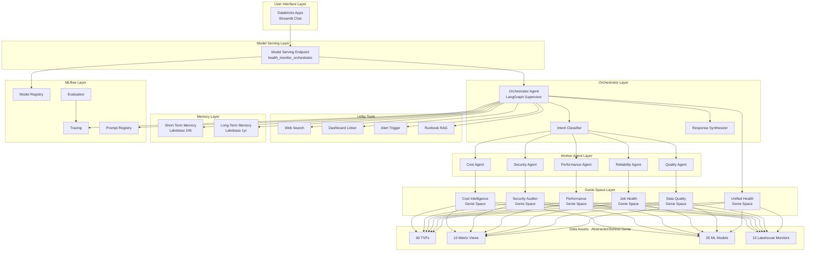
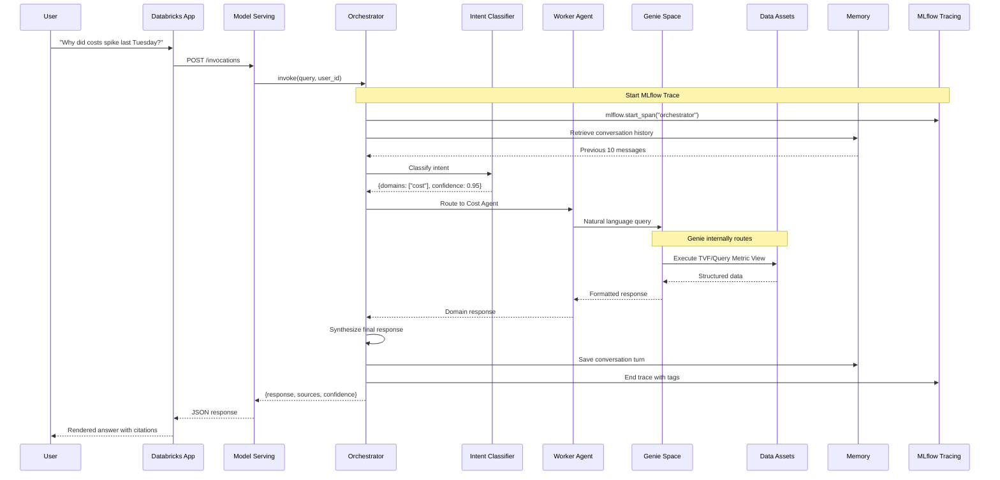
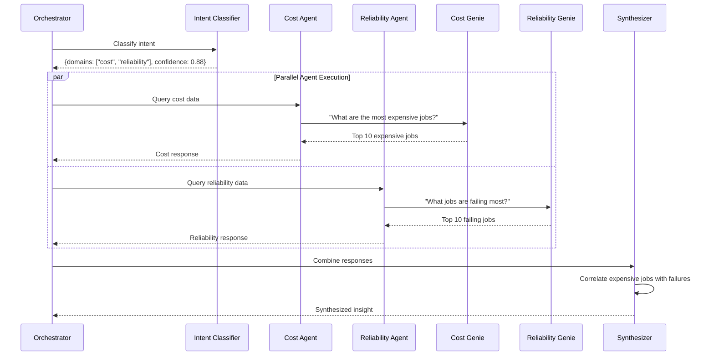
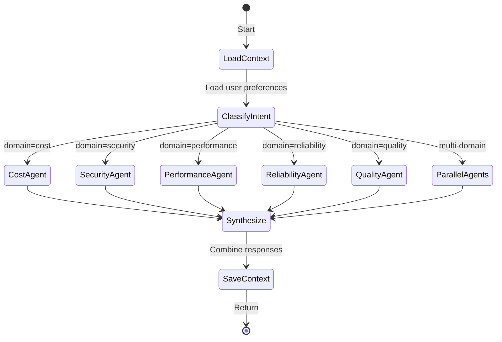
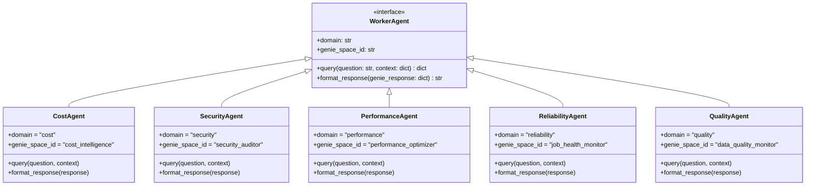
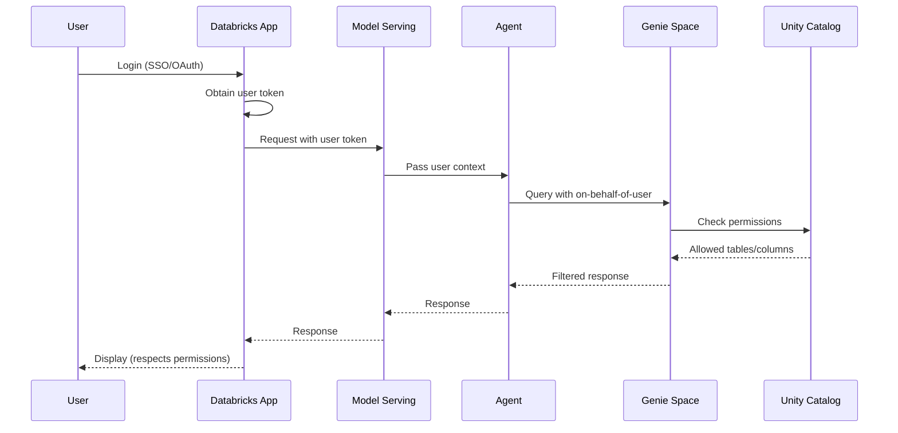
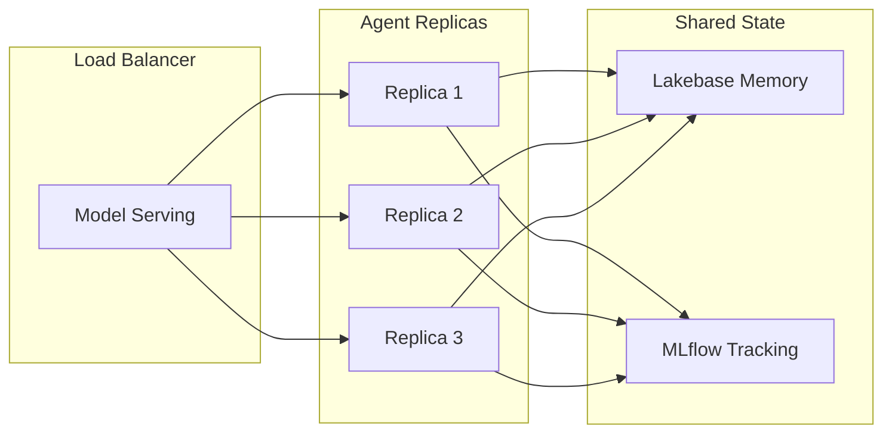

# 02 - Architecture Overview

> **✅ Implementation Status**: See `src/agents/orchestrator/graph.py` for the actual LangGraph implementation.
> Key differences from this design:
> - Memory uses Lakebase `CheckpointSaver` and `DatabricksStore` (not custom Delta tables)
> - Worker agents use `GenieWorkerAgent` base class with placeholder Genie Space IDs
> - Graph has simplified routing via `add_conditional_edges`

## System Architecture

The Databricks Health Monitor Agent System uses a **hierarchical multi-agent architecture** with a custom LangGraph orchestrator supervising domain-specific worker agents. All data access flows through Genie Spaces.



## Data Flow

### Query Processing Flow



### Multi-Domain Query Flow

For queries spanning multiple domains (e.g., "Are expensive jobs also the ones failing?"):



## Component Architecture

### Orchestrator Agent

The orchestrator is the brain of the system, implemented as a LangGraph state machine:



> **Implementation Note**: The actual implementation in `src/agents/orchestrator/graph.py` uses `add_conditional_edges` for routing and does not have separate `RouteToWorker` or `CollectResponses` nodes.

### Worker Agent Design

Each worker agent follows a consistent interface:



## Technology Stack

### Core Technologies

| Layer | Technology | Version | Purpose |
|-------|------------|---------|---------|
| **Orchestration** | LangGraph | 0.2+ | State machine for multi-agent coordination |
| **LLM** | DBRX Instruct | Latest | Intent classification, synthesis |
| **LLM (Fallback)** | Llama 3.1 70B | Latest | Worker agent responses |
| **Framework** | LangChain | 0.3+ | Agent primitives, tool integration |
| **Data Access** | Genie API | Latest | Natural language data queries |
| **Memory** | Lakebase | Latest | Short-term and long-term storage |
| **Tracing** | MLflow 3.0 | 3.0+ | Observability and debugging |
| **Deployment** | Model Serving | Serverless | Production endpoint |
| **Frontend** | Databricks Apps | Latest | Chat interface |

### Python Dependencies

```python
# requirements.txt
mlflow>=3.0.0
langchain>=0.3.0
langgraph>=0.2.0
langchain-databricks>=0.1.0
databricks-sdk>=0.30.0
databricks-agents>=0.1.0
pydantic>=2.0.0
streamlit>=1.30.0
tavily-python>=0.3.0  # For web search
```

## Security Architecture

### Authentication Flow



### Key Security Features

| Feature | Implementation |
|---------|----------------|
| **On-behalf-of-user Auth** | Genie queries execute with user's permissions |
| **Unity Catalog Governance** | Row/column-level security enforced |
| **Secrets Management** | API keys in Databricks Secrets |
| **Audit Logging** | All queries logged via MLflow traces |
| **Rate Limiting** | Model Serving endpoint limits |

## Scalability Considerations

### Horizontal Scaling



### Performance Targets

| Metric | Target | Notes |
|--------|--------|-------|
| Latency (P50) | <5s | Single-domain queries |
| Latency (P95) | <10s | Multi-domain queries |
| Throughput | 100 req/min | Per endpoint |
| Concurrent Users | 50 | Via Model Serving |
| Memory per Request | <512MB | LangGraph state |

## Error Handling

### Failure Modes

| Failure | Detection | Recovery |
|---------|-----------|----------|
| Genie timeout | 30s timeout | Retry with simpler query |
| LLM rate limit | 429 response | Exponential backoff |
| Memory unavailable | Connection error | Proceed without context |
| Worker agent error | Exception | Log and skip domain |
| Utility tool error | Exception | Return partial response |

### Graceful Degradation

```python
# Pseudo-code for error handling
def orchestrate(query: str, user_id: str) -> dict:
    try:
        # Normal flow
        intent = classify_intent(query)
        responses = await gather_worker_responses(intent.domains)
        return synthesize(responses)
    except GenieTimeoutError:
        # Fallback to unified Genie with simpler query
        return unified_genie.query(simplify(query))
    except MemoryUnavailableError:
        # Proceed without conversation history
        return orchestrate_stateless(query)
    except Exception as e:
        # Log error and return apologetic response
        mlflow.log_metric("error_count", 1)
        return {"response": "I encountered an issue. Please try again."}
```

## Next Steps

- **[03-Orchestrator Agent](03-orchestrator-agent.md)**: Detailed orchestrator implementation
- **[04-Worker Agents](04-worker-agents.md)**: Domain specialist agent details
- **[05-Genie Integration](05-genie-integration.md)**: Genie API patterns

