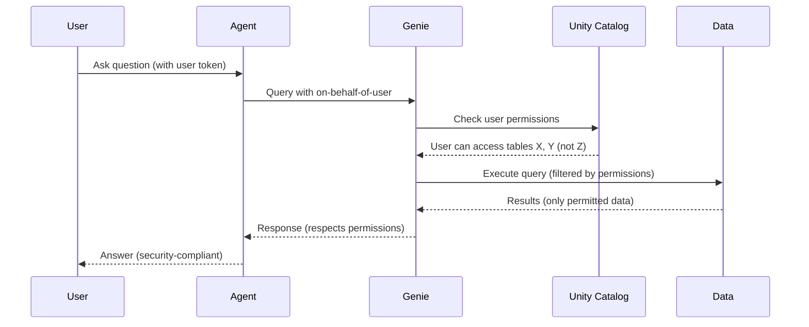

# 05 - Genie Integration

## Overview

Genie Spaces serve as the **sole data interface** for agents. All queries to TVFs, Metric Views, and ML prediction tables flow through Genie. This abstraction provides natural language flexibility, permission inheritance, and governance compliance.

## Architecture Principle

```
┌─────────────────────────────────────────────────────────────────────────────┐
│                         DATA ACCESS ARCHITECTURE                             │
├─────────────────────────────────────────────────────────────────────────────┤
│                                                                             │
│   ❌ WRONG: Agent calls TVFs/Tables directly                                │
│   ┌────────┐      ┌──────────────┐                                         │
│   │ Agent  │ ───► │ TVF / Table  │  No governance, no NL flexibility       │
│   └────────┘      └──────────────┘                                         │
│                                                                             │
│   ✅ CORRECT: Agent queries Genie, Genie routes internally                  │
│   ┌────────┐      ┌────────────┐      ┌──────────────┐                     │
│   │ Agent  │ ───► │ Genie Space│ ───► │ TVF / Table  │                     │
│   └────────┘      └────────────┘      └──────────────┘                     │
│                         │                                                   │
│                         ▼                                                   │
│               Natural Language Query                                        │
│               Permission Checks                                             │
│               Audit Logging                                                 │
│               Response Formatting                                           │
│                                                                             │
└─────────────────────────────────────────────────────────────────────────────┘
```

## Why Genie-Only Data Access?

| Benefit | Description | Impact |
|---------|-------------|--------|
| **Natural Language Flexibility** | Users ask questions naturally; Genie interprets | Better UX |
| **Permission Inheritance** | Queries run with user's Unity Catalog permissions | Security |
| **Abstraction** | Agents don't know TVF signatures or schemas | Maintainability |
| **Governance** | All access logged and auditable | Compliance |
| **Future-Proof** | Add TVFs without changing agent code | Scalability |
| **Consistency** | Same response format regardless of source | Reliability |

## Genie Conversation API

### Starting a Conversation

```python
from databricks.sdk import WorkspaceClient
from databricks.sdk.service.dashboards import GenieAPI
import mlflow

class GenieClient:
    """Client for interacting with Genie Spaces."""
    
    def __init__(self, workspace_client: WorkspaceClient = None):
        self.client = workspace_client or WorkspaceClient()
        self.genie = GenieAPI(self.client)
    
    @mlflow.trace(name="genie_start_conversation", span_type="TOOL")
    def start_conversation(
        self,
        space_id: str,
        question: str,
        user_token: str = None
    ) -> dict:
        """
        Start a new conversation with a Genie Space.
        
        Args:
            space_id: The Genie Space ID
            question: Natural language question
            user_token: Optional token for on-behalf-of-user auth
        
        Returns:
            {
                "conversation_id": str,
                "message_id": str,
                "content": str,
                "sources": List[str],
                "sql_query": Optional[str],
                "status": str
            }
        """
        with mlflow.start_span(name="genie_api_call") as span:
            span.set_attributes({
                "space_id": space_id,
                "question_length": len(question)
            })
            
            # Start conversation
            response = self.genie.start_conversation(
                space_id=space_id,
                content=question
            )
            
            # Wait for completion (Genie is async)
            result = self._wait_for_completion(
                space_id=space_id,
                conversation_id=response.conversation_id,
                message_id=response.message_id
            )
            
            span.set_attributes({
                "conversation_id": response.conversation_id,
                "status": result.get("status", "unknown"),
                "has_sql": result.get("sql_query") is not None
            })
            
            return result
    
    def _wait_for_completion(
        self,
        space_id: str,
        conversation_id: str,
        message_id: str,
        timeout_seconds: int = 45,
        poll_interval: float = 0.5
    ) -> dict:
        """Wait for Genie to complete processing."""
        import time
        
        start_time = time.time()
        while time.time() - start_time < timeout_seconds:
            message = self.genie.get_message(
                space_id=space_id,
                conversation_id=conversation_id,
                message_id=message_id
            )
            
            if message.status == "COMPLETED":
                return {
                    "conversation_id": conversation_id,
                    "message_id": message_id,
                    "content": message.content,
                    "sources": self._extract_sources(message),
                    "sql_query": getattr(message, 'query', None),
                    "status": "COMPLETED"
                }
            elif message.status == "FAILED":
                return {
                    "conversation_id": conversation_id,
                    "message_id": message_id,
                    "content": f"Query failed: {message.error_message}",
                    "sources": [],
                    "sql_query": None,
                    "status": "FAILED",
                    "error": message.error_message
                }
            
            time.sleep(poll_interval)
        
        raise TimeoutError(f"Genie query timed out after {timeout_seconds}s")
    
    def _extract_sources(self, message) -> list:
        """Extract data sources from Genie message."""
        sources = []
        if hasattr(message, 'attachments'):
            for attachment in message.attachments:
                if hasattr(attachment, 'query'):
                    # Extract table references from SQL
                    sql = attachment.query.query
                    sources.extend(self._parse_table_references(sql))
        return list(set(sources))
    
    def _parse_table_references(self, sql: str) -> list:
        """Parse table references from SQL query."""
        import re
        # Match catalog.schema.table patterns
        pattern = r'\b(\w+\.\w+\.\w+)\b'
        matches = re.findall(pattern, sql)
        return matches
```

### Continuing a Conversation

```python
    @mlflow.trace(name="genie_continue_conversation", span_type="TOOL")
    def continue_conversation(
        self,
        space_id: str,
        conversation_id: str,
        question: str
    ) -> dict:
        """
        Continue an existing conversation for follow-up questions.
        
        Args:
            space_id: The Genie Space ID
            conversation_id: Existing conversation ID
            question: Follow-up question
        
        Returns:
            Same structure as start_conversation
        """
        with mlflow.start_span(name="genie_continue_api") as span:
            span.set_attributes({
                "space_id": space_id,
                "conversation_id": conversation_id
            })
            
            response = self.genie.create_message(
                space_id=space_id,
                conversation_id=conversation_id,
                content=question
            )
            
            result = self._wait_for_completion(
                space_id=space_id,
                conversation_id=conversation_id,
                message_id=response.message_id
            )
            
            return result
```

## On-Behalf-of-User Authorization

Genie queries execute with the calling user's permissions, ensuring governance compliance.

### How It Works



### Implementation

```python
class SecureGenieClient(GenieClient):
    """Genie client with on-behalf-of-user authorization."""
    
    def __init__(self, workspace_client: WorkspaceClient = None):
        super().__init__(workspace_client)
    
    def query_as_user(
        self,
        space_id: str,
        question: str,
        user_token: str,
        conversation_id: str = None
    ) -> dict:
        """
        Query Genie with user's permissions.
        
        The user_token is passed to Genie which executes the query
        with that user's Unity Catalog permissions.
        
        Args:
            space_id: Genie Space ID
            question: Natural language question
            user_token: User's OAuth token
            conversation_id: Optional existing conversation
        
        Returns:
            Genie response (filtered by user permissions)
        """
        # Configure client with user token
        # Genie automatically respects the token's permissions
        if conversation_id:
            return self.continue_conversation(
                space_id=space_id,
                conversation_id=conversation_id,
                question=question
            )
        else:
            return self.start_conversation(
                space_id=space_id,
                question=question,
                user_token=user_token
            )
```

## Query Enhancement Patterns

### Time Context Enhancement

```python
def enhance_with_time_context(query: str, default_days: int = 7) -> str:
    """Add time context if missing from query."""
    
    time_keywords = [
        "today", "yesterday", "week", "month", "year",
        "last", "past", "recent", "since", "between",
        "hour", "day", "date"
    ]
    
    has_time = any(kw in query.lower() for kw in time_keywords)
    
    if not has_time:
        return f"{query} (for the last {default_days} days)"
    return query
```

### Domain Context Enhancement

```python
def enhance_with_domain_context(
    query: str,
    domain: str,
    user_preferences: dict
) -> str:
    """Add domain-specific context to query."""
    
    enhancements = []
    
    # Add user preferences
    if domain == "cost":
        if user_preferences.get("cost_threshold"):
            enhancements.append(
                f"Flag costs exceeding ${user_preferences['cost_threshold']}"
            )
        if user_preferences.get("preferred_workspace"):
            enhancements.append(
                f"Focus on workspace: {user_preferences['preferred_workspace']}"
            )
    
    elif domain == "reliability":
        if user_preferences.get("critical_jobs"):
            jobs = ", ".join(user_preferences["critical_jobs"])
            enhancements.append(f"Prioritize jobs: {jobs}")
    
    elif domain == "performance":
        if user_preferences.get("slow_query_threshold_seconds"):
            threshold = user_preferences["slow_query_threshold_seconds"]
            enhancements.append(f"Consider queries >{threshold}s as slow")
    
    if enhancements:
        return f"{query}. {'. '.join(enhancements)}"
    return query
```

### Clarification Enhancement

```python
def enhance_with_clarification(query: str, domain: str) -> str:
    """Add clarifying instructions based on domain."""
    
    clarifications = {
        "cost": "Include cost breakdown by SKU and workspace if relevant.",
        "security": "Include timestamps and user identities for audit.",
        "performance": "Include query IDs and duration metrics.",
        "reliability": "Include error messages and failure categories.",
        "quality": "Include table names and quality scores."
    }
    
    if domain in clarifications:
        return f"{query} {clarifications[domain]}"
    return query
```

## Response Parsing

### Structured Response Extraction

```python
from typing import Optional, List, Dict
from pydantic import BaseModel

class GenieResponse(BaseModel):
    """Structured Genie response."""
    
    content: str
    sources: List[str]
    sql_query: Optional[str]
    data_preview: Optional[List[Dict]]
    confidence: float = 0.9
    
    @classmethod
    def from_raw(cls, raw_response: dict) -> "GenieResponse":
        """Parse raw Genie response into structured format."""
        return cls(
            content=raw_response.get("content", ""),
            sources=raw_response.get("sources", []),
            sql_query=raw_response.get("sql_query"),
            data_preview=raw_response.get("data_preview"),
            confidence=0.9 if raw_response.get("status") == "COMPLETED" else 0.5
        )

def parse_genie_response(raw: dict) -> GenieResponse:
    """Parse and validate Genie response."""
    return GenieResponse.from_raw(raw)
```

### Data Extraction

```python
def extract_numeric_insights(response: GenieResponse) -> dict:
    """Extract numeric values from Genie response."""
    import re
    
    insights = {
        "costs": [],
        "percentages": [],
        "counts": [],
        "durations": []
    }
    
    content = response.content
    
    # Extract costs (e.g., $1,234.56)
    cost_pattern = r'\$[\d,]+\.?\d*'
    insights["costs"] = re.findall(cost_pattern, content)
    
    # Extract percentages (e.g., 45%, 12.5%)
    pct_pattern = r'\d+\.?\d*%'
    insights["percentages"] = re.findall(pct_pattern, content)
    
    # Extract counts (e.g., 1,234 jobs, 56 queries)
    count_pattern = r'(\d[\d,]*)\s+(jobs?|queries?|tables?|users?|failures?)'
    insights["counts"] = re.findall(count_pattern, content, re.IGNORECASE)
    
    # Extract durations (e.g., 30 seconds, 5 minutes)
    duration_pattern = r'(\d+\.?\d*)\s+(seconds?|minutes?|hours?|ms)'
    insights["durations"] = re.findall(duration_pattern, content, re.IGNORECASE)
    
    return insights
```

## Error Handling

### Genie Error Types

```python
class GenieError(Exception):
    """Base exception for Genie errors."""
    pass

class GenieTimeoutError(GenieError):
    """Query timed out."""
    pass

class GeniePermissionError(GenieError):
    """User lacks required permissions."""
    pass

class GenieQueryError(GenieError):
    """Query execution failed."""
    pass

class GenieSpaceNotFoundError(GenieError):
    """Genie Space not found."""
    pass
```

### Error Handling Pattern

```python
def query_genie_with_fallback(
    client: GenieClient,
    space_id: str,
    question: str,
    fallback_space_id: str = None
) -> dict:
    """Query Genie with error handling and fallback."""
    
    try:
        return client.start_conversation(space_id, question)
    
    except GenieTimeoutError:
        # Try simpler query
        simplified = simplify_query(question)
        try:
            return client.start_conversation(space_id, simplified)
        except GenieTimeoutError:
            return {
                "content": "Query timed out. Please try a more specific question.",
                "sources": [],
                "status": "TIMEOUT"
            }
    
    except GeniePermissionError as e:
        return {
            "content": f"You don't have permission to access this data: {e}",
            "sources": [],
            "status": "PERMISSION_DENIED"
        }
    
    except GenieQueryError as e:
        # Try fallback space if available
        if fallback_space_id:
            try:
                return client.start_conversation(fallback_space_id, question)
            except Exception:
                pass
        
        return {
            "content": f"Query failed: {e}. Please rephrase your question.",
            "sources": [],
            "status": "QUERY_ERROR"
        }
    
    except Exception as e:
        mlflow.log_metric("genie_error_count", 1)
        return {
            "content": "An unexpected error occurred. Please try again.",
            "sources": [],
            "status": "ERROR",
            "error": str(e)
        }

def simplify_query(query: str) -> str:
    """Simplify a query for retry."""
    # Remove time constraints
    simplified = re.sub(r'(for the last \d+ days?)', '', query)
    # Remove specific filters
    simplified = re.sub(r'(for workspace \w+)', '', simplified)
    # Add explicit simplification
    simplified += " Give a high-level summary."
    return simplified.strip()
```

## Genie Space Configuration

### Space IDs by Domain

```python
# Loaded from environment or Unity Catalog
GENIE_SPACE_IDS = {
    "cost": os.environ.get("COST_GENIE_SPACE_ID"),
    "security": os.environ.get("SECURITY_GENIE_SPACE_ID"),
    "performance": os.environ.get("PERFORMANCE_GENIE_SPACE_ID"),
    "reliability": os.environ.get("RELIABILITY_GENIE_SPACE_ID"),
    "quality": os.environ.get("QUALITY_GENIE_SPACE_ID"),
    "unified": os.environ.get("UNIFIED_GENIE_SPACE_ID")
}

def get_genie_space_id(domain: str) -> str:
    """Get Genie Space ID for a domain."""
    space_id = GENIE_SPACE_IDS.get(domain.lower())
    if not space_id:
        raise GenieSpaceNotFoundError(f"No Genie Space configured for domain: {domain}")
    return space_id
```

### Space Capabilities

```python
# What each Genie Space can answer
GENIE_SPACE_CAPABILITIES = {
    "cost": {
        "questions": [
            "Cost analysis and breakdowns",
            "Budget tracking and alerts",
            "Chargeback reports",
            "Cost anomalies and forecasts",
            "Resource waste detection"
        ],
        "data_assets": ["60 TVFs", "10 Metric Views", "25 ML Models"]
    },
    "security": {
        "questions": [
            "Access audit and compliance",
            "Threat detection",
            "Permission analysis",
            "User activity reports",
            "Sensitive data access"
        ],
        "data_assets": ["Security TVFs", "Compliance Metrics", "Threat Models"]
    },
    # ... other domains
}
```

## Testing Genie Integration

```python
import pytest
from unittest.mock import Mock, patch

class TestGenieClient:
    """Tests for Genie integration."""
    
    def setup_method(self):
        self.mock_ws = Mock()
        self.client = GenieClient(self.mock_ws)
    
    @patch.object(GenieClient, '_wait_for_completion')
    def test_start_conversation_success(self, mock_wait):
        mock_wait.return_value = {
            "conversation_id": "conv_123",
            "content": "Costs increased by 20%",
            "sources": ["fact_usage"],
            "status": "COMPLETED"
        }
        
        result = self.client.start_conversation(
            space_id="space_123",
            question="Why did costs spike?"
        )
        
        assert result["status"] == "COMPLETED"
        assert "20%" in result["content"]
        assert len(result["sources"]) == 1
    
    def test_enhance_with_time_context(self):
        query = "Show me costs"
        enhanced = enhance_with_time_context(query, default_days=7)
        assert "7 days" in enhanced
    
    def test_enhance_preserves_existing_time(self):
        query = "Show me yesterday's costs"
        enhanced = enhance_with_time_context(query)
        assert "7 days" not in enhanced
        assert "yesterday" in enhanced
```

## Next Steps

- **[06-Utility Tools](06-utility-tools.md)**: Web search, dashboard linker, alerts, RAG
- **[07-Memory Management](07-memory-management.md)**: Lakebase integration

