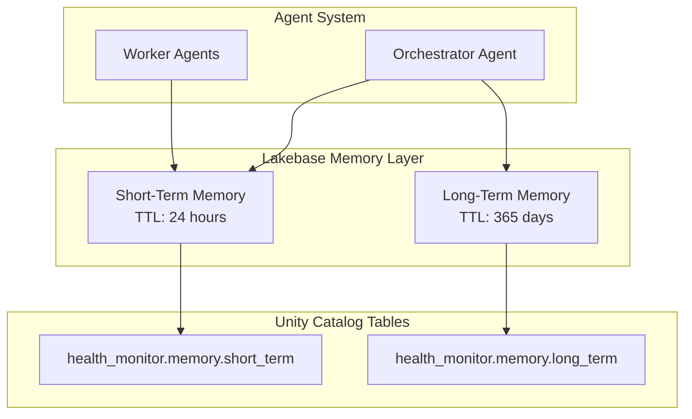

# 07 - Memory Management

> **✅ Implementation Status**: See `src/agents/memory/` for the actual implementation.
>
> **IMPORTANT**: The actual implementation uses official Databricks Lakebase primitives:
> - **Short-term**: `CheckpointSaver` from `databricks_langchain` (NOT custom Delta tables)
> - **Long-term**: `DatabricksStore` from `databricks_langchain` with vector embeddings
>
> This provides automatic schema management, TTL handling, and native LangGraph integration.

## Overview

The agent system uses **Lakebase** for memory management, providing both short-term conversation context and long-term user preferences. Lakebase is Databricks' native memory solution optimized for AI agents.

## Memory Architecture



## Memory Types

| Type | Purpose | TTL | Contents |
|------|---------|-----|----------|
| **Short-Term** | Conversation context | 24 hours | Messages, session state |
| **Long-Term** | User preferences | 365 days | Preferences, insights, history |

## Short-Term Memory

### Purpose

Short-term memory stores conversation history to enable:
- Multi-turn conversations
- Context-aware responses
- Follow-up question handling
- Session continuity

### Schema

```sql
-- Short-term memory table
CREATE TABLE health_monitor.memory.short_term (
    session_id STRING NOT NULL,
    user_id STRING NOT NULL,
    message_id STRING NOT NULL,
    role STRING NOT NULL,  -- 'user' or 'assistant'
    content STRING NOT NULL,
    metadata MAP<STRING, STRING>,
    created_at TIMESTAMP NOT NULL,
    expires_at TIMESTAMP NOT NULL,
    
    -- Clustering for fast retrieval
    CONSTRAINT pk_short_term PRIMARY KEY (session_id, message_id)
)
USING DELTA
CLUSTER BY (session_id, user_id)
TBLPROPERTIES (
    'delta.enableChangeDataFeed' = 'true',
    'delta.autoOptimize.optimizeWrite' = 'true'
);

-- Create index for fast session lookups
CREATE INDEX idx_short_term_session 
ON health_monitor.memory.short_term (session_id, created_at);
```

### Implementation

```python
from typing import List, Dict, Optional
from datetime import datetime, timedelta
import uuid
import mlflow
from pyspark.sql import SparkSession
from pyspark.sql.functions import col, current_timestamp, lit

class ShortTermMemory:
    """Short-term memory using Lakebase for conversation context."""
    
    def __init__(
        self,
        table_name: str = "health_monitor.memory.short_term",
        ttl_hours: int = 24
    ):
        self.table_name = table_name
        self.ttl_hours = ttl_hours
        self.spark = SparkSession.getActiveSession()
    
    @mlflow.trace(name="memory_save", span_type="MEMORY")
    def save(
        self,
        session_id: str,
        user_id: str,
        messages: List[Dict[str, str]],
        metadata: Optional[Dict[str, str]] = None
    ):
        """
        Save conversation messages to short-term memory.
        
        Args:
            session_id: Unique session/conversation ID
            user_id: User identifier
            messages: List of {role, content} messages
            metadata: Optional metadata to store with messages
        """
        with mlflow.start_span(name="save_messages") as span:
            now = datetime.utcnow()
            expires_at = now + timedelta(hours=self.ttl_hours)
            
            records = []
            for msg in messages:
                records.append({
                    "session_id": session_id,
                    "user_id": user_id,
                    "message_id": str(uuid.uuid4()),
                    "role": msg["role"],
                    "content": msg["content"],
                    "metadata": metadata or {},
                    "created_at": now,
                    "expires_at": expires_at
                })
            
            # Write to Delta table
            df = self.spark.createDataFrame(records)
            df.write.format("delta").mode("append").saveAsTable(self.table_name)
            
            span.set_attributes({
                "session_id": session_id,
                "message_count": len(messages),
                "ttl_hours": self.ttl_hours
            })
    
    @mlflow.trace(name="memory_retrieve", span_type="MEMORY")
    def retrieve(
        self,
        session_id: str,
        max_messages: int = 10,
        include_expired: bool = False
    ) -> List[Dict[str, str]]:
        """
        Retrieve conversation history for a session.
        
        Args:
            session_id: Session/conversation ID
            max_messages: Maximum number of messages to retrieve
            include_expired: Whether to include expired messages
        
        Returns:
            List of {role, content} messages in chronological order
        """
        with mlflow.start_span(name="retrieve_messages") as span:
            query = f"""
                SELECT role, content, created_at
                FROM {self.table_name}
                WHERE session_id = '{session_id}'
            """
            
            if not include_expired:
                query += " AND expires_at > current_timestamp()"
            
            query += f" ORDER BY created_at DESC LIMIT {max_messages}"
            
            df = self.spark.sql(query)
            
            # Convert to list and reverse for chronological order
            messages = [
                {"role": row.role, "content": row.content}
                for row in df.collect()
            ][::-1]
            
            span.set_attributes({
                "session_id": session_id,
                "retrieved_count": len(messages)
            })
            
            return messages
    
    def clear_session(self, session_id: str):
        """Clear all messages for a session."""
        self.spark.sql(f"""
            DELETE FROM {self.table_name}
            WHERE session_id = '{session_id}'
        """)
    
    def cleanup_expired(self):
        """Remove all expired messages."""
        self.spark.sql(f"""
            DELETE FROM {self.table_name}
            WHERE expires_at < current_timestamp()
        """)

# Global instance
short_term_memory = ShortTermMemory()
```

### Usage Example

```python
# Save a conversation turn
short_term_memory.save(
    session_id="conv_12345",
    user_id="user@example.com",
    messages=[
        {"role": "user", "content": "Why did costs spike yesterday?"},
        {"role": "assistant", "content": "Costs spiked due to increased cluster usage..."}
    ]
)

# Retrieve conversation history
history = short_term_memory.retrieve(
    session_id="conv_12345",
    max_messages=10
)

print(f"Retrieved {len(history)} messages")
for msg in history:
    print(f"{msg['role']}: {msg['content'][:50]}...")
```

## Long-Term Memory

### Purpose

Long-term memory stores persistent user information:
- Preferences (favorite workspaces, cost thresholds)
- Frequent queries and patterns
- Historical insights and trends
- Role-based context

### Schema

```sql
-- Long-term memory table
CREATE TABLE health_monitor.memory.long_term (
    user_id STRING NOT NULL PRIMARY KEY,
    preferences MAP<STRING, STRING>,
    frequent_queries ARRAY<STRING>,
    insights ARRAY<STRUCT<
        timestamp: TIMESTAMP,
        domain: STRING,
        insight: STRING
    >>,
    role STRING,
    created_at TIMESTAMP NOT NULL,
    updated_at TIMESTAMP NOT NULL,
    expires_at TIMESTAMP
)
USING DELTA
CLUSTER BY (user_id)
TBLPROPERTIES (
    'delta.enableChangeDataFeed' = 'true',
    'delta.autoOptimize.optimizeWrite' = 'true'
);
```

### Implementation

```python
from typing import Dict, List, Optional
from datetime import datetime, timedelta
import mlflow
from pyspark.sql import SparkSession
from pyspark.sql.functions import col, current_timestamp, lit, struct, array

class LongTermMemory:
    """Long-term memory using Lakebase for user preferences and insights."""
    
    def __init__(
        self,
        table_name: str = "health_monitor.memory.long_term",
        ttl_days: int = 365
    ):
        self.table_name = table_name
        self.ttl_days = ttl_days
        self.spark = SparkSession.getActiveSession()
    
    @mlflow.trace(name="ltm_save", span_type="MEMORY")
    def save(
        self,
        user_id: str,
        preferences: Optional[Dict[str, str]] = None,
        frequent_queries: Optional[List[str]] = None,
        insights: Optional[List[Dict]] = None,
        role: Optional[str] = None
    ):
        """
        Save or update user's long-term memory.
        
        Args:
            user_id: User identifier
            preferences: User preferences (workspace, thresholds, etc.)
            frequent_queries: List of frequent query patterns
            insights: List of historical insights
            role: User's role (data_engineer, analyst, etc.)
        """
        with mlflow.start_span(name="save_long_term") as span:
            now = datetime.utcnow()
            expires_at = now + timedelta(days=self.ttl_days)
            
            # Check if user exists
            existing = self.spark.sql(f"""
                SELECT * FROM {self.table_name}
                WHERE user_id = '{user_id}'
            """).collect()
            
            if existing:
                # Update existing record
                updates = []
                if preferences:
                    updates.append(f"preferences = MAP{tuple(sum(preferences.items(), ()))}")
                if frequent_queries:
                    updates.append(f"frequent_queries = ARRAY{tuple(frequent_queries)}")
                if role:
                    updates.append(f"role = '{role}'")
                updates.append("updated_at = current_timestamp()")
                updates.append(f"expires_at = timestamp'{expires_at}'")
                
                self.spark.sql(f"""
                    UPDATE {self.table_name}
                    SET {', '.join(updates)}
                    WHERE user_id = '{user_id}'
                """)
            else:
                # Insert new record
                record = {
                    "user_id": user_id,
                    "preferences": preferences or {},
                    "frequent_queries": frequent_queries or [],
                    "insights": insights or [],
                    "role": role,
                    "created_at": now,
                    "updated_at": now,
                    "expires_at": expires_at
                }
                
                df = self.spark.createDataFrame([record])
                df.write.format("delta").mode("append").saveAsTable(self.table_name)
            
            span.set_attributes({
                "user_id": user_id,
                "has_preferences": preferences is not None,
                "has_queries": frequent_queries is not None
            })
    
    @mlflow.trace(name="ltm_retrieve", span_type="MEMORY")
    def retrieve(self, user_id: str) -> Optional[Dict]:
        """
        Retrieve user's long-term memory.
        
        Args:
            user_id: User identifier
        
        Returns:
            User's stored preferences, queries, and insights
        """
        with mlflow.start_span(name="retrieve_long_term") as span:
            result = self.spark.sql(f"""
                SELECT *
                FROM {self.table_name}
                WHERE user_id = '{user_id}'
                  AND (expires_at IS NULL OR expires_at > current_timestamp())
            """).collect()
            
            if not result:
                span.set_attributes({"found": False})
                return None
            
            row = result[0]
            data = {
                "user_id": row.user_id,
                "preferences": dict(row.preferences) if row.preferences else {},
                "frequent_queries": list(row.frequent_queries) if row.frequent_queries else [],
                "insights": row.insights,
                "role": row.role,
                "created_at": row.created_at,
                "updated_at": row.updated_at
            }
            
            span.set_attributes({
                "found": True,
                "preference_count": len(data["preferences"]),
                "query_count": len(data["frequent_queries"])
            })
            
            return data
    
    def add_insight(
        self,
        user_id: str,
        domain: str,
        insight: str
    ):
        """Add a new insight to user's history."""
        self.spark.sql(f"""
            UPDATE {self.table_name}
            SET insights = array_union(
                insights,
                array(struct(
                    current_timestamp() as timestamp,
                    '{domain}' as domain,
                    '{insight}' as insight
                ))
            ),
            updated_at = current_timestamp()
            WHERE user_id = '{user_id}'
        """)
    
    def update_frequent_queries(
        self,
        user_id: str,
        query: str,
        max_queries: int = 20
    ):
        """Track a query in user's frequent queries list."""
        # Get existing queries
        existing = self.retrieve(user_id)
        if not existing:
            self.save(user_id, frequent_queries=[query])
            return
        
        queries = existing.get("frequent_queries", [])
        
        # Add new query (avoid duplicates, keep recent)
        if query not in queries:
            queries.append(query)
        queries = queries[-max_queries:]  # Keep most recent
        
        self.save(user_id, frequent_queries=queries)

# Global instance
long_term_memory = LongTermMemory()
```

### Usage Example

```python
# Save user preferences
long_term_memory.save(
    user_id="user@example.com",
    preferences={
        "preferred_workspace": "prod",
        "cost_threshold": "10000",
        "timezone": "America/New_York"
    },
    role="data_engineer"
)

# Retrieve user context
user_context = long_term_memory.retrieve("user@example.com")
if user_context:
    print(f"Preferred workspace: {user_context['preferences'].get('preferred_workspace')}")
    print(f"Role: {user_context['role']}")

# Add an insight
long_term_memory.add_insight(
    user_id="user@example.com",
    domain="cost",
    insight="User frequently asks about DBU costs for ML workloads"
)
```

## Memory Integration in Orchestrator

### Loading Context at Query Start

```python
def load_memory_context(
    user_id: str,
    session_id: Optional[str]
) -> Dict:
    """Load all relevant memory context for a query."""
    
    context = {
        "conversation_history": [],
        "user_preferences": {},
        "user_role": None,
        "frequent_queries": []
    }
    
    # Load short-term memory (conversation)
    if session_id:
        context["conversation_history"] = short_term_memory.retrieve(
            session_id=session_id,
            max_messages=10
        )
    
    # Load long-term memory (preferences)
    user_data = long_term_memory.retrieve(user_id)
    if user_data:
        context["user_preferences"] = user_data.get("preferences", {})
        context["user_role"] = user_data.get("role")
        context["frequent_queries"] = user_data.get("frequent_queries", [])
    
    return context
```

### Injecting Context into Prompts

```python
def build_context_prompt(context: Dict) -> str:
    """Build context section for system prompt."""
    
    parts = []
    
    # Add conversation history
    if context["conversation_history"]:
        parts.append("## Recent Conversation:")
        for msg in context["conversation_history"][-5:]:  # Last 5 messages
            parts.append(f"- {msg['role'].upper()}: {msg['content'][:200]}")
    
    # Add user preferences
    if context["user_preferences"]:
        parts.append("\n## User Preferences:")
        for key, value in context["user_preferences"].items():
            parts.append(f"- {key}: {value}")
    
    # Add user role context
    if context["user_role"]:
        parts.append(f"\n## User Role: {context['user_role']}")
        role_context = {
            "data_engineer": "Focus on technical details, SQL, and pipeline health.",
            "analyst": "Focus on business metrics and visualizations.",
            "manager": "Focus on summaries, trends, and cost implications."
        }
        if context["user_role"] in role_context:
            parts.append(f"Communication style: {role_context[context['user_role']]}")
    
    return "\n".join(parts)
```

### Saving Context After Response

```python
def save_conversation_turn(
    user_id: str,
    session_id: str,
    query: str,
    response: str,
    domains: List[str]
):
    """Save conversation turn and update user history."""
    
    # Save to short-term memory
    short_term_memory.save(
        session_id=session_id,
        user_id=user_id,
        messages=[
            {"role": "user", "content": query},
            {"role": "assistant", "content": response}
        ]
    )
    
    # Update long-term memory with query pattern
    long_term_memory.update_frequent_queries(user_id, query)
    
    # Track domain interests (for personalization)
    for domain in domains:
        long_term_memory.add_insight(
            user_id=user_id,
            domain=domain,
            insight=f"Asked about {domain}: {query[:100]}"
        )
```

## Cleanup Jobs

### Scheduled Cleanup

```python
# Run daily to clean up expired memory
def cleanup_memory_job():
    """Cleanup job for expired memory entries."""
    
    # Cleanup short-term memory
    short_term_memory.cleanup_expired()
    print("Cleaned up expired short-term memory")
    
    # Cleanup long-term memory (older than TTL)
    spark = SparkSession.getActiveSession()
    spark.sql("""
        DELETE FROM health_monitor.memory.long_term
        WHERE expires_at < current_timestamp()
    """)
    print("Cleaned up expired long-term memory")

# Schedule this as a daily job in Asset Bundles
```

## Actual Implementation

The actual implementation uses the official Databricks Lakebase primitives instead of custom Delta tables. This approach was chosen because:

1. **Automatic schema management** - No manual DDL required
2. **Built-in TTL handling** - Lakebase manages expiration
3. **Native LangGraph integration** - `CheckpointSaver` works directly with `graph.compile()`
4. **Vector search** - `DatabricksStore` provides semantic retrieval

### Short-Term Memory (CheckpointSaver)

```python
# src/agents/memory/short_term.py (actual implementation)
from databricks_langchain import CheckpointSaver
from langgraph.checkpoint.base import BaseCheckpointSaver

class ShortTermMemory:
    """Short-term memory using Lakebase CheckpointSaver."""

    def __init__(self, instance_name: Optional[str] = None):
        self.instance_name = instance_name or settings.lakebase_instance_name

    @contextmanager
    def get_checkpointer(self) -> Generator[BaseCheckpointSaver, None, None]:
        """Get checkpoint saver for LangGraph compilation."""
        with CheckpointSaver(instance_name=self.instance_name) as checkpointer:
            yield checkpointer

# Usage with LangGraph
with get_checkpoint_saver() as checkpointer:
    graph = workflow.compile(checkpointer=checkpointer)
    config = {"configurable": {"thread_id": thread_id}}
    result = graph.invoke(inputs, config)
```

### Long-Term Memory (DatabricksStore)

```python
# src/agents/memory/long_term.py (actual implementation)
from databricks_langchain import DatabricksStore

class LongTermMemory:
    """Long-term memory using DatabricksStore with vector embeddings."""

    def __init__(
        self,
        instance_name: Optional[str] = None,
        embedding_endpoint: str = "databricks-gte-large-en",
        embedding_dims: int = 1024,
    ):
        self.instance_name = instance_name or settings.lakebase_instance_name
        self._store = DatabricksStore(
            instance_name=self.instance_name,
            embedding_endpoint=embedding_endpoint,
            embedding_dims=embedding_dims,
        )

    def save_memory(self, user_id: str, memory_key: str, memory_data: Dict):
        """Save user memory with vector embedding."""
        namespace = ("user_memories", user_id)
        self._store.put(namespace, memory_key, memory_data)

    def search_memories(self, user_id: str, query: str, limit: int = 5):
        """Semantic search over user memories."""
        namespace = ("user_memories", user_id)
        return self._store.search(namespace, query=query, limit=limit)
```

### References

- [Databricks Short-term Memory Agent (Lakebase)](https://docs.databricks.com/aws/en/notebooks/source/generative-ai/short-term-memory-agent-lakebase.html)
- [Databricks Long-term Memory Agent (Lakebase)](https://docs.databricks.com/aws/en/notebooks/source/generative-ai/long-term-memory-agent-lakebase.html)

## Next Steps

- **[08-MLflow Tracing](08-mlflow-tracing.md)**: Comprehensive tracing setup
- **[09-Evaluation and Judges](09-evaluation-and-judges.md)**: LLM judges configuration

