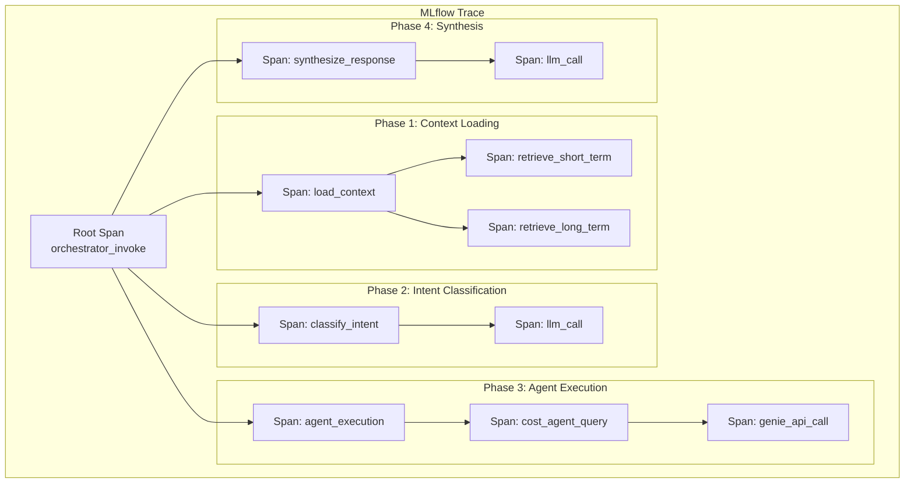

# 08 - MLflow Tracing

## Overview

MLflow 3.0 provides comprehensive tracing for GenAI applications, enabling observability, debugging, and performance monitoring. This document covers the complete tracing implementation for the Health Monitor agent system.

## MLflow 3.0 Tracing Concepts

### Trace Hierarchy



### Span Types

| Span Type | Purpose | Examples |
|-----------|---------|----------|
| `AGENT` | Agent-level operations | Orchestrator invoke, worker agent query |
| `LLM` | LLM calls | Intent classification, response synthesis |
| `TOOL` | Tool invocations | Genie query, web search, dashboard linker |
| `RETRIEVER` | Memory/RAG operations | Memory retrieval, vector search |
| `MEMORY` | Memory operations | Save/retrieve conversation context |
| `CLASSIFIER` | Classification operations | Intent classification |

## Automatic Tracing

### LangChain Autolog

Enable automatic tracing for all LangChain operations:

```python
import mlflow

# Enable automatic tracing for LangChain
# Place at the top of your application entry point
mlflow.langchain.autolog(
    log_models=True,              # Log model artifacts
    log_input_examples=True,      # Log input examples
    log_model_signatures=True,    # Log model signatures
    log_inputs=True,              # Log all inputs
    log_outputs=True,             # Log all outputs (default: True)
    disable=False,                # Enable autologging
    silent=False                  # Show log messages
)
```

### What Gets Traced Automatically

With `autolog()` enabled, the following are automatically traced:
- LangChain chain invocations
- LLM calls (ChatDatabricks, ChatOpenAI, etc.)
- Tool executions
- Agent steps
- Memory operations (if using LangChain memory)

### Example: Automatic Trace

```python
from langchain_databricks import ChatDatabricks
from langchain.prompts import ChatPromptTemplate

# Autolog is already enabled
llm = ChatDatabricks(endpoint="databricks-dbrx-instruct")
prompt = ChatPromptTemplate.from_messages([
    ("system", "You are a helpful assistant."),
    ("human", "{query}")
])

chain = prompt | llm

# This call is automatically traced
response = chain.invoke({"query": "Why did costs spike?"})
# MLflow captures: input, output, latency, token counts, etc.
```

## Manual Tracing

### The @mlflow.trace Decorator

Use `@mlflow.trace` for custom functions that should be traced:

```python
import mlflow
from typing import Dict, List

@mlflow.trace(name="orchestrator_invoke", span_type="AGENT")
def orchestrate(
    query: str,
    user_id: str,
    session_id: str = None
) -> Dict:
    """
    Main orchestrator entry point.
    The entire function execution is traced as a single span.
    """
    # All code here is traced
    context = load_context(user_id, session_id)
    intent = classify_intent(query)
    responses = query_agents(intent.domains, query)
    result = synthesize(responses)
    
    return result
```

### Manual Span Creation with mlflow.start_span()

For fine-grained control, create spans manually:

```python
import mlflow

def classify_intent(query: str) -> Dict:
    """Classify user intent with detailed tracing."""
    
    with mlflow.start_span(name="intent_classification", span_type="CLASSIFIER") as span:
        # Set input attributes
        span.set_inputs({"query": query})
        
        # LLM call (traced separately if using autolog)
        llm = ChatDatabricks(endpoint="databricks-dbrx-instruct", temperature=0.1)
        
        with mlflow.start_span(name="llm_call", span_type="LLM") as llm_span:
            llm_span.set_inputs({"prompt": INTENT_PROMPT, "query": query})
            
            response = llm.invoke([
                {"role": "system", "content": INTENT_PROMPT},
                {"role": "user", "content": query}
            ])
            
            llm_span.set_outputs({"response": response.content})
        
        # Parse result
        intent = json.loads(response.content)
        
        # Set output and custom attributes
        span.set_outputs(intent)
        span.set_attributes({
            "domains": intent["domains"],
            "confidence": intent["confidence"],
            "domain_count": len(intent["domains"])
        })
        
        return intent
```

### Nested Spans

Create hierarchical traces with nested spans:

```python
@mlflow.trace(name="query_agents", span_type="AGENT")
def query_agents(domains: List[str], query: str) -> Dict[str, Dict]:
    """Query multiple agents with tracing for each."""
    
    responses = {}
    
    for domain in domains:
        with mlflow.start_span(name=f"{domain}_agent", span_type="AGENT") as agent_span:
            agent_span.set_inputs({"domain": domain, "query": query})
            
            # Get agent and query
            agent = worker_registry.get_agent(domain)
            
            with mlflow.start_span(name="genie_query", span_type="TOOL") as genie_span:
                genie_span.set_inputs({
                    "space_id": agent.genie_space_id,
                    "query": query
                })
                
                response = agent.query(query)
                
                genie_span.set_outputs(response)
                genie_span.set_attributes({
                    "source_count": len(response.get("sources", [])),
                    "has_error": "error" in response
                })
            
            responses[domain] = response
            agent_span.set_outputs(response)
    
    return responses
```

## Trace Tagging

### Adding Tags to Traces

Tags enable filtering and grouping traces in the MLflow UI:

```python
import mlflow

@mlflow.trace(name="orchestrator_invoke", span_type="AGENT")
def orchestrate(query: str, user_id: str, session_id: str = None) -> Dict:
    """Orchestrate with comprehensive tagging."""
    
    # Perform operations...
    intent = classify_intent(query)
    
    # Update trace with tags
    mlflow.update_current_trace(tags={
        # User context
        "user_id": user_id,
        "session_id": session_id or "none",
        
        # Query context
        "domains": ",".join(intent["domains"]),
        "domain_count": str(len(intent["domains"])),
        "confidence": str(intent["confidence"]),
        
        # Environment
        "environment": os.environ.get("ENVIRONMENT", "dev"),
        "version": "1.0.0",
        
        # Performance hints
        "is_multi_domain": str(len(intent["domains"]) > 1),
        "has_utility_tools": str(needs_utility_tools(query))
    })
    
    # Continue processing...
    responses = query_agents(intent["domains"], query)
    result = synthesize(responses)
    
    return result
```

### Standard Tag Schema

Define a consistent tag schema across all traces:

```python
# Standard tags for all traces
STANDARD_TAGS = {
    # Required
    "user_id": str,           # User identifier
    "session_id": str,        # Session/conversation ID
    "environment": str,       # dev, staging, prod
    
    # Query metadata
    "domains": str,           # Comma-separated domains
    "domain_count": str,      # Number of domains
    "confidence": str,        # Intent classification confidence
    
    # Performance
    "is_multi_domain": str,   # "true" or "false"
    "utility_tools_used": str, # Comma-separated tool names
    
    # Response metadata
    "source_count": str,      # Number of data sources used
    "response_length": str,   # Character count of response
    
    # Error tracking
    "has_error": str,         # "true" or "false"
    "error_type": str,        # Error category if applicable
}

def tag_trace(
    user_id: str,
    session_id: str,
    intent: Dict,
    response: Dict,
    error: Exception = None
):
    """Apply standard tags to current trace."""
    tags = {
        "user_id": user_id,
        "session_id": session_id or "none",
        "environment": os.environ.get("ENVIRONMENT", "dev"),
        "domains": ",".join(intent.get("domains", [])),
        "domain_count": str(len(intent.get("domains", []))),
        "confidence": str(intent.get("confidence", 0)),
        "is_multi_domain": str(len(intent.get("domains", [])) > 1),
        "source_count": str(len(response.get("sources", []))),
        "response_length": str(len(response.get("content", ""))),
        "has_error": str(error is not None),
    }
    
    if error:
        tags["error_type"] = type(error).__name__
    
    mlflow.update_current_trace(tags=tags)
```

## Span Attributes Best Practices

### Input/Output Logging

```python
with mlflow.start_span(name="genie_query", span_type="TOOL") as span:
    # Log inputs
    span.set_inputs({
        "query": query,
        "space_id": genie_space_id,
        "enhanced_query": enhanced_query
    })
    
    # Perform operation
    result = genie_client.query(enhanced_query)
    
    # Log outputs
    span.set_outputs({
        "response": result["content"],
        "sources": result["sources"],
        "sql_query": result.get("sql_query")
    })
```

### Custom Attributes

```python
with mlflow.start_span(name="cost_analysis") as span:
    # Set custom attributes for analysis
    span.set_attributes({
        # Metrics
        "token_count": response.usage.total_tokens,
        "latency_ms": (end_time - start_time) * 1000,
        
        # Business logic
        "cost_threshold_exceeded": amount > threshold,
        "anomaly_detected": is_anomaly,
        
        # Performance
        "cache_hit": used_cache,
        "retry_count": retries
    })
```

## Production Monitoring

### Trace Collection Setup

```python
# Configure MLflow for production tracing
import mlflow

# Set tracking URI (Databricks MLflow is automatic in notebooks)
mlflow.set_tracking_uri("databricks")

# Set experiment for organized traces
mlflow.set_experiment("/Shared/health_monitor/agent_traces")

# Enable trace export to Inference Tables (for Model Serving)
# This is automatic when using mlflow.models.set_model()
```

### Monitoring Queries

Query traces from the MLflow API:

```python
import mlflow
from mlflow import MlflowClient

client = MlflowClient()

# Get traces from the last 24 hours
from datetime import datetime, timedelta

end_time = datetime.utcnow()
start_time = end_time - timedelta(hours=24)

# Search traces with filters
traces = client.search_traces(
    experiment_ids=["<experiment_id>"],
    filter_string=f"timestamp > {int(start_time.timestamp() * 1000)}",
    order_by=["timestamp DESC"],
    max_results=100
)

# Analyze trace metrics
for trace in traces:
    print(f"Trace: {trace.info.trace_id}")
    print(f"  Duration: {trace.info.execution_time_ms}ms")
    print(f"  Tags: {trace.info.tags}")
    print(f"  Status: {trace.info.status}")
```

### Dashboard Metrics

Track key metrics via traces:

```python
# Extract metrics from traces for dashboards
def compute_trace_metrics(traces):
    """Compute aggregate metrics from traces."""
    
    metrics = {
        "total_traces": len(traces),
        "success_count": 0,
        "error_count": 0,
        "avg_latency_ms": 0,
        "p95_latency_ms": 0,
        "domain_distribution": {},
    }
    
    latencies = []
    
    for trace in traces:
        # Count success/error
        if trace.info.status == "OK":
            metrics["success_count"] += 1
        else:
            metrics["error_count"] += 1
        
        # Collect latencies
        latencies.append(trace.info.execution_time_ms)
        
        # Count domains
        domains = trace.info.tags.get("domains", "").split(",")
        for domain in domains:
            if domain:
                metrics["domain_distribution"][domain] = \
                    metrics["domain_distribution"].get(domain, 0) + 1
    
    # Compute latency stats
    if latencies:
        metrics["avg_latency_ms"] = sum(latencies) / len(latencies)
        metrics["p95_latency_ms"] = sorted(latencies)[int(len(latencies) * 0.95)]
    
    return metrics
```

## Debugging with Traces

### Finding Slow Operations

```python
def find_slow_spans(trace_id: str, threshold_ms: int = 1000):
    """Find spans that exceeded latency threshold."""
    
    client = MlflowClient()
    trace = client.get_trace(trace_id)
    
    slow_spans = []
    for span in trace.data.spans:
        duration_ms = (span.end_time_ns - span.start_time_ns) / 1e6
        if duration_ms > threshold_ms:
            slow_spans.append({
                "name": span.name,
                "type": span.span_type,
                "duration_ms": duration_ms,
                "attributes": span.attributes
            })
    
    return sorted(slow_spans, key=lambda x: x["duration_ms"], reverse=True)
```

### Error Analysis

```python
def analyze_errors(traces):
    """Analyze error patterns in traces."""
    
    errors = {}
    
    for trace in traces:
        if trace.info.status != "OK":
            # Get error details from spans
            for span in trace.data.spans:
                if span.status.status_code == "ERROR":
                    error_type = span.attributes.get("error_type", "unknown")
                    error_msg = span.attributes.get("error_message", "")[:100]
                    
                    key = f"{error_type}: {error_msg}"
                    errors[key] = errors.get(key, 0) + 1
    
    return sorted(errors.items(), key=lambda x: x[1], reverse=True)
```

## Complete Tracing Example

```python
import mlflow
import json
from typing import Dict, List
from datetime import datetime

# Enable autolog at module level
mlflow.langchain.autolog()

class TracedOrchestrator:
    """Orchestrator with comprehensive MLflow tracing."""
    
    def __init__(self):
        self.worker_registry = WorkerAgentRegistry()
        self.genie_client = GenieClient()
    
    @mlflow.trace(name="orchestrator_invoke", span_type="AGENT")
    def invoke(
        self,
        query: str,
        user_id: str,
        session_id: str = None
    ) -> Dict:
        """Main entry point with full tracing."""
        
        start_time = datetime.utcnow()
        
        try:
            # Phase 1: Load context
            context = self._load_context(user_id, session_id)
            
            # Phase 2: Classify intent
            intent = self._classify_intent(query, context)
            
            # Phase 3: Query agents
            responses = self._query_agents(intent["domains"], query, context)
            
            # Phase 4: Synthesize response
            result = self._synthesize(query, responses, context)
            
            # Phase 5: Save context
            self._save_context(user_id, session_id, query, result["content"])
            
            # Tag trace with metadata
            self._tag_trace(user_id, session_id, intent, result)
            
            return result
            
        except Exception as e:
            # Log error to trace
            mlflow.update_current_trace(tags={
                "has_error": "true",
                "error_type": type(e).__name__,
                "error_message": str(e)[:200]
            })
            raise
    
    def _load_context(self, user_id: str, session_id: str) -> Dict:
        with mlflow.start_span(name="load_context", span_type="MEMORY") as span:
            span.set_inputs({"user_id": user_id, "session_id": session_id})
            
            context = load_memory_context(user_id, session_id)
            
            span.set_outputs({
                "message_count": len(context.get("conversation_history", [])),
                "has_preferences": bool(context.get("user_preferences"))
            })
            span.set_attributes({
                "user_role": context.get("user_role"),
                "preference_count": len(context.get("user_preferences", {}))
            })
            
            return context
    
    def _classify_intent(self, query: str, context: Dict) -> Dict:
        with mlflow.start_span(name="classify_intent", span_type="CLASSIFIER") as span:
            span.set_inputs({"query": query})
            
            intent = classify_intent(query)  # Uses autologged LLM
            
            span.set_outputs(intent)
            span.set_attributes({
                "domains": intent["domains"],
                "confidence": intent["confidence"]
            })
            
            return intent
    
    def _query_agents(
        self,
        domains: List[str],
        query: str,
        context: Dict
    ) -> Dict[str, Dict]:
        with mlflow.start_span(name="query_agents") as span:
            span.set_inputs({"domains": domains, "query": query})
            
            responses = {}
            for domain in domains:
                with mlflow.start_span(name=f"{domain}_agent", span_type="AGENT") as agent_span:
                    agent = self.worker_registry.get_agent(domain)
                    response = agent.query(query, context)
                    responses[domain] = response
                    
                    agent_span.set_outputs(response)
                    agent_span.set_attributes({
                        "genie_space": agent.genie_space_id,
                        "success": "error" not in response
                    })
            
            span.set_outputs({"domain_count": len(responses)})
            return responses
    
    def _synthesize(
        self,
        query: str,
        responses: Dict[str, Dict],
        context: Dict
    ) -> Dict:
        with mlflow.start_span(name="synthesize", span_type="LLM") as span:
            span.set_inputs({
                "query": query,
                "response_count": len(responses)
            })
            
            result = synthesize_response(query, responses, context)
            
            span.set_outputs({
                "content_length": len(result["content"]),
                "source_count": len(result["sources"])
            })
            
            return result
    
    def _save_context(
        self,
        user_id: str,
        session_id: str,
        query: str,
        response: str
    ):
        with mlflow.start_span(name="save_context", span_type="MEMORY") as span:
            save_conversation_turn(user_id, session_id, query, response, [])
            span.set_attributes({"saved": True})
    
    def _tag_trace(
        self,
        user_id: str,
        session_id: str,
        intent: Dict,
        result: Dict
    ):
        mlflow.update_current_trace(tags={
            "user_id": user_id,
            "session_id": session_id or "none",
            "domains": ",".join(intent["domains"]),
            "confidence": str(intent["confidence"]),
            "source_count": str(len(result.get("sources", []))),
            "response_length": str(len(result.get("content", ""))),
            "environment": os.environ.get("ENVIRONMENT", "dev")
        })
```

## Next Steps

- **[09-Evaluation and Judges](09-evaluation-and-judges.md)**: LLM judges for quality scoring
- **[10-Prompt Registry](10-prompt-registry.md)**: Prompt version management

