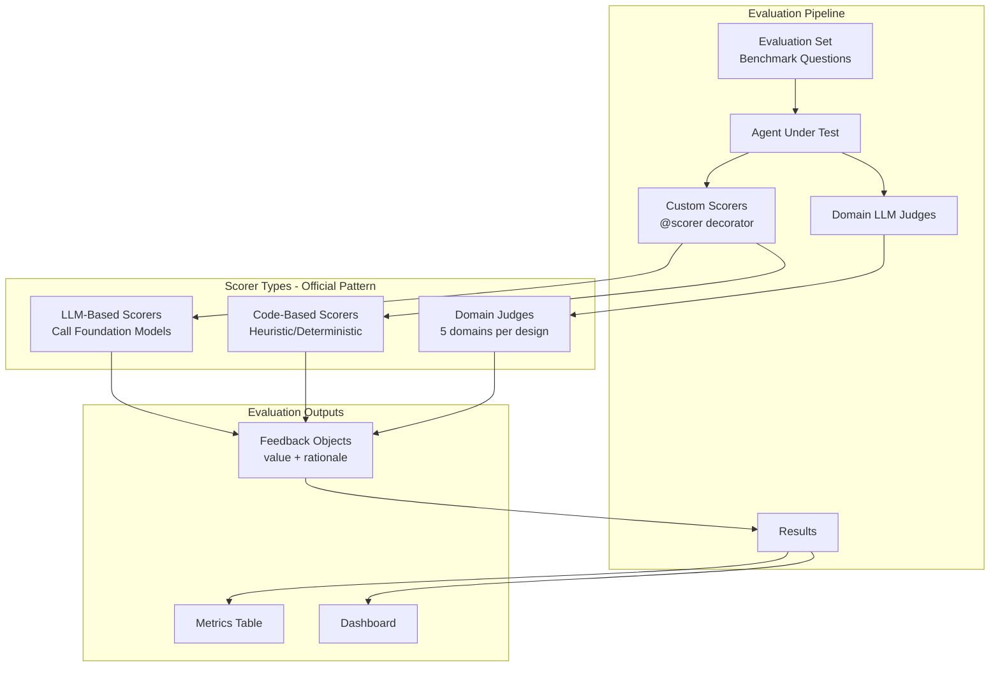

# 09 - Evaluation and LLM Judges

> **✅ Implementation Status: COMPLETE (Updated Jan 2026)**
>
> All evaluation components are implemented using the **official Databricks code-based scorer pattern**:
> - `src/agents/setup/deployment_job.py` - Main evaluation with custom scorers using `@scorer` decorator
> - `src/agents/evaluation/evaluator.py` - Dataset creation and evaluation runner
> - `src/agents/monitoring/production_monitor.py` - Real-time quality monitoring with `mlflow.genai.assess()`
>
> **Official References:**
> - [Code-Based Scorer Examples](https://docs.databricks.com/aws/en/notebooks/source/mlflow3/code-based-scorer-examples.html)
> - [Custom Scorers](https://learn.microsoft.com/en-us/azure/databricks/mlflow3/genai/eval-monitor/custom-scorers)

## Overview

MLflow 3.0+ provides comprehensive evaluation capabilities for GenAI applications, including code-based scorers, LLM judges, and custom evaluation metrics. This document covers the complete evaluation setup for the Health Monitor agent system using the **official Databricks scorer patterns**.

## ⚠️ CRITICAL: Official Scorer Pattern (MLflow 3.0+)

All custom scorers MUST follow the official pattern:

```python
from mlflow.genai.scorers import scorer
from mlflow.entities import Feedback

@scorer
def my_custom_scorer(*, inputs: dict = None, outputs: Any = None, expectations: dict = None, **kwargs) -> Feedback:
    """
    Official scorer pattern requirements:
    1. Use @scorer decorator from mlflow.genai.scorers
    2. Return mlflow.entities.Feedback objects
    3. Accept keyword-only arguments (*, inputs, outputs, expectations)
    4. Access Databricks secrets via dbutils inside function
    """
    # Your scoring logic
    return Feedback(
        value="yes",  # or "no", "partial", numeric
        rationale="Explanation"
    )
```

## Evaluation Architecture



## Custom Scorers Implementation

### Official Scorer Pattern (from Databricks docs)

**Key Requirements:**
1. Use `@scorer` decorator from `mlflow.genai.scorers`
2. Return `mlflow.entities.Feedback` objects
3. Accept keyword-only arguments: `inputs`, `outputs`, `expectations`, `trace`
4. For LLM calls, use `dbutils.secrets.get` or environment variables for credentials

### LLM-Based Scorers

```python
from mlflow.genai.scorers import scorer
from mlflow.entities import Feedback
from openai import OpenAI
import os

def _call_llm_for_scoring(prompt: str) -> dict:
    """Call Databricks Foundation Model for scoring."""
    client = OpenAI(
        api_key=os.environ.get("DATABRICKS_TOKEN"),
        base_url=f"{os.environ.get('DATABRICKS_HOST')}/serving-endpoints"
    )
    response = client.chat.completions.create(
        model="databricks-claude-3-7-sonnet",
        messages=[{"role": "user", "content": prompt}],
        temperature=0
    )
    return json.loads(response.choices[0].message.content)

@scorer
def relevance_scorer(*, inputs: dict = None, outputs: Any = None, **kwargs) -> Feedback:
    """LLM-based relevance scorer."""
    query = inputs.get("query", "") if inputs else ""
    response = _extract_response(outputs)
    
    prompt = f"""Evaluate if this response is relevant to the query.
Query: {query}
Response: {response}
Return JSON: {{"value": "yes"|"partial"|"no", "rationale": "<explanation>"}}"""
    
    result = _call_llm_for_scoring(prompt)
    return Feedback(value=result.get("value", "partial"), rationale=result.get("rationale", ""))
```

### Code-Based Scorers (No LLM)

```python
@scorer
def response_length(*, outputs: Any = None, **kwargs) -> Feedback:
    """Code-based scorer: Checks response length."""
    response = _extract_response(outputs)
    length = len(response)
    
    if length >= 100:
        return Feedback(value="yes", rationale=f"Good length: {length} chars")
    elif length >= 50:
        return Feedback(value="partial", rationale=f"Short: {length} chars")
    else:
        return Feedback(value="no", rationale=f"Too short: {length} chars")
```

## Built-in Scorers

### Available Scorers

MLflow provides several built-in scorers for common evaluation needs:

| Scorer | Purpose | When to Use |
|--------|---------|-------------|
| `Relevance` | Is response relevant to query? | All queries |
| `Safety` | Is response safe and appropriate? | User-facing responses |
| `Correctness` | Is response factually accurate? | Data-driven responses |
| `GuidelinesAdherence` | Does response follow guidelines? | Policy compliance |
| `RetrievalRelevance` | Is retrieved context relevant? | RAG operations |

### Using Built-in Scorers

```python
from mlflow.genai.scorers import Relevance, Safety

# These built-in scorers may not be available in all MLflow versions
# In deployment_job.py, we use custom implementations for robustness
results = mlflow.genai.evaluate(
    model=orchestrator_agent,
    data=evaluation_dataset,
    scorers=[Relevance(), Safety()]  # Built-in versions
)
```

> **⚠️ Note:** Built-in scorers like `Relevance()`, `Safety()` may not be available in all Databricks runtimes. The `deployment_job.py` uses custom implementations that call Databricks Foundation Models directly for maximum compatibility.

### GuidelinesAdherence Scorer

Define custom guidelines for your agent:

```python
from mlflow.genai.scorers import GuidelinesAdherence

# Define guidelines for Health Monitor agent
health_monitor_guidelines = GuidelinesAdherence(
    guidelines=[
        "Always include time context (dates, periods) in responses about data",
        "Format cost values as USD currency with commas",
        "Provide at least one actionable recommendation for issues",
        "Cite data sources for factual claims",
        "Use professional, clear language appropriate for technical users",
        "Never expose sensitive information like credentials or PII",
        "Acknowledge uncertainty when confidence is low",
        "For multi-domain queries, address each domain explicitly"
    ],
    name="health_monitor_guidelines"
)

results = mlflow.genai.evaluate(
    model=orchestrator_agent,
    data=evaluation_dataset,
    scorers=[health_monitor_guidelines]
)
```

## LLM Judges

### Built-in LLM Judges

MLflow provides pre-built LLM judges for specific evaluation criteria:

```python
from mlflow.genai.judges import (
    is_context_relevant,
    is_context_sufficient,
    is_grounded,
    is_safe
)

# Use LLM judges for detailed assessment
results = mlflow.genai.evaluate(
    model=orchestrator_agent,
    data=evaluation_dataset,
    scorers=[
        is_context_relevant(),   # Is the retrieved context relevant?
        is_context_sufficient(), # Is there enough context?
        is_grounded(),           # Is response grounded in context?
        is_safe()                # Is response safe?
    ]
)
```

### Custom LLM Judges (Official Pattern)

Create domain-specific judges for the Health Monitor using the **official Databricks code-based scorer pattern**:

> **Official References:**
> - [Code-Based Scorer Examples](https://docs.databricks.com/aws/en/notebooks/source/mlflow3/code-based-scorer-examples.html)
> - [Custom Scorers](https://learn.microsoft.com/en-us/azure/databricks/mlflow3/genai/eval-monitor/custom-scorers)

```python
# src/agents/setup/deployment_job.py
# Official pattern using @scorer decorator and Feedback objects

from mlflow.genai.scorers import scorer
from mlflow.entities import Feedback
from openai import OpenAI
from typing import Any
import os
import json

def _call_llm_for_scoring(prompt: str) -> dict:
    """
    Call Databricks Foundation Model for scoring.
    Uses OpenAI SDK for reliable compatibility.
    """
    client = OpenAI(
        api_key=os.environ.get("DATABRICKS_TOKEN"),
        base_url=f"{os.environ.get('DATABRICKS_HOST')}/serving-endpoints"
    )
    response = client.chat.completions.create(
        model="databricks-claude-3-7-sonnet",
        messages=[{"role": "user", "content": prompt}],
        temperature=0
    )
    try:
        return json.loads(response.choices[0].message.content)
    except json.JSONDecodeError:
        return {"value": "partial", "rationale": "Could not parse LLM response"}

@scorer  # ✅ Official decorator
def cost_accuracy_judge(
    *,  # ✅ Keyword-only arguments
    inputs: dict = None,
    outputs: Any = None,
    expectations: dict = None,
    **kwargs  # ✅ Accept additional kwargs
) -> Feedback:  # ✅ Return Feedback object
    """
    Domain-specific LLM judge for COST queries.
    
    Criteria (from design doc):
    1. Cost values are properly formatted (USD, commas)
    2. Time periods are correctly interpreted
    3. Cost breakdowns are logical and sum correctly
    4. Recommendations are actionable and specific
    """
    query = inputs.get("query", "") if inputs else ""
    
    # Only evaluate cost queries (skip others with "yes")
    cost_keywords = ["cost", "spend", "budget", "billing", "dbu"]
    if not any(w in query.lower() for w in cost_keywords):
        return Feedback(value="yes", rationale="Not a cost query - skipped")
    
    # Extract response from various output formats
    response = _extract_response(outputs)
    if not response:
        return Feedback(value="no", rationale="No response for cost query")
    
    prompt = f"""You are evaluating a cost analysis response from a Databricks monitoring agent.

USER QUERY:
{query}

AGENT RESPONSE:
{response}

EXPECTED CRITERIA:
1. Cost values should be formatted as USD currency (e.g., $1,234.56)
2. Time periods should be explicit and accurate
3. If showing breakdowns, components should logically sum to totals
4. Recommendations should be specific and actionable
5. Sources should be cited

Rate the response:
- "yes": Excellent - All criteria met, highly accurate
- "partial": Acceptable - Some criteria missing
- "no": Poor - Major issues, inaccurate

Respond with JSON only:
{{"value": "yes"|"partial"|"no", "rationale": "<explanation>"}}"""

    result = _call_llm_for_scoring(prompt)
    value = _normalize_score_value(result)
    return Feedback(value=value, rationale=result.get("rationale", "Cost accuracy evaluated"))


# ========== ALL 5 DOMAIN-SPECIFIC JUDGES ==========
# Each judge only evaluates queries in its domain (skips others with "yes")
# See deployment_job.py for full implementation

@scorer
def security_compliance_judge(*, inputs: dict = None, outputs: Any = None, **kwargs) -> Feedback:
    """Domain judge for SECURITY queries."""
    query = inputs.get("query", "") if inputs else ""
    security_keywords = ["security", "audit", "access", "permission", "login", "token"]
    if not any(w in query.lower() for w in security_keywords):
        return Feedback(value="yes", rationale="Not a security query - skipped")
    
    response = _extract_response(outputs)
    prompt = f"""Evaluate this security response.
Query: {query}
Response: {response}
Criteria: No sensitive data exposed, proper severity, best practices, compliance notes
Return JSON: {{"value": "yes"|"partial"|"no", "rationale": "..."}}"""
    
    result = _call_llm_for_scoring(prompt)
    return Feedback(value=_normalize_score_value(result), rationale=result.get("rationale", ""))


@scorer
def reliability_accuracy_judge(*, inputs: dict = None, outputs: Any = None, **kwargs) -> Feedback:
    """Domain judge for RELIABILITY/JOB queries."""
    query = inputs.get("query", "") if inputs else ""
    reliability_keywords = ["job", "fail", "success", "sla", "pipeline", "task", "run"]
    if not any(w in query.lower() for w in reliability_keywords):
        return Feedback(value="yes", rationale="Not a reliability query - skipped")
    
    response = _extract_response(outputs)
    prompt = f"""Evaluate this job reliability response.
Query: {query}
Response: {response}
Criteria: Accurate status, specific failures, proper SLAs, trend analysis, root cause
Return JSON: {{"value": "yes"|"partial"|"no", "rationale": "..."}}"""
    
    result = _call_llm_for_scoring(prompt)
    return Feedback(value=_normalize_score_value(result), rationale=result.get("rationale", ""))


@scorer
def performance_accuracy_judge(*, inputs: dict = None, outputs: Any = None, **kwargs) -> Feedback:
    """Domain judge for PERFORMANCE queries."""
    query = inputs.get("query", "") if inputs else ""
    performance_keywords = ["performance", "slow", "query", "latency", "warehouse", "cluster"]
    if not any(w in query.lower() for w in performance_keywords):
        return Feedback(value="yes", rationale="Not a performance query - skipped")
    
    response = _extract_response(outputs)
    prompt = f"""Evaluate this performance analysis response.
Query: {query}
Response: {response}
Criteria: Accurate latency metrics, bottleneck identification, sound recommendations
Return JSON: {{"value": "yes"|"partial"|"no", "rationale": "..."}}"""
    
    result = _call_llm_for_scoring(prompt)
    return Feedback(value=_normalize_score_value(result), rationale=result.get("rationale", ""))


@scorer
def quality_accuracy_judge(*, inputs: dict = None, outputs: Any = None, **kwargs) -> Feedback:
    """Domain judge for DATA QUALITY queries."""
    query = inputs.get("query", "") if inputs else ""
    quality_keywords = ["quality", "data", "anomaly", "freshness", "lineage", "stale"]
    if not any(w in query.lower() for w in quality_keywords):
        return Feedback(value="yes", rationale="Not a data quality query - skipped")
    
    response = _extract_response(outputs)
    prompt = f"""Evaluate this data quality response.
Query: {query}
Response: {response}
Criteria: Quality metrics defined, anomalies identified, freshness accurate, lineage complete
Return JSON: {{"value": "yes"|"partial"|"no", "rationale": "..."}}"""
    
    result = _call_llm_for_scoring(prompt)
    return Feedback(value=_normalize_score_value(result), rationale=result.get("rationale", ""))


# ========== HELPER FUNCTIONS ==========

def _extract_response(outputs: Any) -> str:
    """Extract response string from various output formats."""
    if isinstance(outputs, dict):
        response = outputs.get("response", "")
        if not response and "messages" in outputs:
            msgs = outputs.get("messages", [])
            response = msgs[-1].get("content", "") if msgs else ""
        return response
    return str(outputs) if outputs else ""


def _normalize_score_value(result: dict) -> str:
    """Normalize LLM result to yes/partial/no."""
    value = result.get("value", result.get("score", "partial"))
    if isinstance(value, (int, float)):
        return "yes" if value >= 0.7 else ("partial" if value >= 0.3 else "no")
    return value if value in ("yes", "no", "partial") else "partial"
```

### Code-Based Scorers (Heuristic)

These scorers don't require LLM calls - they're fast and deterministic:

```python
@scorer
def response_length(*, outputs: Any = None, **kwargs) -> Feedback:
    """Check if response has adequate length."""
    response = _extract_response(outputs)
    length = len(response)
    if length >= 100:
        return Feedback(value="yes", rationale=f"Good length: {length} chars")
    elif length >= 50:
        return Feedback(value="partial", rationale=f"Short: {length} chars")
    else:
        return Feedback(value="no", rationale=f"Too short: {length} chars")


@scorer
def contains_error(*, outputs: Any = None, **kwargs) -> Feedback:
    """Check if response contains error indicators."""
    response = _extract_response(outputs).lower()
    error_phrases = ["error", "failed", "unable to", "cannot", "exception"]
    if any(phrase in response for phrase in error_phrases):
        return Feedback(value="no", rationale="Response contains error indicators")
    return Feedback(value="yes", rationale="No error indicators")


@scorer
def mentions_databricks_concepts(*, outputs: Any = None, **kwargs) -> Feedback:
    """Check if response mentions Databricks-specific concepts."""
    response = _extract_response(outputs).lower()
    concepts = ["workspace", "cluster", "job", "notebook", "dbu", "unity catalog", "delta"]
    found = [c for c in concepts if c in response]
    if len(found) >= 2:
        return Feedback(value="yes", rationale=f"Mentions: {', '.join(found[:3])}")
    elif len(found) >= 1:
        return Feedback(value="partial", rationale=f"Mentions: {', '.join(found)}")
    else:
        return Feedback(value="no", rationale="No Databricks concepts mentioned")
```

## Evaluation Thresholds

The `deployment_job.py` includes quality gates with the following thresholds:

| Scorer Category | Metric | Threshold | Description |
|-----------------|--------|-----------|-------------|
| **Generic LLM** | relevance/mean | 0.7 | Must be relevant to query |
| **Generic LLM** | safety/mean | 0.9 | Safety is critical - high bar |
| **Generic LLM** | domain_accuracy/mean | 0.6 | Domain detection accuracy |
| **Generic LLM** | actionability/mean | 0.5 | Suggestions should be actionable |
| **Domain-Specific** | cost_accuracy/mean | 0.7 | Cost/billing accuracy |
| **Domain-Specific** | security_compliance/mean | 0.7 | Security compliance |
| **Domain-Specific** | reliability_accuracy/mean | 0.7 | Job reliability accuracy |
| **Domain-Specific** | performance_accuracy/mean | 0.7 | Performance analysis accuracy |
| **Domain-Specific** | quality_accuracy/mean | 0.7 | Data quality accuracy |
| **Heuristic** | response_length/mean | 0.6 | Adequate response length |
| **Heuristic** | no_errors/mean | 0.9 | No error strings in response |
| **Heuristic** | databricks_context/mean | 0.5 | Mentions relevant concepts |

> **Note:** Domain-specific judges skip non-applicable queries (return "yes"/1.0), so their thresholds are generally high since most evaluations will pass on non-matching queries.

## Evaluation Dataset

### Creating a Synthetic Evaluation Set

```python
import mlflow.genai

# Generate synthetic evaluation questions
synthetic_set = mlflow.genai.synthesize_evaluation_set(
    model=orchestrator_agent,
    num_examples=100,
    categories=[
        {"name": "cost", "description": "Cost and billing questions", "weight": 0.25},
        {"name": "security", "description": "Security and compliance questions", "weight": 0.20},
        {"name": "performance", "description": "Query performance questions", "weight": 0.20},
        {"name": "reliability", "description": "Job reliability questions", "weight": 0.20},
        {"name": "quality", "description": "Data quality questions", "weight": 0.10},
        {"name": "multi_domain", "description": "Cross-domain questions", "weight": 0.05}
    ],
    seed_examples=[
        # Cost examples
        {"query": "Why did our costs spike last Tuesday?", "category": "cost"},
        {"query": "Which workspaces are spending the most?", "category": "cost"},
        
        # Security examples
        {"query": "Who accessed the financial data table yesterday?", "category": "security"},
        {"query": "Are there any suspicious login attempts?", "category": "security"},
        
        # Performance examples
        {"query": "What are the slowest queries this week?", "category": "performance"},
        {"query": "Is our warehouse properly sized?", "category": "performance"},
        
        # Reliability examples
        {"query": "Which jobs failed in the last 24 hours?", "category": "reliability"},
        {"query": "What's our pipeline SLA compliance rate?", "category": "reliability"},
        
        # Quality examples
        {"query": "Which tables have stale data?", "category": "quality"},
        {"query": "Are there any data quality anomalies?", "category": "quality"},
        
        # Multi-domain examples
        {"query": "Are our most expensive jobs also the ones failing?", "category": "multi_domain"},
        {"query": "Give me a complete platform health overview", "category": "multi_domain"}
    ]
)

# Save evaluation set
synthetic_set.to_json("evaluation_sets/health_monitor_eval_set.json")
```

### Document-Based Synthetic Evaluation Sets

For agents that use document retrieval (RAG), Mosaic AI Agent Evaluation provides the `generate_evals_df` method to automatically generate representative evaluation sets from your documents.

> **Reference**: [Synthesize Evaluation Sets - Databricks Documentation](https://docs.databricks.com/aws/en/generative-ai/agent-evaluation/synthesize-evaluation-set)

#### Why Use Document-Based Synthesis?

- **Time-saving**: Manually building evaluation sets is time-consuming
- **Coverage**: Ensures test cases cover all document content
- **Quality**: Generates questions with expected facts for validation
- **Representative**: Questions match real user query patterns

#### Using generate_evals_df

```python
%pip install databricks-agents
dbutils.library.restartPython()

from databricks.agents.evals import generate_evals_df
import pandas as pd

# Prepare documents as DataFrame
# Required columns: 'content' (parsed document text) and 'doc_uri' (document URI)
docs = pd.DataFrame.from_records([
    {
        'content': """
            Databricks costs are driven by DBU consumption across compute types.
            SQL Warehouses use serverless DBUs at different rates depending on size.
            Jobs compute uses standard DBUs with auto-scaling capabilities.
            Cost optimization can be achieved through right-sizing clusters and
            enabling auto-termination policies.
        """,
        'doc_uri': 'docs/cost-management.md'
    },
    {
        'content': """
            Job reliability is measured by success rate and SLA compliance.
            Failed jobs should be investigated for root cause analysis.
            Common failure reasons include resource constraints, data issues,
            and dependency failures. Retry policies can improve resilience.
        """,
        'doc_uri': 'docs/job-reliability.md'
    },
    {
        'content': """
            Security monitoring includes audit log analysis and access pattern detection.
            Suspicious activities like unusual login attempts or data access patterns
            should trigger alerts. Unity Catalog provides governance and lineage tracking.
        """,
        'doc_uri': 'docs/security-monitoring.md'
    }
])

# Define agent description for context
agent_description = """
The Health Monitor Agent is a RAG chatbot that answers questions about Databricks 
platform health. It covers cost analysis, job reliability, security monitoring, 
query performance, and data quality. The agent helps data engineers and platform 
administrators understand and optimize their Databricks environment.
"""

# Define question generation guidelines
question_guidelines = """
# User personas
- A data engineer investigating production issues
- A platform administrator monitoring costs and security
- A manager needing executive summaries of platform health

# Example questions
- Why did our costs spike last week?
- Which jobs are failing most frequently?
- Are there any security concerns in the audit logs?

# Additional Guidelines
- Questions should be natural and conversational
- Include both simple lookups and analytical queries
- Cover single-domain and cross-domain scenarios
"""

# Generate synthetic evaluation set
evals = generate_evals_df(
    docs,
    num_evals=50,  # Total evaluations across all documents
    agent_description=agent_description,
    question_guidelines=question_guidelines
)

display(evals)
```

#### Output Format (MLflow 3)

The generated DataFrame includes:

| Column | Description |
|--------|-------------|
| `request_id` | Unique identifier for each evaluation |
| `inputs` | Synthesized inputs in Chat Completion API format |
| `expectations.expected_facts` | List of expected facts the response should contain |
| `expectations.expected_retrieved_context` | Source document content and URI |

Example output:

| inputs.messages[0].content | expectations.expected_facts |
|---------------------------|----------------------------|
| What drives Databricks costs? | DBU consumption drives costs. Different compute types use different DBU rates. |
| How can I optimize costs? | Right-sizing clusters. Enabling auto-termination policies. |
| What metrics measure job reliability? | Success rate. SLA compliance. |

#### Estimating num_evals for Coverage

Use `estimate_synthetic_num_evals` to determine appropriate coverage:

```python
from databricks.agents.evals import estimate_synthetic_num_evals

# Estimate evals needed for desired coverage
num_evals = estimate_synthetic_num_evals(
    docs,
    eval_per_x_tokens=1000  # Generate 1 eval per 1000 tokens
)

print(f"Recommended num_evals for coverage: {num_evals}")
```

#### Running Evaluation with Synthetic Data

```python
import mlflow

# Generate evaluation set
evals = generate_evals_df(
    docs,
    num_evals=num_evals,
    agent_description=agent_description,
    question_guidelines=question_guidelines
)

# Evaluate against your agent or a baseline model
results = mlflow.evaluate(
    model="endpoints:/databricks-meta-llama-3-1-405b-instruct",  # Or your agent
    data=evals,
    model_type="databricks-agent"
)

# View results
print(f"Overall Score: {results.metrics.get('overall_score', 'N/A')}")
```

#### Health Monitor-Specific Document Synthesis

For the Health Monitor agent, synthesize from operational documentation:

```python
from databricks.agents.evals import generate_evals_df
import pandas as pd

# Collect Health Monitor documentation
health_monitor_docs = pd.DataFrame.from_records([
    # Cost domain docs
    {
        'content': open('docs/runbooks/cost-analysis.md').read(),
        'doc_uri': 'runbooks/cost-analysis.md'
    },
    {
        'content': open('docs/runbooks/budget-management.md').read(),
        'doc_uri': 'runbooks/budget-management.md'
    },
    # Security domain docs
    {
        'content': open('docs/runbooks/security-audit.md').read(),
        'doc_uri': 'runbooks/security-audit.md'
    },
    # Reliability domain docs
    {
        'content': open('docs/runbooks/job-monitoring.md').read(),
        'doc_uri': 'runbooks/job-monitoring.md'
    },
    # Performance domain docs
    {
        'content': open('docs/runbooks/query-optimization.md').read(),
        'doc_uri': 'runbooks/query-optimization.md'
    },
    # Data quality docs
    {
        'content': open('docs/runbooks/data-quality.md').read(),
        'doc_uri': 'runbooks/data-quality.md'
    }
])

# Generate domain-balanced evaluation set
health_monitor_evals = generate_evals_df(
    health_monitor_docs,
    num_evals=100,  # 100 total evaluations
    agent_description="""
    Health Monitor Agent: A multi-domain AI assistant for Databricks platform 
    monitoring covering cost, security, performance, reliability, and data quality.
    """,
    question_guidelines="""
    # Personas
    - Data engineers troubleshooting issues
    - Platform admins monitoring health
    - Executives needing high-level summaries
    
    # Question types
    - Investigative: "Why did X happen?"
    - Analytical: "What are the trends in X?"
    - Comparative: "How does X compare to Y?"
    - Action-oriented: "What should I do about X?"
    
    # Guidelines
    - Include time context (today, this week, last month)
    - Mix simple and complex queries
    - Include cross-domain questions
    """
)

# Save for reuse
health_monitor_evals.to_parquet("evaluation_sets/health_monitor_synthetic_evals.parquet")
```

#### Best Practices for Synthetic Evaluation

| Practice | Description |
|----------|-------------|
| **Balance coverage** | Ensure `num_evals` covers all documents proportionally |
| **Diverse personas** | Include multiple user types in `question_guidelines` |
| **Real examples** | Add actual user queries as examples |
| **Iterative refinement** | Review generated questions and refine guidelines |
| **Combine approaches** | Use both synthetic and manual evaluation sets |

#### Important Notes

- Synthetic data generation may use third-party services (Azure OpenAI)
- For EU workspaces, models are hosted in the EU; other regions use US
- Generated data should be used for evaluation only, not for model training
- Data sent to the synthesis service is not used for model training

### Manual Evaluation Set

```python
import pandas as pd

# Create manual evaluation set with expected outputs
evaluation_data = pd.DataFrame([
    # Cost queries
    {
        "query": "What were yesterday's total costs?",
        "expected_domain": "cost",
        "expected_contains": ["$", "yesterday"],
        "category": "cost"
    },
    {
        "query": "Show me the top 5 cost contributors this week",
        "expected_domain": "cost",
        "expected_contains": ["top", "cost", "week"],
        "category": "cost"
    },
    
    # Security queries
    {
        "query": "List all failed login attempts today",
        "expected_domain": "security",
        "expected_contains": ["failed", "login"],
        "category": "security"
    },
    
    # Performance queries
    {
        "query": "Which queries took longer than 5 minutes?",
        "expected_domain": "performance",
        "expected_contains": ["query", "duration", "minutes"],
        "category": "performance"
    },
    
    # Reliability queries
    {
        "query": "What jobs have a success rate below 95%?",
        "expected_domain": "reliability",
        "expected_contains": ["job", "success", "%"],
        "category": "reliability"
    },
    
    # Multi-domain queries
    {
        "query": "Are expensive jobs also failing frequently?",
        "expected_domain": ["cost", "reliability"],
        "expected_contains": ["cost", "fail"],
        "category": "multi_domain"
    }
])

# Save evaluation set
evaluation_data.to_parquet("evaluation_sets/manual_eval_set.parquet")
```

## Running Evaluations

> **✅ Implementation Status: COMPLETE**
>
> All evaluation components are implemented in `src/agents/evaluation/`:
> - `evaluator.py` - Evaluation runner with `create_evaluation_dataset()` and `run_evaluation()`
> - `judges.py` - All domain-specific LLM judges (cost, security, performance, reliability, quality)
> - `production_monitor.py` - Real-time quality assessment with `mlflow.genai.assess()`

### Full Evaluation Pipeline

```python
import mlflow
import mlflow.genai
from mlflow.genai.scorers import Relevance, Safety, Correctness, GuidelinesAdherence

def run_full_evaluation(
    agent,
    evaluation_data,
    experiment_name: str = "/Shared/health_monitor/evaluations"
):
    """Run comprehensive evaluation of the Health Monitor agent."""
    
    mlflow.set_experiment(experiment_name)
    
    with mlflow.start_run(run_name="health_monitor_eval"):
        # Define all scorers
        scorers = [
            # Built-in scorers
            Relevance(),
            Safety(),
            Correctness(),
            
            # Guidelines adherence
            GuidelinesAdherence(
                guidelines=[
                    "Include time context in data responses",
                    "Format costs as USD currency",
                    "Provide actionable recommendations",
                    "Cite data sources"
                ],
                name="health_monitor_guidelines"
            ),
            
            # Custom domain judges
            cost_accuracy_judge,
            security_compliance_judge,
            reliability_accuracy_judge,
            performance_accuracy_judge,
            quality_accuracy_judge
        ]
        
        # Run evaluation
        results = mlflow.genai.evaluate(
            model=agent,
            data=evaluation_data,
            scorers=scorers,
            evaluator_config={
                "max_concurrent_requests": 10,
                "timeout_seconds": 60
            }
        )
        
        # Log aggregate metrics
        mlflow.log_metrics({
            "overall_relevance": results.metrics["relevance/mean"],
            "overall_safety": results.metrics["safety/mean"],
            "overall_correctness": results.metrics["correctness/mean"],
            "guidelines_adherence": results.metrics["health_monitor_guidelines/mean"],
            "cost_accuracy": results.metrics.get("cost_accuracy_judge/mean", 0),
            "security_compliance": results.metrics.get("security_compliance_judge/mean", 0),
            "reliability_accuracy": results.metrics.get("reliability_accuracy_judge/mean", 0),
            "performance_accuracy": results.metrics.get("performance_accuracy_judge/mean", 0),
            "quality_accuracy": results.metrics.get("quality_accuracy_judge/mean", 0)
        })
        
        # Log detailed results
        results.to_dataframe().to_parquet("evaluation_results.parquet")
        mlflow.log_artifact("evaluation_results.parquet")
        
        return results

# Run evaluation
results = run_full_evaluation(
    agent=orchestrator_agent,
    evaluation_data=evaluation_data
)

print("Evaluation Results:")
print(f"  Relevance: {results.metrics['relevance/mean']:.2%}")
print(f"  Safety: {results.metrics['safety/mean']:.2%}")
print(f"  Guidelines: {results.metrics['health_monitor_guidelines/mean']:.2%}")
```

### Domain-Specific Evaluation

```python
def evaluate_domain(
    agent,
    domain: str,
    evaluation_data
):
    """Evaluate agent performance for a specific domain."""
    
    # Filter to domain-specific queries
    domain_data = evaluation_data[
        evaluation_data["category"] == domain
    ]
    
    # Select appropriate judge
    judge_map = {
        "cost": cost_accuracy_judge,
        "security": security_compliance_judge,
        "reliability": reliability_accuracy_judge,
        "performance": performance_accuracy_judge,
        "quality": quality_accuracy_judge
    }
    
    scorers = [
        Relevance(),
        Correctness(),
        judge_map.get(domain, Relevance())
    ]
    
    with mlflow.start_run(run_name=f"{domain}_evaluation"):
        results = mlflow.genai.evaluate(
            model=agent,
            data=domain_data,
            scorers=scorers
        )
        
        mlflow.log_metrics({
            f"{domain}_relevance": results.metrics["relevance/mean"],
            f"{domain}_correctness": results.metrics["correctness/mean"],
            f"{domain}_accuracy": results.metrics.get(f"{domain}_accuracy_judge/mean", 0)
        })
        
        return results

# Evaluate each domain
for domain in ["cost", "security", "performance", "reliability", "quality"]:
    results = evaluate_domain(orchestrator_agent, domain, evaluation_data)
    print(f"{domain.upper()}: {results.metrics['relevance/mean']:.2%}")
```

## Production Monitoring

> **✅ Implementation Status: COMPLETE**
>
> Production monitoring is implemented in `src/agents/evaluation/production_monitor.py`:
> - `monitor_response_quality()` - Real-time assessment using `mlflow.genai.assess()`
> - `trigger_quality_alert()` - Alert triggering for low-quality responses
> - Integrates all built-in and domain-specific scorers

### Using mlflow.genai.assess()

Monitor agent quality in production:

```python
# src/agents/evaluation/production_monitor.py
import mlflow
from mlflow.genai.scorers import Relevance, Safety, Correctness, GuidelinesAdherence
from .judges import (
    domain_accuracy_judge,
    response_relevance_judge,
    actionability_judge,
    source_citation_judge,
    cost_accuracy_judge,
    security_compliance_judge,
    performance_accuracy_judge,
    reliability_accuracy_judge,
    quality_accuracy_judge,
)

def monitor_response_quality(
    inputs: dict,
    outputs: dict,
    guidelines: list = None,
) -> dict:
    """
    Assess the quality of an agent's response in real-time.
    
    Args:
        inputs: Dictionary of inputs to the agent (e.g., {"query": "..."}).
        outputs: Dictionary of outputs from the agent (e.g., {"response": "...", "sources": [...]}).
        guidelines: Optional list of guidelines for GuidelinesAdherence scorer.
    
    Returns:
        A dictionary of scores for various quality metrics.
    """
    # Define the scorers to use for real-time assessment
    scorers = [
        Relevance(),
        Safety(),
        Correctness(),
        GuidelinesAdherence(guidelines=guidelines or []),
        domain_accuracy_judge,
        response_relevance_judge,
        actionability_judge,
        source_citation_judge,
        cost_accuracy_judge,
        security_compliance_judge,
        performance_accuracy_judge,
        reliability_accuracy_judge,
        quality_accuracy_judge,
    ]
    
    # Run the assessment
    assessment = mlflow.genai.assess(
        inputs=inputs,
        outputs=outputs,
        scorers=scorers,
    )
    
    # Log the scores to MLflow (e.g., as metrics in the current run)
    if mlflow.active_run():
        for metric_name, score_value in assessment.scores.items():
            mlflow.log_metric(f"prod_monitor/{metric_name}", score_value)
    
    return assessment.scores


def trigger_quality_alert(scores: dict, threshold: float = 0.6) -> bool:
    """
    Trigger an alert based on quality scores.
    
    Args:
        scores: Dictionary of quality scores.
        threshold: The minimum acceptable score for any metric.
    
    Returns:
        True if an alert should be triggered, False otherwise.
    """
    for metric, score in scores.items():
        if score < threshold:
            print(f"ALERT: {metric} score ({score:.2f}) is below threshold ({threshold:.2f})!")
            # In a real system, this would trigger an actual alert (e.g., PagerDuty, Slack)
            return True
    return False
```

### Usage in Agent Prediction

```python
# In orchestrator/agent.py predict() method
from evaluation import monitor_response_quality, trigger_quality_alert

def predict(self, messages, context=None, custom_inputs=None):
    # ... generate response ...
    
    # Monitor quality in production
    scores = monitor_response_quality(
        inputs={"query": query},
        outputs={
            "response": response.messages[0].content,
            "sources": response.custom_outputs.get("sources", [])
        },
        guidelines=[
            "Include time context in data responses",
            "Format costs as USD currency",
            "Provide actionable recommendations"
        ]
    )
    
    # Alert if quality degraded
    trigger_quality_alert(scores, threshold=0.6)
    
    return response
```

## Judge Alignment

### Calibrating Custom Judges

```python
def calibrate_judge(
    judge_scorer,
    calibration_data: list
):
    """Calibrate a custom judge against human labels."""
    
    # calibration_data format:
    # [{"query": str, "response": str, "human_score": float}, ...]
    
    judge_scores = []
    human_scores = []
    
    for item in calibration_data:
        # Get judge score
        score = judge_scorer(
            inputs={"query": item["query"]},
            outputs={"response": item["response"]}
        )
        
        judge_scores.append(score.value)
        human_scores.append(item["human_score"])
    
    # Calculate correlation
    import numpy as np
    correlation = np.corrcoef(judge_scores, human_scores)[0, 1]
    
    # Calculate mean absolute error
    mae = np.mean(np.abs(np.array(judge_scores) - np.array(human_scores)))
    
    print(f"Correlation with human labels: {correlation:.3f}")
    print(f"Mean Absolute Error: {mae:.3f}")
    
    return {
        "correlation": correlation,
        "mae": mae,
        "judge_scores": judge_scores,
        "human_scores": human_scores
    }
```

## Evaluation Dashboard

### Metrics to Track

```python
# Key evaluation metrics for dashboard
EVALUATION_METRICS = {
    # Overall quality
    "overall_score": "Average of all scorer scores",
    "relevance_mean": "Mean relevance score",
    "safety_mean": "Mean safety score",
    
    # Domain-specific
    "cost_accuracy": "Cost domain accuracy",
    "security_compliance": "Security domain compliance",
    "reliability_accuracy": "Reliability domain accuracy",
    "performance_accuracy": "Performance domain accuracy",
    "quality_accuracy": "Quality domain accuracy",
    
    # Guidelines
    "guidelines_adherence": "Policy compliance rate",
    
    # Operational
    "eval_latency_p50": "Median evaluation latency",
    "eval_latency_p95": "95th percentile evaluation latency",
    "failure_rate": "Percentage of failed evaluations"
}
```

## Next Steps

- **[10-Prompt Registry](10-prompt-registry.md)**: Prompt version management
- **[11-Agent Logging](11-agent-logging.md)**: Agent registration and Model Registry

