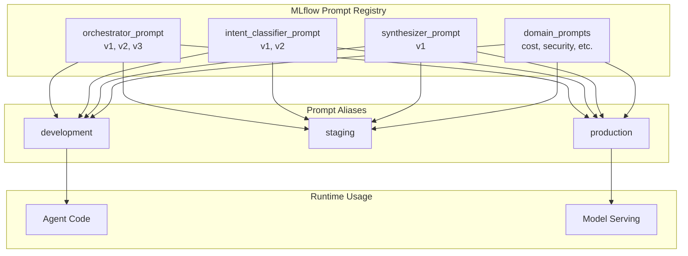

# 10 - Prompt Registry

> **✅ Implementation Status: COMPLETE**
>
> All prompt registry components are implemented in `src/agents/prompts/`:
> - `registry.py` - Prompt definitions, registration, and loading functions
> - `ab_testing.py` - `PromptABTest` class for traffic splitting and variant selection
> - `manager.py` - `PromptManager` class for production prompt management with refresh
> - `__init__.py` - Clean exports for all prompt functions and classes

## Overview

MLflow 3.0 Prompt Registry provides version control for prompts, enabling A/B testing, rollback, and production management. This document covers prompt versioning for the Health Monitor agent system.

## Prompt Registry Architecture



## Logging Prompts

### Basic Prompt Logging

```python
import mlflow.genai

# Log the orchestrator system prompt
orchestrator_prompt_v1 = """You are the Orchestrator Agent for the Databricks Health Monitor.

RESPONSIBILITIES:
- Classify user intent and route to specialized domain agents
- Coordinate multi-agent workflows for complex queries
- Synthesize responses from multiple agents into coherent answers
- Maintain conversation context and user preferences

AVAILABLE AGENTS:
- Cost Agent: Billing, spending, DBU usage, budgets, chargeback
- Security Agent: Access control, audit logs, threats, compliance
- Performance Agent: Query speed, cluster utilization, optimization
- Reliability Agent: Job failures, SLAs, incidents, pipelines
- Quality Agent: Data quality, lineage, freshness, governance

GUIDELINES:
1. Always include time context when discussing data
2. Format costs as USD currency (e.g., $1,234.56)
3. Provide actionable recommendations for identified issues
4. Cite data sources for factual claims
5. Acknowledge uncertainty when confidence is low

USER CONTEXT:
{user_context}

CONVERSATION HISTORY:
{conversation_history}"""

# Log to registry
mlflow.genai.log_prompt(
    prompt=orchestrator_prompt_v1,
    artifact_path="prompts/orchestrator",
    registered_model_name="health_monitor_orchestrator_prompt"
)
```

### Prompt with Variables

```python
# Log prompt template with variable placeholders
intent_classifier_prompt = """You are an intent classifier for Databricks platform monitoring.

Analyze the user query and classify it into ONE OR MORE domains:

DOMAINS:
- COST: Billing, spending, DBU usage, budgets, chargeback, pricing
- SECURITY: Access control, audit logs, threats, compliance, permissions
- PERFORMANCE: Query speed, cluster utilization, latency, optimization
- RELIABILITY: Job failures, SLAs, incidents, success rates, pipelines
- QUALITY: Data quality, lineage, freshness, governance, classification

RULES:
1. A query can belong to multiple domains
2. If unsure, include all potentially relevant domains
3. Return confidence score (0.0-1.0) based on clarity

USER QUERY:
{{query}}

USER ROLE (for context):
{{user_role}}

Return JSON: {{"domains": ["DOMAIN1"], "confidence": 0.XX}}"""

mlflow.genai.log_prompt(
    prompt=intent_classifier_prompt,
    artifact_path="prompts/intent_classifier",
    registered_model_name="health_monitor_intent_prompt"
)
```

### Logging Multiple Versions

```python
# Version 1: Basic orchestrator
mlflow.genai.log_prompt(
    prompt=orchestrator_prompt_v1,
    artifact_path="prompts/orchestrator",
    registered_model_name="health_monitor_orchestrator_prompt"
)

# Version 2: Enhanced with few-shot examples
orchestrator_prompt_v2 = orchestrator_prompt_v1 + """

EXAMPLES:
Q: "Why did costs spike?"
A: Route to Cost Agent, then synthesize with time context and recommendations.

Q: "Are expensive jobs failing?"
A: Route to both Cost and Reliability Agents in parallel, correlate results.

Q: "Give me a health overview"
A: Route to all 5 agents, provide executive summary with key metrics."""

mlflow.genai.log_prompt(
    prompt=orchestrator_prompt_v2,
    artifact_path="prompts/orchestrator",
    registered_model_name="health_monitor_orchestrator_prompt"
)

# Version 3: With persona and tone guidelines
orchestrator_prompt_v3 = orchestrator_prompt_v2 + """

PERSONA:
You are a knowledgeable, helpful platform engineer assistant. Be concise but thorough.
Use technical terms appropriately but explain complex concepts when needed.

TONE:
- Professional and informative
- Proactive in suggesting improvements
- Empathetic when discussing issues or failures
- Confident but acknowledging limitations"""

mlflow.genai.log_prompt(
    prompt=orchestrator_prompt_v3,
    artifact_path="prompts/orchestrator",
    registered_model_name="health_monitor_orchestrator_prompt"
)
```

## Loading Prompts

### Load by Version

```python
import mlflow.genai

# Load specific version
prompt_v1 = mlflow.genai.load_prompt(
    "prompts:/health_monitor_orchestrator_prompt/1"
)

# Load latest version
prompt_latest = mlflow.genai.load_prompt(
    "prompts:/health_monitor_orchestrator_prompt/latest"
)

print(f"Loaded prompt: {prompt_latest[:100]}...")
```

### Load by Alias

```python
# Load production prompt (preferred in deployed applications)
production_prompt = mlflow.genai.load_prompt(
    "prompts:/health_monitor_orchestrator_prompt/production"
)

# Load development prompt (for testing)
dev_prompt = mlflow.genai.load_prompt(
    "prompts:/health_monitor_orchestrator_prompt/development"
)
```

### Using Loaded Prompts

```python
from langchain.prompts import ChatPromptTemplate
from langchain_databricks import ChatDatabricks

# Load prompt from registry
orchestrator_template = mlflow.genai.load_prompt(
    "prompts:/health_monitor_orchestrator_prompt/production"
)

# Create LangChain prompt template
prompt = ChatPromptTemplate.from_template(orchestrator_template)

# Use in chain
llm = ChatDatabricks(endpoint="databricks-dbrx-instruct")
chain = prompt | llm

response = chain.invoke({
    "user_context": "Role: data_engineer, Workspace: prod",
    "conversation_history": "No previous messages",
    "query": "Why did costs spike?"
})
```

## Managing Aliases

### Setting Aliases

```python
from mlflow import MlflowClient

client = MlflowClient()

# Set production alias to version 2
client.set_registered_model_alias(
    name="health_monitor_orchestrator_prompt",
    alias="production",
    version="2"
)

# Set staging alias to version 3 (for testing)
client.set_registered_model_alias(
    name="health_monitor_orchestrator_prompt",
    alias="staging",
    version="3"
)

# Set development alias to latest
client.set_registered_model_alias(
    name="health_monitor_orchestrator_prompt",
    alias="development",
    version="3"
)
```

### Promoting Prompts

```python
def promote_prompt(
    prompt_name: str,
    from_alias: str,
    to_alias: str
):
    """Promote a prompt from one alias to another."""
    
    client = MlflowClient()
    
    # Get version from source alias
    source_version = client.get_model_version_by_alias(
        name=prompt_name,
        alias=from_alias
    )
    
    # Set target alias to same version
    client.set_registered_model_alias(
        name=prompt_name,
        alias=to_alias,
        version=source_version.version
    )
    
    print(f"Promoted {prompt_name} v{source_version.version} from {from_alias} to {to_alias}")

# Example: Promote staging to production
promote_prompt(
    "health_monitor_orchestrator_prompt",
    from_alias="staging",
    to_alias="production"
)
```

### Rollback

```python
def rollback_prompt(
    prompt_name: str,
    alias: str,
    to_version: str
):
    """Rollback a prompt alias to a specific version."""
    
    client = MlflowClient()
    
    # Get current version for logging
    try:
        current = client.get_model_version_by_alias(name=prompt_name, alias=alias)
        current_version = current.version
    except:
        current_version = "none"
    
    # Set alias to rollback version
    client.set_registered_model_alias(
        name=prompt_name,
        alias=alias,
        version=to_version
    )
    
    print(f"Rolled back {prompt_name} {alias}: v{current_version} -> v{to_version}")

# Example: Rollback production to v1
rollback_prompt(
    "health_monitor_orchestrator_prompt",
    alias="production",
    to_version="1"
)
```

## Prompt Templates by Component

### All Health Monitor Prompts

```python
# Dictionary of all prompts for the Health Monitor
HEALTH_MONITOR_PROMPTS = {
    "orchestrator": {
        "name": "health_monitor_orchestrator_prompt",
        "description": "Main orchestrator system prompt",
        "variables": ["user_context", "conversation_history"]
    },
    "intent_classifier": {
        "name": "health_monitor_intent_prompt",
        "description": "Intent classification prompt",
        "variables": ["query", "user_role"]
    },
    "synthesizer": {
        "name": "health_monitor_synthesizer_prompt",
        "description": "Response synthesis prompt",
        "variables": ["agent_responses", "query", "utility_results"]
    },
    "cost_agent": {
        "name": "health_monitor_cost_prompt",
        "description": "Cost agent system prompt",
        "variables": ["query", "context"]
    },
    "security_agent": {
        "name": "health_monitor_security_prompt",
        "description": "Security agent system prompt",
        "variables": ["query", "context"]
    },
    "performance_agent": {
        "name": "health_monitor_performance_prompt",
        "description": "Performance agent system prompt",
        "variables": ["query", "context"]
    },
    "reliability_agent": {
        "name": "health_monitor_reliability_prompt",
        "description": "Reliability agent system prompt",
        "variables": ["query", "context"]
    },
    "quality_agent": {
        "name": "health_monitor_quality_prompt",
        "description": "Quality agent system prompt",
        "variables": ["query", "context"]
    }
}

def register_all_prompts():
    """Register all Health Monitor prompts."""
    
    for key, config in HEALTH_MONITOR_PROMPTS.items():
        prompt_content = load_prompt_file(f"prompts/{key}.txt")
        
        mlflow.genai.log_prompt(
            prompt=prompt_content,
            artifact_path=f"prompts/{key}",
            registered_model_name=config["name"]
        )
        
        print(f"Registered: {config['name']}")
```

### Synthesizer Prompt

```python
SYNTHESIZER_PROMPT = """You are the Response Synthesizer for the Databricks Health Monitor.

Your job is to combine responses from multiple domain agents into a coherent, unified answer.

DOMAIN RESPONSES:
{agent_responses}

USER QUESTION:
{query}

UTILITY DATA (if available):
{utility_results}

SYNTHESIS GUIDELINES:
1. Start with a direct answer to the user's question
2. Integrate insights from each relevant domain
3. Highlight cross-domain correlations (e.g., cost spikes related to job failures)
4. Provide 1-3 actionable recommendations
5. Include sources in [brackets] for each factual claim
6. Use bullet points for clarity when listing multiple items
7. Keep the response concise but comprehensive

FORMAT:
- Lead with the key insight
- Support with data from agents
- Note any correlations across domains
- End with recommendations

Be helpful, accurate, and action-oriented."""

mlflow.genai.log_prompt(
    prompt=SYNTHESIZER_PROMPT,
    artifact_path="prompts/synthesizer",
    registered_model_name="health_monitor_synthesizer_prompt"
)
```

## A/B Testing Prompts

> **✅ Implementation Status: COMPLETE**
>
> A/B testing is implemented in `src/agents/prompts/ab_testing.py`:
> - `PromptABTest` class with consistent hashing for deterministic variant selection
> - Traffic splitting based on user_id hash
> - Methods for variant selection and prompt name generation

### Setup A/B Test

```python
# src/agents/prompts/ab_testing.py
import hashlib
from typing import Dict

class PromptABTest:
    """
    Manages A/B testing for prompts.
    
    Allows splitting traffic between different prompt variants (e.g., "control", "variant_A").
    The variant is determined by hashing the user_id, ensuring consistent assignment.
    """
    
    def __init__(self, variants: Dict[str, float]):
        """
        Initialize the A/B test with variant weights.
        
        Args:
            variants: A dictionary where keys are variant names (e.g., "control", "variant_A")
                      and values are their respective traffic weights (sum must be 1.0).
        Example:
            ab_test = PromptABTest({"control": 0.5, "variant_A": 0.5})
        """
        if sum(variants.values()) != 1.0:
            raise ValueError("Variant weights must sum to 1.0")
        self.variants = variants
        self._variant_names = list(variants.keys())
        self._cumulative_weights = []
        cumulative_sum = 0.0
        for variant, weight in variants.items():
            cumulative_sum += weight
            self._cumulative_weights.append((variant, cumulative_sum))
    
    def select_variant(self, user_id: str) -> str:
        """
        Select a prompt variant for a given user ID.
        
        Uses consistent hashing to ensure the same user always gets the same variant.
        
        Args:
            user_id: The ID of the user for whom to select a variant.
        
        Returns:
            The name of the selected prompt variant.
        """
        # Hash the user_id to get a consistent number between 0 and 1
        hash_object = hashlib.sha256(user_id.encode())
        hash_digest = int(hash_object.hexdigest(), 16)
        normalized_hash = hash_digest / (2**256 - 1)  # Normalize to [0, 1)
        
        # Determine variant based on cumulative weights
        for variant, cumulative_weight in self._cumulative_weights:
            if normalized_hash < cumulative_weight:
                return variant
        return self._variant_names[-1]  # Fallback to the last variant
    
    def get_variant_prompt_name(self, base_prompt_name: str, user_id: str) -> str:
        """
        Get the full prompt name for a user, including the A/B test variant.
        
        Args:
            base_prompt_name: The base name of the prompt (e.g., "orchestrator").
            user_id: The ID of the user.
        
        Returns:
            The full prompt name including the variant (e.g., "orchestrator_control").
        """
        variant = self.select_variant(user_id)
        return f"{base_prompt_name}_{variant}"


# Usage
ab_test = PromptABTest({"control": 0.9, "variant_A": 0.1})

# Get variant for user - always consistent for same user_id
variant = ab_test.select_variant(user_id="user@example.com")
print(f"Selected variant: {variant}")

# Get full prompt name with variant suffix
prompt_name = ab_test.get_variant_prompt_name("orchestrator", "user@example.com")
print(f"Prompt name: {prompt_name}")  # e.g., "orchestrator_control"
```

## Prompt Management in Production

> **✅ Implementation Status: COMPLETE**
>
> Prompt management is implemented in `src/agents/prompts/manager.py`:
> - `PromptManager` class with automatic loading and periodic refresh
> - Thread-safe prompt loading with refresh interval
> - Fallback to hardcoded prompts if registry unavailable
> - Singleton pattern with `get_prompt_manager()` function

### Loading Prompts at Startup

```python
# src/agents/prompts/manager.py
import mlflow
import mlflow.genai
import time
import threading
from typing import Dict, Optional

from .registry import load_prompt, ORCHESTRATOR_PROMPT, INTENT_CLASSIFIER_PROMPT, SYNTHESIZER_PROMPT


class PromptManager:
    """
    Manages loading and refreshing prompts from the MLflow Prompt Registry.
    
    This class ensures that the agent always uses the latest production-aliased
    prompts, with a fallback to hardcoded defaults if the registry is unavailable.
    It also supports periodic refreshing of prompts.
    """
    
    def __init__(self, refresh_interval_seconds: int = 300):
        """
        Initialize the PromptManager.
        
        Args:
            refresh_interval_seconds: How often to refresh prompts from the registry (in seconds).
        """
        self._prompts: Dict[str, str] = {}
        self._refresh_interval = refresh_interval_seconds
        self._last_refresh_time: float = 0.0
        self._lock = threading.Lock()
        self._load_all_prompts()  # Initial load
    
    def _load_all_prompts(self) -> None:
        """Load all required prompts from MLflow registry or use fallbacks."""
        with self._lock:
            print("Loading/refreshing prompts from MLflow registry...")
            prompt_names = [
                "orchestrator",
                "intent_classifier",
                "synthesizer",
                "worker_cost",
                "worker_security",
                "worker_performance",
                "worker_reliability",
                "worker_quality",
            ]
            for name in prompt_names:
                try:
                    # Attempt to load by production alias
                    prompt_content = load_prompt(name, alias="production")
                    if not prompt_content:
                        raise ValueError(f"Prompt '{name}' not found with 'production' alias.")
                    self._prompts[name] = prompt_content
                    print(f"  Loaded '{name}' from registry.")
                except Exception as e:
                    print(f"  WARNING: Failed to load '{name}': {e}. Using fallback.")
                    # Fallback to hardcoded prompts
                    if name == "orchestrator":
                        self._prompts[name] = ORCHESTRATOR_PROMPT
                    elif name == "intent_classifier":
                        self._prompts[name] = INTENT_CLASSIFIER_PROMPT
                    elif name == "synthesizer":
                        self._prompts[name] = SYNTHESIZER_PROMPT
                    else:
                        self._prompts[name] = f"You are a {name.replace('worker_', '')} specialist."
            
            self._last_refresh_time = time.time()
            print("Prompts loaded.")
    
    def get_prompt(self, name: str) -> str:
        """Get a prompt by name, refreshing if necessary."""
        # Check if refresh is needed
        if time.time() - self._last_refresh_time > self._refresh_interval:
            self._load_all_prompts()
        
        return self._prompts.get(name, "")
    
    def refresh_prompts(self) -> None:
        """Manually trigger a refresh of all prompts."""
        self._load_all_prompts()


# Singleton instance
_prompt_manager: Optional[PromptManager] = None

def get_prompt_manager() -> PromptManager:
    """Get the singleton PromptManager instance."""
    global _prompt_manager
    if _prompt_manager is None:
        _prompt_manager = PromptManager()
    return _prompt_manager


# Usage
prompt_manager = get_prompt_manager()
orchestrator_prompt = prompt_manager.get_prompt("orchestrator")
print(f"Loaded prompt: {orchestrator_prompt[:100]}...")

# Manual refresh when needed
prompt_manager.refresh_prompts()
```

## Next Steps

- **[11-Agent Logging](11-agent-logging.md)**: Agent registration and Model Registry
- **[12-Implementation Guide](12-implementation-guide.md)**: Step-by-step implementation

