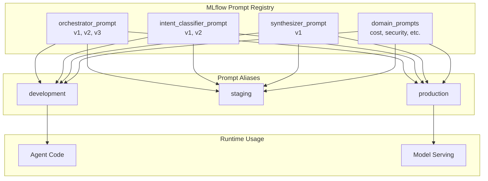

# 10 - Prompt Registry

## Overview

MLflow 3.0 Prompt Registry provides version control for prompts, enabling A/B testing, rollback, and production management. This document covers prompt versioning for the Health Monitor agent system.

## Prompt Registry Architecture



## Logging Prompts

### Basic Prompt Logging

```python
import mlflow.genai

# Log the orchestrator system prompt
orchestrator_prompt_v1 = """You are the Orchestrator Agent for the Databricks Health Monitor.

RESPONSIBILITIES:
- Classify user intent and route to specialized domain agents
- Coordinate multi-agent workflows for complex queries
- Synthesize responses from multiple agents into coherent answers
- Maintain conversation context and user preferences

AVAILABLE AGENTS:
- Cost Agent: Billing, spending, DBU usage, budgets, chargeback
- Security Agent: Access control, audit logs, threats, compliance
- Performance Agent: Query speed, cluster utilization, optimization
- Reliability Agent: Job failures, SLAs, incidents, pipelines
- Quality Agent: Data quality, lineage, freshness, governance

GUIDELINES:
1. Always include time context when discussing data
2. Format costs as USD currency (e.g., $1,234.56)
3. Provide actionable recommendations for identified issues
4. Cite data sources for factual claims
5. Acknowledge uncertainty when confidence is low

USER CONTEXT:
{user_context}

CONVERSATION HISTORY:
{conversation_history}"""

# Log to registry
mlflow.genai.log_prompt(
    prompt=orchestrator_prompt_v1,
    artifact_path="prompts/orchestrator",
    registered_model_name="health_monitor_orchestrator_prompt"
)
```

### Prompt with Variables

```python
# Log prompt template with variable placeholders
intent_classifier_prompt = """You are an intent classifier for Databricks platform monitoring.

Analyze the user query and classify it into ONE OR MORE domains:

DOMAINS:
- COST: Billing, spending, DBU usage, budgets, chargeback, pricing
- SECURITY: Access control, audit logs, threats, compliance, permissions
- PERFORMANCE: Query speed, cluster utilization, latency, optimization
- RELIABILITY: Job failures, SLAs, incidents, success rates, pipelines
- QUALITY: Data quality, lineage, freshness, governance, classification

RULES:
1. A query can belong to multiple domains
2. If unsure, include all potentially relevant domains
3. Return confidence score (0.0-1.0) based on clarity

USER QUERY:
{{query}}

USER ROLE (for context):
{{user_role}}

Return JSON: {{"domains": ["DOMAIN1"], "confidence": 0.XX}}"""

mlflow.genai.log_prompt(
    prompt=intent_classifier_prompt,
    artifact_path="prompts/intent_classifier",
    registered_model_name="health_monitor_intent_prompt"
)
```

### Logging Multiple Versions

```python
# Version 1: Basic orchestrator
mlflow.genai.log_prompt(
    prompt=orchestrator_prompt_v1,
    artifact_path="prompts/orchestrator",
    registered_model_name="health_monitor_orchestrator_prompt"
)

# Version 2: Enhanced with few-shot examples
orchestrator_prompt_v2 = orchestrator_prompt_v1 + """

EXAMPLES:
Q: "Why did costs spike?"
A: Route to Cost Agent, then synthesize with time context and recommendations.

Q: "Are expensive jobs failing?"
A: Route to both Cost and Reliability Agents in parallel, correlate results.

Q: "Give me a health overview"
A: Route to all 5 agents, provide executive summary with key metrics."""

mlflow.genai.log_prompt(
    prompt=orchestrator_prompt_v2,
    artifact_path="prompts/orchestrator",
    registered_model_name="health_monitor_orchestrator_prompt"
)

# Version 3: With persona and tone guidelines
orchestrator_prompt_v3 = orchestrator_prompt_v2 + """

PERSONA:
You are a knowledgeable, helpful platform engineer assistant. Be concise but thorough.
Use technical terms appropriately but explain complex concepts when needed.

TONE:
- Professional and informative
- Proactive in suggesting improvements
- Empathetic when discussing issues or failures
- Confident but acknowledging limitations"""

mlflow.genai.log_prompt(
    prompt=orchestrator_prompt_v3,
    artifact_path="prompts/orchestrator",
    registered_model_name="health_monitor_orchestrator_prompt"
)
```

## Loading Prompts

### Load by Version

```python
import mlflow.genai

# Load specific version
prompt_v1 = mlflow.genai.load_prompt(
    "prompts:/health_monitor_orchestrator_prompt/1"
)

# Load latest version
prompt_latest = mlflow.genai.load_prompt(
    "prompts:/health_monitor_orchestrator_prompt/latest"
)

print(f"Loaded prompt: {prompt_latest[:100]}...")
```

### Load by Alias

```python
# Load production prompt (preferred in deployed applications)
production_prompt = mlflow.genai.load_prompt(
    "prompts:/health_monitor_orchestrator_prompt/production"
)

# Load development prompt (for testing)
dev_prompt = mlflow.genai.load_prompt(
    "prompts:/health_monitor_orchestrator_prompt/development"
)
```

### Using Loaded Prompts

```python
from langchain.prompts import ChatPromptTemplate
from langchain_databricks import ChatDatabricks

# Load prompt from registry
orchestrator_template = mlflow.genai.load_prompt(
    "prompts:/health_monitor_orchestrator_prompt/production"
)

# Create LangChain prompt template
prompt = ChatPromptTemplate.from_template(orchestrator_template)

# Use in chain
llm = ChatDatabricks(endpoint="databricks-dbrx-instruct")
chain = prompt | llm

response = chain.invoke({
    "user_context": "Role: data_engineer, Workspace: prod",
    "conversation_history": "No previous messages",
    "query": "Why did costs spike?"
})
```

## Managing Aliases

### Setting Aliases

```python
from mlflow import MlflowClient

client = MlflowClient()

# Set production alias to version 2
client.set_registered_model_alias(
    name="health_monitor_orchestrator_prompt",
    alias="production",
    version="2"
)

# Set staging alias to version 3 (for testing)
client.set_registered_model_alias(
    name="health_monitor_orchestrator_prompt",
    alias="staging",
    version="3"
)

# Set development alias to latest
client.set_registered_model_alias(
    name="health_monitor_orchestrator_prompt",
    alias="development",
    version="3"
)
```

### Promoting Prompts

```python
def promote_prompt(
    prompt_name: str,
    from_alias: str,
    to_alias: str
):
    """Promote a prompt from one alias to another."""
    
    client = MlflowClient()
    
    # Get version from source alias
    source_version = client.get_model_version_by_alias(
        name=prompt_name,
        alias=from_alias
    )
    
    # Set target alias to same version
    client.set_registered_model_alias(
        name=prompt_name,
        alias=to_alias,
        version=source_version.version
    )
    
    print(f"Promoted {prompt_name} v{source_version.version} from {from_alias} to {to_alias}")

# Example: Promote staging to production
promote_prompt(
    "health_monitor_orchestrator_prompt",
    from_alias="staging",
    to_alias="production"
)
```

### Rollback

```python
def rollback_prompt(
    prompt_name: str,
    alias: str,
    to_version: str
):
    """Rollback a prompt alias to a specific version."""
    
    client = MlflowClient()
    
    # Get current version for logging
    try:
        current = client.get_model_version_by_alias(name=prompt_name, alias=alias)
        current_version = current.version
    except:
        current_version = "none"
    
    # Set alias to rollback version
    client.set_registered_model_alias(
        name=prompt_name,
        alias=alias,
        version=to_version
    )
    
    print(f"Rolled back {prompt_name} {alias}: v{current_version} -> v{to_version}")

# Example: Rollback production to v1
rollback_prompt(
    "health_monitor_orchestrator_prompt",
    alias="production",
    to_version="1"
)
```

## Prompt Templates by Component

### All Health Monitor Prompts

```python
# Dictionary of all prompts for the Health Monitor
HEALTH_MONITOR_PROMPTS = {
    "orchestrator": {
        "name": "health_monitor_orchestrator_prompt",
        "description": "Main orchestrator system prompt",
        "variables": ["user_context", "conversation_history"]
    },
    "intent_classifier": {
        "name": "health_monitor_intent_prompt",
        "description": "Intent classification prompt",
        "variables": ["query", "user_role"]
    },
    "synthesizer": {
        "name": "health_monitor_synthesizer_prompt",
        "description": "Response synthesis prompt",
        "variables": ["agent_responses", "query", "utility_results"]
    },
    "cost_agent": {
        "name": "health_monitor_cost_prompt",
        "description": "Cost agent system prompt",
        "variables": ["query", "context"]
    },
    "security_agent": {
        "name": "health_monitor_security_prompt",
        "description": "Security agent system prompt",
        "variables": ["query", "context"]
    },
    "performance_agent": {
        "name": "health_monitor_performance_prompt",
        "description": "Performance agent system prompt",
        "variables": ["query", "context"]
    },
    "reliability_agent": {
        "name": "health_monitor_reliability_prompt",
        "description": "Reliability agent system prompt",
        "variables": ["query", "context"]
    },
    "quality_agent": {
        "name": "health_monitor_quality_prompt",
        "description": "Quality agent system prompt",
        "variables": ["query", "context"]
    }
}

def register_all_prompts():
    """Register all Health Monitor prompts."""
    
    for key, config in HEALTH_MONITOR_PROMPTS.items():
        prompt_content = load_prompt_file(f"prompts/{key}.txt")
        
        mlflow.genai.log_prompt(
            prompt=prompt_content,
            artifact_path=f"prompts/{key}",
            registered_model_name=config["name"]
        )
        
        print(f"Registered: {config['name']}")
```

### Synthesizer Prompt

```python
SYNTHESIZER_PROMPT = """You are the Response Synthesizer for the Databricks Health Monitor.

Your job is to combine responses from multiple domain agents into a coherent, unified answer.

DOMAIN RESPONSES:
{agent_responses}

USER QUESTION:
{query}

UTILITY DATA (if available):
{utility_results}

SYNTHESIS GUIDELINES:
1. Start with a direct answer to the user's question
2. Integrate insights from each relevant domain
3. Highlight cross-domain correlations (e.g., cost spikes related to job failures)
4. Provide 1-3 actionable recommendations
5. Include sources in [brackets] for each factual claim
6. Use bullet points for clarity when listing multiple items
7. Keep the response concise but comprehensive

FORMAT:
- Lead with the key insight
- Support with data from agents
- Note any correlations across domains
- End with recommendations

Be helpful, accurate, and action-oriented."""

mlflow.genai.log_prompt(
    prompt=SYNTHESIZER_PROMPT,
    artifact_path="prompts/synthesizer",
    registered_model_name="health_monitor_synthesizer_prompt"
)
```

## A/B Testing Prompts

### Setup A/B Test

```python
import random

class PromptABTest:
    """A/B testing for prompts."""
    
    def __init__(
        self,
        prompt_name: str,
        variant_a_alias: str = "production",
        variant_b_alias: str = "staging",
        traffic_split: float = 0.1  # 10% to variant B
    ):
        self.prompt_name = prompt_name
        self.variant_a = variant_a_alias
        self.variant_b = variant_b_alias
        self.traffic_split = traffic_split
    
    def get_prompt(self, user_id: str = None) -> tuple:
        """
        Get prompt variant for A/B test.
        
        Returns:
            (prompt_content, variant_name)
        """
        # Deterministic assignment based on user_id if provided
        if user_id:
            # Hash user_id for consistent assignment
            hash_value = hash(user_id) % 100
            use_variant_b = hash_value < (self.traffic_split * 100)
        else:
            use_variant_b = random.random() < self.traffic_split
        
        variant = self.variant_b if use_variant_b else self.variant_a
        
        prompt = mlflow.genai.load_prompt(
            f"prompts:/{self.prompt_name}/{variant}"
        )
        
        return prompt, variant
    
    def log_variant(self, variant: str, metrics: dict):
        """Log A/B test metrics."""
        mlflow.log_metrics({
            f"ab_test_{variant}_{k}": v
            for k, v in metrics.items()
        })

# Usage
ab_test = PromptABTest(
    prompt_name="health_monitor_orchestrator_prompt",
    variant_a_alias="production",
    variant_b_alias="staging",
    traffic_split=0.1
)

# Get prompt for user
prompt, variant = ab_test.get_prompt(user_id="user@example.com")

# After getting response, log metrics
ab_test.log_variant(variant, {
    "latency_ms": 1500,
    "relevance_score": 0.85,
    "user_rating": 4
})
```

## Prompt Management in Production

### Loading Prompts at Startup

```python
class PromptManager:
    """Centralized prompt management for production."""
    
    def __init__(self, environment: str = "production"):
        self.environment = environment
        self.prompts = {}
        self._load_all_prompts()
    
    def _load_all_prompts(self):
        """Load all prompts at startup."""
        
        alias = self.environment
        
        for key, config in HEALTH_MONITOR_PROMPTS.items():
            try:
                self.prompts[key] = mlflow.genai.load_prompt(
                    f"prompts:/{config['name']}/{alias}"
                )
                print(f"Loaded {key} prompt from {alias}")
            except Exception as e:
                print(f"Failed to load {key} prompt: {e}")
                # Fallback to default
                self.prompts[key] = self._get_default_prompt(key)
    
    def get(self, prompt_key: str) -> str:
        """Get a prompt by key."""
        if prompt_key not in self.prompts:
            raise ValueError(f"Unknown prompt: {prompt_key}")
        return self.prompts[prompt_key]
    
    def refresh(self, prompt_key: str = None):
        """Refresh prompts from registry."""
        if prompt_key:
            config = HEALTH_MONITOR_PROMPTS[prompt_key]
            self.prompts[prompt_key] = mlflow.genai.load_prompt(
                f"prompts:/{config['name']}/{self.environment}"
            )
        else:
            self._load_all_prompts()
    
    def _get_default_prompt(self, key: str) -> str:
        """Return default prompt as fallback."""
        defaults = {
            "orchestrator": "You are a helpful assistant for Databricks monitoring.",
            "intent_classifier": "Classify the query into domains: cost, security, performance, reliability, quality.",
            # ... other defaults
        }
        return defaults.get(key, "You are a helpful assistant.")

# Global prompt manager
prompt_manager = PromptManager(
    environment=os.environ.get("ENVIRONMENT", "production")
)
```

## Next Steps

- **[11-Agent Logging](11-agent-logging.md)**: Agent registration and Model Registry
- **[12-Implementation Guide](12-implementation-guide.md)**: Step-by-step implementation

