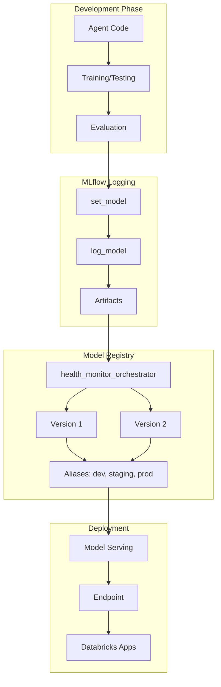

# 11 - Agent Logging

> **✅ Implementation Status: COMPLETE**
>
> Agent logging is implemented in `src/agents/orchestrator/agent.py`:
> - `HealthMonitorAgent` class implementing `ChatAgent` interface
> - `predict()` method returning `ChatAgentResponse`
> - `predict_stream()` method for streaming support (basic implementation)
> - `log_agent()` function for MLflow model registration
> - Model signature, resources, and pip requirements configured

## Overview

MLflow provides comprehensive agent logging capabilities for registering, versioning, and deploying GenAI agents. This document covers the complete agent logging workflow for the Health Monitor system.

## Agent Logging Architecture



## The ChatAgent Interface

### Base ChatAgent Class

MLflow's `ChatAgent` interface is the recommended way to implement agents for deployment:

```python
from mlflow.pyfunc import ChatAgent
from mlflow.types.agent import (
    ChatAgentMessage,
    ChatAgentResponse,
    ChatAgentChunk
)
from typing import Iterator, Optional, Dict, Any
import mlflow

class HealthMonitorAgent(ChatAgent):
    """
    Health Monitor Orchestrator Agent.
    
    Implements the ChatAgent interface for MLflow Model Serving deployment.
    """
    
    def __init__(self):
        """Initialize the agent with all components."""
        self.orchestrator_graph = create_orchestrator_graph()
        self.worker_registry = WorkerAgentRegistry()
        self.genie_client = GenieClient()
        self.prompt_manager = PromptManager()
        self.short_term_memory = ShortTermMemory()
        self.long_term_memory = LongTermMemory()
    
    def predict(
        self,
        context: Any,
        messages: list[ChatAgentMessage],
        params: Optional[Dict[str, Any]] = None
    ) -> ChatAgentResponse:
        """
        Process a chat message and return a response.
        
        Args:
            context: MLflow context (contains model info)
            messages: List of chat messages (conversation history)
            params: Optional parameters (user_id, session_id, etc.)
        
        Returns:
            ChatAgentResponse with the agent's response
        """
        # Extract the latest user message
        user_message = messages[-1]
        query = user_message.content
        
        # Get parameters
        params = params or {}
        user_id = params.get("user_id", "anonymous")
        session_id = params.get("session_id")
        
        # Invoke the orchestrator
        with mlflow.start_span(name="agent_predict", span_type="AGENT") as span:
            span.set_inputs({
                "query": query,
                "user_id": user_id,
                "message_count": len(messages)
            })
            
            # Run orchestrator graph
            result = self.orchestrator_graph.invoke({
                "query": query,
                "user_id": user_id,
                "session_id": session_id,
                "messages": [{"role": m.role, "content": m.content} for m in messages[:-1]]
            })
            
            span.set_outputs({
                "response_length": len(result["synthesized_response"]),
                "source_count": len(result.get("sources", []))
            })
        
        # Build response
        return ChatAgentResponse(
            messages=[
                ChatAgentMessage(
                    role="assistant",
                    content=result["synthesized_response"]
                )
            ],
            metadata={
                "sources": result.get("sources", []),
                "confidence": result.get("confidence", 0.9),
                "domains": result.get("intent", {}).get("domains", [])
            }
        )
    
    def predict_stream(
        self,
        messages: List[ChatAgentMessage],
        context: Optional[ChatContext] = None,
        custom_inputs: Optional[Dict[str, Any]] = None,
    ):
        """
        Stream responses for real-time interaction.
        
        Yields response chunks as they become available.
        
        Note: This is a basic implementation that yields the complete response.
        For true token-by-token streaming, integrate with LangGraph's streaming
        capabilities or the underlying LLM's streaming API.
        
        Args:
            messages: List of chat messages (conversation history)
            context: Optional chat context
            custom_inputs: Optional parameters (user_id, session_id, etc.)
        
        Yields:
            ChatAgentResponse objects containing response chunks
        """
        # For now, use non-streaming and yield complete response
        # TODO: Implement true streaming with LangGraph's stream() method
        response = self.predict(messages, context, custom_inputs)
        yield response
```

## Logging Agents

### Using mlflow.models.set_model()

The `set_model()` function marks a model for logging:

```python
import mlflow

# Create agent instance
agent = HealthMonitorAgent()

# Set the model for logging
# This must be called before log_model()
mlflow.models.set_model(agent)
```

### Complete Logging Workflow

```python
import mlflow
from mlflow.models import ModelSignature
from mlflow.types.schema import Schema, ColSpec

def log_health_monitor_agent():
    """Log the Health Monitor agent to MLflow."""
    
    # Create agent
    agent = HealthMonitorAgent()
    
    # Set model for logging
    mlflow.models.set_model(agent)
    
    # Define input/output signature
    input_schema = Schema([
        ColSpec("string", "query"),
        ColSpec("string", "user_id"),
        ColSpec("string", "session_id")
    ])
    
    output_schema = Schema([
        ColSpec("string", "response"),
        ColSpec("array", "sources"),
        ColSpec("double", "confidence")
    ])
    
    signature = ModelSignature(
        inputs=input_schema,
        outputs=output_schema
    )
    
    # Start MLflow run
    with mlflow.start_run(run_name="health_monitor_agent_v1") as run:
        # Log model parameters
        mlflow.log_params({
            "agent_type": "multi_agent_orchestrator",
            "orchestrator_framework": "langgraph",
            "llm_endpoint": "databricks-dbrx-instruct",
            "worker_agent_count": 5,
            "genie_spaces": 6,
            "utility_tools": 4,
            "memory_type": "lakebase"
        })
        
        # Log the agent model
        mlflow.langchain.log_model(
            lc_model=agent.orchestrator_graph,  # The LangGraph
            artifact_path="orchestrator",
            registered_model_name="health_monitor_orchestrator",
            signature=signature,
            input_example={
                "messages": [
                    {"role": "user", "content": "Why did costs spike yesterday?"}
                ],
                "params": {"user_id": "test_user"}
            },
            pip_requirements=[
                "mlflow>=3.0.0",
                "langchain>=0.3.0",
                "langgraph>=0.2.0",
                "langchain-databricks>=0.1.0",
                "databricks-sdk>=0.30.0",
                "pydantic>=2.0.0"
            ],
            metadata={
                "description": "Health Monitor Multi-Agent Orchestrator",
                "domains": ["cost", "security", "performance", "reliability", "quality"],
                "version": "1.0.0"
            }
        )
        
        # Log additional artifacts
        mlflow.log_artifact("prompts/", artifact_path="prompts")
        mlflow.log_artifact("config/", artifact_path="config")
        
        # Log evaluation metrics (from prior evaluation run)
        mlflow.log_metrics({
            "relevance_score": 0.88,
            "safety_score": 0.95,
            "guidelines_adherence": 0.85,
            "avg_latency_ms": 3500
        })
        
        print(f"Logged agent to run: {run.info.run_id}")
        return run.info.run_id

# Log the agent
run_id = log_health_monitor_agent()
```

### Logging with PyFunc

For custom agent implementations:

```python
import mlflow
from mlflow.pyfunc import PythonModel

class HealthMonitorPyFuncAgent(PythonModel):
    """PyFunc wrapper for the Health Monitor agent."""
    
    def load_context(self, context):
        """Load model artifacts when deployed."""
        import pickle
        
        # Load orchestrator graph
        with open(context.artifacts["orchestrator"], "rb") as f:
            self.orchestrator = pickle.load(f)
        
        # Load prompts
        self.prompts = context.artifacts.get("prompts", {})
    
    def predict(self, context, model_input, params=None):
        """Make predictions."""
        # Handle both DataFrame and dict inputs
        if hasattr(model_input, 'to_dict'):
            data = model_input.to_dict('records')[0]
        else:
            data = model_input
        
        query = data.get("query", data.get("messages", [{}])[-1].get("content", ""))
        user_id = data.get("user_id", "anonymous")
        
        result = self.orchestrator.invoke({
            "query": query,
            "user_id": user_id
        })
        
        return {
            "response": result["synthesized_response"],
            "sources": result.get("sources", []),
            "confidence": result.get("confidence", 0.9)
        }

# Log PyFunc agent
with mlflow.start_run():
    mlflow.pyfunc.log_model(
        artifact_path="agent",
        python_model=HealthMonitorPyFuncAgent(),
        artifacts={
            "orchestrator": "models/orchestrator.pkl",
            "prompts": "prompts/"
        },
        registered_model_name="health_monitor_orchestrator_pyfunc"
    )
```

## Model Registry Operations

### Registering Models

```python
from mlflow import MlflowClient

client = MlflowClient()

# Register model from run
model_version = client.create_model_version(
    name="health_monitor_orchestrator",
    source=f"runs:/{run_id}/orchestrator",
    run_id=run_id,
    description="Health Monitor Multi-Agent Orchestrator v1.0"
)

print(f"Registered version: {model_version.version}")
```

### Setting Aliases

```python
# Set aliases for deployment stages
client.set_registered_model_alias(
    name="health_monitor_orchestrator",
    alias="development",
    version="1"
)

client.set_registered_model_alias(
    name="health_monitor_orchestrator",
    alias="staging",
    version="1"
)

# After testing, promote to production
client.set_registered_model_alias(
    name="health_monitor_orchestrator",
    alias="production",
    version="1"
)
```

### Version Management

```python
def get_production_version(model_name: str) -> str:
    """Get the production version of a model."""
    client = MlflowClient()
    
    version = client.get_model_version_by_alias(
        name=model_name,
        alias="production"
    )
    
    return version.version

def promote_to_production(model_name: str, version: str):
    """Promote a specific version to production."""
    client = MlflowClient()
    
    # Get current production version for logging
    try:
        current_prod = client.get_model_version_by_alias(
            name=model_name,
            alias="production"
        )
        current_version = current_prod.version
    except:
        current_version = "none"
    
    # Update alias
    client.set_registered_model_alias(
        name=model_name,
        alias="production",
        version=version
    )
    
    print(f"Promoted {model_name} to production: v{current_version} -> v{version}")

def rollback_production(model_name: str, to_version: str):
    """Rollback production to a specific version."""
    client = MlflowClient()
    
    client.set_registered_model_alias(
        name=model_name,
        alias="production",
        version=to_version
    )
    
    print(f"Rolled back {model_name} production to v{to_version}")
```

## Loading Models

### Load by Alias

```python
import mlflow

# Load production model
model = mlflow.langchain.load_model(
    "models:/health_monitor_orchestrator@production"
)

# Load development model
dev_model = mlflow.langchain.load_model(
    "models:/health_monitor_orchestrator@development"
)
```

### Load by Version

```python
# Load specific version
model_v1 = mlflow.langchain.load_model(
    "models:/health_monitor_orchestrator/1"
)

# Load latest version
latest_model = mlflow.langchain.load_model(
    "models:/health_monitor_orchestrator/latest"
)
```

### Load by Run ID

```python
# Load from specific run
model = mlflow.langchain.load_model(
    f"runs:/{run_id}/orchestrator"
)
```

## Deployment Configuration

### Model Serving Endpoint (YAML)

```yaml
# resources/ml/orchestrator_serving.yml
resources:
  model_serving_endpoints:
    health_monitor_orchestrator_endpoint:
      name: health_monitor_orchestrator
      config:
        served_models:
          - name: orchestrator_production
            model_name: health_monitor_orchestrator
            model_version: "@production"  # Use alias
            workload_size: Small
            scale_to_zero_enabled: true
        
        # Traffic routing (for A/B testing)
        traffic_config:
          routes:
            - served_model_name: orchestrator_production
              traffic_percentage: 100
        
        # Auto-scaling
        auto_capture_config:
          catalog_name: health_monitor
          schema_name: inference
          table_name_prefix: orchestrator
```

### Environment Variables

```python
# Environment configuration for deployed agent
AGENT_ENV_CONFIG = {
    # MLflow
    "MLFLOW_TRACKING_URI": "databricks",
    "MLFLOW_EXPERIMENT_NAME": "/Shared/health_monitor/agent_traces",
    
    # Agent
    "AGENT_MODEL_NAME": "health_monitor_orchestrator",
    "AGENT_MODEL_ALIAS": "production",
    
    # LLM
    "LLM_ENDPOINT": "databricks-dbrx-instruct",
    "LLM_TEMPERATURE": "0.3",
    
    # Memory
    "SHORT_TERM_MEMORY_TABLE": "health_monitor.memory.short_term",
    "LONG_TERM_MEMORY_TABLE": "health_monitor.memory.long_term",
    "MEMORY_TTL_HOURS": "24",
    
    # Timeouts
    "GENIE_TIMEOUT_SECONDS": "45",
    "AGENT_TIMEOUT_SECONDS": "30"
}
```

## Model Comparison

### Compare Model Versions

```python
def compare_model_versions(
    model_name: str,
    version_a: str,
    version_b: str,
    test_data: list
):
    """Compare two model versions on test data."""
    
    # Load models
    model_a = mlflow.langchain.load_model(f"models:/{model_name}/{version_a}")
    model_b = mlflow.langchain.load_model(f"models:/{model_name}/{version_b}")
    
    results = []
    
    for test_case in test_data:
        query = test_case["query"]
        
        # Run both models
        response_a = model_a.invoke({"query": query})
        response_b = model_b.invoke({"query": query})
        
        results.append({
            "query": query,
            "response_a": response_a["synthesized_response"],
            "response_b": response_b["synthesized_response"],
            "expected": test_case.get("expected")
        })
    
    return results

# Compare versions
comparison = compare_model_versions(
    "health_monitor_orchestrator",
    version_a="1",
    version_b="2",
    test_data=evaluation_data
)
```

## Complete Logging Pipeline

```python
def full_agent_logging_pipeline():
    """Complete pipeline for agent development to deployment."""
    
    # 1. Create and configure agent
    agent = HealthMonitorAgent()
    mlflow.models.set_model(agent)
    
    # 2. Run evaluation
    print("Running evaluation...")
    eval_results = mlflow.genai.evaluate(
        model=agent,
        data=evaluation_dataset,
        scorers=[Relevance(), Safety(), Correctness()]
    )
    
    # 3. Log agent if evaluation passes
    if eval_results.metrics["relevance/mean"] >= 0.8:
        print("Evaluation passed. Logging agent...")
        
        with mlflow.start_run(run_name="health_monitor_agent") as run:
            # Log evaluation metrics
            mlflow.log_metrics({
                "eval_relevance": eval_results.metrics["relevance/mean"],
                "eval_safety": eval_results.metrics["safety/mean"],
                "eval_correctness": eval_results.metrics["correctness/mean"]
            })
            
            # Log model
            mlflow.langchain.log_model(
                lc_model=agent.orchestrator_graph,
                artifact_path="orchestrator",
                registered_model_name="health_monitor_orchestrator",
                pip_requirements=["mlflow>=3.0.0", "langchain>=0.3.0", "langgraph>=0.2.0"]
            )
            
            run_id = run.info.run_id
        
        # 4. Set development alias
        client = MlflowClient()
        latest_version = client.get_latest_versions(
            "health_monitor_orchestrator"
        )[0].version
        
        client.set_registered_model_alias(
            name="health_monitor_orchestrator",
            alias="development",
            version=latest_version
        )
        
        print(f"Agent logged and set to development (v{latest_version})")
        return run_id
    else:
        print(f"Evaluation failed. Relevance: {eval_results.metrics['relevance/mean']:.2f}")
        return None

# Run pipeline
run_id = full_agent_logging_pipeline()
```

## Next Steps

- **[12-Implementation Guide](12-implementation-guide.md)**: Step-by-step implementation phases
- **[13-Deployment and Monitoring](13-deployment-and-monitoring.md)**: Production deployment

