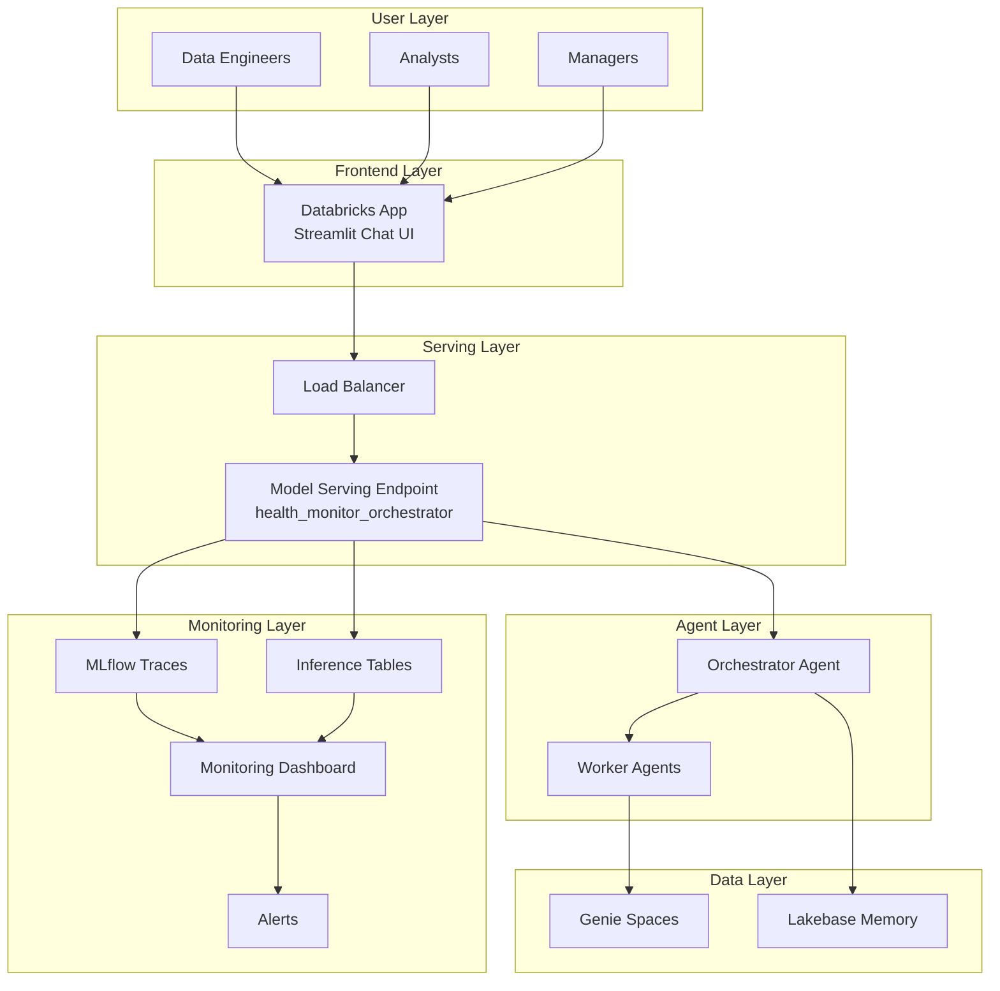

# 13 - Deployment and Monitoring

## Overview

This document covers production deployment of the Health Monitor agent system using Databricks Model Serving and Databricks Apps, along with monitoring and observability setup.

## Deployment Architecture



## Model Serving Deployment

### Asset Bundle Configuration

```yaml
# resources/ml/orchestrator_serving.yml
resources:
  model_serving_endpoints:
    health_monitor_orchestrator_endpoint:
      name: health_monitor_orchestrator
      config:
        served_models:
          - name: orchestrator_production
            model_name: health_monitor_orchestrator
            model_version: "@production"
            workload_size: Small
            scale_to_zero_enabled: true
        
        # Auto-capture for inference tables (CONSOLIDATED schema)
        # All agent data in single schema to avoid sprawl
        # Tables: inference_request_logs, inference_response_logs
        auto_capture_config:
          catalog_name: ${var.catalog}
          schema_name: ${var.agent_schema}
          table_name_prefix: inference
          enabled: true
        
        # Rate limiting
        rate_limits:
          - calls: 100
            renewal_period: MINUTE
            key: user_id
      
      # Tags
      tags:
        environment: ${bundle.target}
        project: health_monitor
        component: agent
```

### Deploy via CLI

```bash
# Validate bundle
databricks bundle validate -t prod

# Deploy endpoint
databricks bundle deploy -t prod

# Verify deployment
databricks serving-endpoints get health_monitor_orchestrator
```

### Manual Deployment via SDK

```python
from databricks.sdk import WorkspaceClient
from databricks.sdk.service.serving import (
    EndpointCoreConfigInput,
    ServedModelInput,
    AutoCaptureConfigInput
)

client = WorkspaceClient()

# Create or update endpoint
client.serving_endpoints.create(
    name="health_monitor_orchestrator",
    config=EndpointCoreConfigInput(
        served_models=[
            ServedModelInput(
                model_name="health_monitor_orchestrator",
                model_version="@production",
                workload_size="Small",
                scale_to_zero_enabled=True
            )
        ],
        # CONSOLIDATED: All agent data in single schema
        auto_capture_config=AutoCaptureConfigInput(
            catalog_name=settings.catalog,  # prashanth_subrahmanyam_catalog
            schema_name=settings.agent_schema,  # dev_<user>_system_gold_agent
            table_name_prefix="inference",  # Creates inference_request_logs, inference_response_logs
            enabled=True
        )
    )
)

print("Endpoint created successfully")
```

## Databricks Apps Frontend

### App Configuration

```yaml
# databricks.yml - Apps section
resources:
  apps:
    health_monitor_chat:
      name: health_monitor_chat
      description: "Health Monitor Chat Interface"
      source_code_path: ../src/frontend_app
      
      resources:
        - name: serving_endpoint
          serving_endpoint:
            name: health_monitor_orchestrator
            permission: CAN_QUERY
```

### Streamlit App

```python
# src/frontend_app/app.py
import streamlit as st
from databricks.sdk import WorkspaceClient
import json

# Page config
st.set_page_config(
    page_title="Databricks Health Monitor",
    page_icon="🏥",
    layout="wide"
)

# Initialize
client = WorkspaceClient()

# Session state
if "messages" not in st.session_state:
    st.session_state.messages = []
if "conversation_id" not in st.session_state:
    st.session_state.conversation_id = None

# Header
st.title("🏥 Databricks Health Monitor")
st.caption("Ask questions about costs, jobs, security, performance, and data quality")

# Sidebar
with st.sidebar:
    st.header("Settings")
    user_email = st.text_input("Your Email", value=st.session_state.get("user_email", ""))
    
    st.header("Quick Questions")
    quick_questions = [
        "Why did costs spike yesterday?",
        "Which jobs failed today?",
        "Show me slow queries",
        "Any security concerns?",
        "Platform health overview"
    ]
    for q in quick_questions:
        if st.button(q, key=f"quick_{q}"):
            st.session_state.quick_question = q

# Display chat history
for message in st.session_state.messages:
    with st.chat_message(message["role"]):
        st.markdown(message["content"])
        if message.get("sources"):
            with st.expander("Sources"):
                for source in message["sources"]:
                    st.caption(f"• {source}")

# Handle quick questions
if "quick_question" in st.session_state:
    prompt = st.session_state.pop("quick_question")
else:
    prompt = st.chat_input("Ask about costs, jobs, security, performance...")

# Process input
if prompt:
    # Add user message
    st.session_state.messages.append({"role": "user", "content": prompt})
    
    with st.chat_message("user"):
        st.markdown(prompt)
    
    # Query endpoint
    with st.chat_message("assistant"):
        with st.spinner("Analyzing..."):
            try:
                response = client.serving_endpoints.query(
                    name="health_monitor_orchestrator",
                    inputs={
                        "messages": [
                            {"role": m["role"], "content": m["content"]}
                            for m in st.session_state.messages
                        ],
                        "params": {
                            "user_id": user_email,
                            "session_id": st.session_state.conversation_id
                        }
                    }
                )
                
                # Parse response
                result = response.predictions[0] if response.predictions else {}
                content = result.get("content", "I couldn't process that request.")
                sources = result.get("sources", [])
                confidence = result.get("confidence", 0.9)
                
                # Display response
                st.markdown(content)
                
                if sources:
                    with st.expander(f"Sources (confidence: {confidence:.0%})"):
                        for source in sources:
                            st.caption(f"• {source}")
                
                # Save to history
                st.session_state.messages.append({
                    "role": "assistant",
                    "content": content,
                    "sources": sources
                })
                
            except Exception as e:
                st.error(f"Error: {str(e)}")

# Clear chat button
if st.button("Clear Chat"):
    st.session_state.messages = []
    st.session_state.conversation_id = None
    st.rerun()
```

### Deploy App

```bash
# Deploy the app
databricks apps deploy health_monitor_chat

# Get app URL
databricks apps get health_monitor_chat
```

## Inference Tables

### Table Schema

```sql
-- CONSOLIDATED: All agent data in single schema
-- Tables use prefix: inference_request_logs, inference_response_logs
-- Dev: prashanth_subrahmanyam_catalog.dev_<user>_system_gold_agent.inference_*
-- Prod: main.system_gold_agent.inference_*

-- Query inference logs (example using dev schema)
SELECT
    request_id,
    timestamp,
    request.messages[0].content AS query,
    response.content AS answer,
    response.confidence,
    response.sources,
    latency_ms
FROM prashanth_subrahmanyam_catalog.dev_prashanth_subrahmanyam_system_gold_agent.inference_response_logs
WHERE timestamp > current_timestamp() - INTERVAL 24 HOURS
ORDER BY timestamp DESC
LIMIT 100;
```

## Monitoring Dashboard

### Key Metrics Query

```sql
-- Monitoring dashboard metrics (CONSOLIDATED schema)
-- Replace ${catalog} and ${agent_schema} with actual values
WITH hourly_stats AS (
    SELECT
        date_trunc('hour', timestamp) AS hour,
        COUNT(*) AS request_count,
        AVG(latency_ms) AS avg_latency_ms,
        PERCENTILE(latency_ms, 0.95) AS p95_latency_ms,
        SUM(CASE WHEN error IS NOT NULL THEN 1 ELSE 0 END) AS error_count,
        AVG(response.confidence) AS avg_confidence
    FROM ${catalog}.${agent_schema}.inference_response_logs
    WHERE timestamp > current_timestamp() - INTERVAL 7 DAYS
    GROUP BY 1
)
SELECT
    hour,
    request_count,
    avg_latency_ms,
    p95_latency_ms,
    error_count,
    (request_count - error_count) / request_count AS success_rate,
    avg_confidence
FROM hourly_stats
ORDER BY hour DESC;
```

### Domain Distribution Query

```sql
-- Query distribution by domain (CONSOLIDATED schema)
SELECT
    date_trunc('day', timestamp) AS day,
    response.domains[0] AS primary_domain,
    COUNT(*) AS query_count,
    AVG(response.confidence) AS avg_confidence
FROM ${catalog}.${agent_schema}.inference_response_logs
WHERE timestamp > current_timestamp() - INTERVAL 30 DAYS
GROUP BY 1, 2
ORDER BY 1 DESC, 3 DESC;
```

## Alerts

### Alert Configuration

```yaml
# resources/monitoring/agent_alerts.yml
resources:
  sql_alerts:
    agent_high_error_rate:
      name: "[Health Monitor] High Error Rate"
      query:
        query: |
          SELECT 
            COUNT(*) as total,
            SUM(CASE WHEN error IS NOT NULL THEN 1 ELSE 0 END) as errors,
            SUM(CASE WHEN error IS NOT NULL THEN 1 ELSE 0 END) / COUNT(*) as error_rate
          FROM ${var.catalog}.${var.agent_schema}.inference_response_logs
          WHERE timestamp > current_timestamp() - INTERVAL 1 HOUR
        warehouse_id: ${var.warehouse_id}
      
      condition:
        op: GREATER_THAN
        operand:
          column:
            name: error_rate
        threshold:
          value:
            double_value: 0.1  # Alert if error rate > 10%
      
      notify:
        - email: platform-team@company.com
      
      display_name: "Agent Error Rate Alert"
    
    agent_high_latency:
      name: "[Health Monitor] High Latency"
      query:
        query: |
          SELECT 
            PERCENTILE(latency_ms, 0.95) as p95_latency
          FROM ${var.catalog}.${var.agent_schema}.inference_response_logs
          WHERE timestamp > current_timestamp() - INTERVAL 1 HOUR
        warehouse_id: ${var.warehouse_id}
      
      condition:
        op: GREATER_THAN
        operand:
          column:
            name: p95_latency
        threshold:
          value:
            double_value: 10000  # Alert if P95 > 10s
      
      notify:
        - email: platform-team@company.com
```

## Production Monitoring

### MLflow Trace Dashboard

```python
# src/agents/monitoring/trace_dashboard.py
import mlflow
from mlflow import MlflowClient
from datetime import datetime, timedelta

def get_trace_metrics(hours: int = 24) -> dict:
    """Get trace metrics for monitoring dashboard."""
    
    client = MlflowClient()
    
    end_time = datetime.utcnow()
    start_time = end_time - timedelta(hours=hours)
    
    traces = client.search_traces(
        experiment_ids=["health_monitor_traces"],
        filter_string=f"timestamp > {int(start_time.timestamp() * 1000)}",
        max_results=1000
    )
    
    metrics = {
        "total_traces": len(traces),
        "success_count": sum(1 for t in traces if t.info.status == "OK"),
        "error_count": sum(1 for t in traces if t.info.status != "OK"),
        "avg_latency_ms": sum(t.info.execution_time_ms for t in traces) / len(traces) if traces else 0,
        "domains": {}
    }
    
    # Count by domain
    for trace in traces:
        domains = trace.info.tags.get("domains", "unknown").split(",")
        for domain in domains:
            metrics["domains"][domain] = metrics["domains"].get(domain, 0) + 1
    
    return metrics
```

### Health Check Endpoint

```python
# src/agents/monitoring/health_check.py
from fastapi import FastAPI, HTTPException
from databricks.sdk import WorkspaceClient

app = FastAPI()

@app.get("/health")
async def health_check():
    """Health check endpoint for monitoring."""
    
    checks = {
        "model_serving": False,
        "genie_access": False,
        "memory_tables": False
    }
    
    client = WorkspaceClient()
    
    # Check model serving
    try:
        endpoint = client.serving_endpoints.get("health_monitor_orchestrator")
        checks["model_serving"] = endpoint.state.ready == "READY"
    except:
        pass
    
    # Check Genie access
    try:
        # Simple test query
        checks["genie_access"] = True  # Implement actual check
    except:
        pass
    
    # Check memory tables
    try:
        spark = SparkSession.getActiveSession()
        # CONSOLIDATED: Memory tables in same schema with prefix
        spark.sql(f"SELECT 1 FROM {settings.catalog}.{settings.agent_schema}.memory_short_term LIMIT 1")
        checks["memory_tables"] = True
    except:
        pass
    
    all_healthy = all(checks.values())
    
    return {
        "status": "healthy" if all_healthy else "degraded",
        "checks": checks
    }
```

## Scaling Configuration

### Auto-scaling Settings

```python
# Endpoint scaling configuration
scaling_config = {
    "min_provisioned_throughput": 0,  # Scale to zero
    "max_provisioned_throughput": 100,  # Max concurrent requests
    "scale_to_zero_enabled": True,
    "warmup_requests": 10  # Requests before scaling down
}
```

### Performance Tuning

```python
# Performance configuration
PERFORMANCE_CONFIG = {
    # Timeouts
    "genie_timeout_seconds": 45,
    "agent_timeout_seconds": 30,
    "endpoint_timeout_seconds": 60,
    
    # Caching
    "cache_ttl_seconds": 300,  # 5 minutes
    "cache_max_size": 100,
    
    # Concurrency
    "max_concurrent_genie_queries": 5,
    "max_worker_threads": 10,
    
    # Rate limiting
    "requests_per_minute_per_user": 30,
    "requests_per_minute_global": 1000
}
```

## Rollback Procedure

### Quick Rollback

```bash
# Rollback to previous version
databricks serving-endpoints update-config health_monitor_orchestrator \
    --served-models '[{
        "model_name": "health_monitor_orchestrator",
        "model_version": "1",
        "workload_size": "Small"
    }]'

# Verify rollback
databricks serving-endpoints get health_monitor_orchestrator
```

### SDK Rollback

```python
from mlflow import MlflowClient

def rollback_agent(version: str):
    """Rollback agent to specific version."""
    client = MlflowClient()
    
    # Update production alias
    client.set_registered_model_alias(
        name="health_monitor_orchestrator",
        alias="production",
        version=version
    )
    
    # Endpoint will automatically pick up the new version
    print(f"Rolled back to version {version}")
```

## Deployment Checklist

### Pre-Deployment
- [ ] All tests passing
- [ ] Evaluation metrics above thresholds
- [ ] Prompts registered and aliased
- [ ] Model logged to registry
- [ ] Environment variables configured

### Deployment
- [ ] Model Serving endpoint created
- [ ] Endpoint responding to test queries
- [ ] Inference tables capturing requests
- [ ] Databricks App deployed
- [ ] App accessible to users

### Post-Deployment
- [ ] Monitoring dashboard showing data
- [ ] Alerts configured and tested
- [ ] Health check passing
- [ ] Documentation updated
- [ ] Team notified

## Next Steps

- **[Appendices](appendices/)**: Code examples and references

