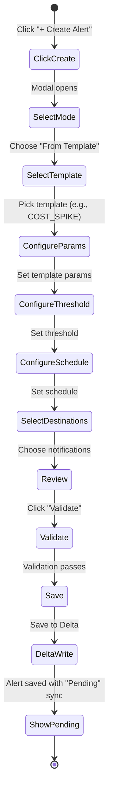
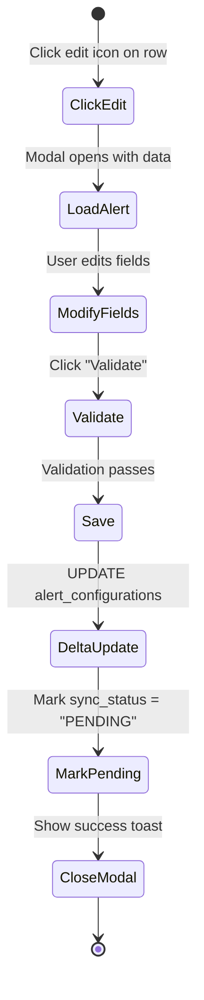
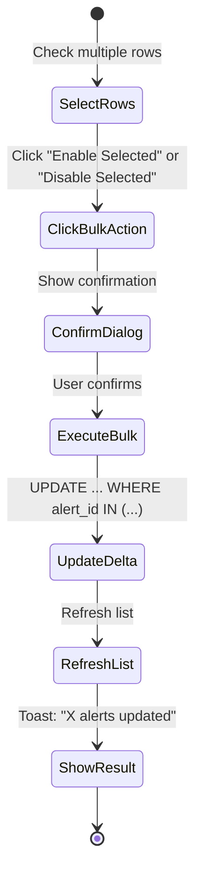
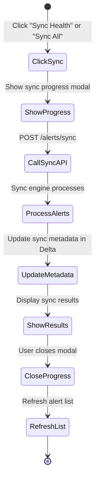

# 13 - Frontend Alert Management UI

> **📋 Document Purpose**: Design specification for a frontend UI that enables administrators to manage alert configurations via CRUD operations against the Delta table.
>
> **Audience**: Frontend developers, UI/UX designers, full-stack engineers
>
> **Related**: [03-Config-Driven Alerting](03-config-driven-alerting.md), [Agent Framework Frontend Guide](../agent-framework-design/15-frontend-integration-guide.md)

---

## Table of Contents

1. [Overview](#overview)
2. [Design Philosophy](#design-philosophy)
3. [UI Architecture](#ui-architecture)
4. [Data Model Mapping](#data-model-mapping)
5. [API Contracts](#api-contracts)
6. [Component Specifications](#component-specifications)
7. [User Flows](#user-flows)
8. [Validation Rules](#validation-rules)
9. [Error Handling](#error-handling)
10. [State Management](#state-management)
11. [Security Considerations](#security-considerations)
12. [Testing Strategy](#testing-strategy)

---

## Overview

### Purpose

The **Alert Center** provides a user-friendly interface for platform administrators to:

- **View** all configured alerts with status, sync state, and destinations
- **Create** new alerts using templates or custom SQL queries
- **Edit** existing alert configurations (thresholds, schedules, notifications)
- **Enable/Disable** alerts without deleting
- **Delete** alerts (soft delete with audit trail)
- **Bulk Operations** for managing multiple alerts at once
- **Sync** configuration changes to Databricks SQL Alerts

### Architecture Pattern

```
┌─────────────────────────────────────────────────────────────────────────────┐
│                           FRONTEND (React/TypeScript)                        │
│                                                                              │
│  ┌─────────────┐   ┌─────────────┐   ┌─────────────┐   ┌─────────────┐     │
│  │ Alert List  │   │ Alert Form  │   │ Destination │   │  Sync Panel │     │
│  │   Component │   │  (Create/   │   │   Manager   │   │             │     │
│  │             │   │   Edit)     │   │             │   │             │     │
│  └─────────────┘   └─────────────┘   └─────────────┘   └─────────────┘     │
│           │               │                │                 │              │
│           └───────────────┴────────────────┴─────────────────┘              │
│                                    │                                         │
│                           State Management (Zustand/Redux)                   │
└────────────────────────────────────┼─────────────────────────────────────────┘
                                     │
                                     ▼
┌─────────────────────────────────────────────────────────────────────────────┐
│                           BACKEND API LAYER                                  │
│                                                                              │
│  ┌─────────────────────────────────────────────────────────────────────┐   │
│  │              Delta Table API (Serverless SQL / Spark)                │   │
│  │                                                                       │   │
│  │  GET  /api/alerts           → SELECT * FROM alert_configurations     │   │
│  │  POST /api/alerts           → INSERT INTO alert_configurations       │   │
│  │  PUT  /api/alerts/{id}      → UPDATE alert_configurations            │   │
│  │  DELETE /api/alerts/{id}    → DELETE FROM alert_configurations       │   │
│  │  POST /api/alerts/sync      → Trigger sync to Databricks Alerts      │   │
│  └─────────────────────────────────────────────────────────────────────┘   │
│                                    │                                         │
└────────────────────────────────────┼─────────────────────────────────────────┘
                                     │
                                     ▼
┌─────────────────────────────────────────────────────────────────────────────┐
│                           DELTA LAKE (Unity Catalog)                         │
│                                                                              │
│   ┌───────────────────────┐  ┌───────────────────────┐                     │
│   │ alert_configurations  │  │ notification_         │                     │
│   │ (29+ alerts)          │  │ destinations          │                     │
│   └───────────────────────┘  └───────────────────────┘                     │
│                                                                              │
└─────────────────────────────────────────────────────────────────────────────┘
                                     │
                                     ▼ (Sync Engine)
┌─────────────────────────────────────────────────────────────────────────────┐
│                      DATABRICKS SQL ALERTS (V2 API)                          │
└─────────────────────────────────────────────────────────────────────────────┘
```

---

## Design Philosophy

### Principle 1: Delta Table as Source of Truth

The frontend **NEVER** directly calls the Databricks Alerts API. All operations modify the `alert_configurations` Delta table, and a separate sync process deploys changes.

```
✅ Frontend → Delta Table → Sync Engine → Databricks Alerts
❌ Frontend → Databricks Alerts (direct API calls)
```

**Why?**
- **Audit trail**: Delta time travel captures all changes
- **Version control**: Can rollback to any previous state
- **Validation**: Sync engine validates queries before deployment
- **Decoupling**: Frontend doesn't need Databricks SDK

### Principle 2: Optimistic UI with Background Sync

1. User makes change in UI → **Immediate feedback** (optimistic update)
2. Change persisted to Delta → **Background write**
3. Sync status shows "Pending" → **Indicates not yet deployed**
4. User triggers manual sync OR scheduled sync runs → **Deployed to Databricks**

### Principle 3: Template-First for New Alerts

Encourage users to start from templates rather than raw SQL:

```
┌─────────────────────────────────────────────────────────────────┐
│  Create New Alert                                               │
│  ─────────────────                                              │
│  ○ From Template (Recommended)                                  │
│    └─ Choose from 29 pre-built patterns                        │
│                                                                 │
│  ○ Custom SQL                                                   │
│    └─ Write your own query (Advanced)                          │
└─────────────────────────────────────────────────────────────────┘
```

---

## Data Model Mapping

### UI to Delta Table Field Mapping

| UI Field | Delta Column | Type | Required | Notes |
|----------|--------------|------|----------|-------|
| Alert Name | `alert_name` | STRING | ✅ | Display name in UI and notifications |
| Alert ID | `alert_id` | STRING | ✅ | Auto-generated: `{DOMAIN}-{SEQ}` |
| Description | `alert_description` | STRING | ❌ | Detailed explanation |
| Domain | `agent_domain` | STRING | ✅ | Dropdown: COST, SECURITY, PERFORMANCE, RELIABILITY, QUALITY |
| Severity | `severity` | STRING | ✅ | Dropdown: CRITICAL, WARNING, INFO |
| SQL Query | `alert_query_template` | STRING | ✅ | Query with `${catalog}.${gold_schema}` placeholders |
| Threshold Column | `threshold_column` | STRING | ✅ | Column name to evaluate |
| Operator | `threshold_operator` | STRING | ✅ | Dropdown: >, <, >=, <=, =, != |
| Threshold Value | `threshold_value_double/string/bool` | VARIES | ✅ | Based on `threshold_value_type` |
| Schedule | `schedule_cron` | STRING | ✅ | Cron expression (with visual builder) |
| Timezone | `schedule_timezone` | STRING | ✅ | Dropdown of IANA timezones |
| Status (ON/OFF) | `is_enabled` | BOOLEAN | ✅ | Toggle switch |
| Pause Status | `pause_status` | STRING | ✅ | UNPAUSED / PAUSED |
| Destinations | `notification_channels` | ARRAY | ❌ | Multi-select from available destinations |
| Notify on OK | `notify_on_ok` | BOOLEAN | ✅ | Checkbox |
| Re-trigger Delay | `retrigger_seconds` | INT | ❌ | Cooldown period |
| Owner | `owner` | STRING | ✅ | Auto-filled from logged-in user |
| Tags | `tags` | MAP | ❌ | Key-value pairs |

### Sync Metadata (Read-Only in UI)

| UI Display | Delta Column | Notes |
|------------|--------------|-------|
| Sync Status | `last_sync_status` | SUCCESS, ERROR, SKIPPED, PENDING |
| Last Synced | `last_synced_at` | Timestamp |
| Databricks ID | `databricks_alert_id` | UUID from API |
| Sync Error | `last_sync_error` | Error message if failed |

---

## API Contracts

### Base URL

```
/api/v1/alerting
```

### Authentication

All endpoints require the user's Databricks PAT:

```http
Authorization: Bearer {user_databricks_token}
```

---

### GET /alerts

**List all alerts with filtering and pagination**

**Request:**
```http
GET /api/v1/alerting/alerts?
    domain=COST&
    severity=CRITICAL&
    status=enabled&
    sync_status=PENDING&
    search=cost&
    page=1&
    limit=25&
    sort_by=alert_name&
    sort_order=asc
```

**Query Parameters:**

| Param | Type | Default | Description |
|-------|------|---------|-------------|
| `domain` | string | - | Filter by domain (COST, SECURITY, etc.) |
| `severity` | string | - | Filter by severity |
| `status` | string | - | Filter: `enabled`, `disabled`, `all` |
| `sync_status` | string | - | Filter: `SYNCED`, `PENDING`, `ERROR`, `SKIPPED` |
| `search` | string | - | Search in alert_name, alert_id, description |
| `page` | int | 1 | Page number |
| `limit` | int | 25 | Items per page (max 100) |
| `sort_by` | string | `alert_name` | Column to sort |
| `sort_order` | string | `asc` | `asc` or `desc` |

**Response:**
```typescript
interface AlertListResponse {
  success: true;
  data: {
    alerts: Alert[];
    pagination: {
      page: number;
      limit: number;
      total_items: number;
      total_pages: number;
    };
    summary: {
      total_alerts: number;
      enabled_alerts: number;
      disabled_alerts: number;
      by_domain: Record<string, number>;
      by_severity: Record<string, number>;
      by_sync_status: Record<string, number>;
    };
  };
}

interface Alert {
  // Identity
  alert_id: string;
  alert_name: string;
  alert_description: string | null;
  
  // Classification
  agent_domain: 'COST' | 'SECURITY' | 'PERFORMANCE' | 'RELIABILITY' | 'QUALITY';
  severity: 'CRITICAL' | 'WARNING' | 'INFO';
  
  // Query
  alert_query_template: string;
  threshold_column: string;
  threshold_operator: '>' | '<' | '>=' | '<=' | '=' | '!=';
  threshold_value_type: 'DOUBLE' | 'STRING' | 'BOOLEAN';
  threshold_value_double: number | null;
  threshold_value_string: string | null;
  threshold_value_bool: boolean | null;
  
  // Schedule
  schedule_cron: string;
  schedule_timezone: string;
  schedule_human_readable: string;  // "Daily at 6:00 AM PST"
  
  // Status
  is_enabled: boolean;
  pause_status: 'UNPAUSED' | 'PAUSED';
  
  // Notifications
  notification_channels: string[];  // Destination IDs
  notify_on_ok: boolean;
  retrigger_seconds: number | null;
  
  // Ownership
  owner: string;
  tags: Record<string, string>;
  
  // Audit
  created_by: string;
  created_at: string;  // ISO timestamp
  updated_by: string | null;
  updated_at: string | null;
  
  // Sync metadata
  sync_status: 'SYNCED' | 'PENDING' | 'ERROR' | 'SKIPPED' | 'NOT_SYNCED';
  databricks_alert_id: string | null;
  last_synced_at: string | null;
  last_sync_error: string | null;
}
```

---

### GET /alerts/{alert_id}

**Get single alert details**

**Response:**
```typescript
interface AlertDetailResponse {
  success: true;
  data: {
    alert: Alert;
    // Additional computed fields for detail view
    query_rendered: string;  // Query with catalog/schema substituted
    validation_status: {
      is_valid: boolean;
      error_message: string | null;
      last_validated_at: string | null;
    };
    destinations_resolved: Array<{
      id: string;
      name: string;
      type: 'EMAIL' | 'SLACK' | 'WEBHOOK' | 'TEAMS' | 'PAGERDUTY';
      config_summary: string;  // "2 email addresses" or "Slack #alerts"
    }>;
    version_history: Array<{
      version: number;
      changed_at: string;
      changed_by: string;
      changes_summary: string;
    }>;
  };
}
```

---

### POST /alerts

**Create a new alert**

**Request:**
```typescript
interface CreateAlertRequest {
  // Required
  alert_name: string;
  agent_domain: string;
  severity: string;
  alert_query_template: string;
  threshold_column: string;
  threshold_operator: string;
  threshold_value_type: string;
  schedule_cron: string;
  schedule_timezone: string;
  
  // Conditionally required based on threshold_value_type
  threshold_value_double?: number;
  threshold_value_string?: string;
  threshold_value_bool?: boolean;
  
  // Optional
  alert_description?: string;
  empty_result_state?: string;  // default: 'OK'
  aggregation_type?: string;
  notification_channels?: string[];
  notify_on_ok?: boolean;  // default: false
  retrigger_seconds?: number;
  use_custom_template?: boolean;
  custom_subject_template?: string;
  custom_body_template?: string;
  tags?: Record<string, string>;
  
  // Optional: Create from template
  template_id?: string;
  template_params?: Record<string, any>;
}
```

**Response:**
```typescript
interface CreateAlertResponse {
  success: true;
  data: {
    alert_id: string;  // Auto-generated
    alert: Alert;
    validation: {
      is_valid: boolean;
      error_message: string | null;
    };
  };
  message: string;
}
```

---

### PUT /alerts/{alert_id}

**Update an existing alert**

**Request:**
```typescript
interface UpdateAlertRequest {
  // All fields optional - only include fields to update
  alert_name?: string;
  alert_description?: string;
  severity?: string;
  alert_query_template?: string;
  threshold_column?: string;
  threshold_operator?: string;
  threshold_value_type?: string;
  threshold_value_double?: number;
  threshold_value_string?: string;
  threshold_value_bool?: boolean;
  schedule_cron?: string;
  schedule_timezone?: string;
  is_enabled?: boolean;
  pause_status?: string;
  notification_channels?: string[];
  notify_on_ok?: boolean;
  retrigger_seconds?: number;
  use_custom_template?: boolean;
  custom_subject_template?: string;
  custom_body_template?: string;
  tags?: Record<string, string>;
}
```

**Response:**
```typescript
interface UpdateAlertResponse {
  success: true;
  data: {
    alert: Alert;
    changes: Array<{
      field: string;
      old_value: any;
      new_value: any;
    }>;
    validation: {
      is_valid: boolean;
      error_message: string | null;
    };
  };
  message: string;
}
```

---

### DELETE /alerts/{alert_id}

**Delete an alert**

**Query Parameters:**

| Param | Type | Default | Description |
|-------|------|---------|-------------|
| `hard_delete` | boolean | false | If true, permanently delete. If false, mark as disabled. |

**Response:**
```typescript
interface DeleteAlertResponse {
  success: true;
  data: {
    alert_id: string;
    action: 'disabled' | 'deleted';
    can_restore_until: string | null;  // For soft delete via time travel
  };
  message: string;
}
```

---

### POST /alerts/bulk

**Bulk operations on multiple alerts**

**Request:**
```typescript
interface BulkOperationRequest {
  alert_ids: string[];
  operation: 'enable' | 'disable' | 'delete' | 'update_severity' | 'update_owner';
  params?: {
    severity?: string;
    owner?: string;
  };
}
```

**Response:**
```typescript
interface BulkOperationResponse {
  success: true;
  data: {
    successful: string[];
    failed: Array<{
      alert_id: string;
      error: string;
    }>;
  };
  message: string;
}
```

---

### POST /alerts/validate

**Validate an alert query before saving**

**Request:**
```typescript
interface ValidateAlertRequest {
  alert_query_template: string;
  threshold_column: string;
}
```

**Response:**
```typescript
interface ValidateAlertResponse {
  success: true;
  data: {
    is_valid: boolean;
    errors: Array<{
      type: 'SYNTAX' | 'COLUMN_NOT_FOUND' | 'TABLE_NOT_FOUND' | 'SECURITY';
      message: string;
      line?: number;
      column?: number;
    }>;
    warnings: string[];
    query_rendered: string;
    columns_found: string[];
    tables_referenced: string[];
    estimated_execution_time_ms: number | null;
  };
}
```

---

### POST /alerts/sync

**Trigger sync to Databricks SQL Alerts**

**Request:**
```typescript
interface SyncRequest {
  alert_ids?: string[];  // If empty, sync all pending
  dry_run?: boolean;     // If true, validate only
  force?: boolean;       // If true, sync even if already synced
}
```

**Response:**
```typescript
interface SyncResponse {
  success: true;
  data: {
    sync_run_id: string;
    dry_run: boolean;
    results: {
      total: number;
      created: number;
      updated: number;
      deleted: number;
      skipped: number;
      failed: number;
    };
    details: Array<{
      alert_id: string;
      action: 'created' | 'updated' | 'deleted' | 'skipped' | 'failed';
      databricks_alert_id: string | null;
      error: string | null;
    }>;
    duration_seconds: number;
  };
  message: string;
}
```

---

### GET /destinations

**List all notification destinations**

**Response:**
```typescript
interface DestinationsResponse {
  success: true;
  data: {
    destinations: Array<{
      destination_id: string;
      destination_name: string;
      destination_type: 'EMAIL' | 'SLACK' | 'WEBHOOK' | 'TEAMS' | 'PAGERDUTY';
      is_enabled: boolean;
      config_summary: string;
      databricks_destination_id: string | null;
      owner: string;
      usage_count: number;  // How many alerts use this destination
    }>;
  };
}
```

---

### GET /templates

**List available alert templates**

**Response:**
```typescript
interface TemplatesResponse {
  success: true;
  data: {
    templates: Array<{
      template_id: string;
      template_name: string;
      description: string;
      domain: string;
      severity: string;
      required_params: Array<{
        name: string;
        type: string;
        description: string;
        default_value?: any;
      }>;
      optional_params: Array<{
        name: string;
        type: string;
        description: string;
        default_value: any;
      }>;
      preview_query: string;  // Example query with sample values
    }>;
  };
}
```

---

## Component Specifications

### 1. Alert List Component

```typescript
// AlertList.tsx
interface AlertListProps {
  filters: AlertFilters;
  onFiltersChange: (filters: AlertFilters) => void;
  selectedAlerts: Set<string>;
  onSelectionChange: (selected: Set<string>) => void;
  onEditAlert: (alertId: string) => void;
  onDeleteAlert: (alertId: string) => void;
}

interface AlertFilters {
  domain: string | null;
  severity: string | null;
  status: 'enabled' | 'disabled' | 'all';
  syncStatus: string | null;
  search: string;
  sortBy: string;
  sortOrder: 'asc' | 'desc';
  page: number;
  limit: number;
}
```

**Table Columns:**

| Column | Width | Sortable | Content |
|--------|-------|----------|---------|
| Checkbox | 40px | ❌ | Selection checkbox |
| Alert Name | 300px | ✅ | Name, description, ID badge |
| Domain | 100px | ✅ | Color-coded badge |
| Severity | 80px | ✅ | Icon + text (CRITICAL=🔴, WARNING=🟡, INFO=🟢) |
| Threshold | 200px | ✅ | `{column} {operator} {value}` |
| Schedule | 120px | ❌ | Human-readable schedule |
| Destinations | 200px | ❌ | Destination badges (max 3 + "+N more") |
| Status | 80px | ✅ | ON/OFF toggle |
| Sync | 100px | ✅ | Status badge with icon |
| Actions | 80px | ❌ | Edit, Delete buttons |

**Row States:**

```css
/* Enabled alert */
.alert-row-enabled {
  background: var(--db-oat-light);
}

/* Disabled alert */
.alert-row-disabled {
  background: var(--gray-100);
  opacity: 0.7;
}

/* Pending sync */
.alert-row-pending {
  border-left: 3px solid var(--db-yellow-600);
}

/* Sync error */
.alert-row-error {
  border-left: 3px solid var(--db-lava-600);
}

/* Selected */
.alert-row-selected {
  background: var(--db-blue-100);
}
```

---

### 2. Alert Form Component (Create/Edit)

```typescript
// AlertForm.tsx
interface AlertFormProps {
  mode: 'create' | 'edit';
  initialValues?: Partial<Alert>;
  templates?: Template[];
  destinations?: Destination[];
  onSubmit: (values: AlertFormValues) => Promise<void>;
  onCancel: () => void;
  onValidateQuery: (query: string) => Promise<ValidationResult>;
}

interface AlertFormValues {
  // Step 1: Basic Info
  alert_name: string;
  alert_description: string;
  agent_domain: string;
  severity: string;
  owner: string;
  tags: Record<string, string>;
  
  // Step 2: Query Configuration
  query_mode: 'template' | 'custom';
  template_id?: string;
  template_params?: Record<string, any>;
  alert_query_template: string;
  threshold_column: string;
  threshold_operator: string;
  threshold_value_type: string;
  threshold_value: number | string | boolean;
  aggregation_type: string;
  empty_result_state: string;
  
  // Step 3: Schedule
  schedule_mode: 'preset' | 'custom';
  schedule_preset?: string;  // 'hourly', 'daily', 'weekly'
  schedule_cron: string;
  schedule_timezone: string;
  
  // Step 4: Notifications
  notification_channels: string[];
  notify_on_ok: boolean;
  retrigger_seconds: number | null;
  use_custom_template: boolean;
  custom_subject_template?: string;
  custom_body_template?: string;
}
```

**Form Layout (Multi-Step Wizard):**

```
┌─────────────────────────────────────────────────────────────────────────────┐
│  Create New Alert                                              [X] Close    │
├─────────────────────────────────────────────────────────────────────────────┤
│                                                                             │
│  Steps: ● Basic Info    ○ Query    ○ Schedule    ○ Notifications           │
│                                                                             │
│  ┌─────────────────────────────────────────────────────────────────────┐   │
│  │  Step 1: Basic Information                                          │   │
│  │                                                                       │   │
│  │  Alert Name *                                                         │   │
│  │  ┌─────────────────────────────────────────────────────────────────┐ │   │
│  │  │ Daily Cost Spike Alert                                          │ │   │
│  │  └─────────────────────────────────────────────────────────────────┘ │   │
│  │                                                                       │   │
│  │  Description                                                          │   │
│  │  ┌─────────────────────────────────────────────────────────────────┐ │   │
│  │  │ Alerts when daily Databricks spend exceeds budget threshold     │ │   │
│  │  └─────────────────────────────────────────────────────────────────┘ │   │
│  │                                                                       │   │
│  │  Domain *                    Severity *                               │   │
│  │  ┌──────────────────┐       ┌──────────────────┐                     │   │
│  │  │ Cost           ▼ │       │ Warning        ▼ │                     │   │
│  │  └──────────────────┘       └──────────────────┘                     │   │
│  │                                                                       │   │
│  │  Owner *                                                              │   │
│  │  ┌─────────────────────────────────────────────────────────────────┐ │   │
│  │  │ finops@company.com                                              │ │   │
│  │  └─────────────────────────────────────────────────────────────────┘ │   │
│  │                                                                       │   │
│  │  Tags                                                                 │   │
│  │  ┌──────────────────────────────────────────────────────────────────┐│   │
│  │  │ team: finops  │  project: cost-monitoring  │  [+ Add Tag]       ││   │
│  │  └──────────────────────────────────────────────────────────────────┘│   │
│  └─────────────────────────────────────────────────────────────────────┘   │
│                                                                             │
│                                          [Cancel]    [← Back]    [Next →]   │
└─────────────────────────────────────────────────────────────────────────────┘
```

---

### 3. Query Builder Component

```typescript
// QueryBuilder.tsx
interface QueryBuilderProps {
  mode: 'template' | 'custom';
  templates: Template[];
  selectedTemplate?: string;
  templateParams: Record<string, any>;
  customQuery: string;
  validationResult: ValidationResult | null;
  isValidating: boolean;
  onModeChange: (mode: 'template' | 'custom') => void;
  onTemplateSelect: (templateId: string) => void;
  onTemplateParamChange: (name: string, value: any) => void;
  onCustomQueryChange: (query: string) => void;
  onValidate: () => void;
}
```

**Visual Layout:**

```
┌─────────────────────────────────────────────────────────────────────────────┐
│  Step 2: Query Configuration                                                │
├─────────────────────────────────────────────────────────────────────────────┤
│                                                                             │
│  ● From Template (Recommended)    ○ Custom SQL                              │
│                                                                             │
│  ┌─────────────────────────────────────────────────────────────────────┐   │
│  │  Template: Cost Spike Detection                               [▼]   │   │
│  └─────────────────────────────────────────────────────────────────────┘   │
│                                                                             │
│  ┌─ Template Parameters ───────────────────────────────────────────────┐   │
│  │                                                                      │   │
│  │  Threshold (USD) *              Lookback Days                        │   │
│  │  ┌──────────────────┐          ┌──────────────────┐                 │   │
│  │  │ 10000           │          │ 1                │                 │   │
│  │  └──────────────────┘          └──────────────────┘                 │   │
│  │                                                                      │   │
│  └──────────────────────────────────────────────────────────────────────┘   │
│                                                                             │
│  ┌─ Generated Query (Read-only) ───────────────────────────────────────┐   │
│  │  SELECT                                                              │   │
│  │    usage_date,                                                       │   │
│  │    SUM(list_cost) as daily_cost,                                    │   │
│  │    10000 as threshold,                                               │   │
│  │    ...                                                               │   │
│  │  FROM ${catalog}.${gold_schema}.fact_usage                          │   │
│  │  WHERE usage_date >= CURRENT_DATE() - INTERVAL 1 DAYS               │   │
│  │  HAVING SUM(list_cost) > 10000                                      │   │
│  └──────────────────────────────────────────────────────────────────────┘   │
│                                                                             │
│  ┌─ Threshold Configuration ───────────────────────────────────────────┐   │
│  │                                                                      │   │
│  │  Column *          Operator *       Value *          Type           │   │
│  │  ┌────────────┐   ┌──────────┐    ┌──────────┐    ┌──────────┐     │   │
│  │  │daily_cost  │   │    >   ▼│    │ 10000    │    │ DOUBLE ▼│     │   │
│  │  └────────────┘   └──────────┘    └──────────┘    └──────────┘     │   │
│  │                                                                      │   │
│  └──────────────────────────────────────────────────────────────────────┘   │
│                                                                             │
│  ┌─ Validation ────────────────────────────────────────────────────────┐   │
│  │  ✅ Query is valid                                                   │   │
│  │  📊 Columns: usage_date, daily_cost, threshold, alert_message       │   │
│  │  📋 Tables: fact_usage                                               │   │
│  │                                              [Validate Query]        │   │
│  └──────────────────────────────────────────────────────────────────────┘   │
└─────────────────────────────────────────────────────────────────────────────┘
```

---

### 4. Schedule Builder Component

```typescript
// ScheduleBuilder.tsx
interface ScheduleBuilderProps {
  mode: 'preset' | 'custom';
  preset?: string;
  cronExpression: string;
  timezone: string;
  onModeChange: (mode: 'preset' | 'custom') => void;
  onPresetChange: (preset: string) => void;
  onCronChange: (cron: string) => void;
  onTimezoneChange: (timezone: string) => void;
}
```

**Preset Options:**

| Preset | Cron Expression | Description |
|--------|-----------------|-------------|
| Every 15 minutes | `0 */15 * * * ?` | Check frequently |
| Hourly | `0 0 * * * ?` | Every hour on the hour |
| Daily at 6 AM | `0 0 6 * * ?` | Morning check |
| Daily at 8 AM | `0 0 8 * * ?` | Start of business |
| Weekly (Monday 9 AM) | `0 0 9 ? * MON` | Weekly summary |
| Custom | - | Build your own |

**Visual Cron Builder:**

```
┌─ Schedule ──────────────────────────────────────────────────────────────────┐
│                                                                             │
│  ● Preset Schedule    ○ Custom (Cron)                                       │
│                                                                             │
│  ┌─────────────────────────────────────────────────────────────────────┐   │
│  │  ● Every 15 minutes                                                  │   │
│  │  ○ Hourly                                                            │   │
│  │  ○ Daily at 6 AM                                                     │   │
│  │  ○ Daily at 8 AM                                                     │   │
│  │  ○ Weekly (Monday 9 AM)                                              │   │
│  └─────────────────────────────────────────────────────────────────────┘   │
│                                                                             │
│  Timezone                                                                   │
│  ┌─────────────────────────────────────────────────────────────────────┐   │
│  │ America/Los_Angeles (Pacific Time)                              [▼] │   │
│  └─────────────────────────────────────────────────────────────────────┘   │
│                                                                             │
│  Preview: "Runs every 15 minutes (Pacific Time)"                           │
│  Next 3 runs: 10:15 AM, 10:30 AM, 10:45 AM                                 │
│                                                                             │
└─────────────────────────────────────────────────────────────────────────────┘
```

---

### 5. Destination Selector Component

```typescript
// DestinationSelector.tsx
interface DestinationSelectorProps {
  availableDestinations: Destination[];
  selectedDestinations: string[];
  onChange: (selected: string[]) => void;
  onCreateDestination: () => void;
}
```

**Visual Layout:**

```
┌─ Notification Destinations ─────────────────────────────────────────────────┐
│                                                                             │
│  Select destinations to notify when this alert triggers:                    │
│                                                                             │
│  ┌─────────────────────────────────────────────────────────────────────┐   │
│  │ ☑ FinOps Team           📧 Email  │  finops@company.com, ...        │   │
│  │ ☐ On-Call PagerDuty     📟 PD     │  Platform Engineering rotation   │   │
│  │ ☑ #databricks-alerts    💬 Slack  │  #databricks-alerts channel      │   │
│  │ ☐ Platform Engineering  📧 Email  │  platform-eng@company.com        │   │
│  │ ☐ Security Team         📧 Email  │  security@company.com            │   │
│  │ ☐ Data Quality Team     📧 Email  │  data-quality@company.com        │   │
│  └─────────────────────────────────────────────────────────────────────┘   │
│                                                                             │
│  Or add a direct email:                                                     │
│  ┌─────────────────────────────────────────────────────────────────────┐   │
│  │ user@company.com                                           [+ Add]  │   │
│  └─────────────────────────────────────────────────────────────────────┘   │
│                                                                             │
│  Selected: 2 destinations                    [+ Create New Destination]     │
│                                                                             │
└─────────────────────────────────────────────────────────────────────────────┘
```

---

### 6. Sync Status Panel

```typescript
// SyncStatusPanel.tsx
interface SyncStatusPanelProps {
  lastSyncTime: string | null;
  syncHealth: {
    total: number;
    synced: number;
    pending: number;
    errors: number;
  };
  issyncing: boolean;
  onSyncAll: () => void;
  onSyncPending: () => void;
  onViewSyncHistory: () => void;
}
```

**Visual Layout:**

```
┌─ Sync Health ───────────────────────────────────────────────────────────────┐
│                                                                             │
│  ┌────────┐  ┌────────┐  ┌────────┐  ┌────────┐                           │
│  │   7    │  │   5    │  │   2    │  │   0    │                           │
│  │ Total  │  │ Synced │  │Pending │  │ Errors │                           │
│  └────────┘  └────────┘  └────────┘  └────────┘                           │
│                                                                             │
│  Last sync: 5 minutes ago                    [Sync Pending] [Sync All]     │
│                                                                             │
│  ⚠️ 2 alerts have changes pending sync                                      │
│                                                                             │
└─────────────────────────────────────────────────────────────────────────────┘
```

---

## User Flows

### Flow 1: Create Alert from Template



### Flow 2: Edit Existing Alert



### Flow 3: Bulk Enable/Disable



### Flow 4: Sync to Databricks



---

## Validation Rules

### Client-Side Validation

| Field | Rules |
|-------|-------|
| `alert_name` | Required, 3-100 chars, alphanumeric + spaces/hyphens |
| `agent_domain` | Required, must be one of: COST, SECURITY, PERFORMANCE, RELIABILITY, QUALITY |
| `severity` | Required, must be one of: CRITICAL, WARNING, INFO |
| `alert_query_template` | Required, min 10 chars, must contain SELECT |
| `threshold_column` | Required, valid SQL identifier |
| `threshold_operator` | Required, must be one of: >, <, >=, <=, =, != |
| `threshold_value_double` | Required if type=DOUBLE, must be valid number |
| `schedule_cron` | Required, valid Quartz cron expression |
| `schedule_timezone` | Required, valid IANA timezone |
| `owner` | Required, valid email format |

### Server-Side Validation (via `/alerts/validate`)

1. **Syntax Check**: Run `EXPLAIN` on query
2. **Column Check**: Verify `threshold_column` exists in query output
3. **Table Check**: Verify all referenced tables exist
4. **Security Check**: Block DROP, DELETE, UPDATE, TRUNCATE statements
5. **Placeholder Check**: Verify `${catalog}` and `${gold_schema}` placeholders

### Validation Error Display

```typescript
interface ValidationError {
  field: string;
  message: string;
  type: 'error' | 'warning';
}

// Example validation errors
const errors: ValidationError[] = [
  { field: 'alert_name', message: 'Alert name is required', type: 'error' },
  { field: 'alert_query_template', message: 'Column "daily_cst" not found. Did you mean "daily_cost"?', type: 'error' },
  { field: 'schedule_cron', message: 'Cron expression "0 0 * * *" is missing seconds field', type: 'error' },
  { field: 'retrigger_seconds', message: 'Consider adding a retrigger delay to prevent alert spam', type: 'warning' },
];
```

---

## Error Handling

### API Error Responses

```typescript
interface APIError {
  success: false;
  error: {
    code: string;
    message: string;
    details?: Record<string, any>;
    request_id: string;
  };
}

// Error codes
type ErrorCode =
  | 'VALIDATION_ERROR'      // Invalid input
  | 'NOT_FOUND'             // Alert not found
  | 'DUPLICATE_ID'          // Alert ID already exists
  | 'QUERY_VALIDATION_FAILED'  // SQL query invalid
  | 'SYNC_FAILED'           // Sync to Databricks failed
  | 'UNAUTHORIZED'          // Invalid token
  | 'FORBIDDEN'             // Insufficient permissions
  | 'RATE_LIMITED'          // Too many requests
  | 'INTERNAL_ERROR';       // Server error
```

### Error Toast Messages

```typescript
const errorMessages: Record<ErrorCode, string> = {
  VALIDATION_ERROR: 'Please fix the validation errors and try again.',
  NOT_FOUND: 'Alert not found. It may have been deleted.',
  DUPLICATE_ID: 'An alert with this ID already exists.',
  QUERY_VALIDATION_FAILED: 'Query validation failed. Check the SQL syntax.',
  SYNC_FAILED: 'Failed to sync to Databricks. Check the sync panel for details.',
  UNAUTHORIZED: 'Your session has expired. Please log in again.',
  FORBIDDEN: 'You do not have permission to perform this action.',
  RATE_LIMITED: 'Too many requests. Please wait a moment.',
  INTERNAL_ERROR: 'An unexpected error occurred. Please try again.',
};
```

### Optimistic Update Rollback

```typescript
// Example: Toggle alert status with optimistic update
async function toggleAlertStatus(alertId: string, newStatus: boolean) {
  // 1. Store previous state
  const previousState = getAlertState(alertId);
  
  // 2. Optimistically update UI
  setAlertState(alertId, { is_enabled: newStatus });
  
  try {
    // 3. Call API
    await api.updateAlert(alertId, { is_enabled: newStatus });
    
    // 4. Show success toast
    toast.success(`Alert ${newStatus ? 'enabled' : 'disabled'}`);
  } catch (error) {
    // 5. Rollback on failure
    setAlertState(alertId, previousState);
    
    // 6. Show error toast
    toast.error(`Failed to ${newStatus ? 'enable' : 'disable'} alert`);
  }
}
```

---

## State Management

### Recommended: Zustand Store

```typescript
// stores/alertStore.ts
import { create } from 'zustand';

interface AlertState {
  // Data
  alerts: Alert[];
  destinations: Destination[];
  templates: Template[];
  
  // UI State
  selectedAlerts: Set<string>;
  filters: AlertFilters;
  editingAlert: Alert | null;
  isCreating: boolean;
  isSyncing: boolean;
  
  // Loading states
  isLoading: boolean;
  isLoadingMore: boolean;
  
  // Pagination
  pagination: {
    page: number;
    limit: number;
    total: number;
  };
  
  // Summary
  summary: AlertSummary | null;
  
  // Actions
  fetchAlerts: () => Promise<void>;
  fetchAlert: (id: string) => Promise<Alert>;
  createAlert: (data: CreateAlertRequest) => Promise<Alert>;
  updateAlert: (id: string, data: UpdateAlertRequest) => Promise<Alert>;
  deleteAlert: (id: string) => Promise<void>;
  bulkOperation: (ids: string[], operation: string) => Promise<void>;
  validateQuery: (query: string) => Promise<ValidationResult>;
  syncAlerts: (ids?: string[]) => Promise<SyncResponse>;
  
  // UI Actions
  setFilters: (filters: Partial<AlertFilters>) => void;
  setSelectedAlerts: (selected: Set<string>) => void;
  setEditingAlert: (alert: Alert | null) => void;
  setIsCreating: (value: boolean) => void;
}

export const useAlertStore = create<AlertState>((set, get) => ({
  // Initial state
  alerts: [],
  destinations: [],
  templates: [],
  selectedAlerts: new Set(),
  filters: {
    domain: null,
    severity: null,
    status: 'all',
    syncStatus: null,
    search: '',
    sortBy: 'alert_name',
    sortOrder: 'asc',
    page: 1,
    limit: 25,
  },
  editingAlert: null,
  isCreating: false,
  isSyncing: false,
  isLoading: false,
  isLoadingMore: false,
  pagination: { page: 1, limit: 25, total: 0 },
  summary: null,
  
  // Implementation of actions...
  fetchAlerts: async () => {
    set({ isLoading: true });
    try {
      const response = await api.getAlerts(get().filters);
      set({
        alerts: response.data.alerts,
        pagination: response.data.pagination,
        summary: response.data.summary,
      });
    } finally {
      set({ isLoading: false });
    }
  },
  
  // ... other actions
}));
```

---

## Security Considerations

### 1. Authentication

All API calls require a valid Databricks PAT:

```typescript
// Validate token on each request
async function validateToken(token: string): Promise<boolean> {
  try {
    const response = await fetch('/api/v1/alerting/me', {
      headers: { Authorization: `Bearer ${token}` }
    });
    return response.ok;
  } catch {
    return false;
  }
}
```

### 2. Authorization

The backend should enforce permissions:

| Action | Required Permission |
|--------|---------------------|
| View alerts | `alerts:read` |
| Create alert | `alerts:write` |
| Edit alert | `alerts:write` + owner check |
| Delete alert | `alerts:delete` + owner check |
| Sync alerts | `alerts:sync` |
| Manage destinations | `destinations:write` |

### 3. Query Injection Prevention

**NEVER** execute raw user SQL directly. Always:
1. Use parameterized queries
2. Run security validation (`validate_query_security`)
3. Block dangerous statements (DROP, DELETE, UPDATE, etc.)

### 4. Audit Logging

All mutations should be logged:

```typescript
interface AuditLog {
  timestamp: string;
  user_id: string;
  action: 'CREATE' | 'UPDATE' | 'DELETE' | 'ENABLE' | 'DISABLE' | 'SYNC';
  resource_type: 'ALERT' | 'DESTINATION';
  resource_id: string;
  changes: Record<string, { old: any; new: any }>;
  ip_address: string;
  user_agent: string;
}
```

---

## Testing Strategy

### Unit Tests

```typescript
// __tests__/components/AlertForm.test.tsx
describe('AlertForm', () => {
  it('validates required fields', async () => {
    render(<AlertForm mode="create" onSubmit={jest.fn()} onCancel={jest.fn()} />);
    
    await userEvent.click(screen.getByText('Next'));
    
    expect(screen.getByText('Alert name is required')).toBeInTheDocument();
    expect(screen.getByText('Domain is required')).toBeInTheDocument();
  });
  
  it('generates correct alert ID', () => {
    const form = render(
      <AlertForm 
        mode="create" 
        templates={mockTemplates}
        onSubmit={jest.fn()} 
        onCancel={jest.fn()} 
      />
    );
    
    // Select domain
    await userEvent.selectOptions(screen.getByLabelText('Domain'), 'COST');
    
    // Should show generated ID
    expect(screen.getByText(/COST-\d{3}/)).toBeInTheDocument();
  });
});
```

### Integration Tests

```typescript
// __tests__/api/alerts.test.ts
describe('Alerts API', () => {
  it('creates alert and marks as pending sync', async () => {
    const response = await api.createAlert({
      alert_name: 'Test Alert',
      agent_domain: 'COST',
      // ... other fields
    });
    
    expect(response.success).toBe(true);
    expect(response.data.alert.sync_status).toBe('PENDING');
  });
  
  it('syncs alert to Databricks', async () => {
    const createResponse = await api.createAlert({ /* ... */ });
    const alertId = createResponse.data.alert_id;
    
    const syncResponse = await api.syncAlerts([alertId]);
    
    expect(syncResponse.data.results.created).toBe(1);
    
    const updatedAlert = await api.getAlert(alertId);
    expect(updatedAlert.data.alert.sync_status).toBe('SYNCED');
    expect(updatedAlert.data.alert.databricks_alert_id).toBeTruthy();
  });
});
```

### E2E Tests

```typescript
// e2e/alert-management.spec.ts
import { test, expect } from '@playwright/test';

test('create alert from template', async ({ page }) => {
  await page.goto('/alerts');
  
  // Click create button
  await page.click('button:has-text("Create Alert")');
  
  // Fill basic info
  await page.fill('input[name="alert_name"]', 'E2E Test Alert');
  await page.selectOption('select[name="agent_domain"]', 'COST');
  await page.selectOption('select[name="severity"]', 'WARNING');
  await page.click('button:has-text("Next")');
  
  // Select template
  await page.click('text=From Template');
  await page.selectOption('select[name="template_id"]', 'COST_SPIKE');
  await page.fill('input[name="threshold_usd"]', '10000');
  await page.click('button:has-text("Validate Query")');
  
  // Wait for validation
  await expect(page.locator('text=Query is valid')).toBeVisible();
  
  // Continue through wizard
  await page.click('button:has-text("Next")'); // Schedule
  await page.click('button:has-text("Next")'); // Notifications
  
  // Save
  await page.click('button:has-text("Create Alert")');
  
  // Verify success
  await expect(page.locator('text=Alert created successfully')).toBeVisible();
  await expect(page.locator('text=E2E Test Alert')).toBeVisible();
});
```

---

## Appendix: Mock Data for Development

```typescript
// mocks/alerts.ts
export const mockAlerts: Alert[] = [
  {
    alert_id: 'COST-001',
    alert_name: 'Daily Cost Spike',
    alert_description: 'Alerts when daily spend exceeds $10,000',
    agent_domain: 'COST',
    severity: 'WARNING',
    alert_query_template: 'SELECT SUM(list_cost) as daily_cost FROM ${catalog}.${gold_schema}.fact_usage WHERE usage_date = CURRENT_DATE() - 1 HAVING SUM(list_cost) > 10000',
    threshold_column: 'daily_cost',
    threshold_operator: '>',
    threshold_value_type: 'DOUBLE',
    threshold_value_double: 10000,
    threshold_value_string: null,
    threshold_value_bool: null,
    schedule_cron: '0 0 6 * * ?',
    schedule_timezone: 'America/Los_Angeles',
    schedule_human_readable: 'Daily at 6:00 AM',
    is_enabled: true,
    pause_status: 'UNPAUSED',
    notification_channels: ['finops_team'],
    notify_on_ok: false,
    retrigger_seconds: 3600,
    owner: 'finops@company.com',
    tags: { team: 'finops', project: 'cost-monitoring' },
    created_by: 'admin@company.com',
    created_at: '2025-12-01T00:00:00Z',
    updated_by: 'admin@company.com',
    updated_at: '2025-12-15T10:30:00Z',
    sync_status: 'SYNCED',
    databricks_alert_id: 'a1b2c3d4-e5f6-7890-abcd-ef1234567890',
    last_synced_at: '2025-12-15T10:31:00Z',
    last_sync_error: null,
  },
  // ... more mock alerts
];

export const mockDestinations: Destination[] = [
  {
    destination_id: 'finops_team',
    destination_name: 'FinOps Team',
    destination_type: 'EMAIL',
    is_enabled: true,
    config_summary: 'finops@company.com',
    databricks_destination_id: 'uuid-123',
    owner: 'admin@company.com',
    usage_count: 3,
  },
  {
    destination_id: 'oncall_pagerduty',
    destination_name: 'On-Call PagerDuty',
    destination_type: 'PAGERDUTY',
    is_enabled: true,
    config_summary: 'Platform Engineering rotation',
    databricks_destination_id: 'uuid-456',
    owner: 'admin@company.com',
    usage_count: 5,
  },
  // ... more destinations
];
```

---

## Next Steps

1. **[14-Frontend Implementation]**: React component implementation code
2. **[15-Backend API Implementation]**: FastAPI/Flask endpoint code
3. **[16-Demo Mode]**: Sample data for development/demo

---

## References

- [03-Config-Driven Alerting](03-config-driven-alerting.md) - Delta table schema
- [05-Databricks SDK Integration](05-databricks-sdk-integration.md) - Sync implementation
- [06-Notification Destinations](06-notification-destinations.md) - Destination types
- [07-Query Validation](07-query-validation.md) - Validation patterns
- [Agent Framework Frontend Guide](../agent-framework-design/15-frontend-integration-guide.md) - Frontend patterns

---

**Document Version**: 1.0  
**Last Updated**: January 10, 2026  
**Author**: AI Assistant

