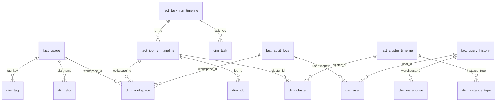

# Databricks Health Monitor - Comprehensive System Architecture

**Version:** 1.0  
**Last Updated:** January 2026  
**Status:** Phase 3 Complete, Phase 4-5 Planned

---

## Table of Contents

1. [Executive Summary](#executive-summary)
2. [System Overview](#system-overview)
3. [Architecture Principles](#architecture-principles)
4. [Technology Stack](#technology-stack)
5. [Data Architecture](#data-architecture)
6. [Implementation Layers](#implementation-layers)
7. [Agent Framework Architecture](#agent-framework-architecture)
8. [Frontend Application Architecture](#frontend-application-architecture)
9. [Integration Architecture](#integration-architecture)
10. [Deployment Architecture](#deployment-architecture)
11. [Security Architecture](#security-architecture)
12. [Performance & Scalability](#performance--scalability)
13. [Future Roadmap](#future-roadmap)
14. [References](#references)

---

## Executive Summary

The **Databricks Health Monitor** is a comprehensive platform observability solution that provides real-time monitoring, analytics, and AI-powered insights for Databricks workspaces. The system follows a medallion architecture pattern (Bronze → Silver → Gold) and implements a multi-layered semantic layer optimized for both human consumption and AI agent interaction.

### Key Capabilities

| Domain | Capabilities |
|--------|-------------|
| **Cost Intelligence** | DBU tracking, cost attribution, anomaly detection, optimization recommendations |
| **Performance Monitoring** | Job execution tracking, query performance, cluster utilization, bottleneck identification |
| **Security & Compliance** | Audit event tracking, access pattern analysis, anomaly detection, compliance reporting |
| **Reliability** | SLA tracking, uptime monitoring, failure prediction, incident response |
| **Data Quality** | Lakehouse monitoring integration, data freshness tracking, validation metrics |
| **MLOps** | Model performance tracking, drift detection, training pipeline monitoring |

### Architecture Highlights

- **Medallion Architecture**: Bronze (raw ingestion) → Silver (validated streaming) → Gold (analytics-ready)
- **Semantic Layer**: 50+ Table-Valued Functions (TVFs), 30+ Metric Views, 6 Agent-optimized Genie Spaces
- **ML Pipeline**: 15 predictive models for anomaly detection, cost forecasting, and failure prediction
- **Alerting Framework**: Config-driven SQL alerts with ML-powered thresholds
- **AI/BI Dashboards**: 12 production dashboards with 200+ visualizations
- **Agent Framework** (Planned): 7 specialized AI agents with orchestration layer
- **Frontend App** (Planned): Next.js 14+ app with Vercel AI SDK integration

---

## System Overview

### High-Level Architecture Diagram

```
┌─────────────────────────────────────────────────────────────────────────────────────────┐
│                                 PRESENTATION LAYER                                       │
│                                                                                          │
│  ┌──────────────────┐  ┌──────────────────┐  ┌──────────────────┐  ┌──────────────────┐│
│  │  Frontend App    │  │  Genie Spaces    │  │  AI/BI Dashboards│  │  SQL Alerts      ││
│  │  (Next.js 14+)   │  │  (6 Spaces)      │  │  (12 Dashboards) │  │  (56 Alerts)     ││
│  │  [Phase 5]       │  │  ✅ Deployed     │  │  ✅ Deployed     │  │  ✅ Deployed     ││
│  └──────────────────┘  └──────────────────┘  └──────────────────┘  └──────────────────┘│
└─────────────────────────────────────────────────────────────────────────────────────────┘
                                         │
                                         ▼
┌─────────────────────────────────────────────────────────────────────────────────────────┐
│                                   AGENT LAYER                                            │
│                                   [Phase 4 - Planned]                                    │
│                                                                                          │
│  ┌────────────────────────────────────────────────────────────────────────────────────┐ │
│  │                          Master Orchestrator Agent                                  │ │
│  │                     (Multi-agent coordination & routing)                           │ │
│  └────────────────────────────────────────────────────────────────────────────────────┘ │
│                                         │                                                │
│              ┌──────────────────────────┼──────────────────────────┐                    │
│              │                          │                          │                    │
│              ▼                          ▼                          ▼                    │
│  ┌────────────────────┐    ┌────────────────────┐    ┌────────────────────┐            │
│  │  Cost Agent        │    │  Security Agent    │    │  Performance Agent │            │
│  │  (Cost Analysis)   │    │  (Security & Audit)│    │  (Job Monitoring)  │            │
│  └────────────────────┘    └────────────────────┘    └────────────────────┘            │
│                                                                                          │
│  ┌────────────────────┐    ┌────────────────────┐    ┌────────────────────┐            │
│  │  Reliability Agent │    │  Data Quality Agent│    │  MLOps Agent       │            │
│  │  (SLA & Uptime)    │    │  (DQ Monitoring)   │    │  (Model Ops)       │            │
│  └────────────────────┘    └────────────────────┘    └────────────────────┘            │
└─────────────────────────────────────────────────────────────────────────────────────────┘
                                         │
                                         ▼
┌─────────────────────────────────────────────────────────────────────────────────────────┐
│                                 SEMANTIC LAYER                                           │
│                                 ✅ Deployed                                              │
│                                                                                          │
│  ┌────────────────────┐    ┌────────────────────┐    ┌────────────────────┐            │
│  │  Table-Valued      │    │  Metric Views      │    │  Genie Spaces      │            │
│  │  Functions (TVFs)  │    │  (30+ Views)       │    │  (6 Spaces)        │            │
│  │  (50+ Functions)   │    │                    │    │                    │            │
│  │                    │    │  • Cost Analytics  │    │  • Cost            │            │
│  │  Agent Domains:    │    │  • Job Performance │    │  • Security        │            │
│  │  • Cost (10 TVFs)  │    │  • Security Events │    │  • Performance     │            │
│  │  • Security (8)    │    │  • Reliability     │    │  • Reliability     │            │
│  │  • Performance (12)│    │  • Data Quality    │    │  • Quality         │            │
│  │  • Reliability (10)│    │  • ML Monitoring   │    │  • MLOps           │            │
│  │  • Quality (6)     │    │                    │    │                    │            │
│  │  • MLOps (4)       │    │                    │    │                    │            │
│  └────────────────────┘    └────────────────────┘    └────────────────────┘            │
└─────────────────────────────────────────────────────────────────────────────────────────┘
                                         │
                                         ▼
┌─────────────────────────────────────────────────────────────────────────────────────────┐
│                                   ML LAYER                                               │
│                                   ✅ Deployed                                            │
│                                                                                          │
│  ┌────────────────────────────────────────────────────────────────────────────────────┐ │
│  │                          MLflow Experiment Tracking                                 │ │
│  │                     (15 Models with Unity Catalog Registry)                        │ │
│  └────────────────────────────────────────────────────────────────────────────────────┘ │
│                                         │                                                │
│              ┌──────────────────────────┼──────────────────────────┐                    │
│              │                          │                          │                    │
│              ▼                          ▼                          ▼                    │
│  ┌────────────────────┐    ┌────────────────────┐    ┌────────────────────┐            │
│  │  Cost Models (5)   │    │  Performance (5)   │    │  Security (5)      │            │
│  │                    │    │                    │    │                    │            │
│  │  • Cost Anomaly    │    │  • Job Failure     │    │  • Access Anomaly  │            │
│  │  • Cost Forecaster │    │  • Duration Pred   │    │  • Breach Risk     │            │
│  │  • DBU Predictor   │    │  • Bottleneck Det  │    │  • User Behavior   │            │
│  │  • Budget Alert    │    │  • Resource Opt    │    │  • Threat Score    │            │
│  │  • Commitment Rec  │    │  • Query Optimizer │    │  • Anomaly Detector│            │
│  └────────────────────┘    └────────────────────┘    └────────────────────┘            │
│                                                                                          │
│  ┌────────────────────────────────────────────────────────────────────────────────────┐ │
│  │                    Model Serving Endpoints (Serverless)                            │ │
│  │  • Real-time inference with auto-scaling                                           │ │
│  │  • Unity Catalog lineage tracking                                                  │ │
│  └────────────────────────────────────────────────────────────────────────────────────┘ │
└─────────────────────────────────────────────────────────────────────────────────────────┘
                                         │
                                         ▼
┌─────────────────────────────────────────────────────────────────────────────────────────┐
│                              MONITORING & ALERTING LAYER                                 │
│                              ✅ Deployed                                                 │
│                                                                                          │
│  ┌────────────────────┐    ┌────────────────────┐    ┌────────────────────┐            │
│  │  Lakehouse         │    │  SQL Alerting      │    │  AI/BI Dashboards  │            │
│  │  Monitoring (12)   │    │  Framework (56)    │    │  (12 Dashboards)   │            │
│  │                    │    │                    │    │                    │            │
│  │  Custom Metrics:   │    │  Alert Domains:    │    │  Dashboard Domains:│            │
│  │  • 150+ Business   │    │  • Cost (8 alerts) │    │  • Cost (2)        │            │
│  │  • 80+ Technical   │    │  • Security (12)   │    │  • Security (2)    │            │
│  │  • 50+ Drift       │    │  • Performance (16)│    │  • Performance (3) │            │
│  │                    │    │  • Reliability (10)│    │  • Reliability (2) │            │
│  │  Output Tables:    │    │  • Quality (6)     │    │  • Quality (2)     │            │
│  │  • _profile_metrics│    │  • MLOps (4)       │    │  • MLOps (1)       │            │
│  │  • _drift_metrics  │    │                    │    │                    │            │
│  │  (Documented for   │    │  ML Thresholds:    │    │  Query Patterns:   │            │
│  │   Genie/LLM)       │    │  • Dynamic         │    │  • Gold layer refs │            │
│  │                    │    │  • Predictive      │    │  • System tables   │            │
│  └────────────────────┘    └────────────────────┘    └────────────────────┘            │
└─────────────────────────────────────────────────────────────────────────────────────────┘
                                         │
                                         ▼
┌─────────────────────────────────────────────────────────────────────────────────────────┐
│                                 GOLD LAYER (Analytics)                                   │
│                                 ✅ Deployed                                              │
│                                                                                          │
│  ┌────────────────────────────────────────────────────────────────────────────────────┐ │
│  │                        Unity Catalog Managed Tables (41)                           │ │
│  │                     PRIMARY KEY / FOREIGN KEY Constraints                          │ │
│  │                     Predictive Optimization Enabled                                │ │
│  └────────────────────────────────────────────────────────────────────────────────────┘ │
│                                         │                                                │
│              ┌──────────────────────────┼──────────────────────────┐                    │
│              │                          │                          │                    │
│              ▼                          ▼                          ▼                    │
│  ┌────────────────────┐    ┌────────────────────┐    ┌────────────────────┐            │
│  │  Fact Tables (12)  │    │  Dimension Tables  │    │  Summary Tables (5)│            │
│  │                    │    │  (SCD Type 2) (24) │    │                    │            │
│  │  • fact_usage      │    │                    │    │  • daily_summaries │            │
│  │  • fact_job_run    │    │  • dim_workspace   │    │  • weekly_rollups  │            │
│  │  • fact_query      │    │  • dim_cluster     │    │  • monthly_aggs    │            │
│  │  • fact_audit_log  │    │  • dim_user        │    │  • metric_snapshots│            │
│  │  • fact_pipeline   │    │  • dim_sku         │    │  • trend_analysis  │            │
│  │  • fact_notebook   │    │  • dim_job         │    │                    │            │
│  │  • ... (6 more)    │    │  • ... (18 more)   │    │                    │            │
│  └────────────────────┘    └────────────────────┘    └────────────────────┘            │
│                                                                                          │
│  Properties (All Tables):                                                               │
│  • delta.enableChangeDataFeed = true                                                    │
│  • delta.autoOptimize.optimizeWrite = true                                              │
│  • delta.autoOptimize.autoCompact = true                                                │
│  • CLUSTER BY AUTO (liquid clustering)                                                  │
│  • LLM-friendly COMMENT and column descriptions                                         │
│  • Unity Catalog tags (domain, layer, contains_pii)                                     │
└─────────────────────────────────────────────────────────────────────────────────────────┘
                                         │
                                         ▼
┌─────────────────────────────────────────────────────────────────────────────────────────┐
│                              SILVER LAYER (Validated Streaming)                          │
│                              ✅ Deployed                                                 │
│                                                                                          │
│  ┌────────────────────────────────────────────────────────────────────────────────────┐ │
│  │                      Delta Live Tables (DLT) Pipelines                             │ │
│  │                    Serverless, Photon-enabled, ADVANCED Edition                    │ │
│  └────────────────────────────────────────────────────────────────────────────────────┘ │
│                                         │                                                │
│              ┌──────────────────────────┼──────────────────────────┐                    │
│              │                          │                          │                    │
│              ▼                          ▼                          ▼                    │
│  ┌────────────────────┐    ┌────────────────────┐    ┌────────────────────┐            │
│  │  Streaming Tables  │    │  DLT Expectations  │    │  Quarantine Tables │            │
│  │  (30+ Tables)      │    │  (Data Quality)    │    │  (Error Capture)   │            │
│  │                    │    │                    │    │                    │            │
│  │  Features:         │    │  • Valid checks    │    │  • Invalid records │            │
│  │  • Incremental     │    │  • Reasonable      │    │  • DQ violations   │            │
│  │  • Deduplication   │    │  • Reference int   │    │  • Schema errors   │            │
│  │  • Type validation │    │  • Business rules  │    │  • Transformation  │            │
│  │  • CDF enabled     │    │  • Drop/quarantine │    │    failures        │            │
│  └────────────────────┘    └────────────────────┘    └────────────────────┘            │
└─────────────────────────────────────────────────────────────────────────────────────────┘
                                         │
                                         ▼
┌─────────────────────────────────────────────────────────────────────────────────────────┐
│                                BRONZE LAYER (Raw Ingestion)                              │
│                                ✅ Deployed                                               │
│                                                                                          │
│  ┌────────────────────────────────────────────────────────────────────────────────────┐ │
│  │                          System Tables as Source                                    │ │
│  │                    (Read-only, Auto-updated by Databricks)                         │ │
│  └────────────────────────────────────────────────────────────────────────────────────┘ │
│                                         │                                                │
│              ┌──────────────────────────┼──────────────────────────┐                    │
│              │                          │                          │                    │
│              ▼                          ▼                          ▼                    │
│  ┌────────────────────┐    ┌────────────────────┐    ┌────────────────────┐            │
│  │  Billing Domain    │    │  LakeFlow Domain   │    │  Governance Domain │            │
│  │                    │    │                    │    │                    │            │
│  │  • billable_usage  │    │  • job_run_timeline│    │  • audit_logs      │            │
│  │  • list_prices     │    │  • task_run_timeline│    │  • lineage         │            │
│  │  • usage           │    │  • cluster_timeline│    │  • table_lineage   │            │
│  │                    │    │  • pipeline_events │    │  • column_lineage  │            │
│  └────────────────────┘    └────────────────────┘    └────────────────────┘            │
│                                                                                          │
│  ┌────────────────────┐    ┌────────────────────┐    ┌────────────────────┐            │
│  │  Compute Domain    │    │  Serverless Domain │    │  Access Domain     │            │
│  │                    │    │                    │    │                    │            │
│  │  • cluster_events  │    │  • query_history   │    │  • account_usage   │            │
│  │  • cluster_spec    │    │  • warehouse_events│    │  • access          │            │
│  └────────────────────┘    └────────────────────┘    └────────────────────┘            │
└─────────────────────────────────────────────────────────────────────────────────────────┘
```

---

## Architecture Principles

### 1. Medallion Architecture

**Bronze → Silver → Gold** pattern for data quality and separation of concerns:

- **Bronze**: Raw system table ingestion, minimal transformation
- **Silver**: Validated streaming with DLT expectations, incremental processing
- **Gold**: Analytics-ready business entities with relational integrity

### 2. Semantic Layer First

All analytics consumers (dashboards, agents, Genie) query through semantic abstractions:

- **Table-Valued Functions (TVFs)**: Parameterized SQL functions for complex queries
- **Metric Views**: Pre-defined metrics with semantic metadata
- **Genie Spaces**: Natural language interface with comprehensive documentation

### 3. AI-Native Design

Every artifact optimized for both human and LLM consumption:

- **LLM-friendly descriptions**: Comprehensive comments on tables, columns, functions
- **Structured metadata**: Tags, domains, lineage for agent reasoning
- **Natural language optimization**: Synonyms, display names, context for Genie

### 4. Unity Catalog Everywhere

Full governance integration:

- **Managed tables**: All data in Unity Catalog
- **Constraints**: Primary/Foreign keys for relational integrity
- **Lineage**: Automatic tracking from Bronze to presentation
- **Access control**: Fine-grained permissions via Unity Catalog

### 5. Serverless First

Minimize operational overhead:

- **Serverless SQL**: All queries via serverless warehouses
- **Serverless DLT**: Silver layer pipelines
- **Serverless Jobs**: All orchestration via serverless compute
- **Model Serving**: Serverless endpoints for ML inference

### 6. Config-Driven Everything

Infrastructure as code with zero hardcoding:

- **Databricks Asset Bundles (DABs)**: All resources defined in YAML
- **YAML-driven schemas**: Gold tables created from YAML definitions
- **Alert configurations**: SQL alerts defined via YAML
- **ML configurations**: Training parameters in config files

### 7. Observability by Default

Built-in monitoring at every layer:

- **Lakehouse Monitoring**: Data quality tracking on all Gold tables
- **DLT Expectations**: Quality gates in Silver layer
- **Job monitoring**: Automatic tracking via system tables
- **ML monitoring**: Model drift and performance tracking

---

## Technology Stack

### Data Platform

| Component | Technology | Purpose |
|-----------|------------|---------|
| **Data Lakehouse** | Databricks Runtime 15.4+ | Unified analytics platform |
| **Storage** | Delta Lake | ACID transactions, time travel, CDF |
| **Catalog** | Unity Catalog | Governance, lineage, access control |
| **Compute** | Serverless SQL/Jobs | Auto-scaling, cost-optimized execution |
| **Streaming** | Delta Live Tables (DLT) | Incremental ETL with quality gates |
| **Optimization** | Predictive Optimization | Automatic indexing and compaction |
| **Clustering** | Liquid Clustering (AUTO) | Adaptive data layout optimization |

### ML Platform

| Component | Technology | Purpose |
|-----------|------------|---------|
| **Tracking** | MLflow 3.1+ | Experiment tracking, model registry |
| **Training** | Databricks Runtime ML | Distributed training frameworks |
| **Serving** | Model Serving (Serverless) | Real-time inference endpoints |
| **Registry** | Unity Catalog Model Registry | Centralized model versioning |
| **Frameworks** | scikit-learn, XGBoost, Prophet | Predictive modeling |

### Semantic Layer

| Component | Technology | Purpose |
|-----------|------------|---------|
| **TVFs** | SQL Table-Valued Functions | Reusable query logic |
| **Metric Views** | Databricks Metric Views v1.1 | Semantic metrics with YAML |
| **Genie** | Databricks Genie Spaces | Natural language SQL interface |
| **Documentation** | Structured comments + tags | LLM-optimized metadata |

### Monitoring & Alerting

| Component | Technology | Purpose |
|-----------|------------|---------|
| **Data Quality** | Lakehouse Monitoring | Custom metrics + drift detection |
| **Alerts** | SQL Alerts V2 API | Config-driven alerting |
| **Dashboards** | Lakeview AI/BI | Interactive visualizations |
| **Thresholds** | ML-powered dynamic thresholds | Adaptive alert boundaries |

### Frontend (Planned)

| Component | Technology | Purpose |
|-----------|------------|---------|
| **Framework** | Next.js 14+ (App Router) | React server components |
| **Language** | TypeScript | Type-safe development |
| **AI SDK** | Vercel AI SDK | Streaming chat, tool calling |
| **Styling** | Tailwind CSS | Utility-first styling |
| **Charts** | Recharts | React-native visualizations |
| **Database** | Lakebase (PostgreSQL) | OLTP app state storage |
| **Deployment** | Databricks Apps | Native platform deployment |

### Orchestration

| Component | Technology | Purpose |
|-----------|------------|---------|
| **Infrastructure** | Databricks Asset Bundles (DABs) | Infrastructure as code |
| **Jobs** | Workflows (Serverless) | Task orchestration |
| **Pipelines** | DLT Pipelines | Streaming data pipelines |
| **CI/CD** | GitHub Actions | Automated deployment |

---

## Data Architecture

### Domain-Driven Design

The system organizes data into 7 core domains:

```
┌────────────────────────────────────────────────────────────────────────┐
│                            DOMAIN STRUCTURE                            │
└────────────────────────────────────────────────────────────────────────┘

1. BILLING DOMAIN (Cost Intelligence)
   └─ fact_usage, fact_list_prices
   └─ dim_sku, dim_tag
   └─ 10 TVFs, 5 Metric Views, 1 Genie Space
   └─ 5 ML Models (cost forecasting, anomaly detection)

2. LAKEFLOW DOMAIN (Job & Pipeline Operations)
   └─ fact_job_run_timeline, fact_task_run_timeline, fact_pipeline_events
   └─ dim_job, dim_pipeline, dim_task
   └─ 12 TVFs, 6 Metric Views, 1 Genie Space
   └─ 5 ML Models (failure prediction, duration forecasting)

3. GOVERNANCE DOMAIN (Security & Compliance)
   └─ fact_audit_logs, fact_table_lineage, fact_column_lineage
   └─ dim_user, dim_service_principal, dim_table
   └─ 8 TVFs, 4 Metric Views, 1 Genie Space
   └─ 5 ML Models (anomaly detection, risk scoring)

4. COMPUTE DOMAIN (Cluster & Resource Management)
   └─ fact_cluster_timeline, fact_cluster_events
   └─ dim_cluster, dim_instance_type
   └─ 6 TVFs, 3 Metric Views

5. SERVERLESS DOMAIN (SQL & Warehouse Operations)
   └─ fact_query_history, fact_warehouse_events
   └─ dim_warehouse, dim_endpoint
   └─ 8 TVFs, 5 Metric Views, 1 Genie Space

6. ACCESS DOMAIN (Identity & Permissions)
   └─ fact_account_usage, fact_access_events
   └─ dim_identity, dim_permission
   └─ 4 TVFs, 2 Metric Views, 1 Genie Space

7. MONITORING DOMAIN (Data Quality & Health)
   └─ fact_table_metrics, fact_data_quality
   └─ dim_monitor, dim_expectation
   └─ 2 TVFs, 5 Metric Views, 1 Genie Space
```

### Entity Relationship Overview

**Gold Layer Relational Model** (41 Tables):



### Data Lineage Flow

```
System Tables (Bronze)
    │
    ├─ Read via Python/SQL jobs
    │
    ▼
DLT Pipelines (Silver)
    │
    ├─ Incremental streaming with expectations
    ├─ Deduplication on business keys
    ├─ Type validation and transformations
    │
    ▼
Gold Tables (Merge Jobs)
    │
    ├─ SCD Type 2 for dimensions
    ├─ Aggregation for facts
    ├─ Constraint validation
    │
    ├────────────┬────────────┬────────────┐
    │            │            │            │
    ▼            ▼            ▼            ▼
  TVFs    Metric Views    ML Features   Lakehouse
                                         Monitoring
    │            │            │            │
    └────────────┴────────────┴────────────┘
                     │
                     ▼
           Presentation Layer
        (Genie, Dashboards, Agents, Frontend)
```

---

## Implementation Layers

### Layer 1: Bronze (Data Ingestion)

**Status:** ✅ Deployed  
**Purpose:** Raw system table snapshot with minimal transformation

#### Architecture

- **Source**: Databricks System Tables (read-only)
- **Compute**: Serverless Python jobs
- **Storage**: Unity Catalog managed tables
- **Frequency**: Daily scheduled jobs

#### Key Tables

| Table | Source | Records/Day | Purpose |
|-------|--------|-------------|---------|
| `bronze_billable_usage` | `system.billing.usage` | ~500K | DBU consumption tracking |
| `bronze_job_run_timeline` | `system.lakeflow.job_run_timeline` | ~50K | Job execution history |
| `bronze_audit_logs` | `system.access.audit` | ~1M | Security event tracking |
| `bronze_query_history` | `system.query.history` | ~100K | SQL warehouse queries |

#### Properties

```sql
TBLPROPERTIES (
    'delta.enableChangeDataFeed' = 'true',
    'delta.autoOptimize.optimizeWrite' = 'true',
    'delta.autoOptimize.autoCompact' = 'true',
    'layer' = 'bronze',
    'source_system' = 'databricks_system_tables'
)
```

---

### Layer 2: Silver (Validated Streaming)

**Status:** ✅ Deployed  
**Purpose:** Validated, deduplicated, streaming-ready data with DLT expectations

#### Architecture

- **Framework**: Delta Live Tables (DLT)
- **Edition**: ADVANCED (for expectations and SCD support)
- **Compute**: Serverless DLT with Photon
- **Mode**: Continuous streaming
- **Quality**: Expectations with quarantine pattern

#### DLT Pipeline Configuration

```yaml
resources:
  pipelines:
    silver_dlt_pipeline:
      name: "[${bundle.target}] Silver Layer Pipeline"
      catalog: ${var.catalog}
      schema: ${var.silver_schema}
      serverless: true
      photon: true
      channel: CURRENT
      edition: ADVANCED
      development: false
      continuous: true
```

#### Data Quality Pattern

```python
@dlt.table(
    name="silver_job_runs",
    comment="Validated job execution records",
    table_properties={
        "quality": "silver",
        "delta.enableChangeDataFeed": "true",
        "delta.enableRowTracking": "true"
    },
    cluster_by_auto=True
)
@dlt.expect_or_drop("valid_duration", "run_duration_ms >= 0")
@dlt.expect("reasonable_duration", "run_duration_ms < 86400000")  # < 24 hours
@dlt.expect("valid_job_id", "job_id IS NOT NULL")
def silver_job_runs():
    return (
        dlt.read_stream("bronze_job_run_timeline")
        .dropDuplicates(["run_id", "update_time"])
        .withColumn("processed_timestamp", current_timestamp())
    )
```

#### Key Tables (30+)

| Domain | Table | Expectations | Purpose |
|--------|-------|--------------|---------|
| Billing | `silver_usage` | 5 | Validated DBU consumption |
| LakeFlow | `silver_job_runs` | 8 | Job execution tracking |
| LakeFlow | `silver_task_runs` | 6 | Task-level execution |
| Governance | `silver_audit_logs` | 7 | Security events |
| Serverless | `silver_queries` | 9 | SQL query history |

---

### Layer 3: Gold (Analytics-Ready)

**Status:** ✅ Deployed  
**Purpose:** Business-level entities with relational integrity and optimizations

#### Architecture

- **Compute**: Serverless Python merge jobs
- **Pattern**: Delta MERGE for upserts
- **Dimensions**: SCD Type 2 (is_current flag)
- **Facts**: Pre-aggregated at appropriate grain
- **Constraints**: PRIMARY KEY / FOREIGN KEY (NOT ENFORCED)

#### YAML-Driven Schema Management

Gold tables are created dynamically from YAML schema definitions:

```yaml
# Example: gold_layer_design/yaml/billing/fact_usage.yaml
table_name: fact_usage
comment: Daily DBU usage fact table...
columns:
  - name: usage_date
    type: DATE
    nullable: false
    comment: Date of DBU consumption
  - name: workspace_id
    type: STRING
    nullable: false
    comment: Workspace identifier
  - name: total_dbu
    type: DECIMAL(18,2)
    nullable: false
    comment: Total DBU consumed
primary_key:
  - usage_date
  - workspace_id
  - sku_name
foreign_keys:
  - name: fk_workspace
    columns: [workspace_id]
    references:
      table: dim_workspace
      columns: [workspace_id]
```

#### Table Properties

```sql
TBLPROPERTIES (
    'delta.enableChangeDataFeed' = 'true',
    'delta.enableRowTracking' = 'true',
    'delta.enableDeletionVectors' = 'true',
    'delta.autoOptimize.autoCompact' = 'true',
    'delta.autoOptimize.optimizeWrite' = 'true',
    'layer' = 'gold',
    'source_layer' = 'silver',
    'domain' = 'billing',
    'entity_type' = 'fact'
)
CLUSTER BY AUTO
```

#### Key Tables (41)

**Fact Tables (12):**
- `fact_usage` - Daily DBU usage by workspace/SKU
- `fact_job_run_timeline` - Job execution metrics
- `fact_task_run_timeline` - Task-level execution
- `fact_audit_logs` - Security audit events
- `fact_query_history` - SQL query performance
- `fact_pipeline_events` - DLT pipeline events
- ... (6 more)

**Dimension Tables (24):**
- `dim_workspace` - Workspace attributes (SCD2)
- `dim_sku` - SKU catalog with pricing
- `dim_job` - Job definitions (SCD2)
- `dim_cluster` - Cluster configurations (SCD2)
- `dim_user` - User profiles (SCD2)
- ... (19 more)

**Summary Tables (5):**
- `daily_cost_summary` - Pre-aggregated daily costs
- `weekly_job_summary` - Weekly job performance
- `monthly_security_summary` - Monthly security metrics
- ... (2 more)

---

### Layer 4: Semantic Layer

**Status:** ✅ Deployed  
**Purpose:** Natural language and AI-optimized query interface

#### 4.1 Table-Valued Functions (TVFs)

**Count:** 50+ functions across 6 domains

**Pattern:**
```sql
CREATE OR REPLACE FUNCTION catalog.schema.get_daily_cost_summary(
    start_date DATE,
    end_date DATE,
    workspace_filter STRING
)
RETURNS TABLE (
    usage_date DATE,
    workspace_name STRING,
    total_dbu DECIMAL(18,2),
    total_cost_usd DECIMAL(18,2)
)
COMMENT 'Returns daily cost summary for specified date range...
BEST FOR: "Daily cost breakdown" | "Cost by workspace over time"
NOT FOR: Real-time cost (use cost_analytics metric view)'
RETURN
    SELECT 
        usage_date,
        workspace_name,
        SUM(usage_quantity) as total_dbu,
        SUM(usage_quantity * list_price_usd) as total_cost_usd
    FROM ${catalog}.${schema}.fact_usage
    WHERE usage_date BETWEEN start_date AND end_date
        AND (workspace_filter IS NULL OR workspace_name LIKE workspace_filter)
    GROUP BY usage_date, workspace_name
    ORDER BY usage_date DESC, total_cost_usd DESC;
```

**Key TVFs by Domain:**

| Domain | TVF Count | Examples |
|--------|-----------|----------|
| Cost | 10 | `get_daily_cost_summary`, `get_cost_anomalies`, `get_top_cost_drivers` |
| Security | 8 | `get_security_events`, `get_failed_access_attempts`, `get_permission_changes` |
| Performance | 12 | `get_failed_jobs`, `get_slow_queries`, `get_resource_bottlenecks` |
| Reliability | 10 | `get_sla_breaches`, `get_pipeline_health`, `get_uptime_metrics` |
| Quality | 6 | `get_data_quality_summary`, `get_freshness_violations` |
| MLOps | 4 | `get_model_performance`, `get_drift_metrics` |

#### 4.2 Metric Views

**Count:** 30+ views with semantic metadata

**Pattern:**
```yaml
# cost_analytics.yaml
version: "1.1"
comment: >
  PURPOSE: Comprehensive cost analytics for Databricks billing.
  BEST FOR: Total spend by workspace | Cost trend | SKU breakdown
  DIMENSIONS: usage_date, workspace_name, sku_name, tag_team
  MEASURES: total_cost, total_dbu, cost_7d, cost_30d
  
source: ${catalog}.${schema}.fact_usage

joins:
  - name: dim_workspace
    source: ${catalog}.${schema}.dim_workspace
    'on': source.workspace_id = dim_workspace.workspace_id 
          AND dim_workspace.is_current = true

dimensions:
  - name: usage_date
    expr: source.usage_date
    comment: Date of DBU consumption for time-based analysis
    display_name: Usage Date
    synonyms: [date, day, usage day]

measures:
  - name: total_cost
    expr: SUM(source.usage_quantity * source.list_price_usd)
    comment: Total cost in USD (list price, not actual billed amount)
    display_name: Total Cost
    format:
      type: currency
      currency_code: USD
      decimal_places:
        type: exact
        places: 2
      abbreviation: compact
    synonyms: [cost, spend, dollars]
```

**Key Metric Views by Domain:**

| Domain | View Count | Examples |
|--------|------------|----------|
| Cost | 5 | `cost_analytics`, `cost_by_workspace`, `sku_utilization` |
| Performance | 6 | `job_performance`, `query_performance`, `cluster_utilization` |
| Security | 4 | `security_events`, `access_patterns`, `compliance_metrics` |
| Reliability | 5 | `sla_compliance`, `uptime_metrics`, `incident_tracking` |
| Quality | 5 | `data_quality`, `freshness_metrics`, `validation_results` |
| MLOps | 5 | `model_performance`, `drift_metrics`, `training_metrics` |

#### 4.3 Genie Spaces

**Count:** 6 domain-specific spaces

**Configuration:**

| Genie Space | Tables | TVFs | Metric Views | Purpose |
|-------------|--------|------|--------------|---------|
| Cost Intelligence | 8 | 10 | 5 | Cost analysis and optimization |
| Security & Compliance | 6 | 8 | 4 | Security monitoring and audit |
| Performance Monitoring | 12 | 12 | 6 | Job and query optimization |
| Reliability Management | 10 | 10 | 5 | SLA tracking and incident response |
| Data Quality | 8 | 6 | 5 | DQ monitoring and validation |
| MLOps | 6 | 4 | 5 | ML model operations |

**Agent Instructions:** Each Genie Space includes comprehensive instructions (500-1000 lines) with:
- Asset descriptions and usage patterns
- Example questions (30-50 per space)
- Query patterns and best practices
- Redirect guidance to other assets

---

### Layer 5: ML Layer

**Status:** ✅ Deployed  
**Purpose:** Predictive models for anomaly detection, forecasting, and optimization

#### Architecture

- **Tracking**: MLflow 3.1+ with Unity Catalog integration
- **Experiments**: Organized by domain (`/Shared/health_monitor_<domain>_ml`)
- **Registry**: Unity Catalog Model Registry
- **Serving**: Serverless model endpoints
- **Features**: Gold layer tables as feature sources

#### ML Model Catalog (15 Models)

**Cost Domain (5 Models):**

| Model | Type | Purpose | Endpoint |
|-------|------|---------|----------|
| `cost_anomaly_detector` | Isolation Forest | Detect unusual spending patterns | ✅ Serving |
| `cost_forecaster` | Prophet | 30-day cost forecasting | ✅ Serving |
| `dbu_demand_predictor` | Random Forest | Predict future DBU needs | ✅ Serving |
| `budget_alert_model` | Threshold ML | Dynamic budget alerting | ✅ Serving |
| `commitment_recommender` | Optimization | Reserved capacity recommendations | ⚙️ Batch |

**Performance Domain (5 Models):**

| Model | Type | Purpose | Endpoint |
|-------|------|---------|----------|
| `job_failure_predictor` | XGBoost | Predict job failures before runs | ✅ Serving |
| `duration_predictor` | Gradient Boost | Predict job runtime | ✅ Serving |
| `bottleneck_detector` | Clustering | Identify resource bottlenecks | ⚙️ Batch |
| `resource_optimizer` | Reinforcement | Cluster size optimization | ⚙️ Batch |
| `query_optimizer` | Neural Network | Query rewrite recommendations | ✅ Serving |

**Security Domain (5 Models):**

| Model | Type | Purpose | Endpoint |
|-------|------|---------|----------|
| `access_anomaly_detector` | Autoencoder | Unusual access patterns | ✅ Serving |
| `breach_risk_scorer` | Classification | Security risk scoring | ✅ Serving |
| `user_behavior_analyzer` | LSTM | Behavioral anomaly detection | ⚙️ Batch |
| `threat_score_model` | Ensemble | Threat priority scoring | ✅ Serving |
| `compliance_predictor` | Binary Classification | Compliance violation prediction | ⚙️ Batch |

#### MLflow Integration Pattern

```python
# Training script pattern
import mlflow
from databricks import feature_engineering

# Set experiment
mlflow.set_experiment("/Shared/health_monitor_cost_ml")

with mlflow.start_run(run_name="cost_anomaly_v1.2") as run:
    # Load features from Gold layer
    features = spark.table("catalog.gold.cost_features")
    
    # Log dataset
    mlflow.log_input(
        mlflow.data.from_spark(features, table_name="cost_features"),
        context="training"
    )
    
    # Train model
    model = IsolationForest(**params)
    model.fit(X_train)
    
    # Log model to Unity Catalog
    mlflow.sklearn.log_model(
        model,
        "model",
        registered_model_name="catalog.gold.cost_anomaly_detector",
        signature=signature
    )
    
    # Log metrics
    mlflow.log_metrics({
        "f1_score": f1,
        "precision": precision,
        "recall": recall
    })
```

---

### Layer 6: Monitoring & Alerting

**Status:** ✅ Deployed  
**Purpose:** Real-time data quality monitoring and proactive alerting

#### 6.1 Lakehouse Monitoring

**Coverage:** 12 monitors across key Gold tables

**Custom Metrics:** 280+ metrics
- Business metrics: 150+ (revenue, KPIs, health scores)
- Technical metrics: 80+ (row counts, nulls, duplicates)
- Drift metrics: 50+ (distribution shifts, anomalies)

**Pattern:**
```python
from databricks.sdk import WorkspaceClient
from databricks.sdk.service.catalog import MonitorInferenceLog

w = WorkspaceClient()

# Create monitor with custom metrics
info = w.quality_monitors.create(
    table_name=f"{catalog}.{schema}.fact_usage",
    assets_dir=f"/Workspace/Users/{user}/lakehouse_monitoring",
    output_schema_name=f"{catalog}.{schema}",
    inference_log=MonitorInferenceLog(
        granularities=["1 day"],
        model_id_col="model_id",
        prediction_col="prediction",
        label_col="actual"
    ),
    custom_metrics=[
        # Business metric
        MonitorMetric(
            type=MonitorMetricType.AGGREGATE,
            input_columns=[":table"],
            name="total_dbu_sum",
            definition="SUM(total_dbu)",
            output_data_type="double"
        ),
        # Drift metric
        MonitorMetric(
            type=MonitorMetricType.DRIFT,
            input_columns=["total_dbu"],
            name="dbu_distribution_drift",
            definition="ks_test"
        )
    ]
)
```

**Output Tables:**
- `{table_name}_profile_metrics` - Custom aggregated metrics
- `{table_name}_drift_metrics` - Statistical drift detection

**Genie Integration:**
All output tables documented with table/column comments for natural language queries.

#### 6.2 SQL Alerting Framework

**Count:** 56 alerts across 6 domains

**Architecture:**
- **Definition**: YAML configuration files
- **Deployment**: REST API (SQL Alerts V2)
- **Evaluation**: Scheduled SQL queries
- **Thresholds**: ML-powered dynamic thresholds
- **Delivery**: Email, Slack, PagerDuty

**Alert Configuration Pattern:**
```yaml
# cost_spike_alert.yaml
alert:
  display_name: "[COST] Daily DBU Spike Detected"
  query_text: |
    SELECT 
      usage_date,
      workspace_name,
      total_dbu,
      avg_dbu_7d,
      (total_dbu - avg_dbu_7d) / avg_dbu_7d * 100 as spike_pct
    FROM (
      SELECT 
        usage_date,
        workspace_name,
        SUM(usage_quantity) as total_dbu,
        AVG(SUM(usage_quantity)) OVER (
          PARTITION BY workspace_name 
          ORDER BY usage_date 
          ROWS BETWEEN 7 PRECEDING AND 1 PRECEDING
        ) as avg_dbu_7d
      FROM ${catalog}.${schema}.fact_usage
      WHERE usage_date = current_date()
      GROUP BY usage_date, workspace_name
    )
    WHERE spike_pct > 50
  
  evaluation:
    condition:
      op: GREATER_THAN
      threshold: 0  # Any rows = alert
    
  notification:
    emails:
      - cost-team@company.com
    subject: "DBU Spike Alert: {{spike_pct}}% increase in {{workspace_name}}"
```

**Alert Domains:**

| Domain | Alert Count | Examples |
|--------|-------------|----------|
| Cost | 8 | DBU spike, budget exceeded, anomaly detected |
| Security | 12 | Failed auth, permission change, anomaly |
| Performance | 16 | Job failure, SLA breach, slow query |
| Reliability | 10 | Pipeline failure, data freshness |
| Quality | 6 | DQ violation, expectation failure |
| MLOps | 4 | Model drift, performance degradation |

#### 6.3 AI/BI Dashboards

**Count:** 12 dashboards with 200+ visualizations

**Architecture:**
- **Platform**: Lakeview AI/BI
- **Queries**: Metric Views + TVFs (no direct Gold layer access)
- **Refresh**: Real-time (serverless SQL)
- **Sharing**: Workspace-level permissions

**Dashboard Catalog:**

| Domain | Dashboard Count | Key Visualizations |
|--------|-----------------|-------------------|
| Cost | 2 | Cost trend, SKU breakdown, workspace ranking, anomaly detection |
| Security | 2 | Event timeline, failed auth, user activity, risk scores |
| Performance | 3 | Job success rate, duration trends, failure analysis, resource utilization |
| Reliability | 2 | SLA compliance, uptime metrics, incident timeline |
| Quality | 2 | DQ summary, expectation failures, freshness metrics |
| MLOps | 1 | Model performance, drift metrics, training history |

---

## Agent Framework Architecture

**Status:** 📋 Planned (Phase 4)  
**Purpose:** AI-powered conversational interface with specialized domain agents

### Architecture Overview

```
┌─────────────────────────────────────────────────────────────────────┐
│                      AGENT ORCHESTRATION LAYER                       │
│                                                                      │
│  ┌────────────────────────────────────────────────────────────────┐ │
│  │             Master Orchestrator Agent                          │ │
│  │                                                                │ │
│  │  Responsibilities:                                             │ │
│  │  • Query understanding and intent classification              │ │
│  │  • Agent selection and routing                                │ │
│  │  • Multi-agent coordination                                   │ │
│  │  • Response synthesis and formatting                          │ │
│  │  • Context management across conversations                    │ │
│  └────────────────────────────────────────────────────────────────┘ │
│                               │                                      │
│                ┌──────────────┼──────────────┐                      │
│                │              │              │                      │
└────────────────┼──────────────┼──────────────┼──────────────────────┘
                 │              │              │
                 ▼              ▼              ▼
┌────────────────────────────────────────────────────────────────────┐
│                      SPECIALIZED AGENTS                             │
│                                                                     │
│  ┌──────────────┐  ┌──────────────┐  ┌──────────────┐             │
│  │ Cost Agent   │  │ Security     │  │ Performance  │             │
│  │              │  │ Agent        │  │ Agent        │             │
│  │ Tools:       │  │              │  │              │             │
│  │ • 10 TVFs    │  │ Tools:       │  │ Tools:       │             │
│  │ • 5 MViews   │  │ • 8 TVFs     │  │ • 12 TVFs    │             │
│  │ • 5 ML Models│  │ • 4 MViews   │  │ • 6 MViews   │             │
│  │ • Genie Space│  │ • 5 ML Models│  │ • 5 ML Models│             │
│  └──────────────┘  └──────────────┘  └──────────────┘             │
│                                                                     │
│  ┌──────────────┐  ┌──────────────┐  ┌──────────────┐             │
│  │ Reliability  │  │ Data Quality │  │ MLOps Agent  │             │
│  │ Agent        │  │ Agent        │  │              │             │
│  │              │  │              │  │ Tools:       │             │
│  │ Tools:       │  │ Tools:       │  │ • 4 TVFs     │             │
│  │ • 10 TVFs    │  │ • 6 TVFs     │  │ • 5 MViews   │             │
│  │ • 5 MViews   │  │ • 5 MViews   │  │ • 15 Models  │             │
│  │ • Genie Space│  │ • Monitors   │  │ • Experiments│             │
│  └──────────────┘  └──────────────┘  └──────────────┘             │
└────────────────────────────────────────────────────────────────────┘
                              │
                              ▼
┌─────────────────────────────────────────────────────────────────────┐
│                       TOOL INTEGRATION LAYER                         │
│                                                                      │
│  ┌────────────────┐  ┌────────────────┐  ┌────────────────┐        │
│  │ SQL Executor   │  │ ML Inference   │  │ Genie Query    │        │
│  │ (TVFs/MViews)  │  │ (Model Serving)│  │ (NL → SQL)     │        │
│  └────────────────┘  └────────────────┘  └────────────────┘        │
└─────────────────────────────────────────────────────────────────────┘
```

### Agent Specifications

#### 1. Master Orchestrator Agent

**Model:** Foundation LLM (GPT-4, Claude 3.5, or Databricks DBRX)

**Responsibilities:**
- Parse user questions and extract intent
- Classify queries into domain categories
- Route to appropriate specialized agent(s)
- Coordinate multi-agent responses
- Synthesize final response with citations

**System Prompt:**
```
You are the Master Orchestrator for the Databricks Health Monitor. 
Your role is to:
1. Understand user questions about Databricks platform health
2. Route queries to specialized agents (Cost, Security, Performance, Reliability, Quality, MLOps)
3. Coordinate multi-agent responses when queries span domains
4. Provide synthesized answers with clear attribution

Available Agents:
- Cost Agent: DBU usage, cost analysis, optimization
- Security Agent: Audit events, access patterns, compliance
- Performance Agent: Job failures, query performance, bottlenecks
- Reliability Agent: SLA tracking, uptime, incident management
- Data Quality Agent: DQ monitoring, freshness, validation
- MLOps Agent: Model performance, drift, training pipelines
```

**Tool Schema:**
```json
{
  "name": "route_to_agent",
  "description": "Route query to specialized agent",
  "parameters": {
    "type": "object",
    "properties": {
      "agent": {
        "type": "string",
        "enum": ["cost", "security", "performance", "reliability", "quality", "mlops"]
      },
      "query": {
        "type": "string",
        "description": "Reformulated query for the agent"
      },
      "context": {
        "type": "object",
        "description": "Additional context (date ranges, filters)"
      }
    }
  }
}
```

#### 2. Cost Agent

**Purpose:** Cost analysis, optimization, and forecasting

**Tools (20 total):**
- **TVFs (10):** `get_daily_cost_summary`, `get_cost_anomalies`, `get_top_cost_drivers`, `get_workspace_cost_trend`, ...
- **Metric Views (5):** `cost_analytics`, `sku_utilization`, `workspace_cost_comparison`, ...
- **ML Models (5):** Cost anomaly detector, cost forecaster, DBU predictor, budget alerter, commitment recommender

**Capabilities:**
- "What are my top cost drivers this month?"
- "Identify any cost anomalies in the past 7 days"
- "Forecast DBU usage for next 30 days"
- "Which workspaces are trending up in cost?"
- "Recommend reserved capacity commitments"

**System Prompt:**
```
You are the Cost Intelligence Agent for Databricks Health Monitor.
Your expertise: DBU consumption, cost attribution, optimization, forecasting.

Use your tools to:
- Query current and historical cost data
- Identify cost spikes and anomalies
- Predict future costs
- Recommend optimization strategies

Always provide:
- Quantified cost impact ($USD and DBU)
- Time ranges for context
- Actionable recommendations
- Links to relevant dashboards
```

#### 3. Security Agent

**Purpose:** Security monitoring, compliance, and threat detection

**Tools (17 total):**
- **TVFs (8):** `get_security_events`, `get_failed_access_attempts`, `get_permission_changes`, ...
- **Metric Views (4):** `security_events`, `access_patterns`, `compliance_metrics`, ...
- **ML Models (5):** Access anomaly detector, breach risk scorer, user behavior analyzer, threat scorer, compliance predictor

**Capabilities:**
- "Show failed authentication attempts in the last 24 hours"
- "Identify unusual access patterns"
- "List recent permission changes for admin users"
- "Calculate security risk score for workspace X"
- "Detect potential compliance violations"

#### 4. Performance Agent

**Purpose:** Job monitoring, query optimization, and resource management

**Tools (23 total):**
- **TVFs (12):** `get_failed_jobs`, `get_slow_queries`, `get_resource_bottlenecks`, ...
- **Metric Views (6):** `job_performance`, `query_performance`, `cluster_utilization`, ...
- **ML Models (5):** Job failure predictor, duration predictor, bottleneck detector, resource optimizer, query optimizer

**Capabilities:**
- "List failed jobs in the past 24 hours"
- "What are the slowest queries this week?"
- "Predict which jobs are at risk of failure"
- "Identify resource bottlenecks"
- "Recommend cluster optimizations"

#### 5. Reliability Agent

**Purpose:** SLA tracking, uptime monitoring, and incident management

**Tools (15 total):**
- **TVFs (10):** `get_sla_breaches`, `get_pipeline_health`, `get_uptime_metrics`, ...
- **Metric Views (5):** `sla_compliance`, `uptime_metrics`, `incident_tracking`, ...

**Capabilities:**
- "Check SLA compliance for critical jobs"
- "Show pipeline health status"
- "Calculate uptime for the past month"
- "List recent incidents and resolution times"

#### 6. Data Quality Agent

**Purpose:** Data quality monitoring and validation

**Tools (11 total):**
- **TVFs (6):** `get_data_quality_summary`, `get_freshness_violations`, ...
- **Metric Views (5):** `data_quality`, `freshness_metrics`, `validation_results`, ...

**Capabilities:**
- "Summarize data quality metrics"
- "Identify tables with freshness violations"
- "Show DLT expectation failures"
- "Check Lakehouse Monitoring results"

#### 7. MLOps Agent

**Purpose:** ML model operations and monitoring

**Tools (14 total):**
- **TVFs (4):** `get_model_performance`, `get_drift_metrics`, ...
- **Metric Views (5):** `model_performance`, `drift_metrics`, `training_metrics`, ...
- **ML Registry:** Access to 15 registered models

**Capabilities:**
- "Show model performance metrics"
- "Detect model drift"
- "List recent training runs"
- "Compare model versions"

### Deployment Architecture (Phase 4)

```yaml
# Agent deployment via Model Serving
resources:
  model_serving_endpoints:
    master_orchestrator:
      name: "health-monitor-master-orchestrator"
      config:
        served_entities:
          - entity_name: "catalog.gold.master_orchestrator"
            entity_version: "1"
            workload_size: "Medium"
            scale_to_zero_enabled: true
    
    cost_agent:
      name: "health-monitor-cost-agent"
      config:
        served_entities:
          - entity_name: "catalog.gold.cost_agent"
            entity_version: "1"
            workload_size: "Small"
            scale_to_zero_enabled: true
    
    # ... (6 more specialized agents)
```

---

## Frontend Application Architecture

**Status:** 📋 Planned (Phase 5)  
**Purpose:** Modern web interface for platform observability with AI-powered chat

See complete specification: [Phase 5 Frontend App Plan](../plans/phase5-frontend-app.md)

### Technology Stack

| Layer | Technology | Rationale |
|-------|------------|-----------|
| **Framework** | Next.js 14+ (App Router) | Server components, streaming, API routes |
| **Language** | TypeScript | Type-safe, maintainability |
| **AI SDK** | Vercel AI SDK | Streaming chat, tool calling |
| **Styling** | Tailwind CSS | Utility-first, rapid dev |
| **Charts** | Recharts | React-native, Tailwind-compatible |
| **Database** | Lakebase (PostgreSQL) | App state, chat history |
| **Deployment** | Databricks Apps | Native integration, SSO |

### Application Structure

```
src/frontend_app/
├── app/                          # Next.js App Router
│   ├── layout.tsx               # Root layout
│   ├── page.tsx                 # Dashboard hub
│   ├── chat/page.tsx            # AI chat interface
│   ├── cost/page.tsx            # Cost center
│   ├── jobs/page.tsx            # Job operations
│   ├── security/page.tsx        # Security center
│   ├── settings/page.tsx        # Configuration
│   └── api/
│       ├── chat/route.ts        # Streaming chat API
│       ├── dashboards/          # Data APIs
│       └── alerts/route.ts      # Alert management
├── components/
│   ├── ui/                      # Reusable components
│   ├── charts/                  # Chart components
│   ├── chat/                    # Chat components
│   └── layout/                  # Layout components
├── lib/
│   ├── databricks/
│   │   ├── client.ts            # SDK client
│   │   ├── sql.ts               # SQL utilities
│   │   └── lakebase.ts          # PostgreSQL connection
│   ├── agents/                  # Agent integrations
│   └── db/                      # Lakebase schemas
└── app.yaml                     # Databricks Apps config
```

### Key Features

#### 1. Dashboard Hub

- **KPI Cards**: Total DBU, Job Success Rate, Active Workspaces, Security Events
- **Trend Charts**: Cost over time, job status distribution
- **Quick Actions**: Direct links to specialized pages
- **Real-time Updates**: < 30s refresh via Server Components

#### 2. AI Chat Interface

- **Agent Selector**: Choose specific agent or orchestrator
- **Streaming Responses**: Real-time via Vercel AI SDK
- **Tool Calling**: Visible "thinking" steps with SQL/ML execution
- **Rich Responses**: Tables, charts, and insights
- **History Persistence**: Lakebase PostgreSQL storage

#### 3. Domain Centers

Specialized pages for each domain:
- **Cost Center**: Cost trends, SKU breakdown, workspace ranking, anomaly detection
- **Job Operations**: Job runs, failure analysis, SLA tracking, ML predictions
- **Security Center**: Audit events, failed auth, anomaly detection, risk scoring
- **Data Quality**: DQ metrics, expectation failures, freshness tracking

#### 4. Lakebase Integration

PostgreSQL OLTP database for transactional app data:

**Tables:**
- `chat_conversations` - Conversation threads
- `chat_messages` - Message history with tool calls
- `user_preferences` - Dashboard layouts, filters
- `alert_rules` - Custom alert configurations
- `alert_history` - Alert notifications

**Connection Pattern:**
```typescript
import { WorkspaceClient } from '@databricks/sdk';
import { Pool } from 'pg';

// Token rotation every 50 minutes
async function getRotatingToken(): Promise<string> {
  const client = new WorkspaceClient();
  const credential = await client.database.generateDatabaseCredential({
    instanceNames: [process.env.LAKEBASE_INSTANCE_NAME!]
  });
  return credential.token;
}

// Connection pool with token refresh
const pool = new Pool({
  host: dbInstance.readWriteDns,
  port: 5432,
  database: process.env.LAKEBASE_DATABASE_NAME!,
  user: process.env.DATABRICKS_CLIENT_ID!,
  password: await getRotatingToken(),
  ssl: { rejectUnauthorized: true }
});
```

---

## Integration Architecture

### Cross-Layer Integration Patterns

```
┌────────────────────────────────────────────────────────────────┐
│                    INTEGRATION FLOWS                            │
└────────────────────────────────────────────────────────────────┘

1. DATA FLOW (Bronze → Silver → Gold → Semantic)
   System Tables → DLT Pipelines → MERGE Jobs → TVFs/Metric Views
   
2. AGENT FLOW (User Query → Agent → Data)
   Frontend Chat → Master Orchestrator → Specialized Agent → Tools
   
3. ALERT FLOW (Data → Monitor → Alert → Notification)
   Gold Tables → Lakehouse Monitor → SQL Alert → Email/Slack
   
4. ML FLOW (Features → Training → Registry → Serving → Inference)
   Gold Tables → MLflow Experiments → UC Registry → Endpoints → Agents
   
5. GENIE FLOW (NL Query → SQL → Data)
   User Question → Genie Space → TVF/Metric View → SQL Execution
```

### API Integration Points

| Consumer | Provider | Protocol | Purpose |
|----------|----------|----------|---------|
| Frontend | Databricks SQL | JDBC/ODBC | Dashboard queries |
| Frontend | Model Serving | REST API | Agent chat |
| Frontend | Lakebase | PostgreSQL | App state persistence |
| Agents | Databricks SQL | SQL Execution API | Tool execution |
| Agents | Model Serving | REST API | ML inference |
| Alerting | SQL Warehouse | Scheduled Queries | Alert evaluation |
| Genie | SQL Warehouse | Natural Language | User queries |
| Dashboards | SQL Warehouse | Lakeview Queries | Visualizations |

### Authentication & Authorization

```
┌─────────────────────────────────────────────────────────────┐
│                    SECURITY ARCHITECTURE                     │
└─────────────────────────────────────────────────────────────┘

Frontend App
   │
   ├─ Databricks OAuth (SSO)
   │   └─ Service Principal credentials auto-injected
   │
   ├─ Unity Catalog Permissions
   │   ├─ Table-level grants (SELECT on Gold tables)
   │   ├─ Function-level grants (EXECUTE on TVFs)
   │   └─ Workspace-level access control
   │
   └─ Lakebase PostgreSQL
       └─ Token-based auth (rotated every 50 min)

Agents (Model Serving)
   │
   ├─ Databricks OAuth
   │   └─ Service Principal for execution
   │
   └─ Unity Catalog Lineage
       └─ Tool execution tracked in lineage

Dashboards (Lakeview)
   │
   └─ Workspace-level permissions
       └─ Inherited from user identity
```

---

## Deployment Architecture

### Databricks Asset Bundles (DABs)

All infrastructure defined as code:

```yaml
# databricks.yml
bundle:
  name: health-monitor

variables:
  catalog: health_monitor
  warehouse_id: "abc123..."

targets:
  dev:
    mode: development
    default: true
  prod:
    mode: production

resources:
  schemas:
    - bronze_schema
    - silver_schema
    - gold_schema
  
  pipelines:
    - silver_dlt_pipeline
  
  jobs:
    # Atomic jobs (Layer 1)
    - bronze_setup_job
    - bronze_refresh_job
    - gold_setup_job
    - gold_merge_job
    - tvf_deployment_job
    - metric_view_deployment_job
    - lakehouse_monitoring_setup_job
    - ml_training_pipeline
    - ml_inference_pipeline
    - alerting_deployment_job
    
    # Composite jobs (Layer 2)
    - semantic_layer_setup_job
    - monitoring_layer_setup_job
    - ml_layer_setup_job
    
    # Master orchestrators (Layer 3)
    - master_setup_orchestrator
    - master_refresh_orchestrator
  
  model_serving_endpoints:
    # ML inference (Phase 3)
    - cost_anomaly_detector_endpoint
    - job_failure_predictor_endpoint
    # ... (13 more)
    
    # Agents (Phase 4 - Planned)
    - master_orchestrator_endpoint
    - cost_agent_endpoint
    # ... (6 more)
  
  apps:
    # Frontend (Phase 5 - Planned)
    - health_monitor_app
```

### Hierarchical Job Architecture

```
LAYER 3: Master Orchestrators
   │
   ├─ master_setup_orchestrator
   │   └─ Run once: Create all tables, functions, monitors
   │
   └─ master_refresh_orchestrator
       └─ Scheduled: Daily data pipeline execution

       ▼ references ▼

LAYER 2: Composite Jobs (Domain-specific)
   │
   ├─ semantic_layer_setup_job
   │   ├─ tvf_deployment_job
   │   └─ metric_view_deployment_job
   │
   ├─ monitoring_layer_setup_job
   │   └─ lakehouse_monitoring_setup_job
   │
   └─ ml_layer_setup_job
       ├─ ml_training_pipeline
       └─ ml_inference_pipeline

       ▼ references ▼

LAYER 1: Atomic Jobs (Single-purpose, testable)
   │
   ├─ bronze_setup_job          (notebook_task)
   ├─ gold_setup_job             (notebook_task)
   ├─ tvf_deployment_job         (sql_task)
   ├─ metric_view_deployment_job (notebook_task)
   └─ lakehouse_monitoring_setup_job (notebook_task)
```

**Key Principle:** Each notebook appears in exactly ONE atomic job. Higher-level jobs use `run_job_task` to reference lower-level jobs (no notebook duplication).

### Environment Configuration

**Development:**
```bash
# Schema prefixes
dev_{username}_bronze
dev_{username}_silver
dev_{username}_gold

# Auto-added by Databricks development mode
# Allows parallel development without conflicts
```

**Production:**
```bash
# Standard schema names
health_monitor.bronze
health_monitor.silver
health_monitor.gold

# Scheduled jobs
master_refresh_orchestrator: Daily at 2 AM UTC
```

### CI/CD Pipeline

```yaml
# .github/workflows/deploy.yml
name: Deploy Health Monitor

on:
  push:
    branches: [main]
  pull_request:
    branches: [main]

jobs:
  validate:
    runs-on: ubuntu-latest
    steps:
      - uses: actions/checkout@v4
      - uses: databricks/setup-cli@main
      - run: databricks bundle validate
  
  test:
    runs-on: ubuntu-latest
    steps:
      - uses: actions/checkout@v4
      - uses: actions/setup-python@v5
        with:
          python-version: '3.11'
      - run: pip install -r requirements.txt
      - run: pytest tests/
  
  deploy-dev:
    needs: [validate, test]
    if: github.event_name == 'pull_request'
    runs-on: ubuntu-latest
    steps:
      - uses: actions/checkout@v4
      - uses: databricks/setup-cli@main
      - run: databricks bundle deploy -t dev
        env:
          DATABRICKS_HOST: ${{ secrets.DATABRICKS_HOST }}
          DATABRICKS_CLIENT_ID: ${{ secrets.DATABRICKS_CLIENT_ID }}
          DATABRICKS_CLIENT_SECRET: ${{ secrets.DATABRICKS_CLIENT_SECRET }}
  
  deploy-prod:
    needs: [validate, test]
    if: github.ref == 'refs/heads/main'
    runs-on: ubuntu-latest
    steps:
      - uses: actions/checkout@v4
      - uses: databricks/setup-cli@main
      - run: databricks bundle deploy -t prod
      - run: databricks bundle run master_setup_orchestrator -t prod
        env:
          DATABRICKS_HOST: ${{ secrets.DATABRICKS_HOST }}
          DATABRICKS_CLIENT_ID: ${{ secrets.DATABRICKS_CLIENT_ID }}
          DATABRICKS_CLIENT_SECRET: ${{ secrets.DATABRICKS_CLIENT_SECRET }}
```

---

## Security Architecture

### Authentication

| Component | Method | Details |
|-----------|--------|---------|
| **Databricks Platform** | OAuth 2.0 | Workspace SSO integration |
| **Service Principals** | Client credentials | Automated job execution |
| **Frontend App** | Databricks OAuth | Auto-injected credentials |
| **Lakebase** | Token-based | 50-minute rotation |
| **Model Serving** | OAuth token | Bearer token authentication |

### Authorization (Unity Catalog)

**Principle of Least Privilege:**

```sql
-- Read-only access to Gold layer
GRANT SELECT ON SCHEMA catalog.gold TO `dashboard_users`;

-- Execute permissions on TVFs
GRANT EXECUTE ON FUNCTION catalog.gold.get_daily_cost_summary 
TO `dashboard_users`;

-- Limited access to sensitive tables
GRANT SELECT ON TABLE catalog.gold.fact_audit_logs 
TO `security_team`;

-- Agent service principal permissions
GRANT SELECT ON SCHEMA catalog.gold TO `health_monitor_agent_sp`;
GRANT EXECUTE ON SCHEMA catalog.gold TO `health_monitor_agent_sp`;
```

### Data Classification

| Level | Description | Tables | Access |
|-------|-------------|--------|--------|
| **Confidential** | PII, sensitive business data | `fact_audit_logs`, `dim_user` | Security team only |
| **Internal** | Business data without PII | Most Gold tables | All authenticated users |
| **Public** | Aggregated, anonymized metrics | Summary tables | Dashboard consumers |

### Audit Logging

All data access automatically tracked:

- **System Audit Logs**: Captured in `system.access.audit`
- **Unity Catalog Lineage**: Table/column lineage for all queries
- **Lakehouse Monitoring**: Data quality and drift tracking
- **ML Tracking**: Model training and inference logged in MLflow

---

## Performance & Scalability

### Optimization Strategies

#### 1. Predictive Optimization

**Enabled at schema level:**
```sql
ALTER SCHEMA catalog.gold ENABLE PREDICTIVE OPTIMIZATION;
```

**Benefits:**
- Automatic compaction and indexing
- Z-ordering based on query patterns
- Vacuum scheduling
- Statistics management

#### 2. Liquid Clustering

**All tables use AUTO clustering:**
```sql
CREATE TABLE catalog.gold.fact_usage (...)
CLUSTER BY AUTO;
```

**Benefits:**
- Adaptive clustering based on access patterns
- No manual column specification
- Automatic re-clustering

#### 3. Query Optimization

**Semantic Layer Caching:**
- Metric Views cached at warehouse level
- TVF results cached for parameterized queries
- Photon acceleration for all SQL

**Serverless SQL:**
- Auto-scaling based on load
- Sub-second query latency for Gold tables
- Concurrent query execution

#### 4. ML Model Serving

**Serverless Endpoints:**
- Scale-to-zero when idle
- Auto-scaling based on requests
- Sub-100ms inference latency

### Scalability Targets

| Metric | Current | Target (1 Year) |
|--------|---------|-----------------|
| **Data Volume** | 10 TB Gold | 100 TB Gold |
| **Daily Ingest** | 500K records | 5M records |
| **Concurrent Users** | 50 | 500 |
| **Dashboard Load Time** | < 2s | < 2s |
| **Chat Response Time** | < 5s | < 3s |
| **ML Inference Latency** | < 200ms | < 100ms |
| **Alert Evaluation** | Every 5 min | Every 1 min |

---

## Future Roadmap

### Phase 4: Agent Framework (Next 3-6 Months)

**Deliverables:**
- [ ] Master Orchestrator Agent deployed
- [ ] 7 Specialized Agents (Cost, Security, Performance, Reliability, Quality, MLOps, Governance)
- [ ] Agent tool integration (50+ TVFs, 30+ Metric Views)
- [ ] Multi-agent coordination logic
- [ ] Response synthesis and citation
- [ ] Agent performance monitoring

**Success Metrics:**
- 90%+ query routing accuracy
- < 5s average response time
- 85%+ user satisfaction score
- 100% tool execution success rate

### Phase 5: Frontend App (6-12 Months)

**Deliverables:**
- [ ] Next.js 14+ application deployed on Databricks Apps
- [ ] 6 specialized pages (Dashboard, Chat, Cost, Jobs, Security, Settings)
- [ ] Vercel AI SDK integration with streaming chat
- [ ] Lakebase PostgreSQL for app state
- [ ] Mobile-responsive design
- [ ] SSO authentication
- [ ] Real-time data updates

**Success Metrics:**
- < 2s page load time
- < 30s data refresh
- 100+ daily active users
- 90%+ uptime SLA

### Phase 6: Advanced Analytics (12+ Months)

**Planned Features:**
- **Root Cause Analysis**: Automated incident investigation
- **Prescriptive Recommendations**: AI-powered optimization suggestions
- **What-If Scenarios**: Cost/performance impact modeling
- **Automated Remediation**: Self-healing workflows
- **Advanced ML**: Reinforcement learning for resource optimization
- **Multi-Workspace**: Cross-workspace analytics and governance

---

## References

### Official Documentation

**Databricks Platform:**
- [Unity Catalog](https://docs.databricks.com/en/unity-catalog/)
- [Delta Live Tables](https://docs.databricks.com/en/delta-live-tables/)
- [Lakehouse Monitoring](https://docs.databricks.com/en/lakehouse-monitoring/)
- [Databricks Apps](https://docs.databricks.com/en/dev-tools/databricks-apps/)
- [Asset Bundles](https://docs.databricks.com/en/dev-tools/bundles/)

**Semantic Layer:**
- [Table-Valued Functions](https://docs.databricks.com/en/sql/language-manual/sql-ref-syntax-qry-select-tvf.html)
- [Metric Views](https://docs.databricks.com/en/metric-views/)
- [Genie Spaces](https://docs.databricks.com/en/genie/)

**ML Platform:**
- [MLflow](https://mlflow.org/docs/latest/index.html)
- [Model Serving](https://docs.databricks.com/en/machine-learning/model-serving/)
- [Unity Catalog Model Registry](https://docs.databricks.com/en/mlflow/unity-catalog-uc.html)

### Internal Documentation

**Implementation Guides:**
- [Semantic Framework Documentation](../docs/semantic-framework/)
- [ML Framework Design](../docs/ml-framework-design/)
- [Lakehouse Monitoring Design](../docs/lakehouse-monitoring-design/)
- [Alerting Framework Design](../docs/alerting-framework-design/)
- [Dashboard Framework Design](../docs/dashboard-framework-design/)
- [Agent Framework Design](../docs/agent-framework-design/)

**Project Plans:**
- [Phase 1: Bronze Ingestion](../plans/phase1-bronze-ingestion.md)
- [Phase 2: Gold Layer Design](../plans/phase2-gold-layer-design.md)
- [Phase 3: Use Cases](../plans/phase3-use-cases.md)
- [Phase 4: Agent Framework](../plans/phase4-agent-framework.md)
- [Phase 5: Frontend App](../plans/phase5-frontend-app.md)

**Reference Architecture:**
- [ML Pipeline Architecture](./ml-pipeline-architecture.md)
- [Gold Layer ERD](../../gold_layer_design/erd/)
- [System Tables Mapping](../../context/systemtables/mapping.md)

---

## Appendix

### Glossary

| Term | Definition |
|------|------------|
| **Medallion Architecture** | Bronze → Silver → Gold data quality pattern |
| **Unity Catalog (UC)** | Databricks unified governance solution |
| **Delta Lake** | Open-source storage layer with ACID transactions |
| **DLT** | Delta Live Tables - declarative ETL framework |
| **TVF** | Table-Valued Function - SQL function returning table |
| **Metric View** | Semantic layer abstraction with pre-defined metrics |
| **Genie Space** | Natural language SQL interface |
| **Lakehouse Monitoring** | Automated data quality and drift detection |
| **DABs** | Databricks Asset Bundles - infrastructure as code |
| **Lakebase** | PostgreSQL OLTP database for Databricks Apps |
| **SCD2** | Slowly Changing Dimension Type 2 (historical tracking) |
| **CDF** | Change Data Feed - incremental change tracking |

### Acronyms

| Acronym | Expansion |
|---------|-----------|
| **API** | Application Programming Interface |
| **DAB** | Databricks Asset Bundle |
| **DBU** | Databricks Unit (compute pricing unit) |
| **DLT** | Delta Live Tables |
| **DQ** | Data Quality |
| **ERD** | Entity Relationship Diagram |
| **FK** | Foreign Key |
| **IAM** | Identity and Access Management |
| **KPI** | Key Performance Indicator |
| **LLM** | Large Language Model |
| **ML** | Machine Learning |
| **MLOps** | Machine Learning Operations |
| **NL** | Natural Language |
| **OLTP** | Online Transaction Processing |
| **PII** | Personally Identifiable Information |
| **PK** | Primary Key |
| **REST** | Representational State Transfer |
| **SCD** | Slowly Changing Dimension |
| **SDK** | Software Development Kit |
| **SLA** | Service Level Agreement |
| **SQL** | Structured Query Language |
| **SSO** | Single Sign-On |
| **TVF** | Table-Valued Function |
| **UC** | Unity Catalog |
| **UI** | User Interface |
| **UX** | User Experience |

---

**Document History:**

| Version | Date | Author | Changes |
|---------|------|--------|---------|
| 1.0 | January 2026 | System Architect | Initial comprehensive architecture document |

---

**Approvals:**

| Role | Name | Date | Signature |
|------|------|------|-----------|
| Technical Lead | | | |
| Product Manager | | | |
| Security Architect | | | |
| Data Platform Lead | | | |

