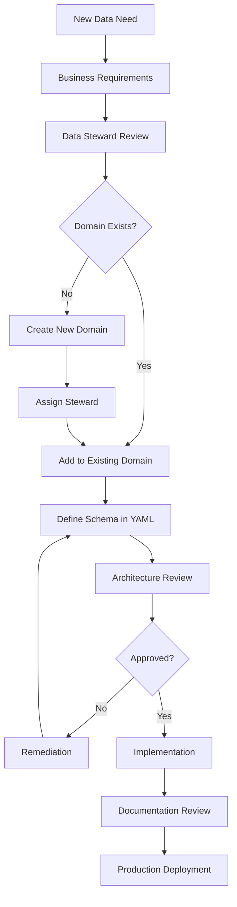

# Enterprise Data Governance

## Document Information

| Field | Value |
|-------|-------|
| **Document ID** | EA-GOV-001 |
| **Version** | 2.0 |
| **Last Updated** | January 2026 |
| **Owner** | Chief Data Officer |
| **Status** | Approved |

---

## Executive Summary

This document establishes the enterprise data governance framework for our Databricks-based data platform. It defines principles, policies, and standards that ensure data quality, security, compliance, and business value across all data assets.

---

## Governance Principles

### Principle 1: Data as a Strategic Asset

Data is a critical enterprise asset that requires intentional management, investment, and protection.

**What This Means:**
- Every data asset has an identified owner
- Data quality is measured and monitored
- Data investments are prioritized based on business value
- Data literacy is promoted across the organization

### Principle 2: Single Source of Truth

For any given business entity, there is one authoritative Gold layer representation.

**What This Means:**
- No duplicate definitions of customers, products, or other entities
- Gold layer is the consumption layer for all analytics
- Changes flow through Bronze → Silver → Gold
- Semantic layer provides consistent business definitions

### Principle 3: Data Quality by Design

Quality is built into data pipelines, not bolted on afterward.

**What This Means:**
- DLT expectations validate data at Silver layer
- Quarantine patterns capture and track bad records
- Quality metrics are monitored via Lakehouse Monitoring
- Business rules are documented and enforced

### Principle 4: Privacy and Security by Default

Data protection is embedded in all processes and systems.

**What This Means:**
- PII is identified, tagged, and protected
- Access follows least-privilege principle
- Audit logging is enabled on all sensitive data
- Secrets are managed via Databricks scopes

### Principle 5: Transparency and Lineage

Data provenance is tracked and visible.

**What This Means:**
- Unity Catalog lineage enabled for all tables
- Source systems documented
- Transformations are traceable
- Impact analysis is possible for any change

---

## Governance Framework

### Data Domains

Data is organized into domains based on business function:

| Domain | Description | Data Steward |
|--------|-------------|--------------|
| **Customer** | Customer master, preferences, interactions | Customer Ops |
| **Product** | Product catalog, pricing, inventory | Product Team |
| **Sales** | Orders, transactions, revenue | Sales Ops |
| **Finance** | Billing, costs, financial reporting | Finance Team |
| **Operations** | Processes, workflows, performance | Platform Team |
| **Security** | Access, audit, compliance | Security Team |

### Data Classification

| Classification | Description | Examples | Controls |
|----------------|-------------|----------|----------|
| **Confidential** | Highly sensitive, PII, financial | SSN, credit card, salary | Encryption, restricted access, audit logging |
| **Internal** | Business sensitive, not public | Sales figures, strategies | Role-based access, no external sharing |
| **Public** | Safe for external sharing | Product specs, marketing | Standard access controls |

### Data Lifecycle

```
┌──────────────────────────────────────────────────────────────────────────────┐
│                           DATA LIFECYCLE                                     │
├──────────────────────────────────────────────────────────────────────────────┤
│                                                                              │
│   ┌─────────┐   ┌─────────┐   ┌─────────┐   ┌─────────┐   ┌─────────┐     │
│   │ CREATE  │──▶│ STORE   │──▶│   USE   │──▶│ ARCHIVE │──▶│ DESTROY │     │
│   └─────────┘   └─────────┘   └─────────┘   └─────────┘   └─────────┘     │
│        │             │             │             │             │            │
│        ▼             ▼             ▼             ▼             ▼            │
│   ┌─────────────────────────────────────────────────────────────────────┐  │
│   │                    GOVERNANCE CONTROLS                              │  │
│   │  • Classification  • Encryption   • Access      • Retention  • Audit│  │
│   │  • Ownership       • Location     • Quality     • Compliance • Purge│  │
│   └─────────────────────────────────────────────────────────────────────┘  │
│                                                                              │
└──────────────────────────────────────────────────────────────────────────────┘
```

---

## Governance Standards

### Standard 1: Data Asset Documentation

**Rule EA-01: All data assets must be documented with business context**

Every table MUST have:
- Table-level COMMENT describing business purpose
- Column-level COMMENTs for all columns
- Tags for layer, domain, classification
- Owner assignment

**Documentation Format:**

```sql
-- Table COMMENT (dual-purpose for business users and LLMs)
COMMENT 'Gold layer customer dimension with current and historical records. 
Business: Primary customer reference for all analytics, includes demographics, 
preferences, and segment assignments. Updated daily from CRM.
Technical: SCD Type 2 with is_current flag. Grain is one row per customer version.'

-- Column COMMENT
COMMENT 'Customer lifetime value in USD. Business: Total revenue attributed to 
this customer across all orders. Used for segmentation and targeting. 
Technical: Calculated daily, includes returns.'
```

### Standard 2: Data Classification and Tagging

**Rule EA-02: PII columns must be tagged and classified**

```sql
-- Apply PII tag
ALTER TABLE catalog.schema.dim_customer
ALTER COLUMN email SET TAGS ('pii' = 'true', 'pii_type' = 'email');

ALTER TABLE catalog.schema.dim_customer
ALTER COLUMN phone SET TAGS ('pii' = 'true', 'pii_type' = 'phone');

-- Apply classification tag
ALTER TABLE catalog.schema.dim_customer
SET TAGS ('data_classification' = 'confidential');
```

### Standard 3: Data Ownership

**Rule EA-03: Every data domain must have an assigned data steward**

| Responsibility | Description |
|----------------|-------------|
| **Define** | Business definitions, quality rules |
| **Approve** | Access requests, schema changes |
| **Monitor** | Quality metrics, usage patterns |
| **Resolve** | Data issues, conflicting definitions |

### Standard 4: Data Quality Rules

Quality rules must be:
- Documented in code (DLT expectations, DQX checks)
- Stored in metadata (dq_rules table)
- Monitored (Lakehouse Monitoring custom metrics)
- Alerted (SQL alerts for threshold breaches)

```python
# DLT Expectation
@dlt.expect_all_or_drop({
    "valid_email": "email RLIKE '^[^@]+@[^@]+\\.[^@]+$'",
    "valid_segment": "segment IN ('premium', 'standard', 'basic')"
})
```

---

## Governance Processes

### Process 1: New Data Asset Onboarding



### Process 2: Schema Change Management

| Change Type | Approval Required | Process |
|-------------|-------------------|---------|
| **Additive** (new column) | Data Steward | PR review → Deploy |
| **Modification** (type change) | Data Steward + Architect | Impact analysis → PR → Deploy |
| **Destructive** (drop column) | Data Steward + Architect + Consumers | 90-day deprecation → Remove |
| **Breaking** (rename, semantic change) | Full review board | Release planning → Migration → Cutover |

### Process 3: Access Request

1. **Request:** User submits access request with business justification
2. **Review:** Data Steward reviews against data classification
3. **Approve/Deny:** Based on need-to-know and least-privilege
4. **Implement:** Platform team applies Unity Catalog grants
5. **Audit:** Access logged and reviewed quarterly

---

## Governance Metrics

### Data Quality Metrics

| Metric | Definition | Target | Alert Threshold |
|--------|------------|--------|-----------------|
| **Completeness** | % non-null values | >99% | <95% |
| **Uniqueness** | % unique values (for keys) | 100% | <100% |
| **Timeliness** | Hours since last refresh | <24h | >48h |
| **Accuracy** | % passing business rules | >99% | <95% |
| **Consistency** | % matching across systems | >99% | <95% |

### Governance Health Metrics

| Metric | Definition | Target |
|--------|------------|--------|
| **Documentation Coverage** | % tables with COMMENTs | 100% |
| **Classification Coverage** | % tables with classification tags | 100% |
| **Steward Assignment** | % domains with assigned steward | 100% |
| **Quality Rule Coverage** | % tables with DQ rules | >90% |
| **Access Review Completion** | % quarterly reviews completed | 100% |

---

## Compliance and Audit

### Audit Trail

Unity Catalog provides automatic audit logging:

```sql
-- Query audit logs
SELECT 
    event_time,
    user_identity.email,
    action_name,
    request_params.name_arg as table_name
FROM system.access.audit
WHERE 
    action_name IN ('createTable', 'deleteTable', 'grantPrivilege')
    AND event_date >= current_date - 30
ORDER BY event_time DESC;
```

### Compliance Controls

| Regulation | Control | Implementation |
|------------|---------|----------------|
| **GDPR** | Right to erasure | Soft delete with purge job |
| **CCPA** | Data access requests | Export utility |
| **SOC 2** | Access controls | Unity Catalog RBAC |
| **PCI-DSS** | Cardholder data protection | Column-level encryption, masking |

### Audit Schedule

| Audit | Frequency | Scope | Owner |
|-------|-----------|-------|-------|
| Access Review | Quarterly | All privileged access | Security Team |
| Data Quality | Monthly | Quality metrics trends | Data Steward |
| Compliance | Annually | Regulatory requirements | Compliance Officer |
| Architecture | Per project | New implementations | Platform Architect |

---

## Tools and Technologies

### Governance Technology Stack

| Capability | Tool | Usage |
|------------|------|-------|
| **Catalog** | Unity Catalog | Central metadata, access control |
| **Lineage** | Unity Catalog Lineage | Data flow tracking |
| **Quality** | DLT + DQX | Data validation |
| **Monitoring** | Lakehouse Monitoring | Quality metrics |
| **Alerting** | SQL Alerts | Threshold notifications |
| **Documentation** | Table/Column COMMENTs | Business context |
| **Classification** | UC Tags | Data sensitivity |

---

## Roles and Responsibilities

See: [Roles & Responsibilities](02-roles-responsibilities.md) for detailed RACI matrix.

| Role | Governance Responsibility |
|------|---------------------------|
| **Chief Data Officer** | Governance strategy, executive sponsorship |
| **Data Steward** | Domain governance, quality standards |
| **Platform Architect** | Technical standards, tooling |
| **Data Engineer** | Implementation, quality rules |
| **Security Team** | Access control, compliance |

---

## Related Documents

- [Roles & Responsibilities](02-roles-responsibilities.md)
- [Compliance Framework](03-compliance-framework.md)
- [Unity Catalog Standards](../platform-architecture/11-unity-catalog.md)
- [Gold Layer Patterns](../solution-architecture/data-pipelines/12-gold-layer-patterns.md)

---

## References

- [Unity Catalog Governance](https://docs.databricks.com/data-governance/unity-catalog/)
- [Data Classification](https://docs.databricks.com/data-governance/unity-catalog/tags)
- [Audit Logging](https://docs.databricks.com/administration-guide/account-settings/audit-logs)
