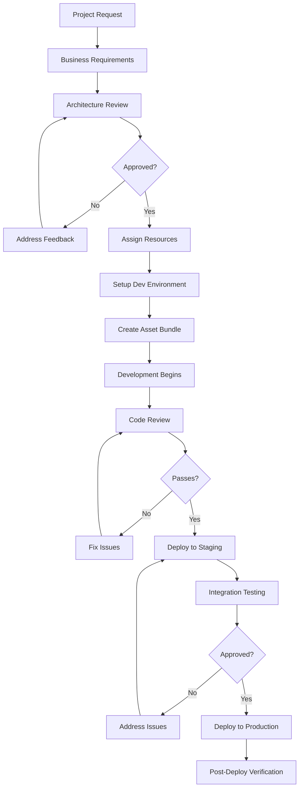
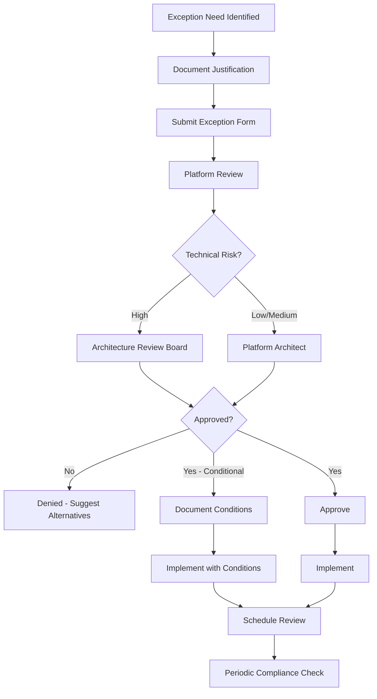
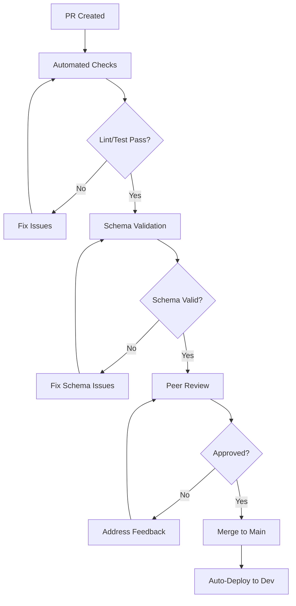

# Roles & Responsibilities

## Document Information

| Field | Value |
|-------|-------|
| **Document ID** | EA-ROLE-001 |
| **Version** | 2.0 |
| **Last Updated** | January 2026 |
| **Owner** | Platform Architecture Team |
| **Status** | Approved |

---

## Role Definitions

### Platform Team

| Role | Responsibilities | Skills Required |
|------|------------------|-----------------|
| **Platform Architect** | Architecture decisions, standards enforcement, exception approvals | Databricks expert, system design, governance |
| **Platform Engineer** | Infrastructure, CI/CD, tooling, compute policies | Asset Bundles, Unity Catalog, DevOps |
| **Platform Admin** | Access control, workspace management, monitoring | UC administration, security, cost management |

### Solution Teams

| Role | Responsibilities | Skills Required |
|------|------------------|-----------------|
| **Data Engineer** | Pipeline development (Bronze→Silver→Gold), data quality | PySpark, DLT, Delta Lake, SQL |
| **Analytics Engineer** | Semantic layer (TVFs, Metric Views), dashboards | SQL, data modeling, Genie |
| **ML Engineer** | Model development, feature engineering, serving | MLflow, Python, ML frameworks |
| **GenAI Engineer** | Agent development, prompt engineering, evaluation | LangGraph, MLflow, RAG |

### Governance & Oversight

| Role | Responsibilities | Skills Required |
|------|------------------|-----------------|
| **Data Steward** | Domain governance, quality standards, access approvals | Business knowledge, data quality |
| **Security Analyst** | Security reviews, compliance audits, incident response | Security, compliance, audit |
| **Compliance Officer** | Regulatory compliance, policy enforcement | GDPR, CCPA, SOC 2 |

---

## RACI Matrix

**Legend:** R=Responsible, A=Accountable, C=Consulted, I=Informed

### Enterprise Architecture Rules

| Rule ID | Rule | Platform Architect | Platform Engineer | Data Steward | Security |
|---------|------|-------------------|-------------------|--------------|----------|
| EA-01 | Data documentation | C | I | A/R | I |
| EA-02 | PII classification | C | I | R | A |
| EA-03 | Steward assignment | A | I | R | I |
| EA-04 | Architecture review | A/R | C | C | C |
| EA-05 | Exception approval | A | I | C | C |

### Platform Architecture Rules

| Rule ID | Rule | Platform Architect | Platform Engineer | Data Engineer | Security |
|---------|------|-------------------|-------------------|---------------|----------|
| PA-01 | Unity Catalog only | A | R | R | C |
| PA-02 | Delta Lake format | A | R | R | I |
| PA-03 | Serverless compute | A | R | R | I |
| PA-04 | Asset Bundles | A | R | R | I |
| PA-05 | Hierarchical jobs | C | A/R | R | I |
| PA-06 | Environment deps | C | A/R | R | I |
| PA-07 | dbutils.widgets | I | A | R | I |
| PA-08 | Pure Python imports | I | A | R | I |
| PA-09 | Secrets management | C | R | R | A |
| PA-10 | Schema prefixes | C | A/R | R | I |

### Data Pipeline Rules

| Rule ID | Rule | Platform Engineer | Data Engineer | Analytics Engineer | Data Steward |
|---------|------|-------------------|---------------|-------------------|--------------|
| DP-01 | Medallion architecture | C | R | C | A |
| DP-02 | CDF on Bronze | C | R | I | I |
| DP-03 | DLT with expectations | C | R | C | A |
| DP-04 | Gold from YAML | A | R | C | C |
| DP-05 | Dedup before MERGE | C | R | I | I |
| DP-06 | PK/FK constraints | A | R | C | C |
| DP-07 | SCD Type 2 | C | R | C | A |

### Semantic Layer Rules

| Rule ID | Rule | Platform Engineer | Analytics Engineer | Data Engineer | Data Steward |
|---------|------|-------------------|-------------------|---------------|--------------|
| SL-01 | Metric View v1.1 | C | R | C | A |
| SL-02 | STRING date params | C | R | C | I |
| SL-03 | Schema validation | C | R | R | C |
| SL-04 | v3.0 comments | I | R | C | A |
| SL-05 | No transitive joins | C | R | C | I |
| SL-06 | Genie inventory | C | R | C | A |

### ML/AI Rules

| Rule ID | Rule | Platform Engineer | ML Engineer | GenAI Engineer | Data Steward |
|---------|------|-------------------|-------------|----------------|--------------|
| ML-01 | UC feature tables | C | R | C | A |
| ML-02 | output_schema | C | R | R | I |
| ML-03 | NaN at source | C | R | R | I |
| ML-04 | ResponsesAgent | C | I | R | I |
| ML-05 | OBO context | A | C | R | I |
| ML-06 | Resource declaration | A | C | R | I |
| ML-07 | Evaluation thresholds | C | R | R | A |

### Monitoring Rules

| Rule ID | Rule | Platform Engineer | Data Engineer | Analytics Engineer | Data Steward |
|---------|------|-------------------|---------------|-------------------|--------------|
| MO-01 | input_columns :table | C | R | R | I |
| MO-02 | Dashboard fieldName | C | I | R | I |
| MO-03 | Raw numbers in SQL | C | C | R | I |
| MO-04 | Alerts V2 API | A | R | C | I |
| MO-05 | Document monitors | C | R | R | A |

---

## Implementation Workflows

### New Project Onboarding

### Rule Exception Request

### Code Review Process

---

## Escalation Matrix

| Issue Type | Level 1 | Level 2 | Level 3 | SLA |
|------------|---------|---------|---------|-----|
| **Data Quality** | Data Engineer | Data Steward | Platform Architect | 4 hours |
| **Pipeline Failure** | Data Engineer | Platform Engineer | Platform Architect | 2 hours |
| **Security Incident** | Security Analyst | Security Lead | CISO | 1 hour |
| **Compliance Violation** | Data Steward | Compliance Officer | Legal | 4 hours |
| **Access Request** | Platform Admin | Data Steward | Platform Architect | 24 hours |
| **Architecture Decision** | Platform Engineer | Platform Architect | CTO | 1 week |

---

## Verification Procedures

### Automated Checks

| Check | Frequency | Tool | Owner |
|-------|-----------|------|-------|
| Schema validation | Per PR | Pre-commit hook | Platform Engineering |
| YAML compliance | Per PR | Bundle validate | Platform Engineering |
| Unity Catalog compliance | Daily | System tables scan | Platform Admin |
| PK/FK constraints | Weekly | Information schema query | Data Engineering |
| Documentation coverage | Weekly | Table COMMENTs audit | Data Stewards |
| Secret exposure | Per PR | Git hooks | Security |

### Manual Reviews

| Review | Frequency | Participants | Artifacts |
|--------|-----------|--------------|-----------|
| Architecture Review | Per project | Architects, Leads, Security | Design doc, ERD |
| Code Review | Per PR | 2 Engineers | PR checklist |
| Security Review | Per project | Security, Platform | Threat model |
| Compliance Review | Quarterly | Compliance, Stewards | Audit report |

---

## Metrics & Reporting

### Team Health Metrics

| Metric | Definition | Target | Owner |
|--------|------------|--------|-------|
| Rule Compliance Rate | % rules followed in reviews | >95% | Platform Architect |
| Exception Rate | # exceptions / # reviews | <5% | Platform Architect |
| Review Turnaround | Hours from PR to approval | <24h | All |
| Training Completion | % team certified | 100% | Managers |

### Quality Metrics

| Metric | Definition | Target | Owner |
|--------|------------|--------|-------|
| Pipeline Success Rate | % successful runs | >99% | Data Engineering |
| Data Freshness | Hours since last update | <24h | Data Engineering |
| Query Performance | P95 latency | <10s | Analytics Engineering |
| Model Accuracy | Evaluation score | >0.8 | ML Engineering |

### Reporting Cadence

| Report | Frequency | Audience | Owner |
|--------|-----------|----------|-------|
| Rule Compliance Dashboard | Real-time | All | Platform |
| Weekly Metrics | Weekly | Managers | Platform Lead |
| Executive Summary | Monthly | Leadership | Platform Architect |
| Compliance Audit | Quarterly | Compliance | Data Steward |

---

## Communication Channels

| Purpose | Channel | Response SLA |
|---------|---------|--------------|
| General questions | #data-platform-help | 4 hours |
| Urgent issues | #data-platform-oncall | 30 min |
| Architecture discussions | #data-platform-architecture | 24 hours |
| Announcements | #data-platform-announcements | N/A |
| Security incidents | security@company.com | 1 hour |

---

## Related Documents

- [Data Governance](01-data-governance.md)
- [Compliance Framework](03-compliance-framework.md)
- [Exception Request Form](../templates/exception-request-form.md)
- [Architecture Review Checklist](../templates/architecture-review-checklist.md)
