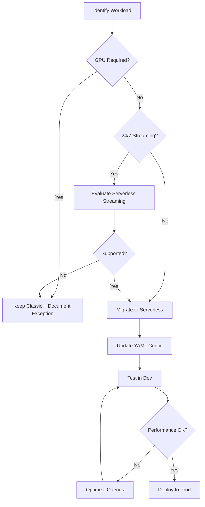

# Serverless Compute Standards

## Document Information

| Field | Value |
|-------|-------|
| **Document ID** | PA-SVLS-001 |
| **Version** | 1.0 |
| **Last Updated** | January 2026 |
| **Owner** | Platform Engineering |
| **Status** | Approved |

---

## Executive Summary

Serverless compute is the default and preferred compute option for all new workloads on the Databricks platform. This document defines when and how to use serverless compute across SQL Warehouses, Jobs, and DLT Pipelines.

---

## Golden Rules Summary

| Rule ID | Rule | Severity |
|---------|------|----------|
| PA-03 | Serverless is the default for all new workloads | 🔴 Critical |
| PA-03a | Serverless SQL Warehouses for all SQL workloads | 🔴 Critical |
| PA-03b | Serverless Jobs for notebooks and Python | 🔴 Critical |
| PA-03c | Serverless DLT for all pipelines | 🟡 Required |

---

## Why Serverless First?

```
┌─────────────────────────────────────────────────────────────────────────────────────┐
│                        SERVERLESS vs CLASSIC COMPUTE                                │
├─────────────────────────────────────────────────────────────────────────────────────┤
│                                                                                     │
│   SERVERLESS                              CLASSIC (Legacy)                          │
│   ✅ Instant startup (seconds)            ❌ Slow startup (minutes)                 │
│   ✅ Auto-scaling                          ❌ Manual scaling                         │
│   ✅ Pay only for usage                    ❌ Pay for idle time                      │
│   ✅ No cluster management                 ❌ Cluster configuration required         │
│   ✅ Always up-to-date runtime             ❌ Manual runtime updates                 │
│   ✅ Built-in optimization                 ❌ Manual tuning                          │
│   ✅ Native Photon                         ❌ Optional Photon                        │
│                                                                                     │
│   USE FOR:                                USE ONLY FOR:                             │
│   • All new workloads                     • GPU workloads (ML training)            │
│   • SQL analytics                         • Streaming with specific configs        │
│   • ETL pipelines                         • Legacy migrations (temporary)          │
│   • ML inference                          • Specialty libraries                    │
│                                                                                     │
└─────────────────────────────────────────────────────────────────────────────────────┘
```

---

## Serverless SQL Warehouses

### Rule PA-03a: All SQL Workloads Use Serverless

**Every SQL query, dashboard, and Genie Space MUST use Serverless SQL Warehouses.**

### Configuration Standards

```yaml
# Serverless SQL Warehouse - Standard Configuration
resources:
  warehouses:
    analytics_warehouse:
      name: "[${bundle.target}] Analytics Warehouse"
      cluster_size: "Small"           # Small, Medium, Large, X-Large, etc.
      warehouse_type: "SERVERLESS"    # ✅ ALWAYS Serverless
      auto_stop_mins: 10              # Stop after 10 minutes idle
      enable_photon: true             # ✅ Always enable Photon
      
      # Scaling
      min_num_clusters: 1
      max_num_clusters: 4             # Scale up to 4 clusters under load
      
      # Spot instances for cost savings
      spot_instance_policy: "COST_OPTIMIZED"
      
      # Query queuing
      enable_serverless_compute: true
```

### Warehouse Sizing Guide

| Size | vCPUs | Memory | Use Case |
|------|-------|--------|----------|
| **2X-Small** | 4 | 16 GB | Development, small queries |
| **X-Small** | 8 | 32 GB | Light dashboards |
| **Small** | 16 | 64 GB | Standard analytics |
| **Medium** | 32 | 128 GB | Heavy dashboards, Genie |
| **Large** | 64 | 256 GB | Complex queries, large scans |
| **X-Large** | 128 | 512 GB | Data science workloads |

### Auto-Stop Configuration

```sql
-- Check warehouse configuration
SELECT 
    name,
    cluster_size,
    auto_stop_mins,
    state
FROM system.compute.warehouses
WHERE warehouse_type = 'SERVERLESS';
```

**Standard auto-stop settings:**
- Development: 5 minutes
- Staging: 10 minutes
- Production: 15 minutes (balance availability vs cost)

---

## Serverless Jobs

### Rule PA-03b: All Jobs Use Serverless Compute

**Every notebook and Python job MUST use serverless compute via environment specification.**

### Mandatory Configuration

```yaml
# ✅ CORRECT: Serverless Job Configuration
resources:
  jobs:
    my_job:
      name: "[${bundle.target}] My Job"
      
      # ✅ MANDATORY: Serverless environment
      environments:
        - environment_key: "default"
          spec:
            environment_version: "4"    # Serverless environment version
            dependencies:
              - "pandas==2.0.3"         # Pin versions
              - "pyarrow>=14.0.0"
      
      tasks:
        - task_key: main_task
          environment_key: default      # ✅ Reference the environment
          notebook_task:
            notebook_path: ../src/my_notebook.py
            base_parameters:
              catalog: ${var.catalog}
```

### ❌ NEVER: Classic Cluster Configuration

```yaml
# ❌ WRONG: Do not use cluster specifications
resources:
  jobs:
    legacy_job:
      name: "Legacy Job"
      
      # ❌ NEVER use job_clusters for new workloads
      job_clusters:
        - job_cluster_key: "my_cluster"
          new_cluster:
            spark_version: "14.3.x-scala2.12"
            node_type_id: "i3.xlarge"
            num_workers: 2
```

### When Classic Clusters Are Acceptable

| Scenario | Justification | Required Approval |
|----------|---------------|-------------------|
| GPU workloads | ML training with GPUs | Platform Architect |
| Streaming 24/7 | Long-running streams | Platform Architect |
| Specialty libraries | Native C/C++ deps | Platform Engineer |
| Migration (temporary) | Legacy code migration | Team Lead + timeline |

---

## Serverless DLT Pipelines

### Rule PA-03c: All DLT Pipelines Use Serverless

```yaml
# ✅ CORRECT: Serverless DLT Pipeline
resources:
  pipelines:
    silver_pipeline:
      name: "[${bundle.target}] Silver Pipeline"
      
      # Unity Catalog integration
      catalog: ${var.catalog}
      schema: ${var.silver_schema}
      
      # ✅ MANDATORY: Serverless
      serverless: true
      
      # ✅ MANDATORY: Photon for performance
      photon: true
      
      # Latest features
      channel: CURRENT
      
      # Edition for expectations
      edition: ADVANCED
      
      libraries:
        - notebook:
            path: ../src/silver/transformations.py
```

### DLT Serverless Benefits

| Feature | Benefit |
|---------|---------|
| **Auto-scaling** | Handles data spikes automatically |
| **No sizing** | No worker/driver configuration needed |
| **Instant start** | Pipeline starts in seconds |
| **Cost optimized** | Pay only for processing time |
| **Photon native** | 2-8x faster processing |

---

## Cost Management

### Serverless Pricing Model

```
┌─────────────────────────────────────────────────────────────────────────────────────┐
│                          SERVERLESS COST MODEL                                       │
├─────────────────────────────────────────────────────────────────────────────────────┤
│                                                                                     │
│   SQL Warehouses:  DBU per hour × hours running                                     │
│                    (Only charged when processing queries)                           │
│                                                                                     │
│   Jobs:            DBU per hour × actual compute time                               │
│                    (Billed per second of execution)                                 │
│                                                                                     │
│   DLT:             DBU per hour × pipeline runtime                                  │
│                    (Only during updates)                                            │
│                                                                                     │
│   COST OPTIMIZATION:                                                                │
│   ├── Auto-stop warehouses when idle                                               │
│   ├── Schedule jobs during off-peak hours                                          │
│   ├── Use incremental processing in DLT                                            │
│   └── Monitor with system.billing tables                                           │
│                                                                                     │
└─────────────────────────────────────────────────────────────────────────────────────┘
```

### Cost Monitoring Query

```sql
-- Daily serverless cost by workspace and SKU
SELECT 
    usage_date,
    workspace_id,
    sku_name,
    SUM(usage_quantity) as total_dbus,
    SUM(list_cost) as total_cost
FROM system.billing.usage
WHERE usage_date >= CURRENT_DATE - 30
    AND sku_name LIKE '%SERVERLESS%'
GROUP BY 1, 2, 3
ORDER BY total_cost DESC;
```

---

## Performance Optimization

### SQL Warehouse Query Optimization

```sql
-- Use Query Profile to identify bottlenecks
-- In SQL Editor: Click "Query Profile" after execution

-- Best practices:
-- 1. Use CLUSTER BY AUTO on frequently queried tables
-- 2. Use appropriate data types (not STRING for dates)
-- 3. Filter early in CTEs
-- 4. Avoid SELECT * in production
-- 5. Use LIMIT only for exploration
```

### Job Performance

```python
# Serverless job optimization
# 1. Use efficient data formats
df.write.format("delta").mode("overwrite").save(path)  # ✅

# 2. Leverage Photon-optimized operations
df.groupBy("col").agg(sum("value"))  # ✅ Vectorized

# 3. Minimize shuffle operations
df.repartition(200)  # Only when necessary

# 4. Use broadcast for small tables
from pyspark.sql.functions import broadcast
df.join(broadcast(small_df), "key")
```

---

## Migration from Classic to Serverless

### Step-by-Step Migration



### Migration Checklist

- [ ] Identify all classic clusters in use
- [ ] Document any GPU or streaming requirements
- [ ] Update Asset Bundle YAML to serverless config
- [ ] Test performance in development
- [ ] Compare costs (classic vs serverless)
- [ ] Get approval for any exceptions
- [ ] Deploy to staging
- [ ] Monitor for 1 week
- [ ] Deploy to production

---

## Validation Checklist

### SQL Warehouses
- [ ] Warehouse type is SERVERLESS
- [ ] Photon enabled
- [ ] Auto-stop configured (5-15 min)
- [ ] Scaling limits set appropriately
- [ ] Spot instance policy set

### Jobs
- [ ] `environments` block defined
- [ ] `environment_key` on every task
- [ ] No `job_clusters` or `new_cluster`
- [ ] Dependencies pinned in environment

### DLT Pipelines
- [ ] `serverless: true` set
- [ ] `photon: true` set
- [ ] `edition: ADVANCED` for expectations
- [ ] No cluster configuration

---

## Exception Process

To request classic compute:

1. Complete [Exception Request Form](../templates/exception-request-form.md)
2. Document technical justification
3. Provide cost comparison
4. Get Platform Architect approval
5. Set review date for migration

---

## Related Documents

- [Platform Overview](10-platform-overview.md)
- [Asset Bundle Standards](20-asset-bundle-standards.md)
- [Cost Management](../../solution-architecture/monitoring/41-lakehouse-monitoring.md)

---

## References

- [Serverless SQL Warehouses](https://docs.databricks.com/sql/admin/serverless.html)
- [Serverless Jobs](https://docs.databricks.com/jobs/serverless.html)
- [Serverless DLT](https://docs.databricks.com/delta-live-tables/serverless.html)
