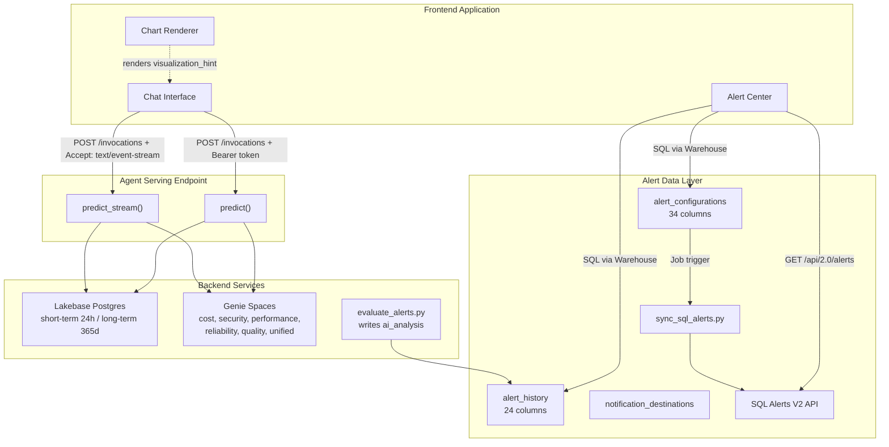

# Frontend Contract Documentation

> Code-grounded contract for building the Databricks Health Monitor frontend.
> Every data shape and interaction pattern is extracted from the actual deployed codebase.

## Architecture Overview

The frontend interacts with **two independent systems**:

1. **Agent Serving Endpoint** -- A Databricks Model Serving endpoint running `HealthMonitorAgent(ResponsesAgent)` from `src/agents/setup/log_agent_model.py`. Handles natural language queries, streaming, memory, and visualization hints.
2. **Alert Data Layer** -- Three Delta tables (`alert_configurations`, `alert_history`, `notification_destinations`) queried via SQL Warehouse, plus the Databricks SQL Alerts V2 API for real-time alert states.

## Critical Codebase Truths

Before building anything, understand these facts:

| Fact | Detail |
|---|---|
| **Deployed agent** | `HealthMonitorAgent(ResponsesAgent)` in `src/agents/setup/log_agent_model.py` (~3800 lines). The LangGraph orchestrator in `src/agents/orchestrator/` is NOT deployed. |
| **No alert REST API** | No Flask/FastAPI/Gradio server exists. Alert data is accessed via SQL against Delta tables + Databricks V2 API. |
| **`alert_context` does not exist** | The agent has no dedicated alert analysis input field. Use natural language queries or read pre-computed `ai_analysis` from `alert_history`. |
| **6 domains** | `cost`, `security`, `performance`, `reliability`, `quality`, `unified` |
| **Request key is `input`, not `messages`** | ResponsesAgent uses `input` array, not the legacy `messages` key. |
| **Stateless replicas** | Model Serving replicas do NOT share state. Frontend must track and pass back `thread_id` and `genie_conversation_ids`. |

## 6 Interaction Patterns

These are the core frontend-to-backend interactions. Each has a dedicated section in this documentation.

| Pattern | Frontend Responsibility | Document |
|---|---|---|
| **Long-term memory** | Pass stable `user_id` on every request. Everything else is automatic. | [05-memory-and-context.md](05-memory-and-context.md) |
| **Short-term memory** | Store `thread_id` from response, pass it back on follow-ups. | [05-memory-and-context.md](05-memory-and-context.md) |
| **Genie conversations** | Store `genie_conversation_ids` dict from response, pass it back on follow-ups. | [05-memory-and-context.md](05-memory-and-context.md) |
| **Streaming** | POST with `Accept: text/event-stream`, parse 3 SSE event types. | [04-streaming-protocol.md](04-streaming-protocol.md) |
| **Alert analysis** | Read `alert_history.ai_analysis` or send alert details as natural language query. | [07-alert-management.md](07-alert-management.md) |
| **Alert checking (3-tier)** | Tier 1: SQL against Delta tables. Tier 2: V2 API for live states. Tier 3: AI analysis. | [07-alert-management.md](07-alert-management.md) |

## Document Index

| Doc | Purpose |
|---|---|
| [01-quickstart.md](01-quickstart.md) | Copy-paste working examples for all 6 patterns |
| [02-authentication.md](02-authentication.md) | OBO auth, Bearer token passing, environment detection |
| [03-agent-api-reference.md](03-agent-api-reference.md) | Exact request/response contract from `predict()` |
| [04-streaming-protocol.md](04-streaming-protocol.md) | HTTP call details, SSE events, frontend parsing code |
| [05-memory-and-context.md](05-memory-and-context.md) | `user_id`, `thread_id`, `genie_conversation_ids` lifecycles |
| [06-visualization-contract.md](06-visualization-contract.md) | All 7 visualization hint types, 6 domain preference configs |
| [07-alert-management.md](07-alert-management.md) | 3-tier alert checking, schemas, AI analysis patterns |
| [08-typescript-types.md](08-typescript-types.md) | TypeScript interfaces generated from Python source code |

## Source of Truth

All contract details are extracted from these source files:

| File | What It Defines |
|---|---|
| `src/agents/setup/log_agent_model.py` | Agent class, `predict()`, `predict_stream()`, memory, visualization, domain routing |
| `src/alerting/setup_alerting_tables.py` | DDL for `alert_configurations` (34 cols), `alert_history` (24 cols), `notification_destinations` |
| `src/alerting/evaluate_alerts.py` | Alert evaluation loop, FMAPI `ai_analysis` generation |
| `src/alerting/alerting_config.py` | `AlertConfigRow` dataclass |
| `src/alerting/sync_sql_alerts.py` | V2 API sync logic, confirms endpoint is `/api/2.0/alerts` |
| `src/agents/setup/initialize_lakebase_tables.py` | Memory table DDLs, TTL configs |
| `src/agents/memory/long_term.py` | `DatabricksStore` wrapper, `LongTermMemory` class |
