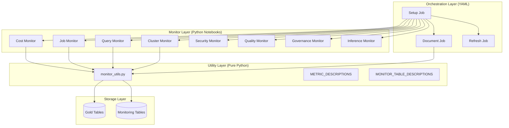
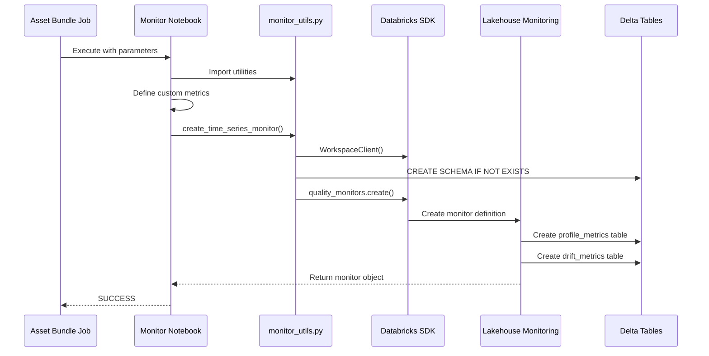

# 02 - Architecture Overview

## System Architecture

The Lakehouse Monitoring system follows a **layered architecture** that separates concerns across four distinct layers:

1. **Orchestration Layer**: Asset Bundle jobs for deployment and scheduling
2. **Monitor Layer**: Individual Python notebooks defining metrics per table
3. **Utility Layer**: Shared Python module with reusable functions
4. **Storage Layer**: Gold tables (source) and monitoring tables (output)

This design enables **independent evolution** of each layer while maintaining consistency through shared utilities.

### Architecture Diagram



### ASCII Architecture Diagram

```
┌─────────────────────────────────────────────────────────────────────────────┐
│                     ORCHESTRATION LAYER (Asset Bundles)                      │
│                                                                              │
│   ┌──────────────────┐  ┌──────────────────┐  ┌──────────────────┐         │
│   │   Setup Job      │  │  Refresh Job     │  │ Documentation    │         │
│   │   (One-time)     │  │  (Scheduled)     │  │ Job (Post-init)  │         │
│   │                  │  │                  │  │                  │         │
│   │ Creates monitors │  │ Triggers refresh │  │ Adds comments    │         │
│   │ for all tables   │  │ on schedule      │  │ for Genie        │         │
│   └────────┬─────────┘  └────────┬─────────┘  └────────┬─────────┘         │
│            │                     │                     │                    │
└────────────┼─────────────────────┼─────────────────────┼────────────────────┘
             │                     │                     │
             ▼                     ▼                     ▼
┌─────────────────────────────────────────────────────────────────────────────┐
│                        MONITOR LAYER (Python Notebooks)                      │
│                                                                              │
│   ┌────────────┐ ┌────────────┐ ┌────────────┐ ┌────────────┐              │
│   │   Cost     │ │    Job     │ │   Query    │ │  Cluster   │              │
│   │  Monitor   │ │  Monitor   │ │  Monitor   │ │  Monitor   │              │
│   │ 35 metrics │ │ 50 metrics │ │ 40 metrics │ │ 40 metrics │              │
│   └────────────┘ └────────────┘ └────────────┘ └────────────┘              │
│   ┌────────────┐ ┌────────────┐ ┌────────────┐ ┌────────────┐              │
│   │  Security  │ │  Quality   │ │ Governance │ │ Inference  │              │
│   │  Monitor   │ │  Monitor   │ │  Monitor   │ │  Monitor   │              │
│   │ 15 metrics │ │ 15 metrics │ │ 15 metrics │ │ 15 metrics │              │
│   └────────────┘ └────────────┘ └────────────┘ └────────────┘              │
│                                                                              │
└────────────────────────────────────┬────────────────────────────────────────┘
                                     │
                                     ▼
┌─────────────────────────────────────────────────────────────────────────────┐
│                       UTILITY LAYER (Pure Python Module)                     │
│                                                                              │
│   ┌─────────────────────────────────────────────────────────────────────┐   │
│   │                         monitor_utils.py                             │   │
│   │                                                                      │   │
│   │  FUNCTIONS:                          REGISTRIES:                     │   │
│   │  • create_time_series_monitor()      • METRIC_DESCRIPTIONS (100+)    │   │
│   │  • create_aggregate_metric()         • MONITOR_TABLE_DESCRIPTIONS    │   │
│   │  • create_derived_metric()                                           │   │
│   │  • create_drift_metric()             HELPERS:                        │   │
│   │  • delete_monitor_if_exists()        • check_monitoring_available()  │   │
│   │  • document_monitor_output_tables()  • wait_for_monitor_tables()     │   │
│   │  • document_all_monitor_tables()                                     │   │
│   │                                                                      │   │
│   └─────────────────────────────────────────────────────────────────────┘   │
│                                                                              │
└────────────────────────────────────┬────────────────────────────────────────┘
                                     │
                                     ▼
┌─────────────────────────────────────────────────────────────────────────────┐
│                            STORAGE LAYER (Delta Tables)                      │
│                                                                              │
│   ┌───────────────────────────────────┐  ┌───────────────────────────────┐  │
│   │          SOURCE TABLES            │  │         OUTPUT TABLES          │  │
│   │    {catalog}.{gold_schema}        │  │  {catalog}.{gold_schema}_mon   │  │
│   │                                   │  │                                │  │
│   │  • fact_usage                     │  │  • fact_usage_profile_metrics  │  │
│   │  • fact_job_run_timeline          │  │  • fact_usage_drift_metrics    │  │
│   │  • fact_query_history             │  │  • fact_job_run_..._profile    │  │
│   │  • fact_node_timeline             │  │  • fact_job_run_..._drift      │  │
│   │  • fact_audit_logs                │  │  • ... (16 total)              │  │
│   │  • fact_table_quality             │  │                                │  │
│   │  • fact_governance_metrics        │  │                                │  │
│   │  • fact_model_serving             │  │                                │  │
│   │                                   │  │                                │  │
│   └───────────────────────────────────┘  └───────────────────────────────┘  │
│                                                                              │
└─────────────────────────────────────────────────────────────────────────────┘
```

## Data Flow

### End-to-End Flow



### Data Flow Description

| Step | From | To | Data | Description |
|------|------|-----|------|-------------|
| 1 | Asset Bundle | Notebook | Parameters | Catalog, schema passed via widgets |
| 2 | Notebook | Utils | Config | Metric definitions, table info |
| 3 | Utils | SDK | API Call | Monitor creation request |
| 4 | SDK | Lakehouse Monitoring | Definition | Monitor configuration stored |
| 5 | Lakehouse Monitoring | Gold Table | Read | Source data scanned |
| 6 | Lakehouse Monitoring | Output Tables | Write | Metrics computed and stored |
| 7 | Output Tables | Genie/Dashboards | Query | Metrics available for analysis |

## Component Inventory

### By Category

| Category | Count | Components |
|----------|-------|------------|
| **Orchestration Jobs** | 3 | Setup, Refresh, Documentation |
| **Monitor Notebooks** | 8 | Cost, Job, Query, Cluster, Security, Quality, Governance, Inference |
| **Utility Modules** | 1 | monitor_utils.py |
| **Output Tables** | 16 | 8 profile_metrics + 8 drift_metrics |

### Component Details

| Component | Purpose | Dependencies | Location |
|-----------|---------|--------------|----------|
| `lakehouse_monitors_job.yml` | Asset Bundle job definitions | databricks.yml variables | `resources/monitoring/` |
| `cost_monitor.py` | Cost domain metrics | monitor_utils.py | `src/monitoring/` |
| `job_monitor.py` | Reliability domain metrics | monitor_utils.py | `src/monitoring/` |
| `query_monitor.py` | Query performance metrics | monitor_utils.py | `src/monitoring/` |
| `cluster_monitor.py` | Cluster utilization metrics | monitor_utils.py | `src/monitoring/` |
| `security_monitor.py` | Security audit metrics | monitor_utils.py | `src/monitoring/` |
| `quality_monitor.py` | Data quality metrics | monitor_utils.py | `src/monitoring/` |
| `governance_monitor.py` | Governance coverage metrics | monitor_utils.py | `src/monitoring/` |
| `inference_monitor.py` | ML inference metrics | monitor_utils.py | `src/monitoring/` |
| `monitor_utils.py` | Shared utilities | databricks-sdk | `src/monitoring/` |
| `document_monitors.py` | Genie documentation | monitor_utils.py | `src/monitoring/` |
| `refresh_monitors.py` | Manual refresh trigger | monitor_utils.py | `src/monitoring/` |
| `setup_all_monitors.py` | Orchestrated setup | All monitors | `src/monitoring/` |

## Technology Stack

| Layer | Technology | Version | Purpose |
|-------|------------|---------|---------|
| **Orchestration** | Databricks Asset Bundles | - | Job definitions, deployment |
| **Compute** | Serverless Compute | v4 | Job execution |
| **SDK** | databricks-sdk | ≥0.28.0 | Lakehouse Monitoring API |
| **API** | Lakehouse Monitoring | v1 | Monitor lifecycle management |
| **Storage** | Delta Lake | - | Source and output tables |
| **Catalog** | Unity Catalog | - | Governance, permissions |
| **Schema** | PySpark Types | - | Metric output types |

## Code Organization

### Directory Structure

```
src/monitoring/
├── __init__.py                 # Package marker
├── monitor_utils.py            # ⚠️ Pure Python (no notebook header!)
├── cost_monitor.py             # Databricks notebook
├── job_monitor.py              # Databricks notebook
├── query_monitor.py            # Databricks notebook
├── cluster_monitor.py          # Databricks notebook
├── security_monitor.py         # Databricks notebook
├── quality_monitor.py          # Databricks notebook
├── governance_monitor.py       # Databricks notebook
├── inference_monitor.py        # Databricks notebook
├── document_monitors.py        # Databricks notebook
├── refresh_monitors.py         # Databricks notebook
├── setup_all_monitors.py       # Databricks notebook
└── wait_for_monitors.py        # Databricks notebook

resources/monitoring/
└── lakehouse_monitors_job.yml  # Asset Bundle job definitions
```

### File Type Distinction

**⚠️ CRITICAL**: `monitor_utils.py` must be a **pure Python file** (no `# Databricks notebook source` header) to enable standard imports after `dbutils.library.restartPython()`.

| File Type | Header | Can Import | Can Execute as Job |
|-----------|--------|------------|-------------------|
| **Pure Python** | None | ✅ Yes | ❌ No |
| **Databricks Notebook** | `# Databricks notebook source` | ❌ No | ✅ Yes |

## Design Principles

### Principle 1: Separation of Concerns

Each component has a single responsibility:
- **Jobs**: Orchestration and scheduling
- **Notebooks**: Monitor-specific metric definitions
- **Utils**: Reusable functions and registries

### Principle 2: Idempotent Operations

All operations are safe to repeat:
- Monitor creation uses cleanup-before-create pattern
- Schema creation uses `CREATE IF NOT EXISTS`
- Documentation uses `ALTER TABLE/COLUMN` (idempotent)

### Principle 3: Fail-Fast with Clear Errors

Each notebook:
- Validates SDK availability at startup
- Reports detailed progress via print statements
- Uses `dbutils.notebook.exit()` with clear status

### Principle 4: Genie-First Documentation

All monitoring tables are documented for LLM understanding:
- Table-level comments explain purpose and usage
- Column-level comments describe business meaning and technical calculation
- Dual-purpose format: `"Business meaning. Technical: calculation details."`

## Integration Points

| Integration | Type | Protocol | Authentication |
|-------------|------|----------|----------------|
| **Unity Catalog** | Data Access | SQL/Spark | Workspace token |
| **Lakehouse Monitoring API** | REST | SDK calls | Workspace token |
| **Delta Tables** | Storage | Spark DataFrame | Workspace token |
| **Asset Bundles** | Deployment | YAML | Profile-based |

## Security Considerations

### Permissions Model

```
┌─────────────────────────────────────────────────────────────┐
│                    Service Principal / User                  │
│                                                              │
│  Required Permissions:                                       │
│  ├── USE CATALOG on target catalog                          │
│  ├── USE SCHEMA on gold_schema                              │
│  ├── USE SCHEMA on {gold_schema}_monitoring                 │
│  ├── SELECT on all Gold layer fact tables                   │
│  ├── MANAGE on all Gold layer fact tables (for monitors)    │
│  ├── CREATE TABLE in monitoring schema                      │
│  └── ALTER on monitoring output tables                      │
└─────────────────────────────────────────────────────────────┘
```

### Sensitive Data Handling

- **No PII in Metrics**: Custom metrics aggregate data, no raw PII exposed
- **Audit Trail**: Monitor creation logged in system tables
- **Access Control**: Output tables inherit catalog permissions

## Slicing Architecture

Slicing enables dimensional analysis of metrics, breaking down KPIs by specific attributes.

### Slicing Flow

```
┌─────────────────────────────────────────────────────────────────────────────┐
│                         SLICING CONFIGURATION                               │
│                                                                              │
│   Monitor Definition:                                                        │
│   slicing_exprs=[                                                           │
│     "workspace_id",      ──┐                                                │
│     "sku_name",          ──┼── Each creates separate rows in output        │
│     "is_tagged",         ──┤   with slice_key and slice_value columns      │
│     "is_serverless"      ──┘                                                │
│   ]                                                                          │
│                                                                              │
└─────────────────────────────────────────────────────────────────────────────┘
                                     │
                                     ▼
┌─────────────────────────────────────────────────────────────────────────────┐
│                         OUTPUT TABLE STRUCTURE                              │
│                                                                              │
│   fact_usage_profile_metrics:                                               │
│   ┌─────────────┬─────────────┬──────────────┬──────────────────────────┐  │
│   │ slice_key   │ slice_value │ column_name  │ total_daily_cost  ...    │  │
│   ├─────────────┼─────────────┼──────────────┼──────────────────────────┤  │
│   │ NULL        │ NULL        │ :table       │ 50000.00 (overall)       │  │
│   │ workspace_id│ ws-123      │ :table       │ 20000.00                 │  │
│   │ workspace_id│ ws-456      │ :table       │ 30000.00                 │  │
│   │ sku_name    │ JOBS        │ :table       │ 15000.00                 │  │
│   │ sku_name    │ SQL         │ :table       │ 35000.00                 │  │
│   │ is_tagged   │ true        │ :table       │ 40000.00                 │  │
│   │ is_tagged   │ false       │ :table       │ 10000.00                 │  │
│   └─────────────┴─────────────┴──────────────┴──────────────────────────┘  │
│                                                                              │
└─────────────────────────────────────────────────────────────────────────────┘
```

### Slicing Expressions by Monitor

| Monitor | Slicing Dimensions | Purpose |
|---------|-------------------|---------|
| **Cost** | `workspace_id`, `sku_name`, `cloud`, `is_tagged`, `product_features_is_serverless` | Cost attribution, serverless adoption |
| **Job** | `workspace_id`, `result_state`, `trigger_type`, `job_name`, `termination_code` | Failure analysis, job-level SLAs |
| **Query** | `workspace_id`, `compute_warehouse_id`, `execution_status`, `statement_type`, `executed_by` | Performance by user/warehouse |
| **Cluster** | `workspace_id`, `cluster_id`, `node_type`, `cluster_name`, `driver` | Utilization by cluster |
| **Security** | `workspace_id`, `service_name`, `audit_level`, `action_name`, `user_identity_email` | Security by user/service |
| **Quality** | `catalog_name`, `schema_name`, `table_name`, `has_critical_violations` | Quality by table |
| **Governance** | `workspace_id`, `entity_type`, `created_by`, `source_catalog_name` | Coverage by entity type |
| **Inference** | `workspace_id`, `is_anomaly`, `anomaly_category`, `predicted_result`, `risk_level` | Prediction analysis |

### Query Pattern for Sliced Data

```sql
-- Overall metrics (no slicing)
WHERE slice_key IS NULL

-- Metrics by workspace
WHERE slice_key = 'workspace_id'

-- Metrics for specific workspace
WHERE slice_key = 'workspace_id' AND slice_value = 'ws-123'
```

## Scalability

### Current Capacity

| Dimension | Current | Limit |
|-----------|---------|-------|
| **Monitors per Workspace** | 8 | 1000+ |
| **Metrics per Monitor** | 50 max | 100+ |
| **Granularities** | 2 | Any supported |
| **Slicing Expressions** | 5 | 10+ |

### Scaling Considerations

- **Large Tables**: May increase monitor creation time (minutes)
- **High Cardinality Slicing**: May increase output table size significantly
- **Frequent Refresh**: May impact Gold table performance
- **Slicing Cardinality**: Each unique slice_value creates additional rows

## Next Steps

- Deep dive into [03-Custom Metrics](03-custom-metrics.md) for metric patterns
- Review [04-Monitor Catalog](04-monitor-catalog.md) for complete inventory
- Follow [06-Implementation Guide](06-implementation-guide.md) for deployment

---

**Version:** 1.0  
**Last Updated:** January 2026

