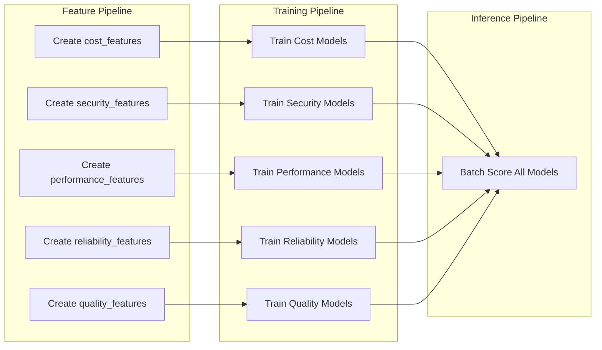

# 09 - Deployment & Orchestration

## Overview

ML pipelines are deployed using Databricks Asset Bundles (DABs) for infrastructure-as-code management. This ensures:
- Version-controlled pipeline definitions
- Reproducible deployments
- Environment separation (dev/prod)
- CI/CD integration

## Job Architecture

### Three-Layer Hierarchy

```
┌─────────────────────────────────────────────────────────────────────────────┐
│                    ML PIPELINE JOB HIERARCHY                                 │
├─────────────────────────────────────────────────────────────────────────────┤
│                                                                             │
│  LAYER 3: MASTER ORCHESTRATORS                                              │
│  ┌──────────────────────────────────────────────────────────────────────┐  │
│  │ ml_layer_setup_orchestrator    ml_layer_inference_orchestrator      │  │
│  │         │                              │                             │  │
│  │    ┌────┴────┐                    ┌────┴────┐                       │  │
│  │    ▼         ▼                    ▼         ▼                       │  │
│  │ feature   training              feature  inference                   │  │
│  │ _setup    _setup                _refresh  _batch                     │  │
│  └──────────────────────────────────────────────────────────────────────┘  │
│                                                                             │
│  LAYER 2: COMPOSITE JOBS (run_job_task)                                    │
│  ┌──────────────────────────────────────────────────────────────────────┐  │
│  │ ml_feature_setup_job        ml_training_setup_job                    │  │
│  │ ml_inference_setup_job                                               │  │
│  └──────────────────────────────────────────────────────────────────────┘  │
│                                                                             │
│  LAYER 1: ATOMIC JOBS (notebook_task)                                      │
│  ┌──────────────────────────────────────────────────────────────────────┐  │
│  │ ml_feature_pipeline_job     ml_training_pipeline_job                 │  │
│  │ ml_inference_pipeline_job                                            │  │
│  └──────────────────────────────────────────────────────────────────────┘  │
│                                                                             │
└─────────────────────────────────────────────────────────────────────────────┘
```

### Key Principle: No Notebook Duplication

Each notebook appears in **exactly one atomic job**. Higher-level jobs reference atomic jobs via `run_job_task`.

## YAML Job Definitions

### Feature Pipeline Job (Atomic)

```yaml
# resources/ml/ml_feature_pipeline_job.yml

resources:
  jobs:
    ml_feature_pipeline_job:
      name: "[${bundle.target}] Health Monitor - ML Feature Pipeline"
      description: "Creates and updates feature tables in Unity Catalog"
      
      # MANDATORY: Serverless environment
      environments:
        - environment_key: default
          spec:
            environment_version: "4"
      
      tasks:
        - task_key: create_feature_tables
          environment_key: default
          notebook_task:
            notebook_path: ../../src/ml/features/create_feature_tables.py
            base_parameters:
              catalog: ${var.catalog}
              gold_schema: ${var.gold_schema}
              feature_schema: ${var.feature_schema}
      
      tags:
        job_level: atomic
        domain: ml
        layer: feature
        project: health_monitor
```

### Training Pipeline Job (Atomic)

```yaml
# resources/ml/ml_training_pipeline_job.yml

resources:
  jobs:
    ml_training_pipeline_job:
      name: "[${bundle.target}] Health Monitor - ML Training Pipeline"
      description: "Trains all 25 ML models using Feature Engineering"
      
      environments:
        - environment_key: default
          spec:
            environment_version: "4"
            dependencies:
              - "scikit-learn>=1.3.0"
              - "xgboost>=2.0.0"
      
      # 25 parallel training tasks
      tasks:
        # COST DOMAIN (6 models)
        - task_key: train_cost_anomaly_detector
          environment_key: default
          notebook_task:
            notebook_path: ../../src/ml/cost/train_cost_anomaly_detector.py
            base_parameters:
              catalog: ${var.catalog}
              gold_schema: ${var.gold_schema}
              feature_schema: ${var.feature_schema}
        
        - task_key: train_budget_forecaster
          environment_key: default
          notebook_task:
            notebook_path: ../../src/ml/cost/train_budget_forecaster.py
            base_parameters:
              catalog: ${var.catalog}
              gold_schema: ${var.gold_schema}
              feature_schema: ${var.feature_schema}
        
        # ... (23 more training tasks)
      
      tags:
        job_level: atomic
        domain: ml
        layer: training
        project: health_monitor
```

### Inference Pipeline Job (Atomic)

```yaml
# resources/ml/ml_inference_pipeline_job.yml

resources:
  jobs:
    ml_inference_pipeline_job:
      name: "[${bundle.target}] Health Monitor - ML Batch Inference"
      description: "Generates predictions for all 25 models using fe.score_batch"
      
      environments:
        - environment_key: default
          spec:
            environment_version: "4"
      
      tasks:
        - task_key: batch_inference_all_models
          environment_key: default
          notebook_task:
            notebook_path: ../../src/ml/inference/batch_inference_all_models.py
            base_parameters:
              catalog: ${var.catalog}
              gold_schema: ${var.gold_schema}
              feature_schema: ${var.feature_schema}
      
      tags:
        job_level: atomic
        domain: ml
        layer: inference
        project: health_monitor
```

### ML Orchestrator Job (Composite)

```yaml
# resources/ml/ml_orchestrator_job.yml

resources:
  jobs:
    ml_orchestrator_job:
      name: "[${bundle.target}] Health Monitor - ML Pipeline Orchestrator"
      description: "Orchestrates complete ML pipeline: Features → Training → Inference"
      
      tasks:
        # Phase 1: Feature Pipeline
        - task_key: run_feature_pipeline
          run_job_task:
            job_id: ${resources.jobs.ml_feature_pipeline_job.id}
        
        # Phase 2: Training (depends on features)
        - task_key: run_training_pipeline
          depends_on:
            - task_key: run_feature_pipeline
          run_job_task:
            job_id: ${resources.jobs.ml_training_pipeline_job.id}
        
        # Phase 3: Inference (depends on training)
        - task_key: run_inference_pipeline
          depends_on:
            - task_key: run_training_pipeline
          run_job_task:
            job_id: ${resources.jobs.ml_inference_pipeline_job.id}
      
      # Schedule: Weekly retraining
      schedule:
        quartz_cron_expression: "0 0 3 ? * SUN"  # Every Sunday at 3 AM
        timezone_id: "America/Los_Angeles"
        pause_status: PAUSED  # Enable in production
      
      tags:
        job_level: orchestrator
        domain: ml
        layer: all
        project: health_monitor
```

## Bundle Configuration

### Main databricks.yml

```yaml
bundle:
  name: databricks_health_monitor

variables:
  catalog:
    default: prashanth_catalog
  gold_schema:
    default: gold
  feature_schema:
    default: gold_ml

targets:
  dev:
    mode: development
    default: true
    variables:
      catalog: dev_catalog
      feature_schema: dev_gold_ml
  
  prod:
    mode: production
    variables:
      catalog: prod_catalog
      feature_schema: gold_ml

include:
  - resources/ml/*.yml
```

## Deployment Commands

### Validate Bundle

```bash
# Validate syntax and configuration
databricks bundle validate -t dev

# Output: "Validation successful"
```

### Deploy to Dev

```bash
# Deploy all resources
databricks bundle deploy -t dev

# This creates:
# - ml_feature_pipeline_job
# - ml_training_pipeline_job
# - ml_inference_pipeline_job
# - ml_orchestrator_job
```

### Run Individual Jobs

```bash
# Run feature pipeline
databricks bundle run -t dev ml_feature_pipeline_job

# Run training pipeline
databricks bundle run -t dev ml_training_pipeline_job

# Run inference pipeline
databricks bundle run -t dev ml_inference_pipeline_job
```

### Run Full Orchestrator

```bash
# Run complete ML pipeline
databricks bundle run -t dev ml_orchestrator_job
```

## Pipeline Dependencies

### Execution Order



### Dependency Requirements

| Pipeline | Requires | Creates |
|---|---|---|
| **Feature** | Gold layer tables | Feature tables with PKs |
| **Training** | Feature tables | Registered models in UC |
| **Inference** | Registered models | Prediction tables |

## Environment Configuration

### Serverless Specification

```yaml
environments:
  - environment_key: default
    spec:
      environment_version: "4"
      dependencies:
        - "scikit-learn>=1.3.0"
        - "xgboost>=2.0.0"
        - "pandas>=2.0.0"
        - "numpy>=1.24.0"
```

### Why Environment Version 4?

- Latest serverless Python environment
- Faster startup times
- Better dependency resolution
- Full ML library support

## Notebook Parameters

### Widget Pattern

```python
# In notebooks - use dbutils.widgets.get()
def get_parameters():
    catalog = dbutils.widgets.get("catalog")
    gold_schema = dbutils.widgets.get("gold_schema")
    feature_schema = dbutils.widgets.get("feature_schema")
    return catalog, gold_schema, feature_schema
```

### YAML Configuration

```yaml
notebook_task:
  notebook_path: ../../src/ml/features/create_feature_tables.py
  base_parameters:
    catalog: ${var.catalog}
    gold_schema: ${var.gold_schema}
    feature_schema: ${var.feature_schema}
```

## Scheduling Strategies

### Development (Paused)

```yaml
schedule:
  quartz_cron_expression: "0 0 3 ? * SUN"
  timezone_id: "America/Los_Angeles"
  pause_status: PAUSED  # Don't run automatically in dev
```

### Production (Active)

```yaml
schedule:
  quartz_cron_expression: "0 0 3 ? * *"  # Daily at 3 AM
  timezone_id: "America/Los_Angeles"
  pause_status: UNPAUSED
```

### Common Schedules

| Schedule | Cron Expression | Use Case |
|---|---|---|
| Daily 3 AM | `0 0 3 ? * *` | Feature refresh |
| Weekly Sunday | `0 0 3 ? * SUN` | Model retraining |
| Hourly | `0 0 * ? * *` | Inference |
| Every 4 hours | `0 0 */4 ? * *` | Frequent predictions |

## Error Handling

### Job Timeouts

```yaml
tasks:
  - task_key: train_models
    timeout_seconds: 14400  # 4 hours
    notebook_task:
      ...
```

### Retry Configuration

```yaml
# At task level for transient failures
tasks:
  - task_key: batch_inference
    max_retries: 2
    min_retry_interval_millis: 60000  # 1 minute
    notebook_task:
      ...
```

### Notification Configuration

```yaml
email_notifications:
  on_start:
    - ml-team@company.com
  on_success:
    - ml-team@company.com
  on_failure:
    - ml-team@company.com
    - on-call@company.com
```

## Monitoring Deployed Jobs

### Job Run History

```bash
# List recent runs
databricks jobs list-runs --job-id <job_id>

# Get run status
databricks runs get --run-id <run_id>
```

### Programmatic Monitoring

```python
from databricks.sdk import WorkspaceClient

client = WorkspaceClient()

# Get recent runs
runs = client.jobs.list_runs(job_id=job_id, limit=10)

for run in runs:
    print(f"Run {run.run_id}: {run.state.result_state}")
```

## Production Deployment Checklist

### Pre-Deployment
- [ ] Bundle validates successfully
- [ ] All notebook paths correct
- [ ] Parameters match widgets
- [ ] Dependencies specified

### Deployment
- [ ] Deploy to dev first
- [ ] Run full orchestrator in dev
- [ ] Check all tasks succeed
- [ ] Review MLflow experiments
- [ ] Verify predictions generated

### Post-Deployment
- [ ] Enable schedule in prod
- [ ] Configure notifications
- [ ] Set up alerting
- [ ] Document deployment

## Troubleshooting Deployment

### Common Issues

| Issue | Cause | Solution |
|---|---|---|
| "Notebook not found" | Wrong path | Check `notebook_path` relative to YAML |
| "Parameter missing" | Widget mismatch | Ensure `base_parameters` match `dbutils.widgets.get()` |
| "Job failed silently" | Missing `raise` | Use `raise` not `dbutils.notebook.exit("FAILED")` |
| "Dependencies not found" | Missing spec | Add to `environments.spec.dependencies` |

### Debugging Failed Runs

```bash
# Get detailed run output
databricks runs get-output --run-id <run_id>

# View notebook output
# Navigate to: Workflows → Jobs → {job} → Runs → {run_id}
```

## Next Steps

- **[10-Troubleshooting](10-troubleshooting.md)**: Common errors and fixes
- **[11-Model Monitoring](11-model-monitoring.md)**: Production monitoring
- **[12-MLflow UI Guide](12-mlflow-ui-guide.md)**: Navigating experiments

