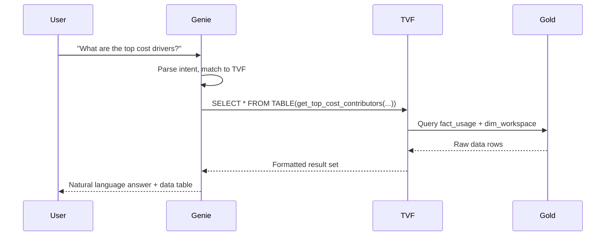
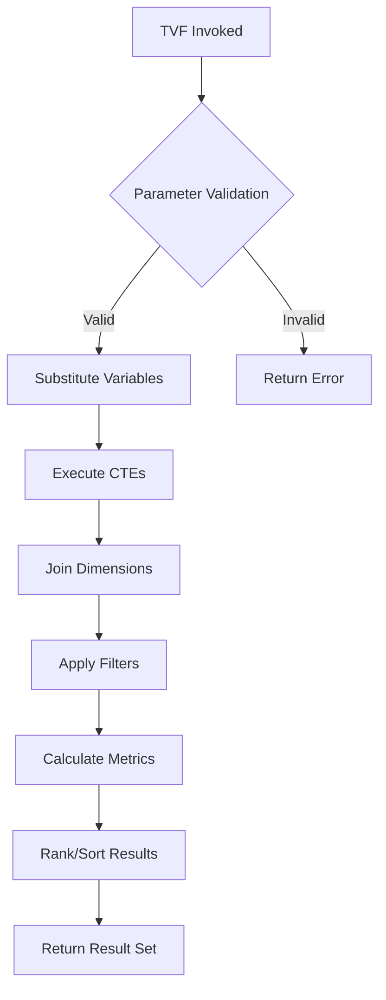

# 02 - Architecture Overview

## System Architecture

```
┌─────────────────────────────────────────────────────────────────────────────────┐
│                              USER INTERFACE                                      │
│                                                                                  │
│    ┌─────────────────────────────────────────────────────────────────────────┐  │
│    │                         Genie Space / AI/BI                             │  │
│    │                    (Natural Language Interface)                          │  │
│    │                                                                          │  │
│    │  User: "What are the top 10 cost drivers this month?"                   │  │
│    │                                                                          │  │
│    └────────────────────────────────────┬────────────────────────────────────┘  │
│                                         │                                        │
└─────────────────────────────────────────┼────────────────────────────────────────┘
                                          │
                                          ▼
┌─────────────────────────────────────────────────────────────────────────────────┐
│                           SEMANTIC FRAMEWORK                                     │
│                                                                                  │
│    ┌─────────────────────────────────────────────────────────────────────────┐  │
│    │                    Table-Valued Functions (TVFs)                         │  │
│    │                                                                          │  │
│    │  Genie generates: SELECT * FROM TABLE(get_top_cost_contributors(        │  │
│    │                     '2024-12-01', '2024-12-31', 10                       │  │
│    │                   ))                                                     │  │
│    │                                                                          │  │
│    │  ┌──────────┐ ┌──────────┐ ┌──────────┐ ┌──────────┐ ┌──────────┐       │  │
│    │  │   Cost   │ │Reliability│ │Performance│ │ Security │ │ Quality  │       │  │
│    │  │ 15 TVFs  │ │ 12 TVFs  │ │ 16 TVFs  │ │ 10 TVFs  │ │  7 TVFs  │       │  │
│    │  └──────────┘ └──────────┘ └──────────┘ └──────────┘ └──────────┘       │  │
│    └────────────────────────────────────┬────────────────────────────────────┘  │
│                                         │                                        │
└─────────────────────────────────────────┼────────────────────────────────────────┘
                                          │
                                          ▼
┌─────────────────────────────────────────────────────────────────────────────────┐
│                              GOLD LAYER                                          │
│                                                                                  │
│    ┌─────────────────────────────────────────────────────────────────────────┐  │
│    │                         Fact Tables                                      │  │
│    │  ┌───────────┐ ┌─────────────────┐ ┌───────────────┐ ┌──────────────┐   │  │
│    │  │fact_usage │ │fact_job_run_    │ │fact_query_    │ │fact_audit_   │   │  │
│    │  │           │ │timeline         │ │history        │ │logs          │   │  │
│    │  │ Billing   │ │ Job execution   │ │ Query metrics │ │ Security     │   │  │
│    │  │ data      │ │ history         │ │               │ │ events       │   │  │
│    │  └───────────┘ └─────────────────┘ └───────────────┘ └──────────────┘   │  │
│    │  ┌───────────────┐ ┌────────────────┐                                   │  │
│    │  │fact_node_     │ │fact_table_     │                                   │  │
│    │  │timeline       │ │lineage         │                                   │  │
│    │  │ Cluster nodes │ │ Data lineage   │                                   │  │
│    │  └───────────────┘ └────────────────┘                                   │  │
│    └─────────────────────────────────────────────────────────────────────────┘  │
│                                                                                  │
│    ┌─────────────────────────────────────────────────────────────────────────┐  │
│    │                       Dimension Tables                                   │  │
│    │  ┌─────────────┐ ┌───────────┐ ┌─────────────┐ ┌───────────────┐        │  │
│    │  │dim_workspace│ │dim_job    │ │dim_warehouse│ │dim_cluster    │        │  │
│    │  └─────────────┘ └───────────┘ └─────────────┘ └───────────────┘        │  │
│    └─────────────────────────────────────────────────────────────────────────┘  │
│                                                                                  │
└─────────────────────────────────────────────────────────────────────────────────┘
```

## Data Flow

### Query Path



### TVF Execution Flow



## TVF Structure Pattern

### Standard TVF Template

```sql
-- =============================================================================
-- TVF: function_name
-- Domain: COST | RELIABILITY | PERFORMANCE | SECURITY | QUALITY
-- =============================================================================

CREATE OR REPLACE FUNCTION ${catalog}.${gold_schema}.function_name(
    -- Required parameters first (no DEFAULT)
    required_param_1 STRING COMMENT 'Description with format',
    required_param_2 STRING COMMENT 'Description with format',
    
    -- Optional parameters last (with DEFAULT)
    optional_param INT DEFAULT 10 COMMENT 'Description with default note'
)
RETURNS TABLE(
    -- All returned columns documented
    column_1 TYPE COMMENT 'Business description',
    column_2 TYPE COMMENT 'Business description',
    calculated_metric TYPE COMMENT 'Calculation description'
)
COMMENT '
- PURPOSE: One sentence describing what this function does
- BEST FOR: Natural language questions this handles well
- NOT FOR: Questions to redirect to other TVFs
- RETURNS: Brief description of result set
- PARAMS: param_1 (format), param_2 (default: value)
- SYNTAX: SELECT * FROM TABLE(function_name(...))
- NOTE: Important caveats or limitations
'
RETURN
    WITH base_data AS (
        -- Step 1: Get base data from fact tables
        SELECT ...
        FROM ${catalog}.${gold_schema}.fact_table f
        WHERE f.date_column BETWEEN CAST(start_date AS DATE) AND CAST(end_date AS DATE)
    ),
    with_dimensions AS (
        -- Step 2: Join dimension tables
        SELECT b.*, d.dimension_name
        FROM base_data b
        LEFT JOIN ${catalog}.${gold_schema}.dim_table d
            ON b.dim_key = d.dim_key
            AND d.delete_time IS NULL  -- SCD2 filter for current record
    ),
    with_metrics AS (
        -- Step 3: Calculate aggregates and metrics
        SELECT
            dimension_name,
            SUM(amount) AS total_amount,
            COUNT(*) AS row_count,
            SUM(amount) / NULLIF(COUNT(*), 0) AS average_amount  -- Null-safe division
        FROM with_dimensions
        GROUP BY dimension_name
    ),
    ranked AS (
        -- Step 4: Rank for Top N (instead of LIMIT)
        SELECT *,
            ROW_NUMBER() OVER (ORDER BY total_amount DESC) AS rank
        FROM with_metrics
    )
    -- Step 5: Final selection with Top N filter
    SELECT column_1, column_2, calculated_metric
    FROM ranked
    WHERE rank <= top_n
    ORDER BY rank;
```

## SQL Patterns

### Date Parameter Handling

```sql
-- Convert STRING parameter to DATE for filtering
WHERE usage_date BETWEEN CAST(start_date AS DATE) AND CAST(end_date AS DATE)

-- Date arithmetic with parameters
WHERE usage_date >= DATE_ADD(CURRENT_DATE(), -days_back)

-- Timestamp arithmetic
WHERE start_time >= TIMESTAMPADD(HOUR, -hours_back, CURRENT_TIMESTAMP())
```

### SCD Type 2 Dimension Joins

```sql
-- Dimension tables use delete_time IS NULL for current record
LEFT JOIN ${catalog}.${gold_schema}.dim_job j
    ON f.job_id = j.job_id
    AND j.delete_time IS NULL

-- Some dimensions have composite primary keys
LEFT JOIN ${catalog}.${gold_schema}.dim_job j
    ON f.workspace_id = j.workspace_id
    AND f.job_id = j.job_id
    AND j.delete_time IS NULL
```

### Top N Without LIMIT

```sql
-- Use ROW_NUMBER() with WHERE instead of LIMIT
WITH ranked AS (
    SELECT *,
        ROW_NUMBER() OVER (ORDER BY total_cost DESC) AS rank
    FROM cost_summary
)
SELECT * FROM ranked
WHERE rank <= top_n
ORDER BY rank;
```

### Percentile Calculations

```sql
-- Use PERCENTILE_APPROX (not PERCENTILE_CONT)
SELECT
    PERCENTILE_APPROX(duration_ms, 0.5) AS p50_duration,
    PERCENTILE_APPROX(duration_ms, 0.9) AS p90_duration,
    PERCENTILE_APPROX(duration_ms, 0.95) AS p95_duration,
    PERCENTILE_APPROX(duration_ms, 0.99) AS p99_duration
FROM query_metrics
```

### Array Handling

```sql
-- Explode arrays for joining
WITH exploded AS (
    SELECT
        job_id,
        EXPLODE(compute_ids) AS cluster_id
    FROM fact_job_run_timeline
    WHERE compute_ids IS NOT NULL
        AND SIZE(compute_ids) > 0
)
SELECT ...
```

### Conditional Aggregation

```sql
-- Use CASE expressions inside aggregates
SELECT
    SUM(CASE WHEN is_success THEN 1 ELSE 0 END) AS success_count,
    SUM(CASE WHEN NOT is_success THEN 1 ELSE 0 END) AS failure_count,
    COUNT(*) AS total_count
FROM job_runs
```

## Table Reference

### Fact Table Keys

| Fact Table | Primary Key | Common Join Keys |
|------------|-------------|------------------|
| fact_usage | (usage_date, usage_record_id) | workspace_id, sku_name, usage_metadata_* |
| fact_job_run_timeline | (workspace_id, job_id, run_id) | workspace_id, job_id |
| fact_query_history | statement_id | compute_warehouse_id, executed_by |
| fact_audit_logs | event_id | user_identity_email, workspace_id |
| fact_node_timeline | (cluster_id, node_id, timestamp) | cluster_id |
| fact_table_lineage | event_id | entity_id, entity_type |

### Dimension Table Keys

| Dimension Table | Primary Key | SCD Pattern |
|-----------------|-------------|-------------|
| dim_workspace | workspace_id | Snapshot |
| dim_job | (workspace_id, job_id) | delete_time IS NULL |
| dim_warehouse | warehouse_id | delete_time IS NULL |
| dim_cluster | (workspace_id, cluster_id) | delete_time IS NULL |
| dim_sku | sku_name | Snapshot |

## Deployment Architecture

```
Databricks Asset Bundles
├── databricks.yml          # Bundle configuration
├── resources/
│   └── semantic/
│       └── tvf_deployment_job.yml   # Deployment job definition
└── src/
    └── semantic/
        └── tvfs/
            ├── deploy_tvfs.py       # Deployment script
            ├── cost_tvfs.sql        # Cost domain TVFs
            ├── reliability_tvfs.sql # Reliability domain TVFs
            ├── performance_tvfs.sql # Query performance TVFs
            ├── compute_tvfs.sql     # Compute optimization TVFs
            ├── security_tvfs.sql    # Security audit TVFs
            └── quality_tvfs.sql     # Data quality TVFs
```

## Next Steps

- **[03-Cost Agent TVFs](03-cost-agent-tvfs.md)**: Cost analysis, chargeback, attribution
- **[04-Reliability Agent TVFs](04-reliability-agent-tvfs.md)**: Job health, SLA tracking
- **[05-Performance Agent TVFs](05-performance-agent-tvfs.md)**: Query and compute optimization
- **[06-Security Agent TVFs](06-security-agent-tvfs.md)**: Audit analysis, access patterns
- **[07-Quality Agent TVFs](07-quality-agent-tvfs.md)**: Data freshness, lineage

