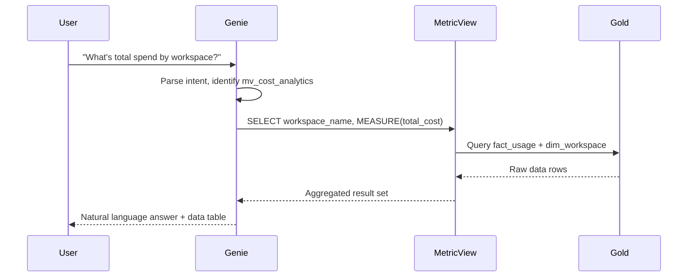
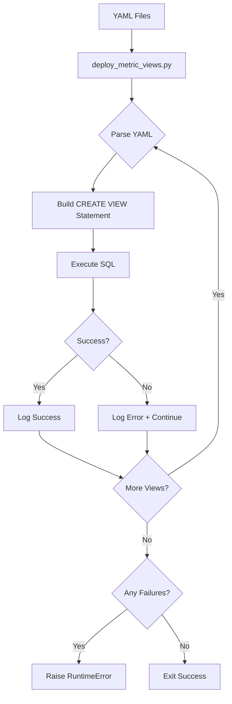

# 22 - Metric Views Architecture

## System Architecture

```
┌─────────────────────────────────────────────────────────────────────────────────┐
│                              USER INTERFACE                                      │
│                                                                                  │
│    ┌─────────────────────────────────────────────────────────────────────────┐  │
│    │                         Genie Space / AI/BI                             │  │
│    │                    (Natural Language Interface)                          │  │
│    │                                                                          │  │
│    │  User: "What's our total spend by workspace this month?"                │  │
│    │                                                                          │  │
│    └────────────────────────────────────┬────────────────────────────────────┘  │
│                                         │                                        │
└─────────────────────────────────────────┼────────────────────────────────────────┘
                                          │
                                          ▼
┌─────────────────────────────────────────────────────────────────────────────────┐
│                           SEMANTIC LAYER                                         │
│                                                                                  │
│    ┌─────────────────────────────────────────────────────────────────────────┐  │
│    │                         Metric Views (mv_*)                              │  │
│    │                                                                          │  │
│    │  Genie generates:                                                       │  │
│    │  SELECT workspace_name, MEASURE(total_cost) as spend                    │  │
│    │  FROM mv_cost_analytics                                                 │  │
│    │  WHERE usage_date >= DATE_TRUNC('month', CURRENT_DATE)                  │  │
│    │  GROUP BY workspace_name                                                │  │
│    │                                                                          │  │
│    │  ┌──────────┐ ┌──────────┐ ┌──────────┐ ┌──────────┐ ┌──────────┐       │  │
│    │  │   Cost   │ │Performance│ │Reliability│ │ Security │ │ Quality  │       │  │
│    │  │ 2 Views  │ │ 3 Views  │ │  1 View  │ │ 2 Views  │ │ 2 Views  │       │  │
│    │  └──────────┘ └──────────┘ └──────────┘ └──────────┘ └──────────┘       │  │
│    └────────────────────────────────────┬────────────────────────────────────┘  │
│                                         │                                        │
└─────────────────────────────────────────┼────────────────────────────────────────┘
                                          │
                                          ▼
┌─────────────────────────────────────────────────────────────────────────────────┐
│                              GOLD LAYER                                          │
│                                                                                  │
│    ┌─────────────────────────────────────────────────────────────────────────┐  │
│    │                         Fact Tables                                      │  │
│    │  ┌───────────┐ ┌─────────────────┐ ┌───────────────┐ ┌──────────────┐   │  │
│    │  │fact_usage │ │fact_job_run_    │ │fact_query_    │ │fact_audit_   │   │  │
│    │  │           │ │timeline         │ │history        │ │logs          │   │  │
│    │  │ Billing   │ │ Job execution   │ │ Query metrics │ │ Security     │   │  │
│    │  │ data      │ │ history         │ │               │ │ events       │   │  │
│    │  └───────────┘ └─────────────────┘ └───────────────┘ └──────────────┘   │  │
│    │  ┌───────────────┐ ┌────────────────┐ ┌────────────────────────────┐    │  │
│    │  │fact_node_     │ │fact_table_     │ │cost_anomaly_predictions    │    │  │
│    │  │timeline       │ │lineage         │ │(ML output)                 │    │  │
│    │  └───────────────┘ └────────────────┘ └────────────────────────────┘    │  │
│    └─────────────────────────────────────────────────────────────────────────┘  │
│                                                                                  │
│    ┌─────────────────────────────────────────────────────────────────────────┐  │
│    │                       Dimension Tables                                   │  │
│    │  ┌─────────────┐ ┌───────────┐ ┌─────────────┐ ┌───────────────┐        │  │
│    │  │dim_workspace│ │dim_job    │ │dim_warehouse│ │dim_cluster    │        │  │
│    │  └─────────────┘ └───────────┘ └─────────────┘ └───────────────┘        │  │
│    └─────────────────────────────────────────────────────────────────────────┘  │
│                                                                                  │
└─────────────────────────────────────────────────────────────────────────────────┘
```

## Data Flow

### Query Path



### Deployment Flow



## YAML Structure

### Standard Template

```yaml
version: "1.1"

comment: >
  PURPOSE: One-line description of what this view provides.
  
  BEST FOR: Question 1 | Question 2 | Question 3 | Question 4
  
  NOT FOR: What this view shouldn't be used for (use alternative instead)
  
  DIMENSIONS: dim1, dim2, dim3, dim4, dim5
  
  MEASURES: measure1, measure2, measure3, measure4, measure5
  
  SOURCE: source_table (domain)
  
  JOINS: dim_table1 (description), dim_table2 (description)
  
  NOTE: Critical caveats or limitations

source: ${catalog}.${gold_schema}.fact_table

joins:
  - name: dim_table
    source: ${catalog}.${gold_schema}.dim_table
    'on': source.fk_column = dim_table.pk_column AND dim_table.is_current = true

dimensions:
  - name: dimension_name
    expr: source.column_name
    comment: Business description for LLM understanding
    display_name: User-Friendly Name
    synonyms:
      - alternative name 1
      - alternative name 2
      - alternative name 3

measures:
  - name: measure_name
    expr: SUM(source.numeric_column)
    comment: Business description and calculation logic
    display_name: User-Friendly Name
    format:
      type: currency
      currency_code: USD
      decimal_places:
        type: exact
        places: 2
      abbreviation: compact
    synonyms:
      - revenue
      - sales
      - total
```

## SQL Generation

The deployment script converts YAML to CREATE VIEW statements:

```sql
CREATE VIEW {catalog}.{gold_schema}.mv_{view_name}
WITH METRICS
LANGUAGE YAML
COMMENT '{escaped_comment}'
AS $$
{yaml_content}
$$
```

### Key Points

1. **`WITH METRICS`** - Identifies as metric view (not regular view)
2. **`LANGUAGE YAML`** - Specifies YAML format
3. **`AS $$ ... $$`** - Dollar-quote delimiters for YAML content
4. **No `name` field in YAML** - Name comes from CREATE VIEW statement

## Column Reference Rules

### Source Table Columns

Always use `source.` prefix:

```yaml
dimensions:
  - name: usage_date
    expr: source.usage_date  # ✅ Correct
    
measures:
  - name: total_cost
    expr: SUM(source.list_cost)  # ✅ Correct
```

### Joined Table Columns

Use join name as prefix:

```yaml
joins:
  - name: dim_workspace
    source: catalog.schema.dim_workspace
    'on': source.workspace_id = dim_workspace.workspace_id

dimensions:
  - name: workspace_name
    expr: dim_workspace.workspace_name  # ✅ Uses join name
```

### ❌ Common Mistakes

```yaml
# WRONG: Using actual table name
expr: fact_usage.list_cost  # ❌

# WRONG: No prefix
expr: list_cost  # ❌

# WRONG: Using 'table' as prefix
expr: table.list_cost  # ❌
```

## Join Patterns

### SCD2 Current Record Join

```yaml
joins:
  - name: dim_workspace
    source: ${catalog}.${gold_schema}.dim_workspace
    'on': source.workspace_id = dim_workspace.workspace_id AND dim_workspace.is_current = true
```

### Multiple Dimension Joins

```yaml
joins:
  - name: dim_workspace
    source: ${catalog}.${gold_schema}.dim_workspace
    'on': source.workspace_id = dim_workspace.workspace_id AND dim_workspace.is_current = true
  
  - name: dim_job
    source: ${catalog}.${gold_schema}.dim_job
    'on': source.job_id = dim_job.job_id AND dim_job.delete_time IS NULL
```

### ⚠️ Transitive Joins NOT Supported

```yaml
# ❌ WRONG: Cannot join dim1 to dim2
joins:
  - name: dim_property
    source: catalog.schema.dim_property
    'on': source.property_id = dim_property.property_id
  
  - name: dim_destination
    source: catalog.schema.dim_destination
    'on': dim_property.destination_id = dim_destination.destination_id  # ❌ Not allowed!
```

**Solution**: Use foreign key directly or denormalize the fact table.

## Format Specifications

### Currency

```yaml
format:
  type: currency
  currency_code: USD
  decimal_places:
    type: exact
    places: 2
  hide_group_separator: false
  abbreviation: compact  # 1.5M instead of 1,500,000
```

### Percentage

```yaml
format:
  type: percentage
  decimal_places:
    type: exact
    places: 1  # 45.3%
```

### Number

```yaml
format:
  type: number
  decimal_places:
    type: all  # Show all decimals
  abbreviation: compact
```

## Querying Metric Views

### Basic Query

```sql
SELECT 
    workspace_name,
    MEASURE(total_cost) as spend
FROM mv_cost_analytics
GROUP BY workspace_name;
```

### With Filters

```sql
SELECT 
    workspace_name,
    MEASURE(total_cost) as spend,
    MEASURE(tag_coverage_pct) as tag_pct
FROM mv_cost_analytics
WHERE usage_date >= CURRENT_DATE - INTERVAL 30 DAYS
GROUP BY workspace_name
ORDER BY spend DESC;
```

## Verification Queries

```sql
-- List all metric views
SHOW VIEWS IN {catalog}.{gold_schema} LIKE 'mv_*';

-- Describe a metric view
DESCRIBE EXTENDED {catalog}.{gold_schema}.mv_cost_analytics;

-- Verify it's a METRIC_VIEW type
SELECT 
    table_name, 
    table_type,
    view_definition
FROM information_schema.views
WHERE table_schema = '{gold_schema}'
  AND table_name LIKE 'mv_%';
```

## Next Steps

- **[23-Metric Views Deployment](23-metric-views-deployment.md)**: How to deploy views
- **[24-Metric Views Reference](24-metric-views-reference.md)**: Complete specifications
- **[Domain Documentation](by-domain/)**: Detailed per-domain guides
