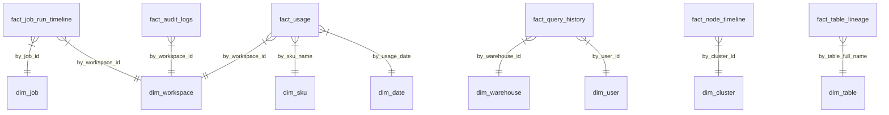

# Databricks Health Monitor Analytics Platform
## Business Onboarding Guide

**Audience:** Data Engineers, Analysts, Data Scientists, Platform Engineers, Finance Teams, Security Teams
**Purpose:** Understand Databricks platform operations and how to leverage the Gold layer for cost optimization, reliability monitoring, security analysis, and performance tuning

---

## Table of Contents

1. [Introduction to Platform Observability](#1-introduction-to-platform-observability)
2. [The Platform Lifecycle (Key Domains)](#2-the-platform-lifecycle-key-domains)
3. [Key Business Entities (Stakeholders)](#3-key-business-entities-stakeholders)
4. [The Gold Layer Data Model (Overview)](#4-the-gold-layer-data-model-overview)
5. [Business Processes & Tracking](#5-business-processes--tracking)
   - [5B. Real-World Scenarios: Following the Data](#5b-real-world-scenarios-following-the-data)
6. [Analytics Use Cases](#6-analytics-use-cases)
7. [AI & ML Opportunities](#7-ai--ml-opportunities)
8. [Self-Service Analytics with Genie](#8-self-service-analytics-with-genie)
9. [Data Quality & Monitoring](#9-data-quality--monitoring)
10. [Getting Started (By Role)](#10-getting-started-by-role)

---

## 1. Introduction to Platform Observability

### What is the Databricks Health Monitor?

The Databricks Health Monitor is an analytics platform built on **System Tables** that provides comprehensive visibility into:

- **Cost Management** - Track DBU consumption, list costs, and budget adherence
- **Job Reliability** - Monitor job success rates, failure patterns, and SLA compliance
- **Query Performance** - Analyze query latency, queue times, and warehouse efficiency
- **Security & Compliance** - Audit user activity, access patterns, and permission changes
- **Cluster Utilization** - Optimize compute resources and identify waste
- **Data Governance** - Track lineage, table usage, and data freshness

### Why This Platform Matters

| Stakeholder | Pain Point Solved |
|-------------|-------------------|
| **Finance** | "How much did each team spend on Databricks this month?" |
| **Platform Team** | "Which jobs are failing most frequently and costing us money?" |
| **Data Engineers** | "Why is my query running slow? Is the warehouse sized correctly?" |
| **Security** | "Who accessed sensitive data after hours?" |
| **Leadership** | "Are we on track to stay within our Databricks commitment?" |

### Data Sources

The platform ingests from Databricks **System Tables**:

| System Table | Domain | Key Information |
|--------------|--------|-----------------|
| `system.billing.usage` | Cost | DBU consumption, list prices, billing records |
| `system.billing.list_prices` | Cost | SKU pricing reference |
| `system.lakeflow.job_run_timeline` | Reliability | Job runs, durations, outcomes |
| `system.compute.clusters` | Compute | Cluster configurations, node types |
| `system.compute.node_timeline` | Compute | CPU/memory utilization over time |
| `system.query.history` | Performance | Query execution details, latency |
| `system.access.audit` | Security | User actions, permission changes |
| `system.access.table_lineage` | Governance | Data flow between tables |
| `system.access.column_lineage` | Governance | Column-level data dependencies |

---

## 2. The Platform Lifecycle (Key Domains)

The Health Monitor tracks six interconnected domains:

```
┌─────────────────────────────────────────────────────────────────────────────────────┐
│                     DATABRICKS HEALTH MONITOR - DOMAIN OVERVIEW                      │
├─────────────────────────────────────────────────────────────────────────────────────┤
│                                                                                     │
│   💰 BILLING                🔄 LAKEFLOW              ⚡ QUERY_PERFORMANCE           │
│   ┌──────────────┐         ┌──────────────┐         ┌──────────────┐              │
│   │  fact_usage  │         │fact_job_run  │         │fact_query    │              │
│   │  fact_prices │         │  _timeline   │         │  _history    │              │
│   │  dim_sku     │         │  dim_job     │         │dim_warehouse │              │
│   │  dim_workspace│        │              │         │              │              │
│   └──────────────┘         └──────────────┘         └──────────────┘              │
│         │                        │                        │                        │
│         │                        │                        │                        │
│         └────────────────────────┼────────────────────────┘                        │
│                                  │                                                  │
│                                  ▼                                                  │
│                     ┌─────────────────────────┐                                    │
│                     │   CENTRAL DIMENSIONS    │                                    │
│                     │  dim_workspace          │                                    │
│                     │  dim_date               │                                    │
│                     │  dim_user               │                                    │
│                     └─────────────────────────┘                                    │
│                                  │                                                  │
│         ┌────────────────────────┼────────────────────────┐                        │
│         │                        │                        │                        │
│         ▼                        ▼                        ▼                        │
│   🖥️ COMPUTE               🔒 SECURITY              📊 GOVERNANCE                  │
│   ┌──────────────┐         ┌──────────────┐         ┌──────────────┐              │
│   │fact_node     │         │fact_audit    │         │fact_table    │              │
│   │  _timeline   │         │  _logs       │         │  _lineage    │              │
│   │  dim_cluster │         │              │         │fact_column   │              │
│   │  dim_node_type│        │              │         │  _lineage    │              │
│   └──────────────┘         └──────────────┘         └──────────────┘              │
│                                                                                     │
└─────────────────────────────────────────────────────────────────────────────────────┘
```

### Domain Descriptions

| Domain | Purpose | Key Questions Answered |
|--------|---------|------------------------|
| **💰 Billing** | Track all Databricks spending | "How much did we spend?" "Which SKUs cost most?" |
| **🔄 Lakeflow** | Monitor job/pipeline reliability | "What's our job success rate?" "Which jobs fail most?" |
| **⚡ Query Performance** | Analyze SQL/warehouse efficiency | "Why are queries slow?" "Which warehouse is overloaded?" |
| **🖥️ Compute** | Optimize cluster resources | "Are clusters right-sized?" "What's our CPU utilization?" |
| **🔒 Security** | Audit access and permissions | "Who accessed what?" "Any suspicious activity?" |
| **📊 Governance** | Track data lineage and freshness | "Where does this data come from?" "Is data fresh?" |

---

## 3. Key Business Entities (Stakeholders)

### Who Uses This Platform?

| Entity | Role | Primary Concerns | Key Tables |
|--------|------|------------------|------------|
| **Platform Engineering** | Maintain Databricks infrastructure | Job reliability, cluster efficiency, cost allocation | `fact_job_run_timeline`, `fact_node_timeline`, `fact_usage` |
| **Data Engineering** | Build and maintain pipelines | Pipeline health, query performance, data freshness | `fact_job_run_timeline`, `fact_query_history`, `fact_table_lineage` |
| **FinOps / Finance** | Control cloud spending | Budget tracking, cost attribution, chargeback | `fact_usage`, `dim_sku`, commit configurations |
| **Security / Compliance** | Ensure data protection | Access auditing, permission changes, anomaly detection | `fact_audit_logs`, `fact_table_lineage` |
| **Data Analysts** | Consume data for insights | Query performance, data availability | `fact_query_history`, `dim_warehouse` |
| **Leadership** | Strategic oversight | KPIs, trends, budget vs actual | All domains (aggregated) |

### Organizational Hierarchy

```
┌─────────────────────────────────────────────────────────────────────────────────────┐
│                           ORGANIZATIONAL CONTEXT                                     │
├─────────────────────────────────────────────────────────────────────────────────────┤
│                                                                                     │
│                               ACCOUNT                                               │
│                                  │                                                  │
│              ┌───────────────────┼───────────────────┐                              │
│              │                   │                   │                              │
│              ▼                   ▼                   ▼                              │
│         WORKSPACE A         WORKSPACE B         WORKSPACE C                         │
│         (Production)        (Development)       (Analytics)                         │
│              │                   │                   │                              │
│         ┌────┴────┐         ┌────┴────┐         ┌────┴────┐                        │
│         │         │         │         │         │         │                        │
│       JOBS     CLUSTERS   JOBS     CLUSTERS   QUERIES   CLUSTERS                   │
│         │         │         │         │         │         │                        │
│       USERS     USERS     USERS     USERS     USERS     USERS                      │
│                                                                                     │
│   Each level generates system table events:                                         │
│   • Account: Billing, audit logs                                                    │
│   • Workspace: Jobs, queries, clusters                                              │
│   • User: Actions, permissions                                                      │
│                                                                                     │
└─────────────────────────────────────────────────────────────────────────────────────┘
```

---

## 4. The Gold Layer Data Model (Overview)

### Domain-Based Organization

The Gold layer organizes tables by business domain:

| Domain | Fact Tables | Dimension Tables | Primary Grain |
|--------|-------------|------------------|---------------|
| **Billing** | `fact_usage`, `fact_list_prices` | `dim_sku`, `dim_workspace` | One row per usage record per day |
| **Lakeflow** | `fact_job_run_timeline` | `dim_job`, `dim_cluster` | One row per job run |
| **Query Performance** | `fact_query_history` | `dim_warehouse`, `dim_user` | One row per query execution |
| **Compute** | `fact_node_timeline` | `dim_cluster`, `dim_node_type` | One row per node per time interval |
| **Security** | `fact_audit_logs` | N/A (embedded dimensions) | One row per audit event |
| **Governance** | `fact_table_lineage`, `fact_column_lineage` | `dim_table` | One row per lineage event |

### SCD Type Strategy

| Table | SCD Type | Rationale |
|-------|----------|-----------|
| `dim_workspace` | Type 2 | Track workspace config changes over time |
| `dim_job` | Type 2 | Track job definition changes |
| `dim_cluster` | Type 2 | Track cluster configuration changes |
| `dim_warehouse` | Type 2 | Track warehouse sizing changes |
| `dim_sku` | Type 2 | Track pricing changes |
| `dim_user` | Type 1 | Current user info sufficient |
| `dim_date` | Type 1 | Static calendar dimension |
| `dim_node_type` | Type 1 | Static reference data |

### Key Relationships



---

## 5. Business Processes & Tracking

### Process 1: Cost Attribution & Chargeback (Finance)

**Business Context:** Finance needs to allocate Databricks costs to teams/projects for budgeting and chargeback.

**Why It Matters:**
- Accurate cost allocation drives accountability
- Budget forecasting requires historical trends
- Commit tracking ensures contract compliance

```
┌─────────────────────────────────────────────────────────────────────────────────────┐
│                        COST ATTRIBUTION FLOW                                         │
├─────────────────────────────────────────────────────────────────────────────────────┤
│                                                                                     │
│  USAGE RECORDED         ENRICHED               AGGREGATED           ATTRIBUTED     │
│  ┌──────────────┐    ┌──────────────┐    ┌──────────────┐    ┌──────────────┐     │
│  │  Raw Usage   │───▶│  With Prices │───▶│  Daily Roll  │───▶│  By Team/    │     │
│  │  (DBUs)      │    │  (list_cost) │    │  -ups        │    │  Project     │     │
│  └──────────────┘    └──────────────┘    └──────────────┘    └──────────────┘     │
│        │                    │                   │                   │              │
│  Source Tables:       Source Tables:      Source Tables:      Source Tables:       │
│  • system.billing     • system.billing    • fact_usage        • fact_usage        │
│    .usage               .list_prices                          • custom_tags       │
│        │                    │                   │                   │              │
│        ▼                    ▼                   ▼                   ▼              │
│  Gold Tables:         Gold Tables:        Gold Tables:        Gold Tables:         │
│  • fact_usage         • fact_list_prices  • fact_usage        • fact_usage        │
│  • dim_sku            • dim_sku           • dim_workspace     • cost dashboards   │
│                                                                                     │
└─────────────────────────────────────────────────────────────────────────────────────┘
```

**Stage-by-Stage Detail:**

| Stage | What Happens | Source Table | Gold Table | Key Fields |
|-------|--------------|--------------|------------|------------|
| **1. Usage Recorded** | Databricks records DBU consumption | `system.billing.usage` | `fact_usage` | `usage_quantity`, `sku_name`, `workspace_id` |
| **2. Enriched** | List prices joined for cost calculation | `system.billing.list_prices` | `fact_list_prices`, `dim_sku` | `list_cost`, `pricing_unit` |
| **3. Aggregated** | Daily rollups by workspace/SKU | `fact_usage` | `fact_usage` (aggregated) | `daily_cost`, `daily_dbu` |
| **4. Attributed** | Custom tags applied for chargeback | `fact_usage` | Dashboard queries | `custom_tags['team']`, `custom_tags['project']` |

**Business Questions Answered:**
- "How much did we spend last month?" → `SELECT SUM(list_cost) FROM fact_usage WHERE usage_date BETWEEN ...`
- "Which team spent the most?" → `GROUP BY custom_tags['team']`
- "Are we on track for our commit?" → Compare `SUM(list_cost)` to commit configuration

---

### Process 2: Job Reliability Monitoring (Platform Engineering)

**Business Context:** Platform team needs to ensure production jobs run successfully and meet SLAs.

**Why It Matters:**
- Failed jobs impact downstream consumers
- Repair costs (retries) add unnecessary expense
- SLA breaches affect business commitments

```
┌─────────────────────────────────────────────────────────────────────────────────────┐
│                        JOB RELIABILITY FLOW                                          │
├─────────────────────────────────────────────────────────────────────────────────────┤
│                                                                                     │
│  JOB SCHEDULED          JOB RUNS            OUTCOME RECORDED      METRICS CALC     │
│  ┌──────────────┐    ┌──────────────┐    ┌──────────────┐    ┌──────────────┐     │
│  │   Job        │───▶│   Task       │───▶│   Success/   │───▶│  Success %   │     │
│  │   Triggered  │    │   Execution  │    │   Failure    │    │  Duration    │     │
│  └──────────────┘    └──────────────┘    └──────────────┘    └──────────────┘     │
│        │                    │                   │                   │              │
│  Source Tables:       Source Tables:      Source Tables:      Metrics:             │
│  • system.lakeflow    • system.lakeflow   • system.lakeflow   • success_rate       │
│    .job_run_timeline    .job_run_timeline   .job_run_timeline • avg_duration       │
│        │                    │                   │              • failure_count     │
│        ▼                    ▼                   ▼                   │              │
│  Gold Tables:         Gold Tables:        Gold Tables:              ▼              │
│  • dim_job            • fact_job_run      • fact_job_run      TVFs & Dashboards   │
│                         _timeline           _timeline                              │
│                                                                                     │
└─────────────────────────────────────────────────────────────────────────────────────┘
```

**Stage-by-Stage Detail:**

| Stage | What Happens | Source Table | Gold Table | Key Fields |
|-------|--------------|--------------|------------|------------|
| **1. Job Scheduled** | Job definition and schedule stored | `system.lakeflow.jobs` | `dim_job` | `job_id`, `job_name`, `schedule` |
| **2. Job Runs** | Each execution creates run record | `system.lakeflow.job_run_timeline` | `fact_job_run_timeline` | `run_id`, `start_time`, `cluster_id` |
| **3. Outcome Recorded** | Final state captured | `system.lakeflow.job_run_timeline` | `fact_job_run_timeline` | `result_state`, `end_time`, `error_message` |
| **4. Metrics Calculated** | Success rates, durations computed | `fact_job_run_timeline` | Metric Views, TVFs | `success_rate`, `p95_duration` |

**Business Questions Answered:**
- "What's our overall job success rate?" → `SELECT COUNT(CASE WHEN result_state='SUCCESS') / COUNT(*) FROM fact_job_run_timeline`
- "Which jobs fail most frequently?" → TVF: `get_failed_jobs(30)`
- "How much did retries cost us?" → TVF: `get_job_repair_costs(30)`

---

### Process 3: Security Audit Trail (Security Team)

**Business Context:** Security needs to audit all user activity for compliance and threat detection.

**Why It Matters:**
- Compliance requirements (SOX, HIPAA, GDPR)
- Insider threat detection
- Access pattern anomaly identification
- Permission change tracking

```
┌─────────────────────────────────────────────────────────────────────────────────────┐
│                        SECURITY AUDIT FLOW                                           │
├─────────────────────────────────────────────────────────────────────────────────────┤
│                                                                                     │
│  USER ACTION           AUDIT LOGGED         ENRICHED            ANALYZED           │
│  ┌──────────────┐    ┌──────────────┐    ┌──────────────┐    ┌──────────────┐     │
│  │  Login/      │───▶│  Event       │───▶│  With User   │───▶│  Anomaly     │     │
│  │  Query/      │    │  Captured    │    │  Context     │    │  Detection   │     │
│  │  Permission  │    │              │    │              │    │              │     │
│  └──────────────┘    └──────────────┘    └──────────────┘    └──────────────┘     │
│        │                    │                   │                   │              │
│  Source Tables:       Source Tables:      Source Tables:      ML Models:           │
│  • (User action)      • system.access     • fact_audit_logs   • Threat Detector   │
│                         .audit            • dim_user          • Behavior Baseline │
│        │                    │                   │                   │              │
│        ▼                    ▼                   ▼                   ▼              │
│  Gold Tables:         Gold Tables:        Gold Tables:        Predictions:         │
│  N/A                  • fact_audit_logs   • fact_audit_logs   • threat_score       │
│                                                                • is_anomaly        │
│                                                                                     │
└─────────────────────────────────────────────────────────────────────────────────────┘
```

**Stage-by-Stage Detail:**

| Stage | What Happens | Source Table | Gold Table | Key Fields |
|-------|--------------|--------------|------------|------------|
| **1. User Action** | Any user action in Databricks | N/A (user activity) | N/A | N/A |
| **2. Audit Logged** | System captures audit event | `system.access.audit` | `fact_audit_logs` | `action_name`, `user_identity`, `request_params` |
| **3. Enriched** | Context added (workspace, user info) | `fact_audit_logs` | `fact_audit_logs` | `workspace_name`, `user_email`, `is_failed_action` |
| **4. Analyzed** | ML models score for anomalies | ML inference tables | `threat_detection_predictions` | `threat_score`, `is_anomaly`, `risk_level` |

**Business Questions Answered:**
- "Who accessed sensitive tables after hours?" → TVF: `get_off_hours_activity(30)`
- "What permission changes happened this week?" → TVF: `get_permission_changes(7)`
- "Any suspicious access patterns?" → ML: `threat_detection_predictions`

---

## 5B. Real-World Scenarios: Following the Data

### 📖 Story 1: "The Budget Breach Alert" — Cost Management in Action

**The Business Context:**
The Engineering team's Databricks spend has been growing 15% week-over-week for the past month. The FinOps team needs to understand why and take action before breaching the quarterly budget.

---

#### Chapter 1: Cost Spike Detected (Monday 8:00 AM)

**What Happens:**
The daily cost monitoring job runs and detects a significant increase in spending.

**In System Tables (Source System):**
```
system.billing.usage:
  usage_date: 2024-01-15
  workspace_id: ws-engineering-prod
  sku_name: JOBS_COMPUTE
  usage_quantity: 450.5 DBU
  usage_metadata.job_id: job-etl-pipeline-001
```

**In Gold Layer:**

| Table | Record Created/Updated | Key Values |
|-------|------------------------|------------|
| `fact_usage` | ✅ New row | `list_cost` = $225.25, `workspace_id` = 'ws-engineering-prod' |

**Analytics Impact:**
- `cost_7d_vs_prior_7d_growth_pct` increases to 32%
- WoW Growth Alert (COST-015) triggers at threshold > 30%
- Slack notification sent to #finops-alerts

---

#### Chapter 2: Investigation Begins (Monday 9:00 AM)

**What Happens:**
FinOps analyst opens the Cost Intelligence Dashboard and drills down by job.

**Genie Query:**
> "Which jobs had the highest cost increase in the last 7 days compared to prior 7 days?"

**TVF Called:** `get_cost_growth_by_period('job', 7, 7, 20)`

**Results:**
```
| job_id               | job_name           | current_7d_cost | prior_7d_cost | growth_pct |
|----------------------|--------------------|-----------------| --------------|------------|
| job-etl-pipeline-001 | ETL Main Pipeline  | $1,575.00       | $650.00       | 142%       |
| job-ml-training-002  | ML Model Training  | $890.00         | $420.00       | 112%       |
```

---

#### Chapter 3: Root Cause Identified (Monday 10:00 AM)

**What Happens:**
Deep dive reveals the ETL pipeline job has 3x more run attempts due to increased failures and retries.

**In Gold Layer:**

| Table | Query | Finding |
|-------|-------|---------|
| `fact_job_run_timeline` | `get_job_retry_analysis(30)` | Job has 45% retry rate (up from 5%) |
| `fact_job_run_timeline` | `get_job_failure_trends(30)` | Failures started Jan 10 (data source issue) |

**Analytics Impact:**
- Root cause: Upstream data source started sending malformed records
- Repair cost identified: $925 in unnecessary retries

---

#### Chapter 4: Resolution & Prevention (Monday 2:00 PM)

**What Happens:**
Data Engineering fixes the upstream issue. Alert threshold adjusted.

**Actions Taken:**
1. Data validation added to ETL pipeline
2. Alert created for retry rate > 10%
3. Budget forecast updated

**In Gold Layer:**

| Table | Record Updated | Key Values |
|-------|----------------|------------|
| `alert_configurations` | ✅ New alert | `RELIABILITY-NEW`: Retry rate > 10% WARNING |
| (Next day) `fact_job_run_timeline` | ✅ New rows | `retry_count` = 0, `result_state` = 'SUCCESS' |

---

#### Story Summary: Data Journey Visualization

```
┌─────────────────────────────────────────────────────────────────────────────────────┐
│                    BUDGET BREACH ALERT: DATA TRAIL THROUGH GOLD LAYER               │
├─────────────────────────────────────────────────────────────────────────────────────┤
│                                                                                     │
│  TIME        EVENT                        TABLES UPDATED                            │
│  ───────────────────────────────────────────────────────────────────────────────   │
│  08:00       Daily cost job runs          fact_usage (new records)                  │
│  08:05       Alert COST-015 triggers      alert_history (new alert)                 │
│  09:00       Analyst queries dashboard    (read-only)                               │
│  10:00       Retry analysis performed     (read-only from fact_job_run_timeline)    │
│  14:00       New alert configured         alert_configurations (new row)            │
│  Next day    Job runs successfully        fact_job_run_timeline (new rows)          │
│                                                                                     │
│  TOTAL: 3 tables touched, 1 new alert created                                       │
│                                                                                     │
└─────────────────────────────────────────────────────────────────────────────────────┘
```

---

### 📖 Story 2: "The Runaway Query" — Performance Troubleshooting

**The Business Context:**
A data analyst reports that their dashboard is timing out. The query that used to take 30 seconds now takes 15 minutes.

---

#### Chapter 1: Issue Reported (Tuesday 2:00 PM)

**What Happens:**
Analyst submits ticket: "Dashboard XYZ is broken - queries timing out."

**In System Tables (Source System):**
```
system.query.history:
  query_id: qry-dashboard-xyz-001
  warehouse_id: wh-analytics-small
  execution_status: FINISHED
  total_duration_ms: 892000  (14.8 minutes)
  read_bytes: 450000000000  (450 GB)
  result_fetch_time_ms: 12000
```

**In Gold Layer:**

| Table | Record Created | Key Values |
|-------|----------------|------------|
| `fact_query_history` | ✅ New row | `total_duration_ms` = 892000, `read_bytes` = 450GB |

---

#### Chapter 2: Query Analysis (Tuesday 2:15 PM)

**What Happens:**
Platform engineer investigates using Query Performance Dashboard.

**TVF Called:** `get_slow_queries(1, 60000)`  (queries > 60 seconds in last day)

**Results:**
```
| query_id              | total_duration_ms | read_bytes | spill_bytes | queue_time_ms |
|-----------------------|-------------------|------------|-------------|---------------|
| qry-dashboard-xyz-001 | 892000            | 450 GB     | 120 GB      | 5000          |
| qry-dashboard-xyz-002 | 756000            | 380 GB     | 95 GB       | 4500          |
```

**Observation:** Queries have massive data spill (120GB to disk)

---

#### Chapter 3: Warehouse Analysis (Tuesday 2:30 PM)

**What Happens:**
Check warehouse sizing and queue times.

**TVF Called:** `get_warehouse_utilization(7)`

**Results:**
```
| warehouse_id        | avg_queue_time_ms | avg_queries_per_hour | p95_duration_ms | size |
|---------------------|-------------------|----------------------|-----------------|------|
| wh-analytics-small  | 4500              | 245                  | 450000          | Small|
```

**Finding:** Queue time is high (4.5 seconds avg) and warehouse is undersized for workload.

---

#### Chapter 4: Resolution (Tuesday 3:00 PM)

**What Happens:**
Warehouse scaled from Small to Medium. Query optimized.

**Actions Taken:**
1. Warehouse resized from Small → Medium
2. Query rewritten to add partition pruning (date filter)
3. Materialized view created for pre-aggregation

**After Resolution:**
```
| query_id              | total_duration_ms | read_bytes | spill_bytes |
|-----------------------|-------------------|------------|-------------|
| qry-dashboard-xyz-001 | 28000             | 2.5 GB     | 0           |
```

**Analytics Impact:**
- Query duration: 14.8 minutes → 28 seconds (97% improvement)
- Data scanned: 450 GB → 2.5 GB (99% reduction)
- Spill: 120 GB → 0

---

### 📖 Story 3: "The After-Hours Access" — Security Investigation

**The Business Context:**
Security team notices unusual access to the customer PII table at 2 AM on a Sunday. They need to investigate if this is a threat.

---

#### Chapter 1: Anomaly Detected (Monday 6:00 AM)

**What Happens:**
Daily security scan identifies off-hours access to sensitive tables.

**In System Tables (Source System):**
```
system.access.audit:
  event_time: 2024-01-14 02:15:00
  action_name: selectTable
  request_params.full_name_arg: catalog.schema.customer_pii
  user_identity.email: john.doe@company.com
  source_ip_address: 203.0.113.42
```

**In Gold Layer:**

| Table | Record Created | Key Values |
|-------|----------------|------------|
| `fact_audit_logs` | ✅ New row | `action_name` = 'selectTable', `is_off_hours` = TRUE |

**Alert Triggered:** SEC-003 "Off-hours sensitive table access"

---

#### Chapter 2: Investigation (Monday 9:00 AM)

**What Happens:**
Security analyst investigates the access pattern.

**TVF Called:** `get_off_hours_activity(7)`

**Results:**
```
| user_email           | action_name  | table_accessed        | event_time          | source_ip      |
|----------------------|--------------|----------------------|---------------------|----------------|
| john.doe@company.com | selectTable  | customer_pii         | 2024-01-14 02:15:00 | 203.0.113.42   |
| john.doe@company.com | selectTable  | customer_pii         | 2024-01-14 02:18:00 | 203.0.113.42   |
| john.doe@company.com | downloadFile | customer_pii_export  | 2024-01-14 02:22:00 | 203.0.113.42   |
```

**Red Flags:**
- 3 consecutive accesses within 7 minutes
- Included a download/export action
- Unknown IP address (not in corporate range)

---

#### Chapter 3: ML Threat Assessment (Monday 9:30 AM)

**What Happens:**
ML model scores the activity for threat risk.

**ML Model:** `threat_detection_predictions`

**Results:**
```
| user_email           | threat_score | is_anomaly | risk_level | contributing_factors                    |
|----------------------|--------------|------------|------------|------------------------------------------|
| john.doe@company.com | 0.87         | TRUE       | HIGH       | off_hours, new_ip, sensitive_table, export|
```

---

#### Chapter 4: Resolution (Monday 11:00 AM)

**What Happens:**
After investigation, determined to be legitimate (employee traveling in different timezone, using hotel WiFi).

**Actions Taken:**
1. User confirmed legitimate business need
2. IP address added to known travel patterns
3. Alert threshold adjusted for this user
4. Recommendation: VPN required for sensitive data access when traveling

**In Gold Layer:**

| Table | Record Updated | Key Values |
|-------|----------------|------------|
| `user_travel_whitelist` | ✅ New row | `user_email` = 'john.doe@company.com', `notes` = 'Travel 2024-01-13 to 2024-01-18' |

---

## 6. Analytics Use Cases

### Cost Analytics

| Use Case | Question | TVF/Query |
|----------|----------|-----------|
| **Top Cost Contributors** | "Which jobs cost the most?" | `get_most_expensive_jobs(30, 20)` |
| **Cost by Tag** | "How much did each team spend?" | `get_cost_by_tag('team', 30)` |
| **Period Comparison** | "How does this month compare to last?" | `get_cost_growth_by_period('all', 30, 30, 100)` |
| **Untagged Resources** | "What spend can't be attributed?" | `get_untagged_resources(30)` |
| **Commit Tracking** | "Are we on track for commit?" | `get_commit_vs_actual()` |

### Reliability Analytics

| Use Case | Question | TVF/Query |
|----------|----------|-----------|
| **Failed Jobs** | "What jobs failed today?" | `get_failed_jobs(1)` |
| **Success Rate Trends** | "Is reliability improving?" | `get_job_success_rate(30)` |
| **Repair Costs** | "How much did retries cost?" | `get_job_repair_costs(30)` |
| **SLA Compliance** | "Are we meeting SLAs?" | `get_job_sla_compliance(30)` |
| **Duration Outliers** | "Any jobs running longer than normal?" | `get_job_duration_percentiles(30)` |

### Performance Analytics

| Use Case | Question | TVF/Query |
|----------|----------|-----------|
| **Slow Queries** | "What queries are slow?" | `get_slow_queries(7, 60000)` |
| **Warehouse Utilization** | "Are warehouses right-sized?" | `get_warehouse_utilization(7)` |
| **Queue Times** | "Are users waiting in queue?" | Metric View: `query_performance` |
| **Spill Analysis** | "Which queries spill to disk?" | `get_high_spill_queries(7)` |
| **User Patterns** | "Who runs the most queries?" | `get_user_query_summary(30)` |

### Security Analytics

| Use Case | Question | TVF/Query |
|----------|----------|-----------|
| **User Activity** | "What did this user do?" | `get_user_activity_summary('user@email.com', 30)` |
| **Sensitive Access** | "Who accessed PII tables?" | `get_sensitive_table_access(30)` |
| **Off-Hours Activity** | "Any suspicious access times?" | `get_off_hours_activity(30)` |
| **Permission Changes** | "What grants/revokes happened?" | `get_permission_changes(7)` |
| **IP Analysis** | "Any unusual IP addresses?" | `get_ip_address_analysis(30)` |

---

## 7. AI & ML Opportunities

### Deployed ML Models (18 Models)

| Domain | Model | Purpose | Output |
|--------|-------|---------|--------|
| **Cost** | Cost Anomaly Detector | Identify unusual spending patterns | `anomaly_score`, `is_anomaly` |
| **Cost** | Budget Forecaster | Predict monthly spend | `predicted_spend`, `confidence` |
| **Cost** | Job Cost Optimizer | Recommend cost savings | `savings_potential`, `recommendation` |
| **Security** | Threat Detector | Identify security threats | `threat_score`, `risk_level` |
| **Security** | User Behavior Baseline | Detect abnormal user activity | `deviation_score` |
| **Security** | Exfiltration Detector | Identify potential data leaks | `exfil_risk_score` |
| **Performance** | Query Forecaster | Predict query duration | `predicted_duration_ms` |
| **Performance** | Warehouse Optimizer | Recommend sizing | `recommended_size` |
| **Reliability** | Failure Predictor | Predict job failures before run | `failure_probability` |
| **Reliability** | SLA Breach Predictor | Predict SLA violations | `breach_probability` |

### Using ML Predictions

**Example: Cost Anomaly Detection**
```sql
-- Find all anomalous usage records today
SELECT
    u.workspace_id,
    u.job_id,
    u.list_cost,
    p.anomaly_score,
    p.is_anomaly
FROM fact_usage u
JOIN cost_anomaly_predictions p
    ON u.workspace_id = p.workspace_id
    AND u.usage_date = p.usage_date
WHERE p.is_anomaly = TRUE
    AND u.usage_date = CURRENT_DATE()
ORDER BY p.anomaly_score DESC
```

---

## 8. Self-Service Analytics with Genie

### Genie Spaces Available

| Space | Audience | TVFs Included | Metric Views |
|-------|----------|---------------|--------------|
| **Cost Analyst** | Finance, FinOps | All `get_cost_*` TVFs | `cost_analytics` |
| **Platform Ops** | Platform Engineering | Job/warehouse TVFs | `job_performance` |
| **Security Analyst** | Security Team | All `get_*_access*` TVFs | `security_events` |
| **Executive** | Leadership | All TVFs (summary) | All metric views |

### Natural Language Query Examples

| Question | What Genie Returns |
|----------|-------------------|
| "How much did we spend last month?" | Total cost from `cost_analytics` |
| "Which jobs failed yesterday?" | Results from `get_failed_jobs(1)` |
| "Show me slow queries this week" | Results from `get_slow_queries(7, 60000)` |
| "Who accessed customer_pii table?" | Results from `get_sensitive_table_access(30)` |
| "What's our job success rate?" | Calculation from `job_performance` metric view |

### Genie Best Practices

1. **Use Synonyms** - Metric views include synonyms for natural language
2. **Be Specific** - "cost last 7 days" vs "cost" gives better results
3. **Leverage TVFs** - For complex queries, ask Genie to call specific TVFs
4. **Check Dimensions** - Filter by workspace, job, user for specificity

---

## 9. Data Quality & Monitoring

### Lakehouse Monitors Deployed

| Monitor | Table | Key Metrics | Alert Threshold |
|---------|-------|-------------|-----------------|
| **Cost Monitor** | `fact_usage` | `daily_cost`, `tag_coverage` | Growth > 30% WoW |
| **Job Monitor** | `fact_job_run_timeline` | `success_rate`, `failure_count` | Success < 95% |
| **Query Monitor** | `fact_query_history` | `p95_duration`, `spill_rate` | P95 > 5 minutes |
| **Security Monitor** | `fact_audit_logs` | `event_count`, `failed_actions` | Failed > 10% |
| **ML Monitor** | `cost_anomaly_predictions` | `MAE`, `anomaly_rate` | MAE drift > 20% |

### Data Freshness SLAs

| Table | Update Frequency | Freshness SLA |
|-------|------------------|---------------|
| `fact_usage` | Daily (6 AM UTC) | < 24 hours |
| `fact_job_run_timeline` | Hourly | < 2 hours |
| `fact_query_history` | Hourly | < 2 hours |
| `fact_audit_logs` | Hourly | < 2 hours |
| ML predictions | Daily (3 AM UTC) | < 24 hours |

### Alert Configuration

See [Alerting Framework Plan](../plans/phase3-addendum-3.7-alerting-framework.md) for complete alert definitions.

---

## 10. Getting Started (By Role)

### For Data Engineers

**First Steps:**
1. Review Gold layer ERD at `gold_layer_design/erd_master.md`
2. Understand YAML schemas at `gold_layer_design/yaml/`
3. Run sample TVF queries to explore data
4. Review merge scripts at `src/gold/merge_*.py`

**Key Resources:**
- Column lineage: `gold_layer_design/COLUMN_LINEAGE.md`
- Schema validation: `tests/gold/test_gold_schema.py`
- Merge patterns: `.cursor/rules/gold/10-gold-layer-merge-patterns.mdc`

### For Data Analysts

**First Steps:**
1. Access Genie Space for your domain (Cost Analyst, Platform Ops, etc.)
2. Try natural language queries: "Show me cost trend last 30 days"
3. Explore pre-built dashboards in AI/BI workspace
4. Review TVF documentation for advanced queries

**Key Resources:**
- TVF reference: `src/tvfs/*.sql`
- Metric view definitions: `src/metric_views/*.yaml`
- Sample queries in this guide (Section 6)

### For Data Scientists

**First Steps:**
1. Review feature tables at `src/ml/features/`
2. Understand ML model catalog at `src/ml/`
3. Access training notebooks for each domain
4. Review inference pipeline at `src/ml/inference/`

**Key Resources:**
- Feature engineering: `src/ml/common/feature_utils.py`
- MLflow patterns: `.cursor/rules/ml/27-mlflow-mlmodels-patterns.mdc`
- Model serving endpoints: `src/ml/deployment/`

### For Business Users

**First Steps:**
1. Access appropriate Genie Space (ask your admin)
2. Ask questions in natural language
3. Explore pre-built dashboards
4. Request new metrics/dashboards as needed

**Key Resources:**
- This guide (Sections 1-6)
- Dashboard catalog in AI/BI workspace
- Contact platform-team@company.com for support

---

## Appendix A: Quick Reference Tables

### Gold Layer Table Summary

| Table | Domain | Grain | Key Measures |
|-------|--------|-------|--------------|
| `fact_usage` | Billing | Usage record/day | `list_cost`, `usage_quantity` |
| `fact_list_prices` | Billing | SKU/date | `pricing` |
| `fact_job_run_timeline` | Lakeflow | Job run | `run_duration`, `result_state` |
| `fact_query_history` | Performance | Query | `total_duration_ms`, `read_bytes` |
| `fact_node_timeline` | Compute | Node/interval | `cpu_user`, `memory_used` |
| `fact_audit_logs` | Security | Event | `action_name`, `response_code` |
| `fact_table_lineage` | Governance | Lineage event | `source_table`, `target_table` |
| `fact_column_lineage` | Governance | Column lineage | `source_column`, `target_column` |

### TVF Quick Reference

| Category | TVF Count | Top TVFs |
|----------|-----------|----------|
| **Cost** | 13 | `get_top_cost_contributors`, `get_cost_by_tag`, `get_commit_vs_actual` |
| **Reliability** | 12 | `get_failed_jobs`, `get_job_success_rate`, `get_job_repair_costs` |
| **Performance** | 8 | `get_slow_queries`, `get_warehouse_utilization`, `get_high_spill_queries` |
| **Security** | 8 | `get_user_activity_summary`, `get_permission_changes`, `get_off_hours_activity` |
| **Compute** | 5 | `get_cluster_utilization`, `get_underutilized_clusters` |
| **Quality** | 5 | `get_table_freshness`, `get_data_quality_summary` |

---

## Appendix B: Glossary

| Term | Definition |
|------|------------|
| **DBU** | Databricks Unit - unit of compute consumption |
| **List Cost** | Pre-calculated cost based on list prices (DBU × price) |
| **SCD Type 2** | Slowly Changing Dimension that tracks history with effective dates |
| **TVF** | Table-Valued Function - parameterized SQL function returning table |
| **Metric View** | Semantic layer defining measures and dimensions for Genie |
| **Genie** | Databricks natural language query interface |
| **Lakehouse Monitor** | Automated data quality and drift detection |
| **Commit** | Contractual spending commitment to Databricks |

---

## Appendix C: Key Insights from Industry Sources

### Recommended Thresholds (Validated by Databricks SME Team)

| Metric | Threshold | Severity | Source |
|--------|-----------|----------|--------|
| Long-running query | 60 seconds | WARNING | DBSQL SME Blog |
| P95 queue time | >30 seconds | WARNING | Warehouse Advisor |
| Queue time ratio | >10% of runtime | WARNING | Warehouse Advisor |
| CPU saturation | >90% time | CRITICAL | Workflow Advisor |
| CPU idle (waste) | >70% time | INFO | Workflow Advisor |
| Spill rate | >10% queries | WARNING | Warehouse Advisor |
| WoW cost growth | >30% | WARNING | Dashboard patterns |
| Duration regression | >50% increase | WARNING | Workflow Advisor |

### Best Practice: Cluster Types for Cost Efficiency
From the Workflow Advisor blog: **"ALL PURPOSE CLUSTERS warrant scrutiny due to cost inefficiency compared to job-specific clusters."**

- Use **Job Clusters** for scheduled workflows (auto-terminate, right-sized)
- Reserve **All-Purpose Clusters** for interactive development only
- Monitor ALL_PURPOSE SKU costs in `fact_usage` for optimization opportunities

### Best Practice: Query Performance Monitoring
From the DBSQL Warehouse Advisor v5 blog:
- Track both **P95 and P99 percentiles** for comprehensive SLA monitoring
- Monitor **QPS/QPM metrics** for throughput analysis
- Use **spill rate** as indicator of warehouse undersizing

---

## Appendix D: Additional References

### GitHub Repositories
- [system-tables-audit-logs](https://github.com/andyweaves/system-tables-audit-logs) - Security monitoring patterns
- [DBSQL Warehouse Advisor](https://github.com/CodyAustinDavis/dbsql_sme) - Query efficiency analysis
- [Workflow Advisor](https://github.com/yati1002/Workflowadvisor) - Job optimization patterns

### Blog Posts (Databricks SME Engineering)
- [DBSQL Warehouse Advisor v5](https://medium.com/dbsql-sme-engineering/the-dbsql-warehouse-advisor-dashboard-v5-multi-warehouse-analytics-ef4f07578ac1)
- [Real-Time Query Monitoring with Alerts](https://medium.com/dbsql-sme-engineering/real-time-query-monitoring-on-dbsql-with-alerts-24e4e7e4a904)
- [Workflow Advisor Dashboard](https://medium.com/dbsql-sme-engineering/analyzing-workflows-in-dbsql-with-the-workflows-advisor-dashboard-95fee9f01fe6)

### Official Databricks Documentation
- [System Tables Documentation](https://docs.databricks.com/en/administration-guide/system-tables/index.html)
- [Lakehouse Monitoring](https://docs.databricks.com/lakehouse-monitoring)
- [Metric Views](https://docs.databricks.com/metric-views)
- [Genie](https://docs.databricks.com/genie)

---

*Last Updated: 2024-12-19*
*Maintained by: Platform Engineering Team*
*Contact: platform-team@company.com*
