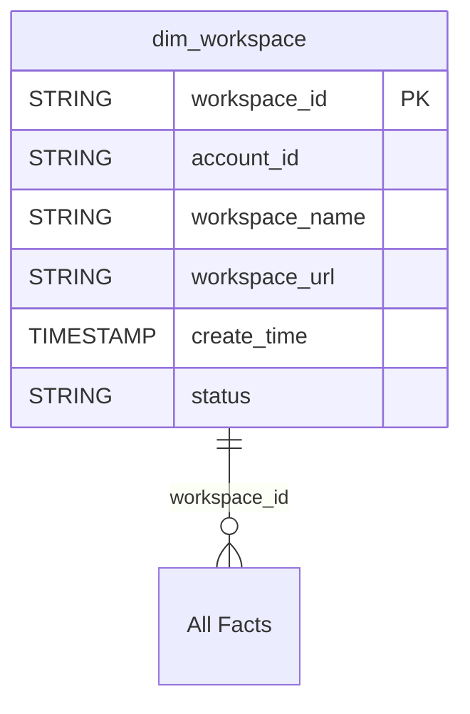

# Gold Layer ERD Index

## Overview

Entity Relationship Diagrams for the Gold layer dimensional model, organized by business domain.

## Master ERD

📊 **[00_master_erd.md](00_master_erd.md)** - Complete ERD showing all 37 tables and relationships

## Domain ERDs

| # | Domain | Tables | ERD File |
|---|--------|--------|----------|
| 1 | [Lakeflow](01_lakeflow_erd.md) | 6 | Jobs, tasks, pipelines |
| 2 | [Query Performance](02_query_performance_erd.md) | 3 | Warehouses, queries |
| 3 | [Billing](03_billing_erd.md) | 4 | SKUs, usage, pricing |
| 4 | [Compute](04_compute_erd.md) | 3 | Clusters, nodes |
| 5 | [Governance](05_governance_erd.md) | 2 | Lineage tracking |
| 6 | [MLflow](06_mlflow_erd.md) | 3 | Experiments, runs |
| 7 | [Model Serving](07_model_serving_erd.md) | 3 | Endpoints, usage |
| 8 | [Security](08_security_erd.md) | 5 | Audit, network access |
| 9 | [Marketplace](09_marketplace_erd.md) | 2 | Listings, funnel |
| 10 | [Data Quality](10_data_quality_erd.md) | 2 | DQ monitoring |
| 11 | [Data Classification](11_data_classification_erd.md) | 2 | Classification results |
| 12 | [Storage](12_storage_erd.md) | 1 | Predictive optimization |
| 13 | [Shared](13_shared_erd.md) | 1 | Workspace dimension |

## Central Dimension

All domains reference the shared `dim_workspace` dimension:

## Relationship Summary

| Relationship Type | Count |
|------------------|-------|
| Dimension → Fact | ~25 |
| Cross-domain (via workspace) | 12 |
| Total FKs | ~40 |

