# Gold Layer Master ERD

## Overview

Complete entity relationship diagram for the Databricks Health Monitor Gold layer, showing all 37 tables across 13 domains.

## Summary Statistics

| Metric | Count |
|--------|-------|
| **Total Tables** | 37 |
| **Dimensions** | 12 |
| **Facts** | 25 |
| **Domains** | 13 |
| **FK Relationships** | ~40 |

## Master Entity Relationship Diagram

```mermaid
erDiagram
    %% ============================================
    %% SHARED DOMAIN (Central Hub)
    %% ============================================
    dim_workspace {
        STRING workspace_id PK
        STRING account_id
        STRING workspace_name
        STRING workspace_url
        TIMESTAMP create_time
        STRING status
    }

    %% ============================================
    %% COMPUTE DOMAIN
    %% ============================================
    dim_node_type {
        STRING node_type_id PK
        STRING category
        INT num_cores
        DOUBLE memory_mb
    }

    dim_cluster {
        STRING workspace_id PK
        STRING cluster_id PK
        STRING cluster_name
        STRING node_type_id FK
        STRING spark_version
    }

    fact_node_timeline {
        STRING workspace_id PK
        STRING cluster_id FK
        TIMESTAMP start_time PK
        STRING node_id
        STRING state
    }

    %% ============================================
    %% LAKEFLOW DOMAIN
    %% ============================================
    dim_job {
        STRING workspace_id PK
        STRING job_id PK
        STRING job_name
        STRING creator_user_name
    }

    dim_job_task {
        STRING workspace_id PK
        STRING job_id PK
        STRING task_key PK
        STRING task_type
    }

    dim_pipeline {
        STRING workspace_id PK
        STRING pipeline_id PK
        STRING pipeline_name
        STRING pipeline_type
    }

    fact_job_run_timeline {
        STRING workspace_id PK
        STRING run_id PK
        STRING job_id FK
        STRING result_state
        STRING trigger_type
    }

    fact_job_task_run_timeline {
        STRING workspace_id PK
        STRING run_id PK
        STRING task_run_id PK
        STRING job_id FK
        STRING task_key FK
    }

    fact_pipeline_update_timeline {
        STRING workspace_id PK
        STRING pipeline_id FK
        STRING update_id PK
        STRING state
    }

    %% ============================================
    %% QUERY PERFORMANCE DOMAIN
    %% ============================================
    dim_warehouse {
        STRING workspace_id PK
        STRING warehouse_id PK
        STRING warehouse_name
        STRING warehouse_type
    }

    fact_query_history {
        STRING workspace_id PK
        STRING statement_id PK
        STRING warehouse_id FK
        STRING user_name
        BIGINT execution_time_ms
    }

    fact_warehouse_events {
        STRING workspace_id PK
        STRING warehouse_id FK
        STRING event_type PK
        TIMESTAMP event_time PK
    }

    %% ============================================
    %% BILLING DOMAIN
    %% ============================================
    dim_sku {
        STRING sku_name PK
        STRING billing_type
        STRING usage_unit
    }

    fact_usage {
        STRING workspace_id PK
        STRING sku_name FK
        DATE usage_date PK
        DOUBLE usage_quantity
    }

    fact_list_prices {
        STRING sku_name FK
        STRING currency_code PK
        DATE price_start_time PK
        DOUBLE list_price
    }

    fact_account_prices {
        STRING account_id PK
        STRING sku_name FK
        DATE price_start_time PK
        DOUBLE account_price
    }

    %% ============================================
    %% MLFLOW DOMAIN
    %% ============================================
    dim_experiment {
        STRING workspace_id PK
        STRING experiment_id PK
        STRING experiment_name
        STRING lifecycle_stage
    }

    fact_mlflow_runs {
        STRING workspace_id PK
        STRING run_id PK
        STRING experiment_id FK
        STRING status
    }

    fact_mlflow_run_metrics_history {
        STRING workspace_id PK
        STRING run_id FK
        STRING metric_key PK
        DOUBLE metric_value
    }

    %% ============================================
    %% MODEL SERVING DOMAIN
    %% ============================================
    dim_served_entities {
        STRING workspace_id PK
        STRING endpoint_name PK
        STRING served_entity_name PK
        STRING entity_type
    }

    fact_endpoint_usage {
        STRING workspace_id PK
        STRING endpoint_name FK
        DATE usage_date PK
        BIGINT request_count
    }

    fact_payload_logs {
        STRING workspace_id PK
        STRING endpoint_name FK
        STRING request_id PK
        DOUBLE execution_time_ms
    }

    %% ============================================
    %% GOVERNANCE DOMAIN
    %% ============================================
    fact_table_lineage {
        STRING workspace_id PK
        STRING source_table_full_name
        STRING target_table_full_name
        TIMESTAMP event_time PK
    }

    fact_column_lineage {
        STRING workspace_id PK
        STRING source_column_name
        STRING target_column_name
        TIMESTAMP event_time PK
    }

    %% ============================================
    %% SECURITY DOMAIN
    %% ============================================
    fact_audit_logs {
        STRING workspace_id PK
        STRING request_id PK
        STRING action_name
        STRING user_identity
    }

    fact_assistant_events {
        STRING workspace_id PK
        STRING request_id PK
        STRING event_type
        STRING user_id
    }

    fact_clean_room_events {
        STRING workspace_id PK
        STRING event_id PK
        STRING clean_room_name
        STRING event_type
    }

    fact_inbound_network {
        STRING workspace_id PK
        STRING denied_entity_id PK
        TIMESTAMP event_time PK
        STRING source_ip
    }

    fact_outbound_network {
        STRING workspace_id PK
        STRING denied_entity_id PK
        TIMESTAMP event_time PK
        STRING dest_host
    }

    %% ============================================
    %% MARKETPLACE DOMAIN
    %% ============================================
    fact_listing_access {
        STRING workspace_id PK
        STRING listing_id PK
        TIMESTAMP access_time PK
        STRING access_type
    }

    fact_listing_funnel {
        STRING workspace_id PK
        STRING listing_id PK
        STRING event_type PK
        BIGINT event_count
    }

    %% ============================================
    %% DATA QUALITY DOMAIN
    %% ============================================
    fact_data_quality_monitoring_table_results {
        STRING workspace_id PK
        STRING table_name
        TIMESTAMP event_time PK
        STRING status
    }

    fact_dq_monitoring {
        STRING workspace_id PK
        STRING monitor_id PK
        TIMESTAMP event_time PK
        STRING status
    }

    %% ============================================
    %% DATA CLASSIFICATION DOMAIN
    %% ============================================
    fact_data_classification {
        STRING workspace_id PK
        STRING table_name
        TIMESTAMP event_time PK
        STRING classification_status
    }

    fact_data_classification_results {
        STRING workspace_id PK
        STRING column_name
        TIMESTAMP event_time PK
        STRING pii_type
    }

    %% ============================================
    %% STORAGE DOMAIN
    %% ============================================
    fact_predictive_optimization {
        STRING workspace_id PK
        STRING table_name
        TIMESTAMP start_time PK
        STRING operation_type
        STRING status
    }

    %% ============================================
    %% RELATIONSHIPS - Workspace Hub
    %% ============================================
    dim_workspace ||--o{ dim_cluster : "workspace_id"
    dim_workspace ||--o{ dim_job : "workspace_id"
    dim_workspace ||--o{ dim_pipeline : "workspace_id"
    dim_workspace ||--o{ dim_warehouse : "workspace_id"
    dim_workspace ||--o{ dim_experiment : "workspace_id"
    dim_workspace ||--o{ dim_served_entities : "workspace_id"
    dim_workspace ||--o{ fact_usage : "workspace_id"
    dim_workspace ||--o{ fact_table_lineage : "workspace_id"
    dim_workspace ||--o{ fact_column_lineage : "workspace_id"
    dim_workspace ||--o{ fact_audit_logs : "workspace_id"
    dim_workspace ||--o{ fact_assistant_events : "workspace_id"
    dim_workspace ||--o{ fact_clean_room_events : "workspace_id"
    dim_workspace ||--o{ fact_inbound_network : "workspace_id"
    dim_workspace ||--o{ fact_outbound_network : "workspace_id"
    dim_workspace ||--o{ fact_listing_access : "workspace_id"
    dim_workspace ||--o{ fact_listing_funnel : "workspace_id"
    dim_workspace ||--o{ fact_data_quality_monitoring_table_results : "workspace_id"
    dim_workspace ||--o{ fact_dq_monitoring : "workspace_id"
    dim_workspace ||--o{ fact_data_classification : "workspace_id"
    dim_workspace ||--o{ fact_data_classification_results : "workspace_id"
    dim_workspace ||--o{ fact_predictive_optimization : "workspace_id"

    %% ============================================
    %% RELATIONSHIPS - Compute
    %% ============================================
    dim_node_type ||--o{ dim_cluster : "node_type_id"
    dim_cluster ||--o{ fact_node_timeline : "workspace_id, cluster_id"

    %% ============================================
    %% RELATIONSHIPS - Lakeflow
    %% ============================================
    dim_job ||--o{ dim_job_task : "workspace_id, job_id"
    dim_job ||--o{ fact_job_run_timeline : "workspace_id, job_id"
    dim_job_task ||--o{ fact_job_task_run_timeline : "workspace_id, job_id, task_key"
    dim_pipeline ||--o{ fact_pipeline_update_timeline : "workspace_id, pipeline_id"

    %% ============================================
    %% RELATIONSHIPS - Query Performance
    %% ============================================
    dim_warehouse ||--o{ fact_query_history : "workspace_id, warehouse_id"
    dim_warehouse ||--o{ fact_warehouse_events : "workspace_id, warehouse_id"

    %% ============================================
    %% RELATIONSHIPS - Billing
    %% ============================================
    dim_sku ||--o{ fact_usage : "sku_name"
    dim_sku ||--o{ fact_list_prices : "sku_name"
    dim_sku ||--o{ fact_account_prices : "sku_name"

    %% ============================================
    %% RELATIONSHIPS - MLflow
    %% ============================================
    dim_experiment ||--o{ fact_mlflow_runs : "workspace_id, experiment_id"
    fact_mlflow_runs ||--o{ fact_mlflow_run_metrics_history : "workspace_id, run_id"

    %% ============================================
    %% RELATIONSHIPS - Model Serving
    %% ============================================
    dim_served_entities ||--o{ fact_endpoint_usage : "workspace_id, endpoint_name"
    dim_served_entities ||--o{ fact_payload_logs : "workspace_id, endpoint_name"
```



## Table Inventory by Domain

### Shared (1 table)
| Table | Type | Primary Key |
|-------|------|-------------|
| dim_workspace | Dimension | workspace_id |

### Compute (3 tables)
| Table | Type | Primary Key |
|-------|------|-------------|
| dim_cluster | Dimension | workspace_id, cluster_id |
| dim_node_type | Dimension | node_type_id |
| fact_node_timeline | Fact | workspace_id, cluster_id, start_time |

### Lakeflow (6 tables)
| Table | Type | Primary Key |
|-------|------|-------------|
| dim_job | Dimension | workspace_id, job_id |
| dim_job_task | Dimension | workspace_id, job_id, task_key |
| dim_pipeline | Dimension | workspace_id, pipeline_id |
| fact_job_run_timeline | Fact | workspace_id, run_id |
| fact_job_task_run_timeline | Fact | workspace_id, run_id, task_run_id |
| fact_pipeline_update_timeline | Fact | workspace_id, pipeline_id, update_id |

### Query Performance (3 tables)
| Table | Type | Primary Key |
|-------|------|-------------|
| dim_warehouse | Dimension | workspace_id, warehouse_id |
| fact_query_history | Fact | workspace_id, statement_id |
| fact_warehouse_events | Fact | workspace_id, warehouse_id, event_type, event_time |

### Billing (4 tables)
| Table | Type | Primary Key |
|-------|------|-------------|
| dim_sku | Dimension | sku_name |
| fact_usage | Fact | workspace_id, sku_name, usage_date |
| fact_list_prices | Fact | sku_name, currency_code, price_start_time |
| fact_account_prices | Fact | account_id, sku_name, price_start_time |

### MLflow (3 tables)
| Table | Type | Primary Key |
|-------|------|-------------|
| dim_experiment | Dimension | workspace_id, experiment_id |
| fact_mlflow_runs | Fact | workspace_id, run_id |
| fact_mlflow_run_metrics_history | Fact | workspace_id, run_id, metric_key, timestamp |

### Model Serving (3 tables)
| Table | Type | Primary Key |
|-------|------|-------------|
| dim_served_entities | Dimension | workspace_id, endpoint_name, served_entity_name |
| fact_endpoint_usage | Fact | workspace_id, endpoint_name, usage_date |
| fact_payload_logs | Fact | workspace_id, endpoint_name, request_id |

### Governance (2 tables)
| Table | Type | Primary Key |
|-------|------|-------------|
| fact_table_lineage | Fact | workspace_id, event_time |
| fact_column_lineage | Fact | workspace_id, event_time |

### Security (5 tables)
| Table | Type | Primary Key |
|-------|------|-------------|
| fact_audit_logs | Fact | workspace_id, request_id |
| fact_assistant_events | Fact | workspace_id, request_id |
| fact_clean_room_events | Fact | workspace_id, event_id |
| fact_inbound_network | Fact | workspace_id, denied_entity_id, event_time |
| fact_outbound_network | Fact | workspace_id, denied_entity_id, event_time |

### Marketplace (2 tables)
| Table | Type | Primary Key |
|-------|------|-------------|
| fact_listing_access | Fact | workspace_id, listing_id, access_time |
| fact_listing_funnel | Fact | workspace_id, listing_id, event_type, event_date |

### Data Quality (2 tables)
| Table | Type | Primary Key |
|-------|------|-------------|
| fact_data_quality_monitoring_table_results | Fact | workspace_id, event_time |
| fact_dq_monitoring | Fact | workspace_id, monitor_id, event_time |

### Data Classification (2 tables)
| Table | Type | Primary Key |
|-------|------|-------------|
| fact_data_classification | Fact | workspace_id, event_time |
| fact_data_classification_results | Fact | workspace_id, event_time |

### Storage (1 table)
| Table | Type | Primary Key |
|-------|------|-------------|
| fact_predictive_optimization | Fact | workspace_id, start_time |

## Relationship Matrix

| From Table | To Table | FK Columns | Cardinality |
|------------|----------|------------|-------------|
| dim_workspace | dim_cluster | workspace_id | 1:N |
| dim_workspace | dim_job | workspace_id | 1:N |
| dim_workspace | dim_pipeline | workspace_id | 1:N |
| dim_workspace | dim_warehouse | workspace_id | 1:N |
| dim_workspace | dim_experiment | workspace_id | 1:N |
| dim_workspace | dim_served_entities | workspace_id | 1:N |
| dim_workspace | fact_usage | workspace_id | 1:N |
| dim_workspace | fact_* (security) | workspace_id | 1:N |
| dim_workspace | fact_* (governance) | workspace_id | 1:N |
| dim_workspace | fact_* (other) | workspace_id | 1:N |
| dim_node_type | dim_cluster | node_type_id | 1:N |
| dim_cluster | fact_node_timeline | workspace_id, cluster_id | 1:N |
| dim_job | dim_job_task | workspace_id, job_id | 1:N |
| dim_job | fact_job_run_timeline | workspace_id, job_id | 1:N |
| dim_job_task | fact_job_task_run_timeline | workspace_id, job_id, task_key | 1:N |
| dim_pipeline | fact_pipeline_update_timeline | workspace_id, pipeline_id | 1:N |
| dim_warehouse | fact_query_history | workspace_id, warehouse_id | 1:N |
| dim_warehouse | fact_warehouse_events | workspace_id, warehouse_id | 1:N |
| dim_sku | fact_usage | sku_name | 1:N |
| dim_sku | fact_list_prices | sku_name | 1:N |
| dim_sku | fact_account_prices | sku_name | 1:N |
| dim_experiment | fact_mlflow_runs | workspace_id, experiment_id | 1:N |
| fact_mlflow_runs | fact_mlflow_run_metrics_history | workspace_id, run_id | 1:N |
| dim_served_entities | fact_endpoint_usage | workspace_id, endpoint_name | 1:N |
| dim_served_entities | fact_payload_logs | workspace_id, endpoint_name | 1:N |

## Star Schema Visualization

```
                                    ┌─────────────────┐
                                    │  dim_node_type  │
                                    └────────┬────────┘
                                             │
┌─────────────┐                    ┌─────────▼────────┐                    ┌─────────────┐
│  dim_sku    │                    │   dim_cluster    │                    │dim_warehouse│
└──────┬──────┘                    └─────────┬────────┘                    └──────┬──────┘
       │                                     │                                    │
       │                           ┌─────────▼────────┐                          │
       │                           │fact_node_timeline│                          │
       │                           └──────────────────┘                          │
       │                                                                         │
       │                                     ┌─────────────────┐                 │
       │                                     │                 │                 │
       ▼                                     │  dim_workspace  │                 ▼
┌──────────────┐                            │    (HUB)        │          ┌─────────────────┐
│  fact_usage  │◄───────────────────────────┤                 ├─────────►│fact_query_history│
└──────────────┘                            │                 │          └─────────────────┘
                                            └────────┬────────┘
                                                     │
              ┌──────────────────────────────────────┼──────────────────────────────────────┐
              │                                      │                                      │
              ▼                                      ▼                                      ▼
       ┌─────────────┐                        ┌─────────────┐                        ┌─────────────┐
       │   dim_job   │                        │dim_pipeline │                        │dim_experiment│
       └──────┬──────┘                        └──────┬──────┘                        └──────┬──────┘
              │                                      │                                      │
              ▼                                      ▼                                      ▼
       ┌─────────────────────┐              ┌───────────────────────────┐          ┌───────────────┐
       │fact_job_run_timeline│              │fact_pipeline_update_timeline│        │fact_mlflow_runs│
       └─────────────────────┘              └───────────────────────────┘          └───────────────┘
```

## Design Notes

1. **Central Hub**: `dim_workspace` is the central dimension connecting all domains
2. **Composite Keys**: Most tables use composite PKs (workspace_id + entity_id)
3. **NOT ENFORCED**: All FK constraints are informational (NOT ENFORCED)
4. **Temporal Facts**: Most facts include timestamp columns for time-series analysis
5. **Grain**: Each fact table has a clearly defined grain documented in YAML schemas

