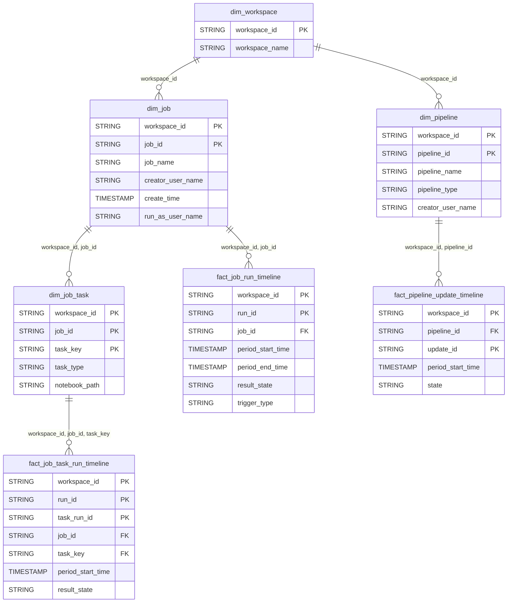

# Lakeflow Domain ERD

## Overview
Job and pipeline orchestration tracking.

## Tables
- `dim_job` - Job definitions
- `dim_job_task` - Task definitions within jobs
- `dim_pipeline` - DLT pipeline metadata
- `fact_job_run_timeline` - Job execution metrics
- `fact_job_task_run_timeline` - Task-level execution
- `fact_pipeline_update_timeline` - Pipeline update events

## Entity Relationship Diagram

## Key Relationships

| From | To | Cardinality | FK Columns |
|------|-----|-------------|------------|
| dim_job | fact_job_run_timeline | 1:N | workspace_id, job_id |
| dim_job_task | fact_job_task_run_timeline | 1:N | workspace_id, job_id, task_key |
| dim_pipeline | fact_pipeline_update_timeline | 1:N | workspace_id, pipeline_id |

