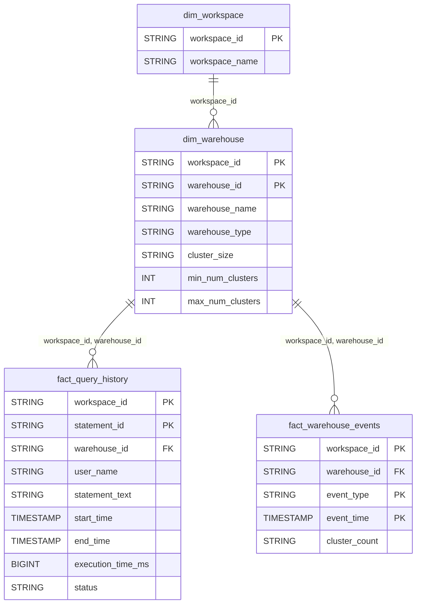

# Query Performance Domain ERD

## Overview
SQL warehouse and query execution analytics.

## Tables
- `dim_warehouse` - SQL warehouse configurations
- `fact_query_history` - Query execution history
- `fact_warehouse_events` - Warehouse lifecycle events

## Entity Relationship Diagram

## Key Relationships

| From | To | Cardinality | FK Columns |
|------|-----|-------------|------------|
| dim_warehouse | fact_query_history | 1:N | workspace_id, warehouse_id |
| dim_warehouse | fact_warehouse_events | 1:N | workspace_id, warehouse_id |

