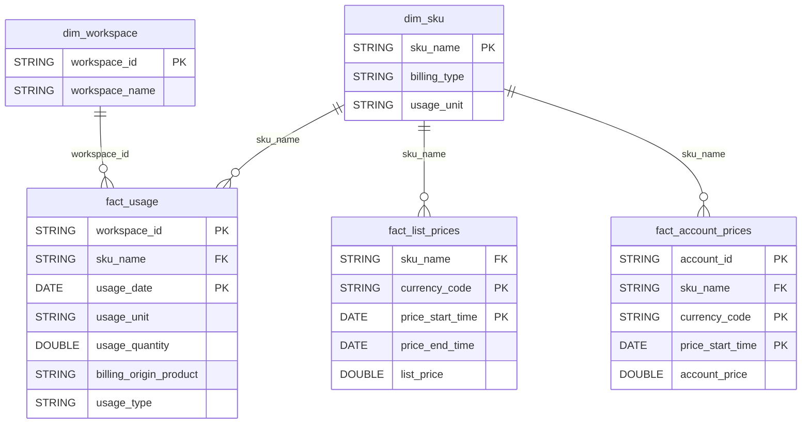

# Billing Domain ERD

## Overview
Cost management, usage tracking, and pricing.

## Tables
- `dim_sku` - SKU/pricing definitions
- `fact_usage` - Billable usage records
- `fact_list_prices` - Published pricing
- `fact_account_prices` - Account-specific pricing

## Entity Relationship Diagram

## Key Relationships

| From | To | Cardinality | FK Columns |
|------|-----|-------------|------------|
| dim_sku | fact_usage | 1:N | sku_name |
| dim_sku | fact_list_prices | 1:N | sku_name |
| dim_sku | fact_account_prices | 1:N | sku_name |
| dim_workspace | fact_usage | 1:N | workspace_id |

