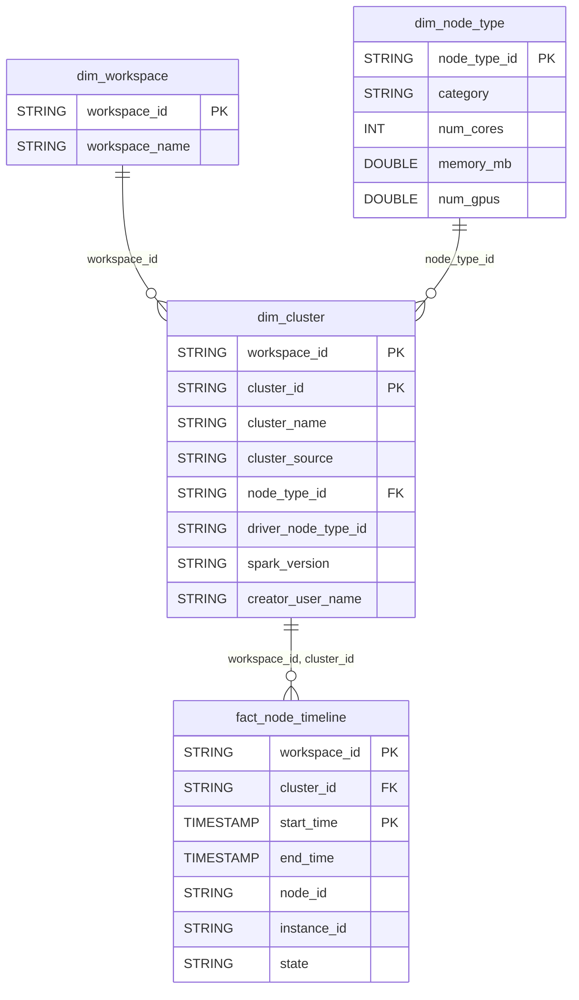

# Compute Domain ERD

## Overview
Cluster and compute resource management.

## Tables
- `dim_cluster` - Cluster configurations
- `dim_node_type` - Available node types
- `fact_node_timeline` - Node utilization metrics

## Entity Relationship Diagram

## Key Relationships

| From | To | Cardinality | FK Columns |
|------|-----|-------------|------------|
| dim_cluster | fact_node_timeline | 1:N | workspace_id, cluster_id |
| dim_node_type | dim_cluster | 1:N | node_type_id |

