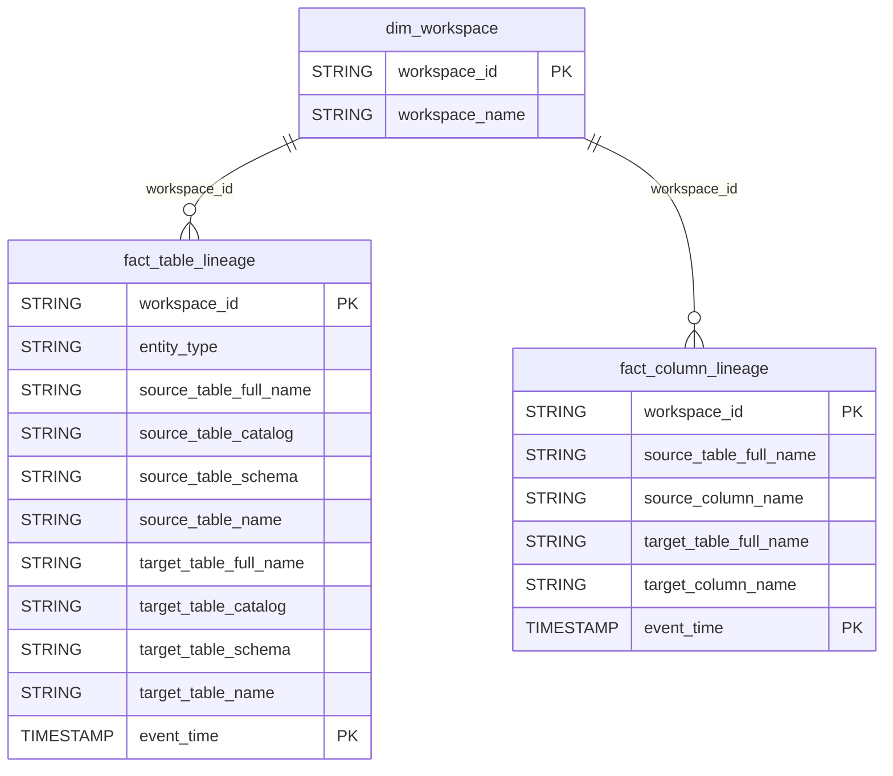

# Governance Domain ERD

## Overview
Data lineage and metadata tracking.

## Tables
- `fact_table_lineage` - Table-level lineage
- `fact_column_lineage` - Column-level lineage

## Entity Relationship Diagram

## Key Relationships

| From | To | Cardinality | FK Columns |
|------|-----|-------------|------------|
| dim_workspace | fact_table_lineage | 1:N | workspace_id |
| dim_workspace | fact_column_lineage | 1:N | workspace_id |

