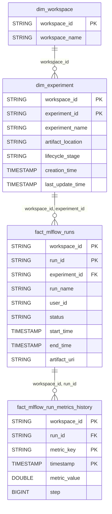

# MLflow Domain ERD

## Overview
ML experiment tracking and run metrics.

## Tables
- `dim_experiment` - Experiment definitions
- `fact_mlflow_runs` - Training run records
- `fact_mlflow_run_metrics_history` - Metric timeseries

## Entity Relationship Diagram

## Key Relationships

| From | To | Cardinality | FK Columns |
|------|-----|-------------|------------|
| dim_experiment | fact_mlflow_runs | 1:N | workspace_id, experiment_id |
| fact_mlflow_runs | fact_mlflow_run_metrics_history | 1:N | workspace_id, run_id |

