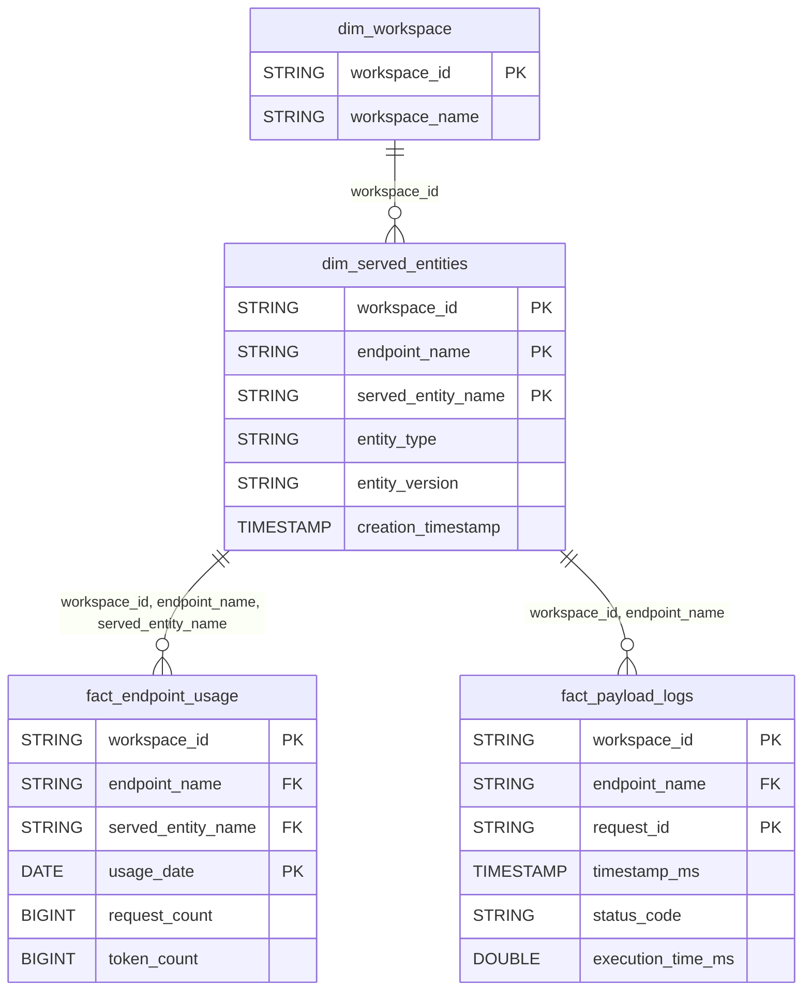

# Model Serving Domain ERD

## Overview
Model deployment and inference tracking.

## Tables
- `dim_served_entities` - Deployed model entities
- `fact_endpoint_usage` - Endpoint utilization
- `fact_payload_logs` - Inference request logs

## Entity Relationship Diagram

## Key Relationships

| From | To | Cardinality | FK Columns |
|------|-----|-------------|------------|
| dim_served_entities | fact_endpoint_usage | 1:N | workspace_id, endpoint_name, served_entity_name |
| dim_served_entities | fact_payload_logs | 1:N | workspace_id, endpoint_name |

