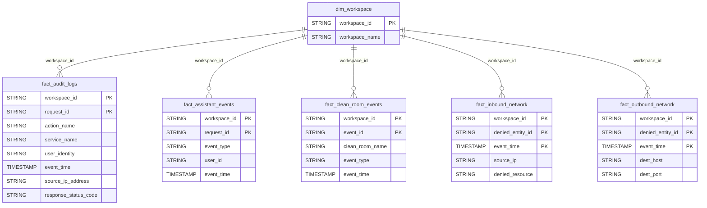

# Security Domain ERD

## Overview
Access control, auditing, and network access tracking.

## Tables
- `fact_audit_logs` - Security audit trail
- `fact_assistant_events` - AI assistant usage
- `fact_clean_room_events` - Clean room activity
- `fact_inbound_network` - Inbound access denial events
- `fact_outbound_network` - Outbound access denial events

## Entity Relationship Diagram

## Key Relationships

| From | To | Cardinality | FK Columns |
|------|-----|-------------|------------|
| dim_workspace | fact_audit_logs | 1:N | workspace_id |
| dim_workspace | fact_assistant_events | 1:N | workspace_id |
| dim_workspace | fact_clean_room_events | 1:N | workspace_id |
| dim_workspace | fact_inbound_network | 1:N | workspace_id |
| dim_workspace | fact_outbound_network | 1:N | workspace_id |

