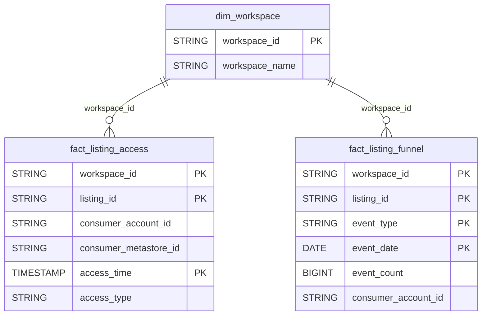

# Marketplace Domain ERD

## Overview
Databricks Marketplace listing analytics.

## Tables
- `fact_listing_access` - Listing data access events
- `fact_listing_funnel` - Listing engagement funnel

## Entity Relationship Diagram

## Key Relationships

| From | To | Cardinality | FK Columns |
|------|-----|-------------|------------|
| dim_workspace | fact_listing_access | 1:N | workspace_id |
| dim_workspace | fact_listing_funnel | 1:N | workspace_id |

