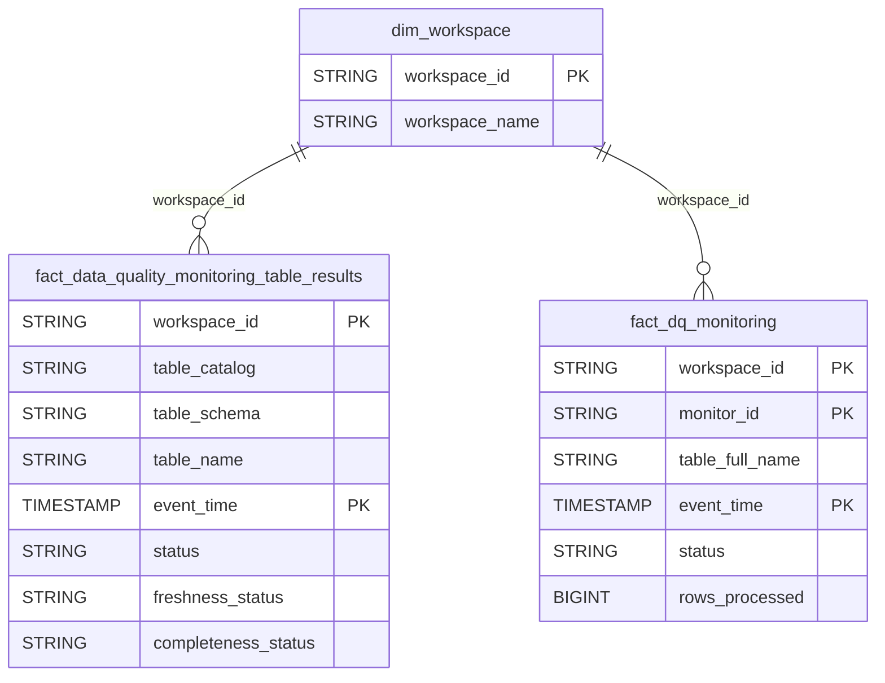

# Data Quality Domain ERD

## Overview
Data quality monitoring and metrics.

## Tables
- `fact_data_quality_monitoring_table_results` - Table DQ results
- `fact_dq_monitoring` - DQ monitoring events

## Entity Relationship Diagram

## Key Relationships

| From | To | Cardinality | FK Columns |
|------|-----|-------------|------------|
| dim_workspace | fact_data_quality_monitoring_table_results | 1:N | workspace_id |
| dim_workspace | fact_dq_monitoring | 1:N | workspace_id |

