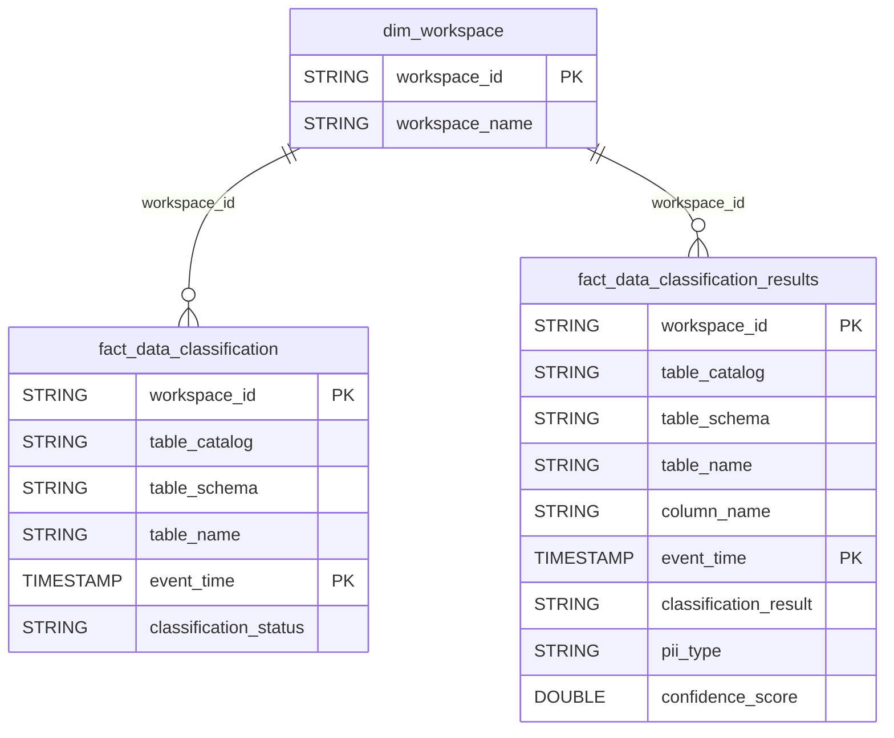

# Data Classification Domain ERD

## Overview
Data classification detection results.

## Tables
- `fact_data_classification` - Classification events
- `fact_data_classification_results` - Classification outcomes

## Entity Relationship Diagram

## Key Relationships

| From | To | Cardinality | FK Columns |
|------|-----|-------------|------------|
| dim_workspace | fact_data_classification | 1:N | workspace_id |
| dim_workspace | fact_data_classification_results | 1:N | workspace_id |

