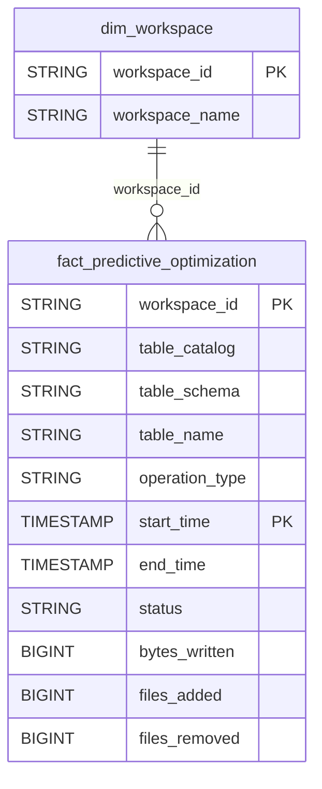

# Storage Domain ERD

## Overview
Storage optimization operations.

## Tables
- `fact_predictive_optimization` - Predictive optimization operations

## Entity Relationship Diagram

## Key Relationships

| From | To | Cardinality | FK Columns |
|------|-----|-------------|------------|
| dim_workspace | fact_predictive_optimization | 1:N | workspace_id |

