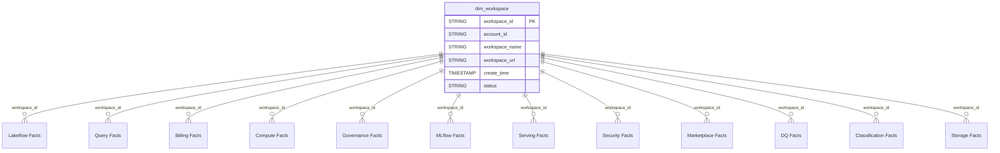

# Shared Domain ERD

## Overview
Central dimension shared across all domains.

## Tables
- `dim_workspace` - Workspace metadata (referenced by most facts)

## Entity Relationship Diagram

## Workspace as Central Hub

The `dim_workspace` dimension serves as the central hub connecting all domains:

| Domain | Tables Referencing workspace_id |
|--------|--------------------------------|
| Lakeflow | dim_job, dim_pipeline, fact_job_run_timeline, fact_job_task_run_timeline, fact_pipeline_update_timeline |
| Query Performance | dim_warehouse, fact_query_history, fact_warehouse_events |
| Billing | fact_usage |
| Compute | dim_cluster, fact_node_timeline |
| Governance | fact_table_lineage, fact_column_lineage |
| MLflow | dim_experiment, fact_mlflow_runs, fact_mlflow_run_metrics_history |
| Model Serving | dim_served_entities, fact_endpoint_usage, fact_payload_logs |
| Security | fact_audit_logs, fact_assistant_events, fact_clean_room_events, fact_inbound_network, fact_outbound_network |
| Marketplace | fact_listing_access, fact_listing_funnel |
| Data Quality | fact_data_quality_monitoring_table_results, fact_dq_monitoring |
| Data Classification | fact_data_classification, fact_data_classification_results |
| Storage | fact_predictive_optimization |

## Key Attributes

| Column | Business Purpose |
|--------|-----------------|
| workspace_id | Primary identifier - used in all FK relationships |
| account_id | Account-level grouping for enterprise deployments |
| workspace_name | Human-readable name for reports and dashboards |
| workspace_url | Direct link to workspace for operational use |
| status | Operational status filtering (RUNNING, FAILED, etc.) |

